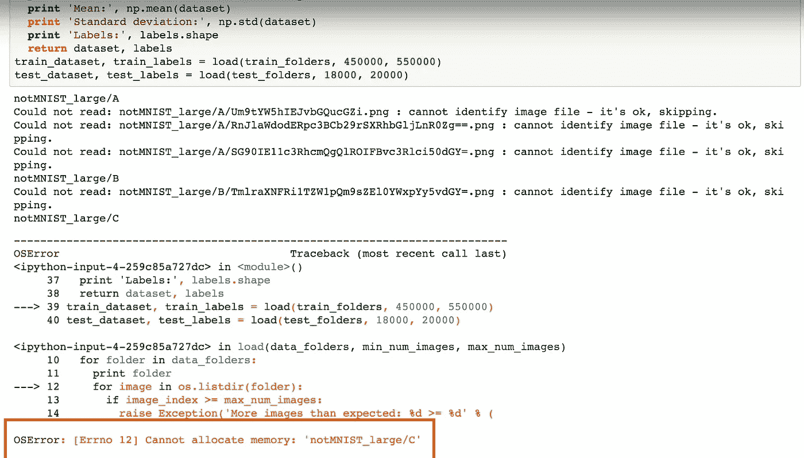
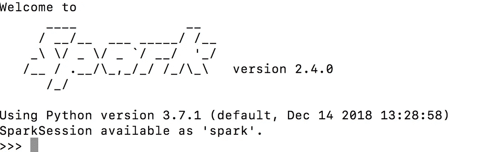
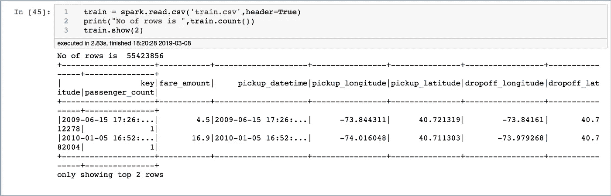
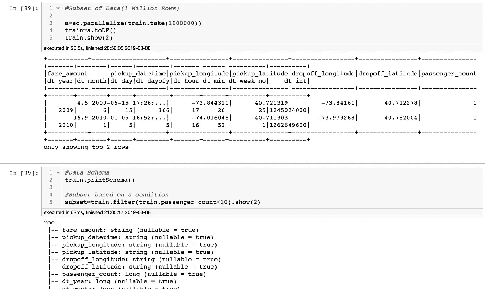
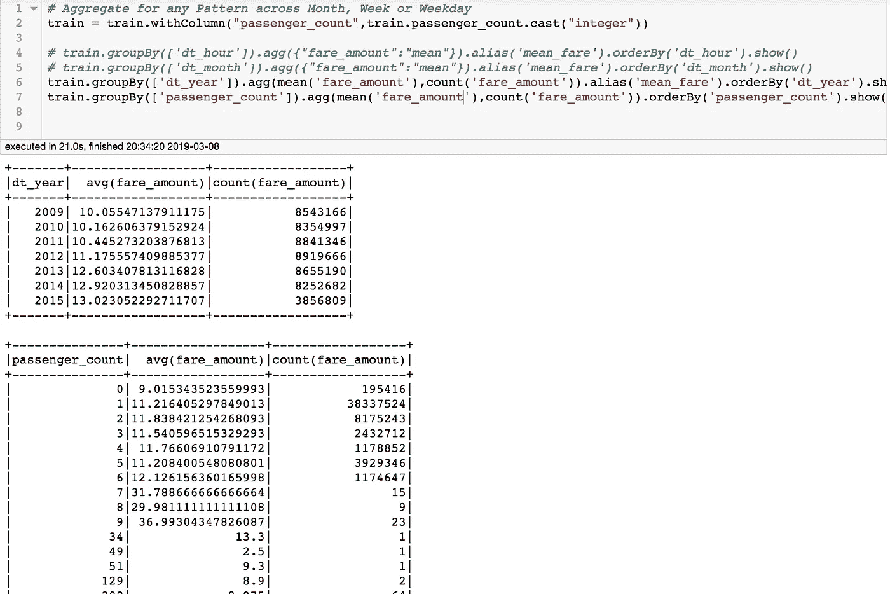
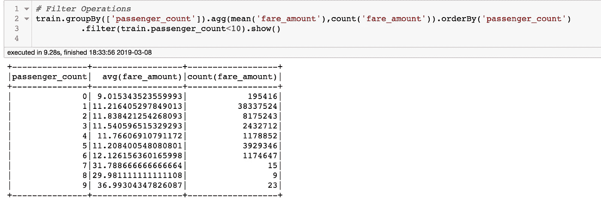
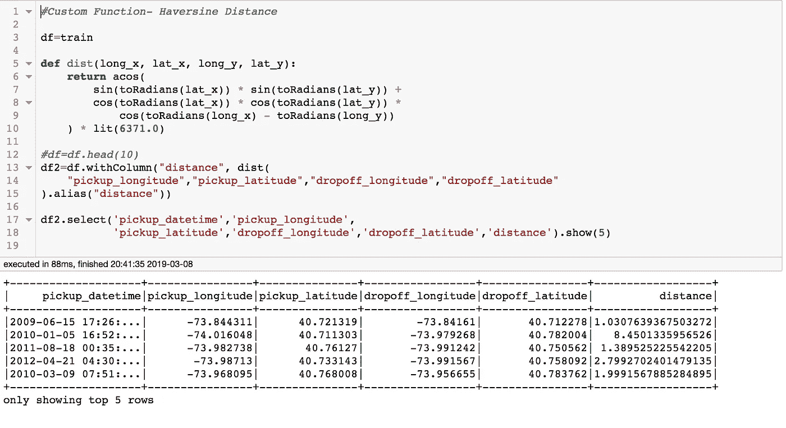
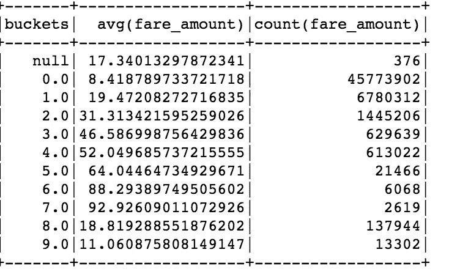

# 数十亿行，毫秒级时间——PySpark 入门指南

> 原文：<https://pub.towardsai.net/billions-of-rows-milliseconds-of-time-pyspark-starter-guide-c1f984023bf2?source=collection_archive---------0----------------------->

## [编程](https://towardsai.net/p/category/programming)

*目标受众:具备 Python、SQL 和 Linux 应用知识的数据科学家*


我们经常看到下面的错误，然后是终端关闭，接着是对丢失工作的绝望:



内存错误- Jupyter 笔记本

数据是新的石油，与石油不同的是，数据每天都在增加。数据大小的增长超过了 RAM 升级的速度/成本，这就需要使用多核、并行处理、分块等技术进行智能数据处理。

请继续学习，到本文结束时，您将会:

*   在你的机器上有一个运行的火花环境
*   有基本的 Pandas 到 Pyspark 数据操作经验
*   拥有在强健的环境中大规模提升数据操作速度的经验

[PySpark](http://spark.apache.org/docs/2.2.0/api/python/pyspark.html) 是使用 Spark 的 Python API，Spark 是运行大数据应用的并行分布式引擎。本文试图帮助您立即开始使用 PySpark！

从 CSV 文件(33 Mn 行，5.7GB 大小)读取和聚合的不同技术的性能比较:

```
1\. Reading in Chunks(Pandas)mylist = []
for chunk in  pd.read_csv('train.csv', chunksize=10000000):
    mylist.append(chunk)
train = pd.concat(mylist, axis= 0)
del mylistprint(train.shape)
train.groupby(['passenger_count'])['fare_amount'].mean().reset_index().head(5)***Time Taken(2 Mins,25 secs)***2\. Dasktrain = dd.read_csv('train.csv')
train = client2.persist(train)
progress(train)
print("No of rows is ",len(train))
train.groupby(['passenger_count'])['fare_amount'].mean().reset_index().compute().head(5)***Time Taken(18 secs)***3\. PySparktrain = spark.read.csv('train.csv',header=True)
print("No of rows is ",train.count())
train.groupBy(['passenger_count']).agg(mean('fare_amount'),count('fare_amount')).orderBy('passenger_count').filter(train.passenger_count<10).show()**Time Taken(12 Secs)**
```

Dask 和 PySpark 的主要速度优势是由于在主从节点设置中利用了机器的所有内核。我将把这篇文章献给 Pyspark，并在以后的文章中介绍 Dask，同时，你可以在 https://docs.dask.org/en/latest/[阅读更多关于 DASK 的内容。](https://docs.dask.org/en/latest/)

PySpark 的主要优势:

*   在多个内核上实施进程，因此速度更快
*   机器学习和神经网络库的可用性
*   熊猫、SQL 和 RDD 之间无缝切换的选项。Spark Dataframe 上的 SQL 操作，让数据工程师在不改变基础语言的情况下，轻松学习 ML、神经网络等。

现在让我们安装 PySpark(在我的 Mac 和 EC2(Linux 机器)上测试):

```
a. Install JAVA from [https://www.oracle.com/technetwork/java/javase/downloads/jdk11-downloads-5066655.html](https://www.oracle.com/technetwork/java/javase/downloads/jdk11-downloads-5066655.html)b.Install PySpark from [http://spark.apache.org/downloads.html](http://spark.apache.org/downloads.html)
                       /pip install pysparkc. Create a symbolic link: ln -s /opt/spark-2.4.0 /opt/spark̀d. Tell your bash where to find Spark:
          export SPARK_HOME=/opt/spark
          export PATH=$SPARK_HOME/bin:$PATHe. Restart your terminal and type **pyspark** for a spark environment.
```



终端中的 PySpark

```
#PySpark on Jupyter Notebookimport pyspark
from pyspark.context import SparkContext
from pyspark.sql.session import SparkSessionsc = SparkContext(('local[30]'))
spark = SparkSession(sc)
spark = SparkSession \
   .builder \
   .appName("PySpark Sample") \
   .config("spark.some.config.option", "some-value") \
   .getOrCreate() 
```

既然分布式计算的舞台已经搭好，让我们做一些数据辩论练习。我将使用纽约出租车费用数据集进行进一步分析:[https://www.kaggle.com/c/new-york-city-taxi-fare-prediction](https://www.kaggle.com/c/new-york-city-taxi-fare-prediction)

由于这是一个大数据集，在我们的家庭互联网/PC 上下载它似乎并不明智。Kaggle 发布了一个 API，可以直接用来获取我们虚拟机上的数据集:[https://github.com/Kaggle/kaggle-api](https://github.com/Kaggle/kaggle-api)

在继续之前，让我们对 PySpark 进行一次快速的强度测试，以便不面临数据量增加的问题。在第一次测试中，PySpark 可以在 38 秒内执行 15 亿行(即约 1TB 数据)的连接和聚合，在 21 分钟内执行 130 亿行(即约 60 TB 数据)的连接和聚合。


PySpark 重数据提升

30，000 英尺*吉安*够了，让我们从数据操作开始，同时关注速度基准的执行时间:

## **读取 CSV 文件:**

```
# Read CSV, length of file and headertrain = spark.read.csv('train.csv',header=True)
print("No of rows is ",train.count())
train.show(2)
```



## **显示模式、子集和过滤器:**

```
#Subset of Data(1 Million Rows)a=sc.parallelize(train.take(1000000))
train=a.toDF()
train.show(2)#Data Schema
train.printSchema()#Subset based on a condition
subset=train.filter(train.passenger_count<10).show(2)
```



## **分组、排序和过滤:**

```
# Data Type change
train = train.withColumn("passenger_count",train.passenger_count.cast("integer"))#GroupBy, Rename and Sorttrain.groupBy(['dt_year']).agg(mean('fare_amount'),count('fare_amount')).alias('mean_fare').orderBy('dt_year').show()train.groupBy(['passenger_count']).agg(mean('fare_amount'),count('fare_amount')).orderBy('passenger_count').show()
```



**分组和排序**



**过滤器**

## **创建新列并更改数据类型(默认为字符串):**

```
train =train.withColumn("fare",train.fare_amount.cast("float"))
train = train.withColumn("date",train.pickup_datetime.cast("date"))
```

## **自定义功能:**

```
#Custom Function- Haversine Distance between 2 latitudes-Longitudesdf=traindef dist(long_x, lat_x, long_y, lat_y):
    return acos(
        sin(toRadians(lat_x)) * sin(toRadians(lat_y)) + 
        cos(toRadians(lat_x)) * cos(toRadians(lat_y)) * 
            cos(toRadians(long_x) - toRadians(long_y))
    ) * lit(6371.0)#df=df.head(10)
df2=df.withColumn("distance", dist(
    "pickup_longitude","pickup_latitude","dropoff_longitude","dropoff_latitude"
).alias("distance"))df2.select('pickup_datetime','pickup_longitude',
           'pickup_latitude','dropoff_longitude','dropoff_latitude','distance').show(5)
```



## **宁滨:**

```
# Binning in Pysparkfrom pyspark.ml.feature import Bucketizerbucketizer = Bucketizer(splits=[ 0, 5, 10,15,20,25,30,35,40,float('Inf') ],inputCol="distance", outputCol="buckets")df2 = bucketizer.setHandleInvalid("keep").transform(df2)df2.groupBy(['buckets']).agg(mean('fare_amount'),count('fare_amount')).orderBy('buckets',asc=False).show(5)
```



箱柜创建

## **转换成熊猫，写 CSV:**

```
df2.groupBy(['buckets']).agg(mean('fare_amount'),count('fare_amount')).toPandas().to_csv('Spark_To_Pandas.csv')
```

## **SQL 操作:**

对 Spark 数据帧执行操作的一种方式是通过 Spark SQL，这使得数据帧可以像表一样被查询。

```
#SQL Operations#Convert Spark Data Frame to SQL Tabledf2.createOrReplaceTempView("sql_table")#SQL Query
sql_output = spark.sql("""
  select dt_month,pickup_latitude,round(mean(fare_amount),2) as avg_fare
  from sql_table
  group by 1
  order by 1 asc
""")
sql_output.show()
```

上面的帖子旨在摆脱我们最初的抗拒，开始一项未来的技术。我只是设法了解了一些皮毛，在分布式计算的各层之下蕴藏着巨大的潜力。在我的下一篇文章中，我将使用 Pyspark 写关于文本处理、机器学习(MLLib)、图形操作(Graphx)和神经网络的内容。

如果您在设置 Spark 环境时遇到任何问题，或者无法执行任何 PySpark 操作，甚至无法进行一般的聊天，请在评论中告诉我。快乐学习！！！

## 来源:

*   [https://medium . com/du nder-data/minimally-sufficult-pandas-a 8 e 67 F2 a 2428](https://medium.com/dunder-data/minimally-sufficient-pandas-a8e67f2a2428)
*   [https://blog . si cara . com/get-started-pyspark-jupyter-guide-tutorial-AE 2 Fe 84 f 594 f](https://blog.sicara.com/get-started-pyspark-jupyter-guide-tutorial-ae2fe84f594f)
*   [https://towards data science . com/a-brief-introduction-to-py spark-ff 4284701873](https://towardsdatascience.com/a-brief-introduction-to-pyspark-ff4284701873)