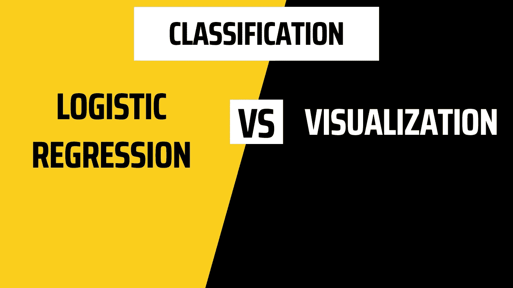
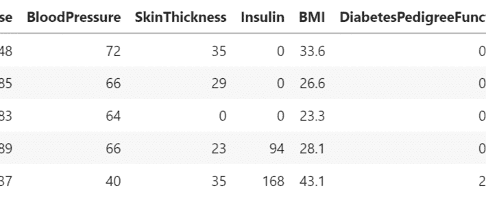
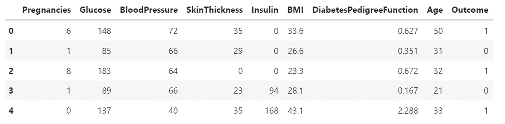
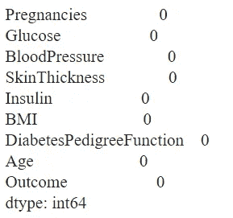
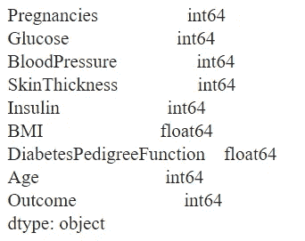
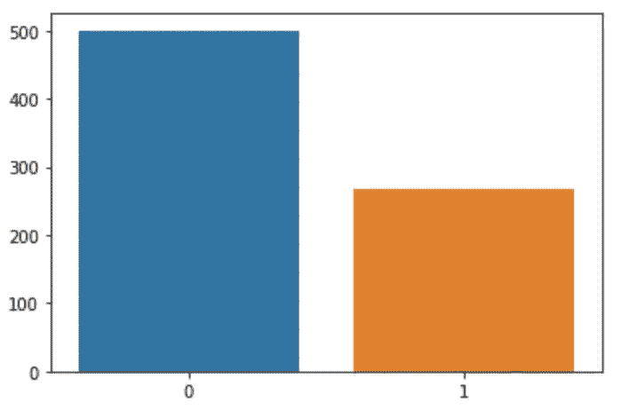
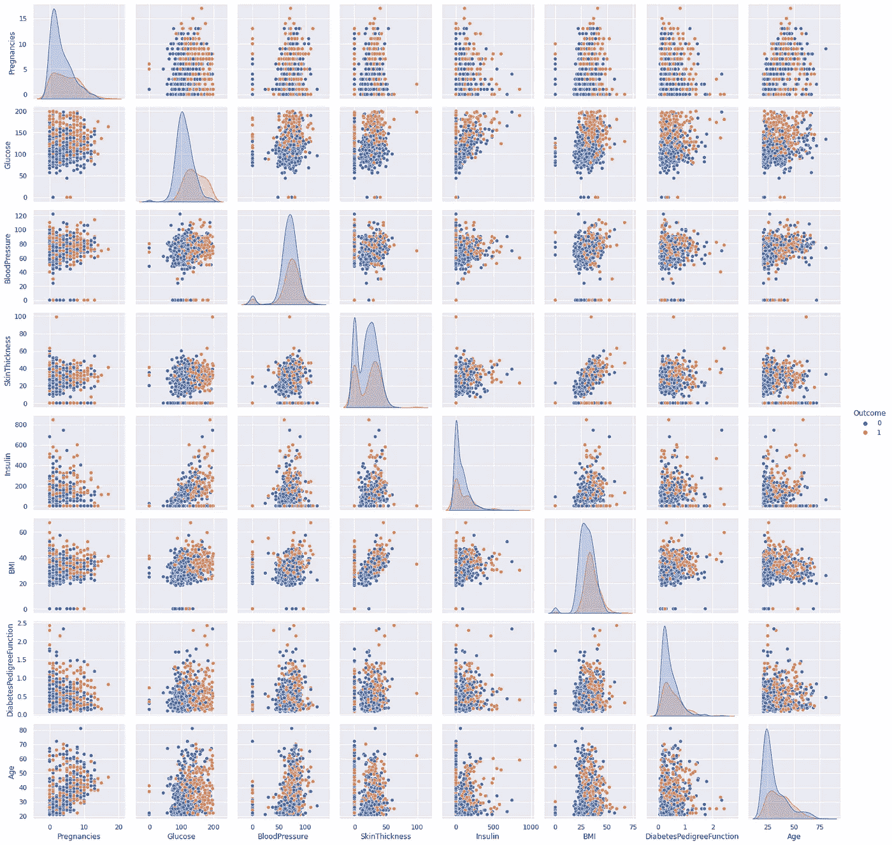
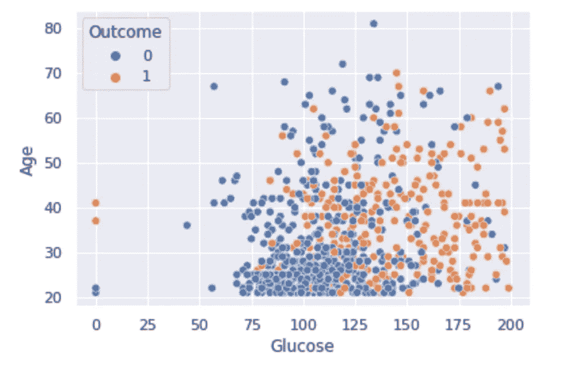
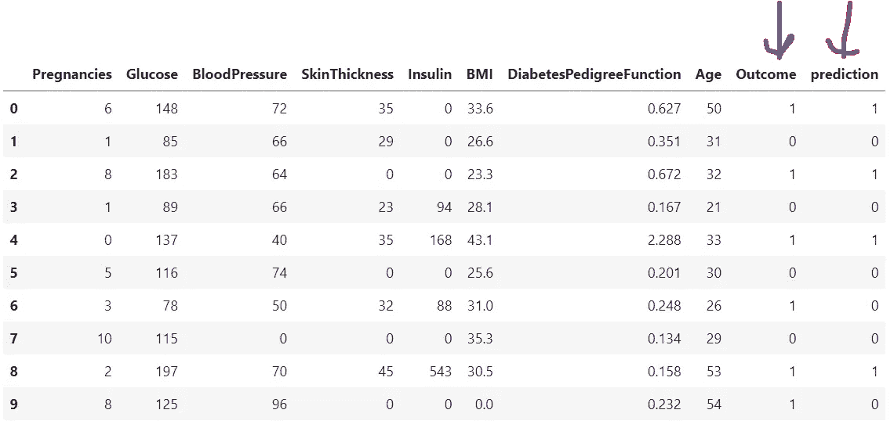
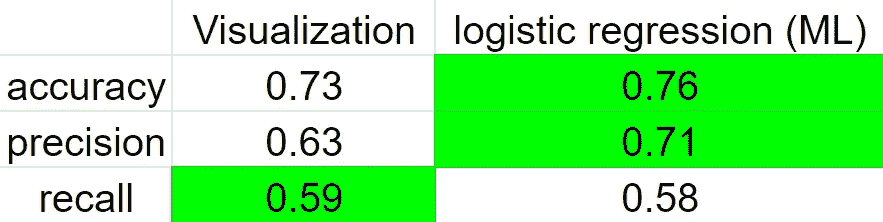

# 使用逻辑回归和可视化的二元分类

> 原文：<https://pub.towardsai.net/binary-classification-using-logistic-regression-vs-visualizations-8b9b5dce8e8b?source=collection_archive---------0----------------------->

## 如何使用 Seaborn 可视化数据集？如何使用逻辑回归创建机器学习模型？良好视觉化的力量。

# 介绍

在本教程中，我们将构建一个诊断患者是否患有糖尿病的二元分类项目。我们将从两个方面着手:1 .仅使用散点图可视化和 2。使用流行的机器学习算法之一—*逻辑回归。最后我会 ***对比结果*** 。事实证明，数据可视化对分类也有很大的作用。*

> *如果你喜欢看的话，这里有完整的 YouTube 视频教程。*

**

*[逻辑回归 vs 可视化](https://www.youtube.com/watch?v=1hjkSCE2hgA&t=16s)(图片由作者提供)*

**

*结果 gif 作者*

*您可以从[这里](https://www.kaggle.com/datasets/mathchi/diabetes-data-set)下载数据集*

*你可以在这里看到 GitHub 代码。*

*环境:[谷歌 colab](https://colab.research.google.com/)*

# *目录:*

*[**简介**](#fed7)*

***1。** [**数据预处理**](#1e9e)*

***2。** [**分类使用可视化**](#76fe)*

***3。** [**分类采用逻辑回归**](#9400)*

***4。** [**可视化 vs 逻辑回归**](#6f16)*

*[**结论**](#da74)*

# ***1。数据预处理:***

*第一步是下载、读取和预处理数据集。此外，我们需要导入必要的库。*

*显示了数据集的样本。它由 8 个输入特征组成，如“怀孕”、“血糖”、“血压”等。和 1 个输出特征——“结果”，其表示患者是否患有糖尿病。*

**

*数据集示例(图片由作者提供)*

*   *仔细检查数据集是否包含空值*

**

*输出结果(作者)*

*   *检查数据集列数据类型。结果显示，所有的列都是 int64 数据类型，所以不需要做什么。*

**

*输出结果(作者)*

*   *检查输出类的分布。正如结果所强调的，数据集中有一点不平衡，因此选择正确的指标来评估我们的分类结果非常重要。*

**

*类别分布(作者的结果)*

# *2.仅使用可视化的分类*

*由于我们对数据集进行了预处理，现在是时候进行分类了。通常，数据集的可视化是预处理步骤的一部分。但是，在这种情况下，我们将对二进制分类进行可视化。为此，我们将所有要素相对于输出要素的散点图可视化，并注意分隔橙色和蓝色点簇的最有趣的图。*

*   ***橘色圆点**——患有糖尿病的**患者***
*   ***蓝点**——无糖尿病的患者**。***

```
*g **=** sns**.**pairplot(data, hue**=**"Outcome")*
```

**

*所有特征的散点图(图片由作者提供)*

*根据散点图，最有趣的图是**年龄**和**葡萄糖**之间的关系，因为我们可以看到橙色和蓝色点簇之间的明显区别。我们可以分别想象这种关系，以便更仔细地观察它们。*

```
*sns.scatterplot(data['Glucose'],data['Age'],hue=data['Outcome'])*
```

**

*年龄与葡萄糖散点图(图片由作者提供)*

*值得注意的是，如果葡萄糖浓度高于 130，我们可以粗略地假设患者患有糖尿病。我们只根据这个阈值做一个预测，看看结果。*

```
*data['prediction'] **=** np**.**where((data['Glucose']**>**130),1,0)
data.head()*
```

**

*预测结果(作者图片)*

*“结果”是基本事实，而“预测”是预测值。基于这个数据集样本，几乎所有的预测都是正确的。然而，为了更全面地了解我们的预测有多好，我们可以计算一下 [*【准确性】*](https://developers.google.com/machine-learning/crash-course/classification/accuracy)[*【精度】*](https://developers.google.com/machine-learning/crash-course/classification/precision-and-recall)[*【召回】*](https://developers.google.com/machine-learning/crash-course/classification/precision-and-recall) 。*

```
*y_test_vis **=** data['Outcome']**.**values
y_pred_vis **=** data['prediction']**.**values

print("accuracy: ", accuracy_score(y_test_vis,y_pred_vis ))
print("precision: ", precision_score(y_test_vis,y_pred_vis ))
print("recall: ", recall_score(y_test_vis,y_pred_vis ))*
```

*Out[ ]:*

```
*accuracy:  0.73828125
precision:  0.6334661354581673
recall:  0.5932835820895522*
```

# *3.使用逻辑回归分类*

*正如我们使用可视化进行分类一样，现在我们可以使用机器学习方法来做同样的事情。在这种情况下，我们使用逻辑回归算法。由于逻辑回归是一个线性模型，数据集需要缩放。在一切(缩放、数据拆分等)之后。)完成后，我们计算与之前相同的指标，以比较预测结果。*

```
*data**.**drop(columns**=**['prediction'], inplace**=True**)data_f **=** data**.**drop(columns**=**['Outcome'])**.**values
labels **=** data['Outcome']**.**values
scaler **=** MinMaxScaler()

data_f_scaled **=** scaler**.**fit_transform(data_f)X_train, X_test, y_train, y_test **=** train_test_split(data_f_scaled, labels, test_size**=**0.2, random_state**=**42)LR **=** LogisticRegression()

LR**.**fit(X_train,y_train)

y_pred **=** LR**.**predict(X_test)
y_pred_prob **=** LR**.**predict_proba(X_test)[:,1]print("accuracy: ", accuracy_score(y_test,y_pred ))
print("precision: ", precision_score(y_test,y_pred ))
print("recall: ", recall_score(y_test,y_pred ))*
```

*Out[ ]:*

```
*accuracy:  0.7662337662337663
precision:  0.7111111111111111
recall:  0.5818181818181818*
```

# *4.可视化与逻辑回归(ML)*

*这是指标的摘要。即使我们使用了机器学习算法，简单的可视化产生了非常相同的预测结果。此外，视觉化预测有较高的回忆分数。*

**

*预测结果对比(图片由作者提供)*

# *结论*

*综上所述，我们可以得出结论，可视化对于数据分析是非常强大的。在这种情况下，我们使用可视化进行分类，产生了与流行的机器学习算法几乎相同的结果。当然，一切都取决于数据集，在大多数情况下，简单地目测可视化无法击败机器学习算法，但可视化是一种强大的分析工具，可以让数据科学家从数据集获得洞察力。它可以在预处理步骤中完成，也可以在最后调试机器学习预测结果。*

*谢谢你的阅读。如果你想看 ***更详细的分析*** *你可以* ***观看*** *我的* [***YouTube 视频***](https://www.youtube.com/watch?v=1hjkSCE2hgA&t=16s)*

> *如果你想在 medium 上注册，以获得无限的故事，你可以使用我的 [**推荐链接**](https://medium.com/@gkeretchashvili/membership) (我会免费向你收取一小笔佣金 *)**

*[](https://medium.com/@gkeretchashvili/membership) [## 通过我的推荐链接加入媒体-Gurami keretcashvili

### 阅读 Gurami Keretchashvili(以及媒体上成千上万的其他作家)的每一个故事。您的会员费直接…

medium.com](https://medium.com/@gkeretchashvili/membership)*