# 基于张量流的二值图像分类

> 原文：<https://pub.towardsai.net/binary-image-classification-with-tensorflow-2cc6555e55e8?source=collection_archive---------0----------------------->

## *在 Tensorflow 中使用卷积神经网络对猫和狗的图像进行分类*

照片由[颜劳里切塞](https://unsplash.com/@majomaya?utm_source=unsplash&utm_medium=referral&utm_content=creditCopyText)在 [Unsplash](https://unsplash.com/s/visual/cda11df6-ab49-42a1-a32d-7b6d08b60889?utm_source=unsplash&utm_medium=referral&utm_content=creditCopyText) 上拍摄

在这篇文章中，我们将看到如何用 Tensorflow 建立一个二元分类模型来区分图像中的狗和猫。从 [Kaggle 和它的数据集](https://www.kaggle.com/competitions/dogs-vs-cats)上的一个著名竞赛中得到启示，我们将使用这个任务来学习如何做

*   从 web 导入压缩数据集
*   使用卷积图层和最大池构建分类模型
*   使用 ImageDataGenerator 创建图像生成器，以有效地管理训练和验证图像
*   编译和训练模型
*   在神经网络的各个层中可视化应用于图像的变换
*   对从未见过的图像进行预测

由于深度学习不是任何家用 PC 都能负担得起的，我们将使用运行时设置为 GPU 的 Google Colab。

# 从 web 导入压缩数据集

我们将使用从 Kaggle 著名的 25000 幅图像数据集中提取的 3000 幅猫和狗的精简数据集。完整的数据集重量超过 500MB，将它们上传/下载到 Colab 可能会令人沮丧。我们将使用这个精简版本，无论如何，它将允许我们有效地测试我们的模型。

数据集的 URL 是:

[https://storage . Google APIs . com/mledu-datasets/cats _ and _ dogs _ filtered . zip](https://storage.googleapis.com/mledu-datasets/cats_and_dogs_filtered.zip)

我们使用 *wget* 命令将压缩文件下载到我们的文件系统:

通过使用 wget 命令以及 os 和 zip 文件包，我们能够高效地下载和组织我们的培训文件。我们现在有了一种指向带有特定变量的文件的方法，我们将在 Tensorflow 的 *ImageDataGenerator* 中使用这些变量。

让我们看一组图像，以便了解我们要分类的内容。

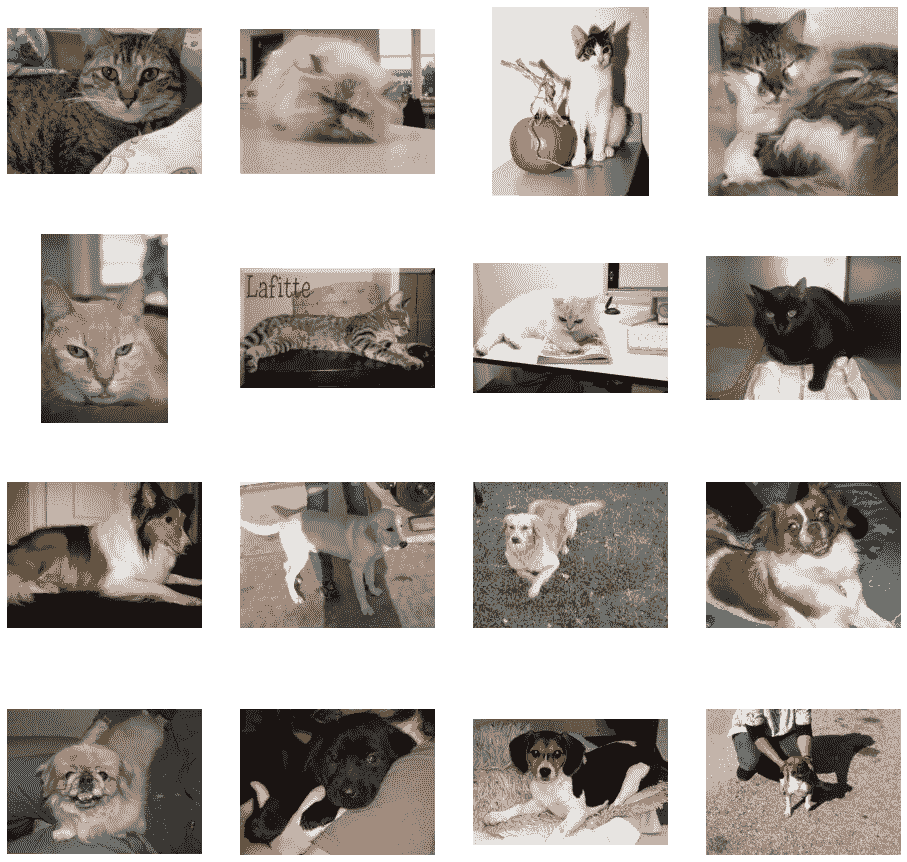

我们将要分类的狗和猫的图片的例子。图片作者。

我们看到这些图像彼此之间是多么的不同，以及有时像人或其他物体这样的外来实体是如何出现在图像中的。我们将建立一个深度学习模型，能够有效区分猫和狗**，尽管有这些外来因素**。

如果我们使用*len(OS . listdir(train _ cats _ dir))*来计算各个文件夹中的图像数量，我们看到它们的数量总计为 3000，其中分别有 1000 张训练中的狗和猫的图像以及 500 张用于验证的图像。

# 卷积和池的简要介绍

在我们即将看到的模型中，我们将使用卷积层和池。这两层都广泛用于计算机视觉任务，因为它们应用于输入图像的变换，并有利于神经网络，因为它们通过强调模式中存在的基本特征来帮助它**识别模式。**

## 盘旋

卷积本质上是一种应用于图像的滤镜。考虑到**像素**级别，也就是我们在讨论图像时要转换的实体，卷积查看其值和其**相邻像素的值，并使用映射到每个像素的网格值来转换目标像素，考虑** d. ‍

例如，如果我们使用 3x3 的网格，那么我们将考虑目标像素的所有相邻像素。当我们应用卷积时，目标像素被转换，并取对应于所考虑的每个像素的原始值与卷积网格中相应值的乘积的值。最终值对应于每个乘积的总和。一张图片将有助于更好地理解这个概念:

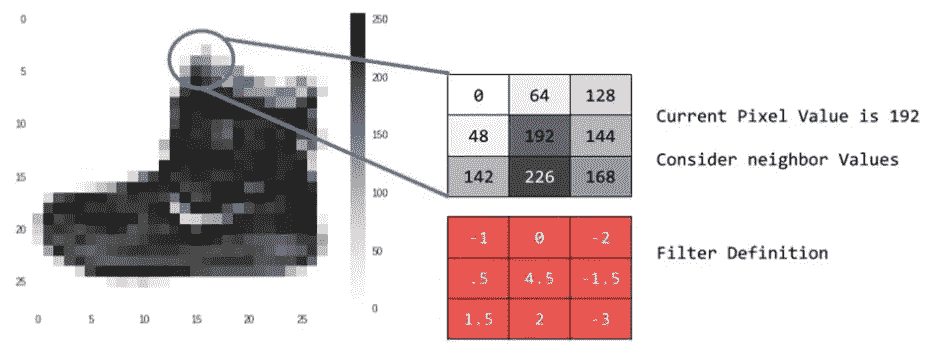

卷积在像素上的应用。截图来自 Coursera.org。

考虑值为 192 的目标像素，然后应用于它的卷积将认为它周围的所有像素都是邻居，并且它的新值将如下:

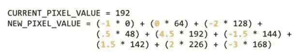

如何计算新像素值。截图来自 Coursera.org。

卷积背后的想法是突出图像的特征，例如边缘和轮廓，并使它们比背景更突出。

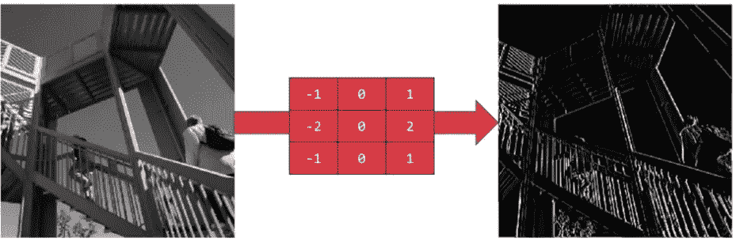

显示图像中元素的垂直边缘的卷积。截图来自 Coursera.org。

卷积通常伴随着*池化*，这允许神经网络压缩图像并提取其中真正显著的元素。

在 Tensorflow 中，典型的卷积层应用了`tf.keras.layers.Conv2D(filters, kernel_size, activation, **kwargs)`。在*过滤器*中，我们将插入要应用的卷积过滤器的数量，相反，我们将使用*内核大小*指示网格的大小。对于激活，我们将指定激活函数。参数很多，我建议读者最好研究一下[官方 Tensorflow 文档](https://www.tensorflow.org/api_docs/python/tf/keras/layers/Conv2D)上的材料。

## 联营

汇集意味着对图像进行压缩。例如，如果我们想用 Tensorflow 应用 2D 池图层，这将意味着采用目标像素，它下面的一个和它左边的两个，来形成一个四值网格。**这些值中，只有最大值被保留**。

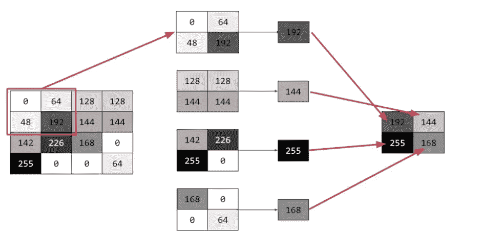

2D 统筹机制的一个例子。截图来自 Coursera.org。

仔细观察这幅图像，我们可以看到池化是如何将一幅 16 像素的图像缩减为一幅 4 像素的图像，以 4 个像素为一组，取最大的像素，然后重复这个过程。

这种机制在卷积之后*被应用，从而保留了它所突出的特征**并进一步放大了这种效果**。池化也减少了图像的大小，从而加快了神经网络更高级层的训练。*

通常通过取最大值来应用池化，但也有其他逻辑，例如基于平均值和总和的逻辑。

在 Tensorflow 中，一个典型的池层应用了`tf.keras.layers.MaxPooling2D(pool_size, **kwargs)`。在 *pool_size* 中，我们将输入网格的大小。参数很多，我建议读者最好研究一下[官方 Keras 文档](https://keras.io/api/layers/pooling_layers/max_pooling2d/)上的资料。

# 使用 Tensorflow 创建模型

现在对卷积和池化有了一点了解，让我们继续使用 Tensorflow 创建一个二进制分类模型，该模型可以利用使狗和猫可识别的特征。我们将使用 Tensorflow 的顺序 API，因为它易于理解和实现。

## 关于输入形状的一个注记

需要注意的是，我们应该向模型提供**统一尺寸的图像。这个大小是任意的，对于这个模型，我们将使用 150x150 像素的大小。Tensorflow 会将每个图像的大小调整为正方形。既然我们使用彩色图像，我们也应该提供这些信息。因此，input_shape 将是(150，150，3)，其中 3 代表对颜色进行编码的三位信息。我们将很快看到如何通过 *ImageDataGenerator* 来确保我们的图像是这个尺寸。**

让我们看看如何实现神经网络架构。

如前所述，卷积和池化经常一起进行。然而，它们的数量是任意的，我们的工作就是测试最佳组合。也许通过增加或减少层数，性能会提高。理解这一点的唯一方法是通过实验。

最后一个神经元的输出最终被馈送到 *sigmoid* 激活函数，该函数返回 0 或 1。

我们现在使用 *model.summary()* 来理解神经网络如何转换数据，以及如何将其转换为二进制类。

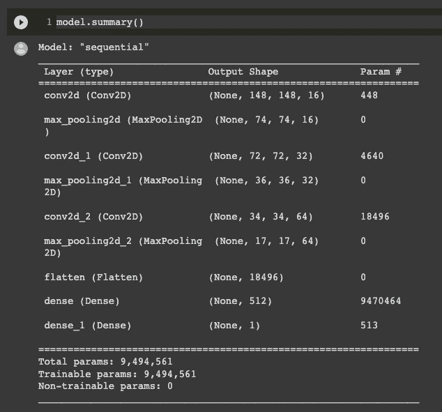

model.summary()的结果。图片作者。

让我们看看如何以级联的方式，我们的图像通过卷积被缩小，然后通过合并被进一步压缩。我们必须特别注意输出 Shape 列，因为它向我们显示了数据在网络中的路径。让我们看看在第一个 conv2d 层中，输出形状是 148，148，64。让我们更深入地分析一下这些信息。为什么如果我们的图像是 150x150，神经网络会将 148x148 的图像作为输入？答案是，我们使用的卷积使用的是 3x3 的网格。**图像周围的前几个像素没有相邻像素，因此不能应用滤镜**。然后，X 和 Y 轴上的一个像素被移除，图像边距减少 1 个像素。64 代表应用于图像的卷积数。

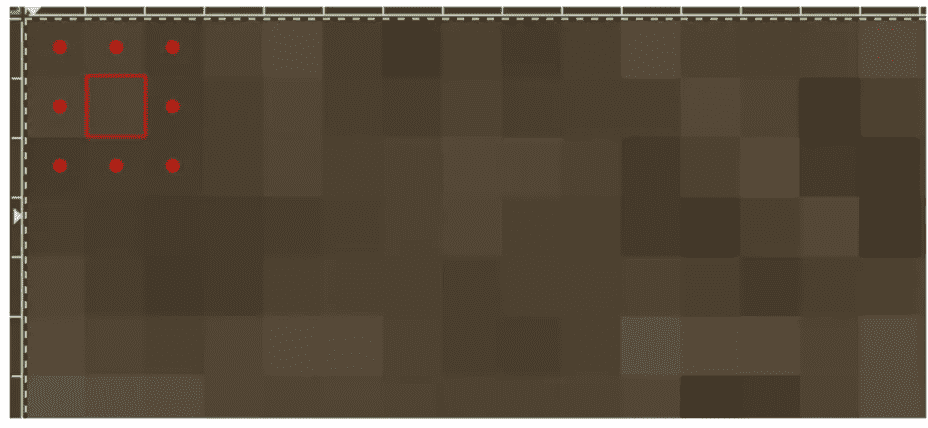

卷积从图像中移除 1 像素的外部边距。这张截图来自 Coursera.org。

在第一次卷积之后，我们可以看到 max pooling 层如何缩小图像的大小，正好缩小一半。这个过程一直继续，直到我们到达*展平*层，它将该点的输出展平成一个矢量。这被馈送到一个由 512 个神经元组成的密集层，然后到达网络的末端，只有一个输出，0 或 1。

为了告诉 Tensorflow 模型架构已经完成，我们需要使用 *compile* 命令。我们将使用 Adam 优化器(一种二元交叉熵损失函数)和准确性作为性能指标。

现在让我们继续编写要提供给模型的**图像预处理管道**。

# 图像预处理

下一步是预处理图像，以确保它们在形状上是一致的。**无论原始大小如何，它们都将被调整大小**，转换为 float64，并与它们的标签(狗或猫)相关联。这些信息将被传递给模型。我们将创建两个生成器:一个用于训练，一个用于验证。此外，其中的每一个都将图像转换成 0 到 255 之间的标准化数值。255 是像素的最大值，因此强度为 255 的像素将变为 1，而“关”像素将为 0，并且将包括每个中间值。介于 0 和 1 之间。

酷的是，这都是在内存中完成的，所以我们在磁盘上的原始图像不会受到影响。

在 Tensorflow 中，所有这些都是用***imagedata generator***完成的。ImageDataGenerator 如此强大的一个特点是，它根据包含图像的文件夹的层次结构和命名方式，自动为我们的图像生成标签。

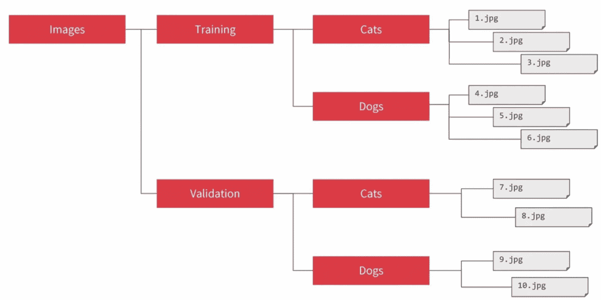

ImageDataGenerator 根据图像在专用文件夹中的位置自动为图像分配标签。截图来自 Coursera.org。

让我们看看如何用 Python 实现这些生成器。这些现在将用于训练模型，但我们不应该担心手动调整图像或做标记。这都是 Tensorflow 做的；)

# 模特培训

我们将在 2000 张图像上训练模型，并在 1000 张图像上验证它。我们将这样做 15 个时期。

*Steps_per_epoch* 表示为一个 epoch 选择的批次数量。如果选择 500 个步骤，网络将使用 500 个批次来完成一个时期。让我们看看模特在训练时的表现。

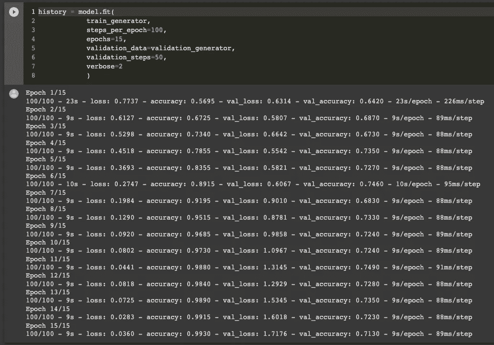

模型训练结果。图片作者。

让我们看看我们的模型在验证集上的准确率是如何达到 71%左右的。不错，但也不太好——在这样一个小数据集上，71%在我看来是令人满意的！增加图像的数量肯定会给出更可靠的结果。

# 可视化神经表征

最有趣的事情之一是看看卷积神经网络如何从图像中提取重要信息，并在图像通过各层时将其表示出来。我们将使用一个 Keras 模型来完成这项工作，并将之前训练的卷积模型的输入传递给它。这段代码有点高级，所以可以随意跳过它或者直接运行它以获得输出(这非常酷！)

这是结果

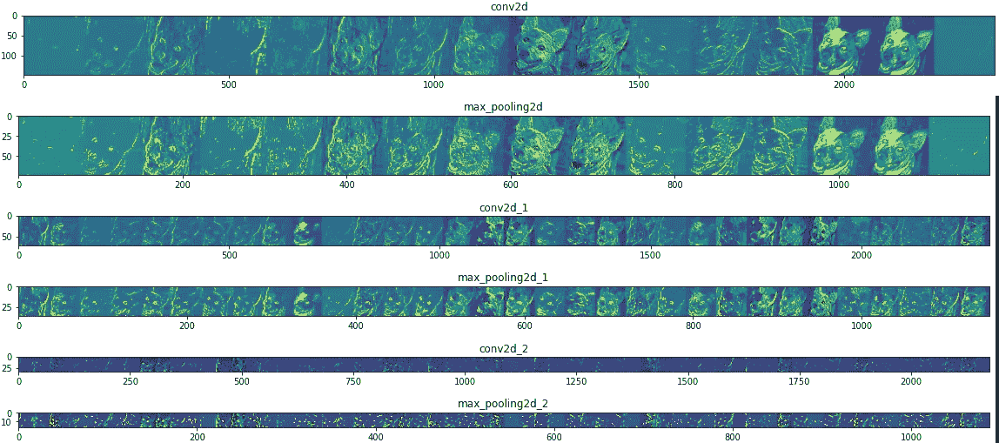

神经网络中卷积和汇集的中间表示。图片作者。

我们看到最显著的特征是如何从一层传递到另一层的。我们注意到耳朵、眼睛和口鼻是如何突出并构成了狗的特征。这些特征在层中的所有(或几乎所有)表示中保持，并用于使神经网络理解狗的样子。很有意思！

这种可视化神经网络表示的技术是有用的，因为它帮助我们理解卷积和池化带来了什么。如果有问题，这是第一个要找的地方。例如，网络可能会突出非固有特征，导致其误读预测。在这种情况下，手动分析是必须的，我们应该对网络架构采取行动。

# 模型评估

在继续对新的、看不见的图像进行预测之前，让我们编写一些代码来绘制模型评估指标——损失和准确性。

下面是结果——**在训练集中肯定有一些过度配合**。如前所述，这是因为数据集很小。在第二个历元之后，训练准确度已经快速达到 95–99%之间的准确度。当一个模型暴露于太少的例子**时，过度拟合就会发生，因为它学习的模式不能推广到新的数据**——也就是当模型开始使用不相关的特征来进行预测的时候。

过度适应是机器学习中的头号问题，这是一个你在这个领域会经常遇到的术语。作为分析师，我们的首要目标是避免过度拟合，并使模型尽可能通用。

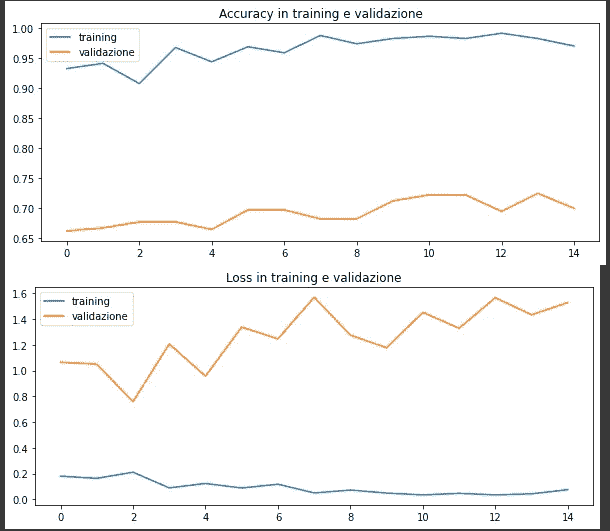

训练和验证集中的损失和准确性趋势。图片作者。

# 新图像的预测

我们得出了这篇文章的结论。感谢您的关注！如果你喜欢，记得留下评论或与同事分享这篇文章:)现在让我们看看如何将图像上传到 Colab，并使用我们的预测模型使用它进行分类。

我们将使用这张拉布拉多小狗的图片来测试模型。

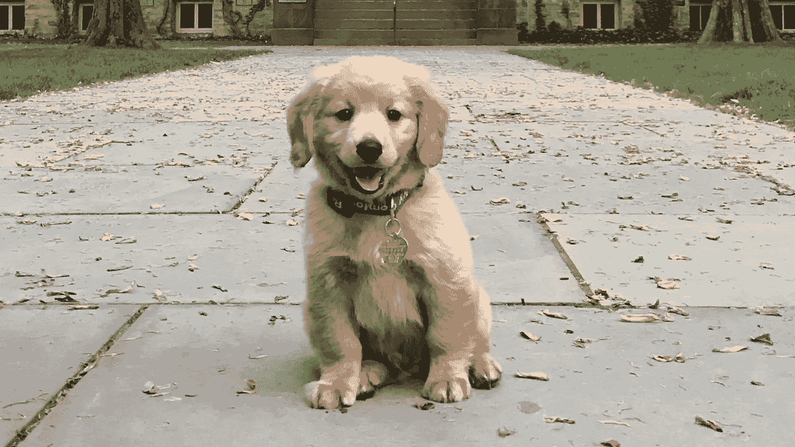

测试模型的图像。

这是代码

最后，这是我们模型的正确预测！

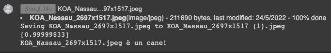

该图像被正确地分类为一只狗。图片由作者提供。

 [## Mlearning.ai 提交建议

### 如何成为 Mlearning.ai 上的作家

medium.com](https://medium.com/mlearning-ai/mlearning-ai-submission-suggestions-b51e2b130bfb)