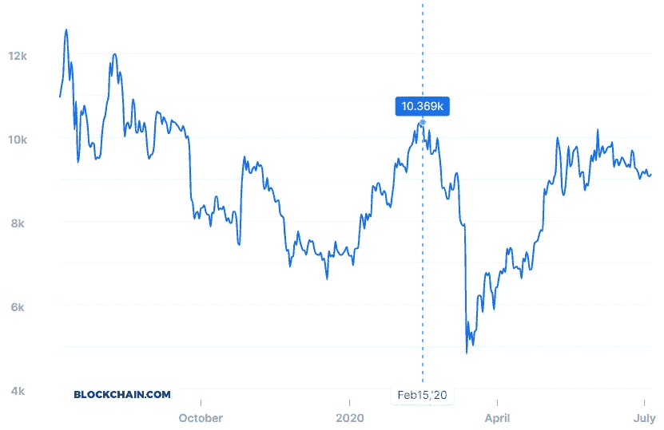
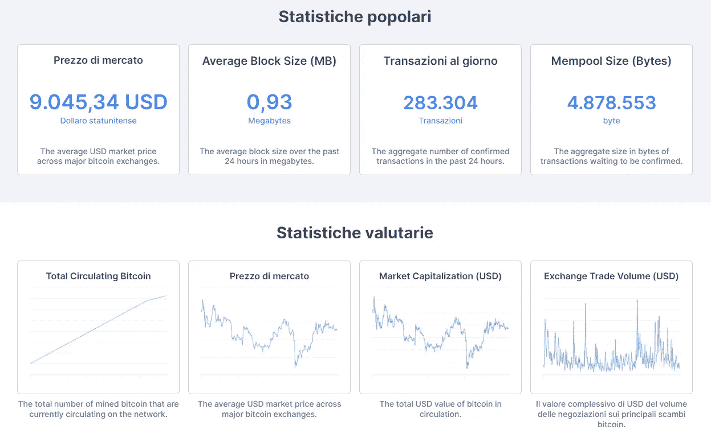
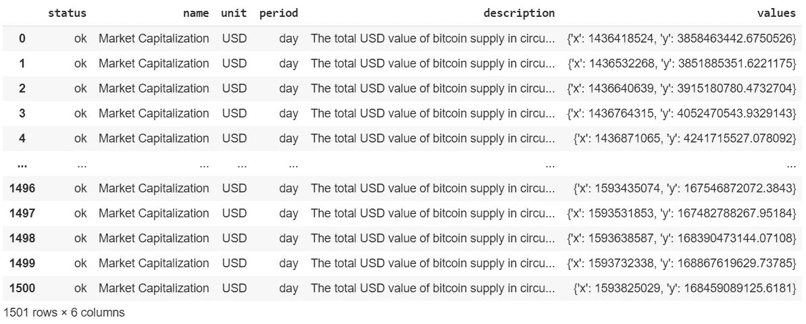
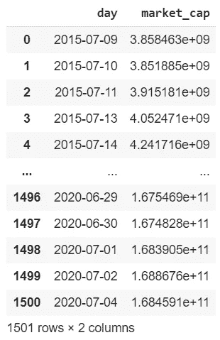
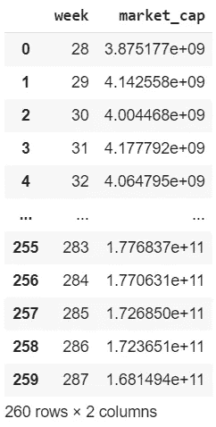
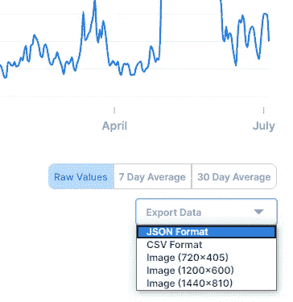
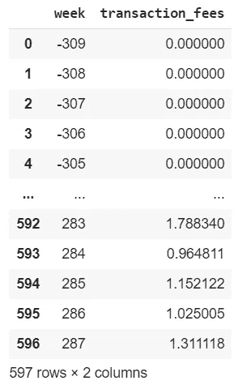
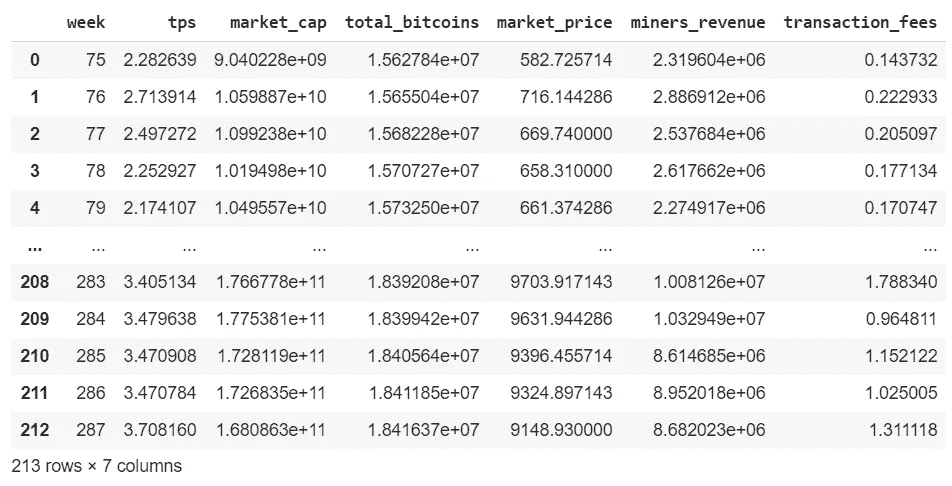

# 使用 Q 块的 LSTM 比特币价格预测(上)

> 原文：<https://pub.towardsai.net/bitcoin-price-prediction-with-lstm-using-q-blocks-part-i-43322abf7556?source=collection_archive---------1----------------------->

## [机器学习](https://towardsai.net/p/category/machine-learning)，递归神经网络

## 挖掘比特币数据。在我的 [Github 库](https://github.com/arditoibryan/Projects/tree/master/20200705_Bitcoin_Forecasting)有完整的代码。

比特币是一种非常特殊的资产。它的价格受需求和供给而非外部因素的影响，因此它可能高度依赖于感知的趋势而非感知的信息。对于这类问题，模式识别可能会证明非常有用。



## 第一部分(本文)

因为这个问题很大，从头到尾，我就从文章的第一部分开始，通过挖掘比特币数据。

## 第二部分(下一条)

在第二部分，我将建立 LSTM 来预测即将到来的比特币价格。因为运行代码所需的计算能力对于普通笔记本来说是不够的，所以我将从 Q Blocks 租用计算能力。在下一篇文章中，我将保留一个完整的部分，讲述如何使用对等分布式 GPU 连接到他们的笔记本电脑以提高性能。

## 第三部分

在 Q Blocks 平台上运行所有东西之后，我将详细解释 LSTM 模型是如何工作的，并估计最终模型的准确性。

## 导入库

```
import json
import urllib.request
import pandas as pd
```

## 导入函数

通过下面的函数，我将能够解码 UTF-8 数据并将数据分组为块(具体来说是几周)。现在，我不会进入细节，但随着进一步的代码将需要使用这两个主要功能。

```
def group_chunks(df, id_loc, value_loc): #df, 0, 1
  def average(list1):
    sum1 = 0
    for _ in list1:
      sum1 += _
    return sum1/len(list1)#convert DataFrame into a dict with a unique value per timestamp
  mydict = {}
  for x in range(len(df)):
    currentid = df.iloc[x,id_loc]
    currentvalue = df.iloc[x,value_loc]
    mydict.setdefault(currentid, [])
    mydict[currentid].append(currentvalue)
  mydict#convert dict into a list
  dictlist = list()
  for key, value in mydict.items():
    temp = [key,value]
    dictlist.append(temp)#convert to DataFrame
  dictlist = pd.DataFrame(dictlist)
  dictlist#average of multiple values
  dictlist[1] = dictlist[1].apply(lambda x : average(x))
  return dictlist
```

## 指定初始周

在这段代码中，您唯一要做的手动干预就是指定何时开始计算周数。因为我正在下载最近 5 年的数据，所以我将 2015 年指定为初始日期。

```
#***cambiare questa per determinare inizio conteggio settimana
benchmark_date = 2015import datetime
def convert_week(date):
  year = int(date[0:4])
  return datetime.datetime.strptime(date, '%Y-%m-%d').isocalendar()[1] + (year-benchmark_date)*52
convert_week('2018-01-01')
convert_week('2019-01-01')def convert_week_back(week_n):
  year_week = int(week_n/52)
  year = benchmark_date + year_week
  d = str(year)+'-W'+str(week_n%52)
  r = datetime.datetime.strptime(d + '-1', "%Y-W%W-%w")
  return rconvert_week_back(129)
```

# 下载功能

就我的经验而言，比特币数据很容易从互联网上获得，实际上有多种来源。问题是大部分数据必须手动下载，其余的只能通过使用 API 获得。

我将具体指导你如何构建一个连接到 https://www.blockchain.com/[的函数来提取所有相关数据。](https://www.blockchain.com/)



网站上可用数据的样本

* * *无需注册，数据可通过公开获取。json 格式。因此，您不需要使用任何 API 令牌发出 GET 请求。

因为我不得不在不同的项目中使用这个算法，所以它比我们实际需要的更复杂。对于 LSTM，我将只使用一个变量(市场价格)，而通过这个功能，您可以自动下载和解析 blockchain.com 上所有可用的图表。

## 正在下载 JSON

```
def download_data(chart_name, data_=None, compress=True):
  #[https://api.blockchain.info/charts/transactions-per-second?timespan=2years&rollingAverage=8hours&format=json](https://api.blockchain.info/charts/transactions-per-second?timespan=2years&rollingAverage=8hours&format=json)if data_ is None:
    with urllib.request.urlopen('[https://api.blockchain.info/charts/'](https://api.blockchain.info/charts/') + chart_name + '?timespan=5years&rollingAverage=24hours&format=json') as url:
```

## 解析 JSON

我将使用 JSON 库将其转换为字典。然后，我将把字典中的每个元素存储到熊猫数据帧中。

```
 response = url.read()
      data = json.loads(response)
  else:
    data = open(data_)
    data = json.load(data)

  import pandas as pd
  data = pd.DataFrame(data)
  data
```

转换成熊猫数据集后，结果如下:



## 提取时间和值

数据是 UTF 8 编码的。我需要解码它，提取时间戳和市场价格(或我们从网站下载的任何其他值)。

```
#make backup
  data_copy = data.copy()def extract_time(dict1):
    dict2 = list(dict1.values())
    #dict2 = list(data['values'][0].values())[0],
    return dict2def time_converter(time1):
    from datetime import datetime
    #return datetime.fromtimestamp(time1).strftime('%Y-%m-%d %H:%M:%S')
    return datetime.fromtimestamp(time1).strftime('%Y-%m-%d')#preprocessing data
  data = data_copy.copy()
  data['timestamp'] = data['values'].apply(lambda x : extract_time(x)[0])
  data['timestamp'] = data['timestamp'].apply(lambda x : time_converter(x))
  data[chart_name] = data['values'].apply(lambda x : extract_time(x)[1])
  data.pop('values')
  datadf = data.drop(['status', 'name', 'unit', 'period', 'description'], axis=1)
  df
```

到目前为止，该功能将允许我每天提取数据。但是，如果我想进一步推进并按周分组，我需要取这段时间内数据的平均值，以获得有效的指标。

```
if compress == True:
    #group by date
    df = group_chunks(df, 0, 1)
    #df = df.drop(df.index[[730]])
    df#apply weeks
    df['week'] = df[0].apply(lambda x : convert_week(x))
    df.pop(0)
    df#group by week
    df = group_chunks(df, 1, 0)
    dfreturn df
```

# 下载

如您所见，根据您希望获得的输出，您可以使用多个参数。

## 按天分组的数据

```
market_cap = download_data('market-cap', compress=False)
market_cap.columns = ['day', 'market_cap']
market_cap
```



## 按周分组的数据

```
#download data compressed by week
market_cap = download_data('market-cap')
```



## 来自下载的 JSON 的数据

不幸的是，我在网站上发现了一些缺失的图表。每美元的交易费用就是一个例子。如果您希望下载类似的数据，您可以直接(但手动)下载 son 文件:



将数据导入笔记本时，使用以下设置提取数据，而不执行 GET 请求。

```
#importing data by json, then compressing
#transaction_fees = download_data('transaction-fees-usd') #url not working
transaction_fees = download_data(0, data_='/content/drive/My Drive/Colab Notebooks/Projects_Work/20200617_Bitcoin/fees-usd-per-transaction.json')
transaction_fees.columns = ['week', 'transaction_fees']
transaction_fees
```



因为周会从 2015 年开始算，而且我下载了更早的数据，所以周会是负数。如果您希望放弃，可以删除周为负数的行。

# 合并数据集

就我而言，我已经下载了几个不同的数据块。我需要将它们合并在一起。我将使用周作为一个公共因子，这样我就可以对它们进行分组。

```
#tps, market_cap, total_bitcoins, market_price
result = pd.merge(tps, market_cap, on=0)
result = pd.merge(result, total_bitcoins, on=0)
result = pd.merge(result, market_price, on=0)
result = pd.merge(result, miners_revenue, on=0)
result = pd.merge(result, transaction_fees, on=0)
resultresult.columns = ['week', 'tps', 'market_cap', 'total_bitcoins', 'market_price', 'miners_revenue', 'transaction_fees']
result
```



# 导出数据

```
market_price.to_csv('bitcoin.csv')
```

# 第二部分

我们都为第二部分做好了准备…

->转到第二部分(在建)