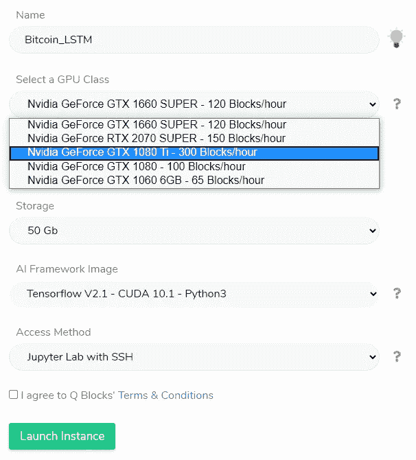
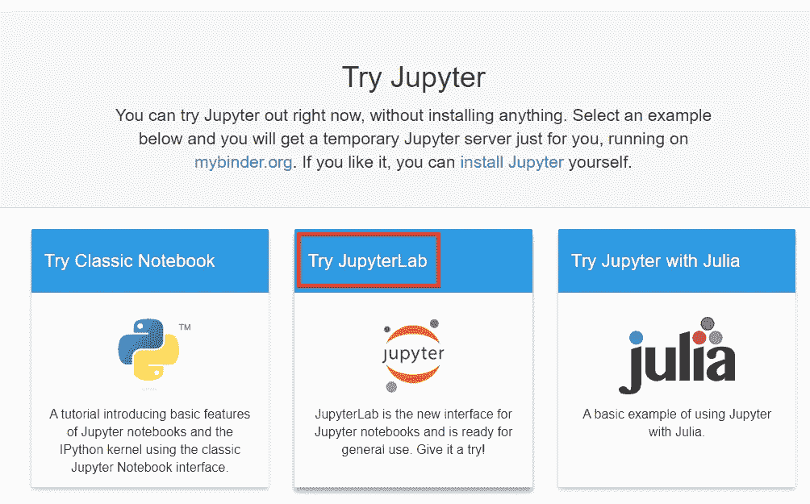
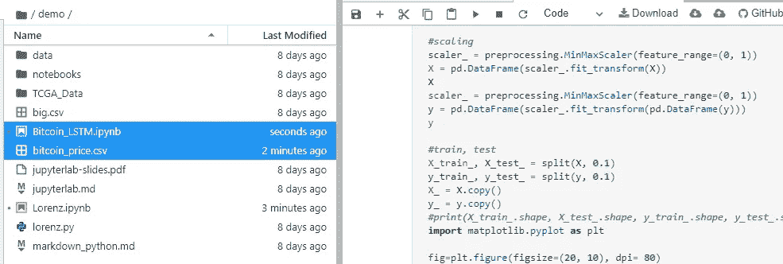
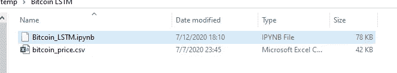

# 使用 Q 块的 LSTM 比特币价格预测(下)

> 原文：<https://pub.towardsai.net/bitcoin-price-prediction-with-lstm-using-q-blocks-part-ii-ae2168bafd6d?source=collection_archive---------4----------------------->

## [深度学习](https://towardsai.net/p/category/machine-learning/deep-learning)

## [Q 块](https://www.qblocks.cloud/) GPU 使用指南，顺序到[第一部分](https://medium.com/towards-artificial-intelligence/bitcoin-price-prediction-with-lstm-using-q-blocks-part-i-43322abf7556)

在这一系列文章中，我将创建一个软件，尝试使用 LSTMs 神经网络预测比特币价格。

*   第一部分:我解释了如何下载比特币数据来进行分析
*   第二部分:使用 Q 块 GPU
*   第三部分:创建 LSTM 神经网络
*   第四部分:调整网络并比较结果

为了进行这个实验，我需要高计算能力:神经网络，尤其是大规模的，可能需要几个小时，甚至几天的训练。在我的实验中，我将需要尝试超参数的不同组合(调整)，直到我找到满意的结果。除非我想使用任何免费的 GPU 笔记本电脑，并等待几天来完成我的实验，否则我将租用 GPU 来加速这个过程，最多几个小时。

照片由[阿列克西·里斯](https://unsplash.com/@denarium_bitcoin?utm_source=medium&utm_medium=referral)在 [Unsplash](https://unsplash.com?utm_source=medium&utm_medium=referral) 上拍摄

# q 块

我将租用的平台叫做 Q Blocks。它仍然处于早期访问阶段，所以你甚至可以在购买之前尝试一下(这个平台给你 20 小时的免费 GPU，一个很好的开始)，看看你是否适应它。

云计算很快将成为新的规范。有了区块链和像素流技术等革命性创新，人们将不再需要购买 GPU 硬件。像 Q Blocks 这样使用对等计算的提供商通过使计算能力更容易获得和加速创新做出了贡献。

## GPU 是怎么租的？

GPU 不是用使用量买的，是用时间买的。这项服务每小时只需 0.05 美元。这是一个非常合理的价格，你基本上是以与 CPU 相同的成本购买一个 GPU。Q Blocks 使用的分布式计算技术允许该提供商在不降低质量的情况下保持低价。

## 我需要购买 GPU 来运行这段代码吗？

不。我所有的代码都可以在免费的笔记本上运行，比如 Colab、Jupyter 或 Kaggle。然而，当您增加模型的复杂性，并且您想要可靠的结果时，您必然想要使用高计算能力。对于我要运行的代码，我强烈建议你租一个 GPU，除非你想连续等几天。

与免费的云编译器的 GPU 相比，Q 块可以达到快 10 倍的速度。例如，在 Google Colab 上运行这种算法甚至可能需要一天的连续计算。你可以用更少的时间达到同样的效果，仅仅是因为你有 GPU 的使用权。

## 设置实例

创建帐户后，您可以开始创建个性化实例。Q Blocks 允许你从大量的图形卡中进行选择。每张显卡都是按块购买的(100 块= 0.10 美元)。如果你想加速你的模型，你需要一个更强大的图形处理器。

* * *选择 TensorFlow V.1.3，否则这段代码不会运行

## 我为什么要租 GPU？

LSTMs 是人工智能中最麻烦的结构之一。构建模型(尤其是预处理部分)非常具有挑战性，耗时很长，而且并不总是有效的。

假设我已经正确地设置了模型，我将需要调整模型。为了达到模型的足够性能(例如最小化 MSE ),本质上，我将不得不多次使用变量，直到我找到最佳的超参数。

这将需要多次迭代(多次尝试)。鉴于 500 个或更多样本的时间序列的 LSTM 可能需要多达 3000 个历元，我期待在一个普通的免费笔记本上用各种调整训练我的模型长达 24 小时或更长时间。

我唯一能加快这个过程的方法就是租用 GPU。AWS 可能是您的首选，但相当昂贵。Q Blocks 将为您提供低至每小时 0.05 美元的 GPU。

## 创建一个模拟 Jupyter 笔记本

(第三部分中有关代码的详细信息)

当激活 Q 块时，它将允许你以 Jupyter 笔记本的形式打开你自己的实例。因为实例立即开始消耗 GPU，而不是直接在那里编码，所以我要做的是[在其他地方](https://jupyter.org/try)创建一个免费的 Jupyter 笔记本，然后下载笔记本。第二次，我会将笔记本上传到 Q Blocks 上，以节省宝贵的时间(尤其是如果你运行的是非常昂贵的 GPU)。点击描述中的链接访问网站。

通过点击尝试 JupyterLab，它将允许你在一个新的笔记本上操作。在编写完代码并确保它可以在免费的 Jupyter 笔记本版本上顺利运行之后，您就可以导出笔记本了。

在第三部分中，我将介绍构建 LSTM 的所有代码。通过创建笔记本的副本，您可以轻松地将其导入到另一个 Jupyter 笔记本中，而无需复制和粘贴任何代码片段或从零开始重新启动。

这样会给你一个时间优势，你要用的 GPU 也会最小化。例如，假设你要使用 GTX 180 Ti，每小时 0.30 美元，你不需要在任何调试上花钱。

## 保存文件

创建笔记本后，只需将文件保存在桌面上。当然，你可以在我的回购协议上找到这些已经准备好的文件。

我们准备进入下一部分(III)，我将详细解释如何对整个项目进行编码。在第四部分，我将调整 LSTM，看看哪个是最适合的预测。

# 结论

与 GPU 相比，免费的云编译器可以达到快 10 倍的速度。如果你打算在 Q 块上租用更强大的 GPU，根据你的需求，这个数字只会增加。