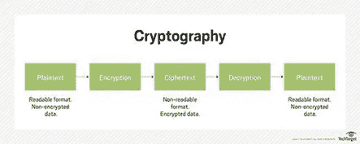
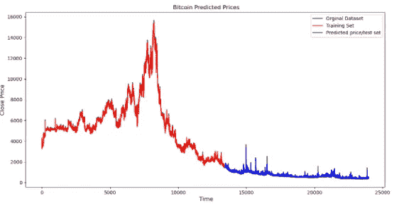
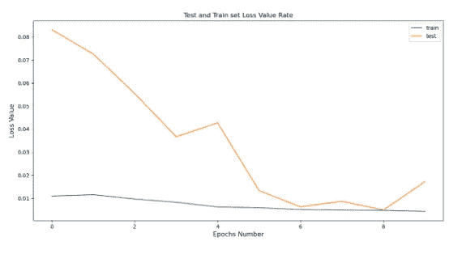

# 用 Python 实现 RNN 和 LSTM 的比特币价格预测

> 原文：<https://pub.towardsai.net/bitcoin-price-prediction-with-rnn-and-lstm-in-python-f912d57c483e?source=collection_archive---------0----------------------->

## [深度学习](https://towardsai.net/p/category/machine-learning/deep-learning)

## **利用深度学习预测比特币价格**


比特币的预测。作者的照片

在本文中，我们将讨论一个与比特币价格预测相关的程序。

我们将讨论这里使用的图形表示的库。

## 涵盖的主题:

```
1\. What is a Bitcoin
2\. How to use Bitcoin
3\. Prediction of Bitcoin Prices Using Deep Learning
```

> ***什么是比特币？***

比特币是所有加密爱好者常用的加密货币之一。尽管有几种加密货币，如以太坊、Ripple、莱特币等，但比特币仍名列前茅。

加密货币通常被用作我们货币的加密形式，广泛用于购物、交易、投资等。

它使用点对点技术。这种技术背后的原因是没有驱动力或任何第三方来干扰网络内进行的交易。此外，比特币是“开源”的，任何人都可以使用。

一些功能包括:

```
1\. Fast peer-to-peer transactions
2\. Worldwide payments
3\. Low processing fees
```

**使用的原理—密码术:**

加密货币(比特币)背后的工作原理是“密码学”。他们利用这一原理来保护和认证协商，并控制加密货币新组件的建立。



比特币流程图步骤。来源是[技术目标](https://searchsecurity.techtarget.com/definition/cryptography)

> ***如何使用比特币？***

*   保护钱包:比特币钱包应该更加安全，以便轻松顺利地进行交易
*   比特币的价格不稳定:比特币的价格可能会有波动。价格可以根据通货膨胀率、交易量等几个因素上升或下降。

[](/understand-tensorflow-basic-with-python-87281e737db9) [## 使用 Python 了解 TensorFlow Basic

### 张量流中使用的基本术语

pub.towardsai.net](/understand-tensorflow-basic-with-python-87281e737db9) [](/step-by-step-basic-understanding-of-neural-networks-with-keras-in-python-94f4afd026e5) [## 使用 Python 中的 Keras 逐步基本了解神经网络

### 具有定义的神经网络的学习

pub.towardsai.net](/step-by-step-basic-understanding-of-neural-networks-with-keras-in-python-94f4afd026e5) 

> ***利用深度学习预测比特币价格:***

该项目中使用的步骤是:

**1。** **数据采集:**

导入 CSV 文件数据集。

```
import pandas as pd
import numpy as np
import matplotlib.pyplot as plt
```

现在，导入熊猫和 numpy 的数据集。Numpy 主要用于 python 中的科学计算

```
coindata = pd.read_csv(‘Dataset.csv’)
googledata = pd.read_csv(‘DS2.csv’)
```

现在，加载的原始数据集被打印出来

```
coindata = coindata.drop([‘#’], axis=1)
coindata.columns = [‘Date’,’Open’,’High’,’Low’,’Close’,’Volume’]
googledata = googledata.drop([‘Date’,’#’], axis=1)
```

未使用的列放在这里。这里，我们从 coin 数据和 google 数据集中删除了两列，因为它们是未使用的列。

现在，在从数据集中删除了未使用的列之后，打印出两个数据集的最终结果。

```
last = pd.concat([coindata,googledata], axis=1)
```

现在，两个数据集——硬币数据和谷歌数据连接在一起，并使用函数打印出来

```
last.to_csv(‘Bitcoin3D.csv’, index=False)
```

现在，在连接两个数据集之后，最终数据集被导出。

**1。** **RNN 对 1D:**

```
import pandas as pd
import matplotlib.pyplot as plt
import numpy as npimport mathfrom sklearn.preprocessing import MinMaxScaler
from sklearn.metrics import mean_squared_errorfrom keras.models import Sequential
from keras.layers import Dense, Activation, Dropout
from keras.layers import LSTM
```

在这里，我们使用 Keras 库。Keras 用于训练神经网络模型，只需几行代码就可以使用高效的计算库。MinMaxScaler 将通过将每个要素映射到给定范围来转换要素。sklearn 包将提供程序所需的一些实用函数。

密集层将执行以下操作并返回输出。

```
output = activation(dot(input, kernel) + bias)def new_dataset(dataset, step_size):
    data_X, data_Y = [], []
    for i in range(len(dataset)-step_size-1):
        a = dataset[i:(i+step_size), 0]
        data_X.append(a)
        data_Y.append(dataset[i + step_size, 0])
    return np.array(data_X), np.array(data_Y)
```

这里，我们将在数据预处理阶段收集的 1D 数据组织成时间序列数据

```
df = pd.read_csv(“Bitcoin1D.csv”)
df[‘Date’] = pd.to_datetime(df[‘Date’])
df = df.reindex(index= df.index[::-1])
```

数据集已加载。该特征从 Bitcoin1D.csv 文件中读取。此外，我们将日期列转换为日期时间。按日期列重新索引所有数据集。

```
zaman = np.arange(1, len(df) + 1, 1)
OHCL_avg = df.mean(axis=1)
```

这里，我们直接分配一个新的索引数组。

```
OHCL_avg = np.reshape(OHCL_avg.values, (len(OHCL_avg),1)) #7288 data
scaler = MinMaxScaler(feature_range=(0,1))
OHCL_avg = scaler.fit_transform(OHCL_avg)
```

分配定标器后，归一化数据集

```
#print(OHCL_avg)train_OHLC = int(len(OHCL_avg)*0.56)
test_OHLC = len(OHCL_avg) — train_OHLCtrain_OHLC, test_OHLC = OHCL_avg[0:train_OHLC,:], OHCL_avg[train_OHLC:len(OHCL_avg),:]#Train the datasets and test ittrainX, trainY = new_dataset(train_OHLC,1)
testX, testY = new_dataset(test_OHLC,1)
```

我们从平均 OHLC(开盘-盘高-盘低-收盘)创建 1D 维度数据集

```
trainX = np.reshape(trainX, (trainX.shape[0],1,trainX.shape[1]))
testX = np.reshape(testX, (testX.shape[0],1,testX.shape[1]))step_size = 1
```

现在，在 3D 维度中重塑 LSTM 的数据集。将步长指定为 1。

```
model = Sequential()
model.add(LSTM(128, input_shape=(1, step_size)))
model.add(Dropout(0.1))
model.add(Dense(1))
model.add(Activation(‘linear’))
```

在这里，LSTM 模式被创造出来

```
model.compile(loss=’mean_squared_error’, optimizer=’adam’)
model.fit(trainX, trainY, epochs=10, batch_size=25, verbose=2)
```

我们将历元数定义为 10，batch_size 定义为 25

```
trainPredict = model.predict(trainX)
testPredict = model.predict(testX)trainPredict = scaler.inverse_transform(trainPredict)
trainY = scaler.inverse_transform([trainY])
testPredict = scaler.inverse_transform(testPredict)testY = scaler.inverse_transform([testY])
```

现在，反规范化是为了绘图

```
trainScore = math.sqrt(mean_squared_error(trainY[0], 
                       trainPredict[:,0]))testScore = math.sqrt(mean_squared_error(testY[0], 
                       testPredict[:,0]))
```

为预测的测试数据集计算性能度量 RMSE

```
trainPredictPlot = np.empty_like(OHCL_avg)trainPredictPlot[:,:] = np.nantrainPredictPlot[step_size:len(trainPredict)+step_size,:] =
                                                  trainPredict
```

现在，转换后的训练数据集用于绘图

```
testPredictPlot = np.empty_like(OHCL_avg)testPredictPlot[:,:] = np.nantestPredictPlot[len(trainPredict)+(step_size*2)+1:len(OHCL_avg)-1,:]
                    = testPredict
```

现在，转换后的预测测试数据集用于绘图

最后，预测值被可视化

```
OHCL_avg = scaler.inverse_transform(OHCL_avg)plt.plot(OHCL_avg, ‘g’, label=’Orginal Dataset’)
plt.plot(trainPredictPlot, ‘r’, label=’Training Set’)
plt.plot(testPredictPlot, ‘b’, label=’Predicted price/test set’)
plt.title(“ Bitcoin Predicted Prices”)
plt.xlabel(‘ Time’, fontsize=12)
plt.ylabel(‘Close Price’, fontsize=12)
plt.legend(loc=’upper right’)
plt.show()
```



1D — RNN 的产量。作者的照片

[](/data-preprocessing-concepts-with-python-b93c63f14bb6) [## Python 中的数据预处理概念

### 一种为机器学习估值器准备数据的稳健方法

pub.towardsai.net](/data-preprocessing-concepts-with-python-b93c63f14bb6) [](/understand-time-series-components-with-python-4bc3e2ba1189) [## 用 Python 理解时间序列组件

### 机器学习中预测模型的基本概念及实例

pub.towardsai.net](/understand-time-series-components-with-python-4bc3e2ba1189) 

**3。多变量的 RNN:**

```
import pandas as pd
from pandas import DataFrame
from pandas import concatfrom math import sqrt
from numpy import concatenateimport matplotlib.pyplot as pyplot
import numpy as npfrom sklearn.metrics import mean_squared_error
from sklearn.preprocessing import MinMaxScalerfrom keras import Sequential
from keras.layers import LSTM, Dense, Dropout, Activationfrom pandas import read_csv
```

在这里，我们使用 Keras 库。Keras 用于训练神经网络模型，只需几行代码就可以使用高效的计算库。sklearn 包将提供程序所需的一些实用函数。

密集层将执行以下操作并返回输出。

```
dataset = read_csv(‘Bitcoin3D.csv’, header=0, index_col=0)
print(dataset.head())values = dataset.values
```

使用 Pandas 库加载数据集。这是为可视化准备的柱子。

```
groups = [0, 1, 2, 3, 5, 6,7,8,9]
i = 1
```

将系列转换为监督学习

```
def series_to_supervised(data, n_in=1, n_out=1, dropnan=True):
    n_vars = 1 if type(data) is list else data.shape[1]
    df = DataFrame(data)
    cols, names = list(), list()
    # Here is created input columns which are (t-n, … t-1)
    for i in range(n_in, 0, -1):
        cols.append(df.shift(i))
        names += [(‘var%d(t-%d)’ % (j+1, i)) for j in range(n_vars)]#Here, we had created output/forecast column which are (t, t+1, … t+n)
    for i in range(0, n_out):
        cols.append(df.shift(-i))
        if i == 0:
            names += [(‘var%d(t)’ % (j+1)) for j in range(n_vars)]
        else:
            names += [(‘var%d(t+%d)’ % (j+1, i)) for j in
                                             range(n_vars)] agg = concat(cols, axis=1)
    agg.columns = names
    # drop rows with NaN values 
    if dropnan:
        agg.dropna(inplace=True)
    return agg
```

检查值是否为数字格式

```
values = values.astype(‘float32’)
```

使用最小最大值方法对数据集值进行归一化

```
scaler = MinMaxScaler(feature_range=(0,1))
scaled = scaler.fit_transform(values)
```

归一化值被转换用于监督学习

```
reframed = series_to_supervised(scaled,1,1)#reframed.drop(reframed.columns[[9,10,11,12,13,14,15]], axis=1, inplace=True)
```

数据集被分成两组，即训练集和测试集

```
values = reframed.values
train_size = int(len(values)*0.70)
train = values[:train_size,:]
test = values[train_size:,:]
```

分割数据集被分割成 trainX、trainY、testX 和 testY

```
trainX, trainY = train[:,:-1], train[:,13]
testX, testY = test[:,:-1], test[:,13]
```

训练和测试数据集以 3D 尺寸重新整形，以用于 LSTM

```
trainX = trainX.reshape((trainX.shape[0],1,trainX.shape[1]))
testX = testX.reshape((testX.shape[0],1,testX.shape[1]))
```

创建 LSTM 模型并调整神经元结构

```
model = Sequential()
model.add(LSTM(128, input_shape=(trainX.shape[1], trainX.shape[2])))
model.add(Dropout(0.05))
model.add(Dense(1))
model.add(Activation(‘linear’))
model.compile(loss=’mae’, optimizer=’adam’)
```

使用 trainX 和 trainY 对数据集进行训练

```
history = model.fit(trainX, trainY, epochs=10, batch_size=25, validation_data=(testX, testY), verbose=2, shuffle=False)
```

为每个训练时期计算损失值，并将其可视化

```
pyplot.plot(history.history[‘loss’], label=’train’)
pyplot.plot(history.history[‘val_loss’], label=’test’)
pyplot.title(“Test and Train set Loss Value Rate”)
pyplot.xlabel(‘Epochs Number’, fontsize=12)
pyplot.ylabel(‘Loss Value’, fontsize=12)
pyplot.legend()
pyplot.show()
```



损失图。作者的照片

对训练数据集执行预测过程

```
trainPredict = model.predict(trainX)
trainX = trainX.reshape((trainX.shape[0], trainX.shape[2]))
```

对测试数据集执行预测过程

```
testPredict = model.predict(testX)
testX = testX.reshape((testX.shape[0], testX.shape[2]))
```

训练数据集反转训练的缩放比例

```
trainPredict = concatenate((trainPredict, trainX[:, -9:]), axis=1)
trainPredict = scaler.inverse_transform(trainPredict)
trainPredict = trainPredict[:,0]
```

测试数据集反转预测的缩放比例

```
testPredict = concatenate((testPredict, testX[:, -9:]), axis=1)
testPredict = scaler.inverse_transform(testPredict)
testPredict = testPredict[:,0]# invert scaling for actualtestY = testY.reshape((len(testY), 1))
inv_y = concatenate((testY, testX[:, -9:]), axis=1)
inv_y = scaler.inverse_transform(inv_y)
inv_y = inv_y[:,0]
```

通过使用训练和测试预测的均方误差来计算性能测量

```
rmse2 = sqrt(mean_squared_error(trainY, trainPredict))rmse = sqrt(mean_squared_error(inv_y, testPredict))
```

训练集和测试预测集被连接在一起

```
final = np.append(trainPredict, testPredict)final = pd.DataFrame(data=final, columns=[‘Close’])
actual = dataset.Close
actual = actual.values
actual = pd.DataFrame(data=actual, columns=[‘Close’])
```

最后，可视化训练和预测结果

```
pyplot.plot(actual.Close, ‘b’, label=’Original Set’)
pyplot.plot(final.Close[0:16781], ‘r’ , label=’Training set’)pyplot.plot(final.Close[16781:len(final)], ‘g’,
            label=’Predicted/Test set’)pyplot.title(“ Bitcoin Predicted Prices”)
pyplot.xlabel(‘ Time’, fontsize=12)
pyplot.ylabel(‘Close Price’, fontsize=12)
pyplot.legend(loc=’best’)
pyplot.show()
```


RNN 多变量的输出。作者的照片

> ***结论:***

在这里，我们使用历史比特币价格数据集开发了一个价格预测模型。我们使用 RNN 和 LSTM 算法来寻找价格预测。

我希望你喜欢这篇文章。通过我的 [LinkedIn](https://www.linkedin.com/in/data-scientist-95040a1ab/) 和 [twitter](https://twitter.com/amitprius) 联系我。

# 推荐文章

[1。NLP —零到英雄与 Python](https://medium.com/towards-artificial-intelligence/nlp-zero-to-hero-with-python-2df6fcebff6e?sk=2231d868766e96b13d1e9d7db6064df1)
2。 [Python 数据结构数据类型和对象](https://medium.com/towards-artificial-intelligence/python-data-structures-data-types-and-objects-244d0a86c3cf?sk=42f4b462499f3fc3a160b21e2c94dba6)3 .[Python 中的异常处理概念](/exception-handling-concepts-in-python-4d5116decac3?source=friends_link&sk=a0ed49d9fdeaa67925eac34ecb55ea30)
4。[用 Python 进行主成分分析降维](/principal-component-analysis-in-dimensionality-reduction-with-python-1a613006d531?source=friends_link&sk=3ed0671fdc04ba395dd36478bcea8a55)
5。[用 Python 全面讲解 K-means 聚类](https://medium.com/towards-artificial-intelligence/fully-explained-k-means-clustering-with-python-e7caa573176a?source=friends_link&sk=9c5c613ceb10f2d203712634f3b6fb28)
6。[用 Python](https://medium.com/towards-artificial-intelligence/fully-explained-linear-regression-with-python-fe2b313f32f3?source=friends_link&sk=53c91a2a51347ec2d93f8222c0e06402)
7 全面讲解了线性回归。[用 Python](https://medium.com/towards-artificial-intelligence/fully-explained-logistic-regression-with-python-f4a16413ddcd?source=friends_link&sk=528181f15a44e48ea38fdd9579241a78)
充分解释了 Logistic 回归 8。[concat()、merge()和 join()与 Python](/differences-between-concat-merge-and-join-with-python-1a6541abc08d?source=friends_link&sk=3b37b694fb90db16275059ea752fc16a)
的区别 9。[与 Python 的数据角力—第一部分](/data-wrangling-with-python-part-1-969e3cc81d69?source=friends_link&sk=9c3649cf20f31a5c9ead51c50c89ba0b)
10。[机器学习中的混淆矩阵](https://medium.com/analytics-vidhya/confusion-matrix-in-machine-learning-91b6e2b3f9af?source=friends_link&sk=11c6531da0bab7b504d518d02746d4cc)