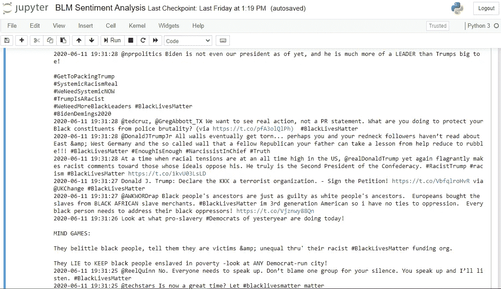
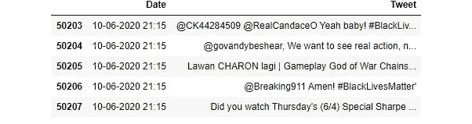
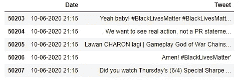
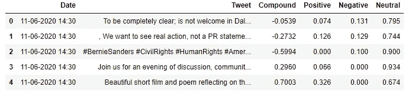
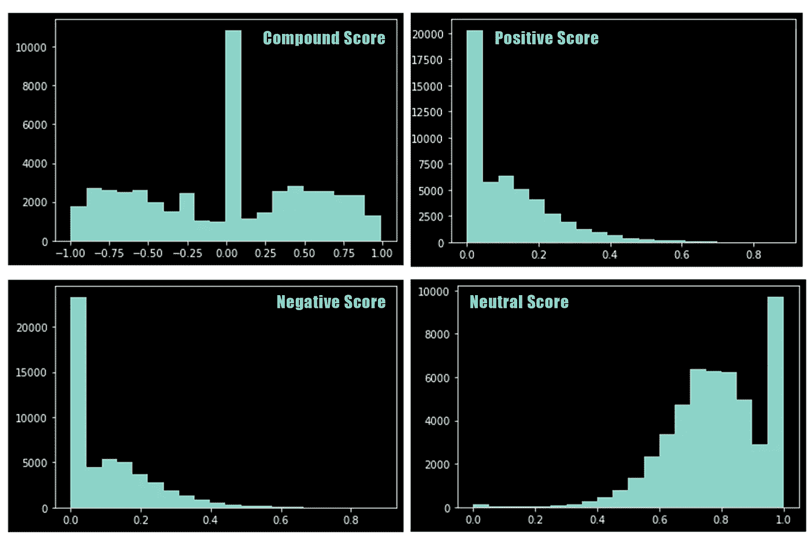
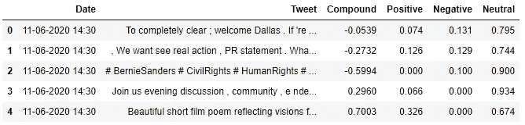
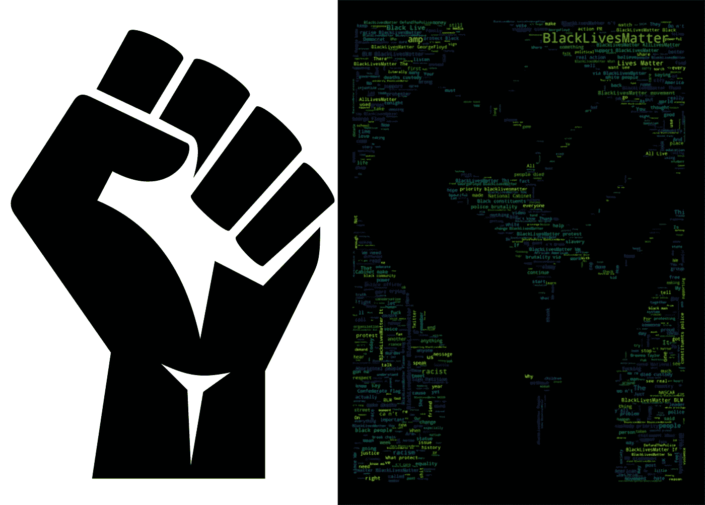

# # blacklivesmatter ✊✊✊:·维德使用 Python 对 Twitter 进行情感分析

> 原文：<https://pub.towardsai.net/blacklivesmatter-twitter-vader-sentiment-analysis-using-python-8b6e6fc2cd6a?source=collection_archive---------1----------------------->

## [自然语言处理](https://towardsai.net/p/category/nlp)， [Python](https://towardsai.net/p/category/programming/python)

照片由[蒂莫西·戴克斯](https://unsplash.com/@timothycdykes?utm_source=medium&utm_medium=referral)在 [Unsplash](https://unsplash.com?utm_source=medium&utm_medium=referral) 拍摄

> “求你了，我不能呼吸了”——乔治·弗洛伊德

2020 年 5 月 25 日，一名无辜黑人的最后一句话给美国公民敲响了警钟，让他们正视多年来根深蒂固的种族主义和警察暴行。现在一个问题一定曾经出现在你的脑海中，这种事件在过去也有报道。但是为什么这次变得如此全球化，来自美国所有 50 个州和许多其他国家的人们走上街头反对所有这些偏见？

答案将是社交媒体。我们知道种族主义是美国故事的一部分——事实上，是许多国家的一部分，但人们就是不相信。但这一次，当 9 分钟的视频浮出水面，显示一名无臂的无辜黑人如何被杀害时，普通民众的愤怒像野火一样蔓延。《华尔街日报》的这篇文章《 [**对乔治·弗洛伊德遇害的抗议如何在全球蔓延**](https://www.wsj.com/articles/social-media-helps-spur-global-protests-over-george-floyds-death-11591880851) 》对这个问题做了详尽的解释。但是等等，这是一篇关于 Twitter 数据情感分析的技术文章，对吗？—是的。让我们进入#BlackLivesMatter 抗议的整个场景的情绪分析方面。我这个项目的动机是检查人们对这个问题的反应，以及他们在网上表达自己的能力。考虑到冠状病毒导致的社会隔离，我已经看到社交媒体变得非常有毒，人们(阅读社交媒体士兵)开始传播负面信息，而不是给出建设性的批评。因此在这个项目中，我借助数据和情感分析技术来证实我的假设。

**你将在本文中探索的事情😄**

*   如何在 Twitter 上创建开发者账户和应用？
*   如何使用 tweepy 提取特定标签的 tweets。
*   如何使用[VADER](https://github.com/cjhutto/vaderSentiment)(***V****alence****A****ware****D****ictionary 和 s****E****ntiment****R****easer*进行情感分析
*   如何创建文字云与图像掩盖？

## 在 Twitter 中创建开发者账户和应用

*   申请一个[开发者账号](https://developer.twitter.com/en)。
*   创建新应用程序。填写必填字段。(如果你没有网站，你可以使用占位符。)需要帮助！检查[这个](https://iag.me/socialmedia/how-to-create-a-twitter-app-in-8-easy-steps/)出来。
*   转到您的[应用程序管理屏幕](https://developer.twitter.com/en/apps)，点击您的应用程序的**详细信息**。单击“密钥和令牌”选项卡。创建访问令牌和访问令牌密钥。(消费者和消费者密钥应该已经可见。)

在进入 tweepy 之前，给所有初学者一个忠告。每当你开始一个新项目时，先从创建一个虚拟环境开始。为什么这么问？—虚拟环境基本上是一个为您的特定编码项目开放的房间。它不是使用操作系统范围内定义的 Python 或 Python 包，而是旨在将您的 Python 及其依赖包与您的计算机托管的所有项目隔离开来。仍然怀疑我，不想经历所有的大惊小怪。好吧，那就让我拿出大枪来。下面的话来自我的一个朋友[沙斯瓦特·蕾恩卡](https://medium.com/u/b605c8e24791?source=post_page-----8b6e6fc2cd6a--------------------------------)，他是一名有抱负的数据科学家，即将成为通用电气医疗保健公司的 SDE，也是 2018 年通用电气精准医疗挑战的获胜者—

> 假设你同时在做两个项目。但是您只有一个安装了所有库和包的基础环境。你有一个两个项目都需要的库 X，但是有两个不同的版本。那么你的一个项目就会崩溃。如果你在一个适当的软件开发规模上工作，这种情况会一直发生。如果你所有的项目都非常基础，不需要特定包的特定版本，那么你可能不需要 Venv。此外，如果没有 venv，你就不能从事 GitHub 的开源项目，因为它们有严格的要求。(requirements.txt 要认真对待)而且如果你把他们的 requirements.txt 安装到你的 base env。然后所有其他事情都会崩溃。经历过这一切。 *✌🏻——****沙瓦特***

现在，主要的问题是如何去做。查看此[链接](https://www.geeksforgeeks.org/creating-python-virtual-environment-windows-linux/)了解虚拟环境的逐步设置。

## 使用 tweepy 提取推文

在您创建的虚拟环境中使用终端导入软件包之前，确保您已经使用`pip install tweepy`安装了软件包。

现在，进入有趣的部分——Twitter API 处理海量数据。twitter 确保开发者和用户的数据安全的方式是通过认证。现在，这就是 tweepy 展示其魔力的地方，它让 OAuth 1a ( [一种 twitter 允许的认证类型](https://developer.twitter.com/en/docs/basics/authentication/overview))对您来说尽可能地轻松。代码中使用了上一步中检索到的密钥。(由于显而易见的原因，没有显示这些键)

我们的 twitter 开发人员应用程序的身份验证代码

接下来，我们使用 tweepy 提取 tweetss，并使用我的访问键将 tweet 加载到一个 CSV 文件中，用于我们项目的分析部分。在这里，我们使用#BlackLivesMatter 作为标记来提取关于乔治·弗洛伊德之死的最近事件的推文。所有其他属性都是不言自明的，我建议您通过阅读 [tweepy](http://docs.tweepy.org/en/latest/) 的文档来探索它。

提取 tweets 并将其加载到 CSV 文件中的代码

显示使用 tweepy 提取的推文的输出(**图片作者**)

在这里，我遇到了一个大问题，花了我很长时间才解决。这些推文以 UTF-8 格式写在 CSV 文件中。因此，所有的表情符号都是一个大麻烦，因为我无法从 UTF-8 转换成普通的表情符号进行进一步分析(相信我，我已经搜索了整个网络来解决这个难题)。最后，我必须使用 regex 方法找到推文中所有 UTF-8 编码的表情符号，并将它们从 CSV 文件中删除。(如果谁有什么更好的解决办法，欢迎在下面随意评论。)

编辑 1:感谢评论中的宝贵反馈，我知道 VADER 也升级了 UTF 8 编码的表情符号。我建议你通过保留表情符号来探索更多更好的结果。

最后，使用更干净、更易处理的数据，我们使用 pandas 将数据引入 Dataframe 对象，以便更好地操作和清理 twitter 数据。(确保在您的 Venv 中使用 pip 安装了所有要求)

使用 Pandas 将 tweets 导入 Dataframe 的代码

在 Dataframe 对象中显示 tweets 的输出(**作者的图片**

现在我们必须清理数据，因为它包含大量的 URL、数字和 user _ ids，这在分析推文时变得具有挑战性，并且对推文的情感分析也没有贡献。

代码清理所有不必要的推文元素

清理后显示推文的输出(作者的**图片)**

现在我们已经完成了数据操作和清理，是时候进行下一个目标了——执行情感分析。

**什么是情感分析？**

情感分析或**意见挖掘**是[自然语言处理(NLP)](https://en.wikipedia.org/wiki/Natural_language_processing) 的一个子领域，它试图在给定的文本中识别和提取意见。情感分析旨在基于文本中主观性的计算处理来衡量说话者/作者的态度、情感、评价、态度和情绪。关于如何和为什么的更多细节，请参考此[链接](https://monkeylearn.com/sentiment-analysis/#:~:text=Sentiment%20analysis%20is%20the%20interpretation,in%20online%20conversations%20and%20feedback.)。

## 情感分析的 VADER

[VADER](http://comp.social.gatech.edu/papers/icwsm14.vader.hutto.pdf)(**V**alence**A**ware**D**ictionary and s**E**entiment**R**easoner)是一个基于词汇和规则的情绪分析工具，专门针对社交媒体中表达的情绪*。人们发现 VADER 在处理社交媒体文本、纽约时报社论、电影评论和产品评论时非常成功，因为它不仅告诉我们积极和消极的分数，还告诉我们情绪有多积极或消极。查看此[链接](http://t-redactyl.io/blog/2017/04/using-vader-to-handle-sentiment-analysis-with-social-media-text.html)见证 VADER 处理社交媒体文本的能力，这些文本由缩写、感叹词、多个标点符号组成(所有这些都代表用户的精神状态)。)*

确保您已经在 cmd/terminal 中使用 pip 安装了 Vader perspection。

用于 VADER 情感分析和随后向数据帧添加分数的代码

显示每条推文不同分数的输出(**作者图片**

关于评分的更多信息:复合评分是一个计算所有词典评分总和的指标，这些评分已经在-1(最极端的负面)和+1(最极端的正面)之间标准化。

正面情绪:(复合得分> = 0.05)
中性情绪:(复合得分> -0.05)和(复合得分< 0.05)
负面情绪:(复合得分< = -0.05)

考虑到上述评分标准，我们从我们的推文语料库中找到了 **19736/50208 正面**、 **19892/50208** 负面和 **10580/50208** 中性推文。为了可视化分数的分布，我们使用 matplotlib 通过条形图来呈现分布。

绘制分布图的代码

显示各种情感分数分布的图(**作者图片**

从上面的情节中，我们可以解读出大多数推文要么是中性的，要么是正面的。但是积极的程度比消极的程度要小。正面推文的数量可能比负面推文少，但中性推文的数量弥补了这一点。大约 40%的推文被归类为负面推文，这确实是一个严重的情况。作为负责任的社交媒体用户，我们应该知道如何以更成熟的方式构建我们的思想，并更具建设性地批评某人。对某人发泄仇恨是不应该的。你永远不知道某人正在经历什么，也不知道你发的那条微博会对某人产生什么样的影响。我知道考虑到我选择的关于种族主义的主题，一些像种族主义这样的词可能会被认为是负面的词汇，并会增加负面的分数，但请注意，也有许多推文只是有人分享了一个标题为“观看此视频”的视频，这将被归类为中性的。我同意会有一些噪音，但作为一个整体，数据集确实向我们展示了社交媒体的负面影响。

## 在图像上创建单词云遮罩

考虑到 VADER 有处理社交媒体文本的工具，我们不在乎删除停用词。但是，由于我们现在要制作一个词云来描述推文中最常用的词，很明显我们需要删除停用词。因此，我们从使用 NLTK(**N**natural**L**anguage**T**tool**K**it)包开始，它基本上是一套用于用 Python 编程语言编写的英语的符号和统计自然语言处理(NLP)的库和程序。

从推文中删除停用词的代码

删除停用词后显示推文的输出(**作者的图片**

最后，我们来到了该项目的最具视觉吸引力的部分。我们将使用臭名昭著的 python 库——Word Cloud 来制作单词 Cloud。首先，为了创建图像遮罩，我们将使用 PIL。PIL 库用于打开图像，并且从图像创建 numpy 数组以创建遮罩。numpy 数组可以与 ImageColorGenerator 一起使用，然后对单词 cloud 重新着色，以表示图像的颜色。

在完成图像的遮罩之后，我们使用使用图像生成的遮罩来生成单词云。然后为了进一步使用，我们使用`plt.savefig(‘image.jpg’)`将绘图/图像保存到我们的系统中

从 twitter 数据中屏蔽和生成单词云的代码

显示用作遮罩的图像和在遮罩上生成的文字云的最终输出(**作者的图像**

啊啊！！！所以我们得到了我们的单词云，它是用一个图像遮罩制作的。它清楚地描述了我们项目的主题，并帮助我们用数据来讲述一个故事。屏蔽是一个非常重要的讲述故事的工具，任何数据科学家都可以将其用于数据。

如果你正在读这篇文章，非常感谢你的耐心。我可以向你保证，你已经学到了一些东西，这些东西现在是，将来也将是分享你对某个特定主题的观点的绝佳手段，数据扮演着获奖的辅助角色。

*免责声明:社交媒体上的解释是有害的，也是基于所进行的数据分析，纯粹基于作者的观点。可能因人而异。*

—来自一个相信数据故事的人，他认为这篇文章是有效理解它的一种手段。😅