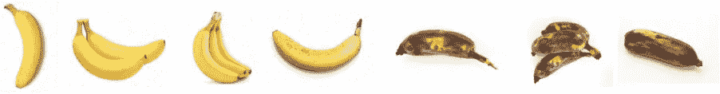
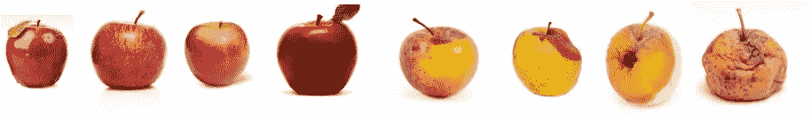
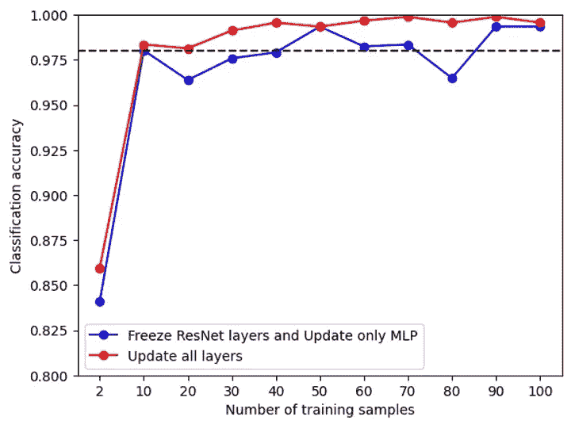
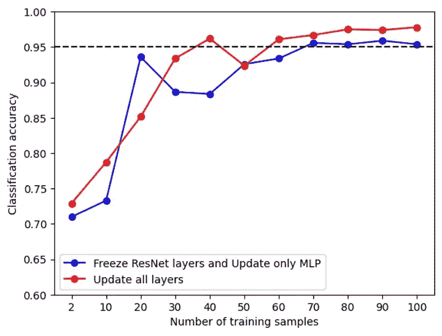

# Java 图像分类的小数据集快速训练

> 原文：<https://pub.towardsai.net/blazing-fast-training-with-small-dataset-for-java-applications-4acb9332cd0b?source=collection_archive---------2----------------------->


深度学习在解决 CV、NLP、强化学习等各种领域的问题中显示出强大的能力。，产生了许多成功应用的例子。然而，对于非常具体的定制任务，如杂货店中的腐烂水果检测，或公共场所中的戴口罩检测，仍有许多挑战要面对，包括以下两个:

1.适合该任务的训练数据集通常不会立即可用，而数据收集和注释可能会非常昂贵。

2.从头开始训练一个模型可能非常耗时，并且可能面临许多不确定性。

在这篇博文中，我们将用**迁移学习**解决上述两个问题，并在一个腐烂水果检测任务上演示。我们的结果表明，该模型可以在少于 **100** 幅图像的情况下达到 **95%** 的图像分类准确率。我们还将展示在 Java 环境中实现这一点是多么容易。

在接下来的 10 分钟内，您将了解如何实现这一点。

为了解决上面提到的问题，我们将使用 DeepJavaLibrary [DJL](https://github.com/deepjavalibrary/djl) 中的迁移学习特性。DJL 是一个为 Java 开发人员设计的深度学习库，与现有的深度学习引擎兼容，如 PyTorch、MXNet 和 Tensorflow，并支持 Java 中的模型训练和推理。我们还将使用 [ATLearn](https://github.com/awslabs/atlearn) ，一个自适应迁移学习工具包，来编辑和导入大型预训练模型。ATLearn 是一个轻量级迁移学习工具包，为 python 用户提供了各种 API、算法和模型动物园。

这篇博文的结构如下。

1.数据集和问题表述

2.迁移学习模式

3.Java 中迁移学习的演示

4.尝试减少训练数据的大小

5.摘要

**完整源代码**可从[这里](https://github.com/deepjavalibrary/djl/blob/master/examples/src/main/java/ai/djl/examples/training/transferlearning/TransferFreshFruit.java)获得。

# **1。数据集和问题公式化**

在这篇博文中，我们用从 Kaggle 竞赛中公开获得的[水果新鲜和腐烂数据集](https://www.kaggle.com/datasets/sriramr/fruits-fresh-and-rotten-for-classification)进行了演示。这个数据集由图片组成，图片中有一个水果，新鲜的或腐烂的。因此，检测腐烂水果的任务可以表述为两类分类问题。这项任务在食品杂货店建立自动腐烂水果检测中具有潜在的应用。

以下是一些图像数据的示例。

新鲜/腐烂香蕉数据集:



新鲜/腐烂的苹果数据集:



很明显，水果图像确实具有足够的视觉变化，可用于分类器模型。

# **2。迁移学习模式**

基于迁移学习，该模型建立在一个大的预训练模型之上，该模型用于获得嵌入向量。然后，嵌入向量被馈送到随后的全连接层，随后是 SoftMax 激活函数。因此，通过迁移学习，用户可以从大量预先训练的模型中受益，并解决他们自己定制的问题。

本次演示中使用的预训练模型是 [ResNet18](https://pytorch.org/vision/main/models/generated/torchvision.models.resnet18.html) 。你可以从 ATLearn 或者手动从 PyTorch 获得一个用它制作的嵌入模型。这里我们展示了使用 ATLearn 的方法，嵌入模型可以直接导出。

```
import ATLearn
model = ATLearn.get_embedding(ATLearn.task.IMAGE_CLASSIFICATION,
                              "EXPORT_PATH",
                              network='resnet18',  # pre-trained model from torch
                              user_network=None)   # users' own pre-trained model
```

在这一步，ATLearn 所做的是移除 ResNet18 的最后一层，以获得中间矢量，然后跟踪并导出模型为 TorchScript 文件`resnet18_embedding.pt`，然后可以直接在 DJL 加载。这部分将在下一节介绍。

# 3.Java 中迁移学习的演示

总的来说，这种迁移学习功能是一种培训功能，因此它的 API 与其他 DJL 培训示例有相似之处。它主要包含模型结构、数据加载、训练配置和指标。

**3。1 设置**

要开始使用 DJL 迁移学习功能，请将下面的代码片段添加到`build.gradle`文件中，它定义了必要的依赖关系。

```
plugins {
  id 'java'
}
repositories {
  mavenCentral()
}
dependencies {
  implementation "org.apache.logging.log4j:log4j-slf4j-impl:2.17.1"
  implementation platform("ai.djl:bom:0.21.0")
  implementation "ai.djl:api"
  runtimeOnly "ai.djl.pytorch:pytorch-engine"
  runtimeOnly "ai.djl.pytorch:pytorch-model-zoo"
}
```

**3.2 模型构建**

**3.2.1 在 DJL 加载包埋，建立模型。**如前所述，我们已经从 ATLearn 生成了一个嵌入层。现在我们可以把它装载到 DJL。这个嵌入层在`modelUrl = “djl://ai.djl.pytorch/resnet18_embedding”`也有。在 DJL，模型加载是通过`criteria` API 实现的，它作为搜索模型的标准。它提供了几个选项来配置模型。其中`trainParam`是专门针对迁移学习(或模型再培训)的选项。将其设置为“false”将会冻结加载的嵌入层(或模型)中的参数，而“true”则相反。

```
String modelUrl = "/EXPORT_PATH/resnet18_embedding.pt";
Criteria<NDList, NDList> criteria =
        Criteria.builder()
                .setTypes(NDList.class, NDList.class)
                .optModelUrls(modelUrl)
                .optEngine("PyTorch")
                .optProgress(new ProgressBar())
                .optOption("trainParam", "true")  // or "false" to freeze the embedding 
                .build();
ZooModel<NDList, NDList> embedding = criteria.loadModel();
Block baseBlock = embedding.getBlock();
```

在嵌入模型之上，我们进一步添加全连接(FC)层(也表示为 MLP 层)，其输出维度是类的数量，即，在该任务中为 2。我们使用顺序块模型来包含嵌入和完全连接的层。最终输出是一个 SoftMax 函数，用于获取类概率，如下所示。

```
 Block blocks =
        new SequentialBlock()
                .add(baseBlock)
                .addSingleton(nd -> nd.squeeze(new int[] {2, 3}))  // squeeze the size-1 dimensions from the baseBlock
                .add(Linear.builder().setUnits(2).build()) // add fully connected layer
                .addSingleton(nd -> nd.softmax(1));
Model model = Model.newInstance("TransferFreshFruit");
model.setBlock(blocks);
```

**3.2.2。教练配置。**训练器的配置主要包括损失函数(本例中为`SoftmaxCrossEntropy`)、评估指标(本例中为`Accuracy`)、用于获取训练监控数据的训练监听器等的设置。在我们的任务中，它们被指定如下所示。

```
private static DefaultTrainingConfig setupTrainingConfig(Block baseBlock) {
    String outputDir = "build/fruits";
    SaveModelTrainingListener listener = new SaveModelTrainingListener(outputDir);
    listener.setSaveModelCallback(
            trainer -> {
                TrainingResult result = trainer.getTrainingResult();
                Model model = trainer.getModel();
                float accuracy = result.getValidateEvaluation("Accuracy");
                model.setProperty("Accuracy", String.format("%.5f", accuracy));
                model.setProperty("Loss", String.format("%.5f", result.getValidateLoss()));
            });

    DefaultTrainingConfig config = new DefaultTrainingConfig(new SoftmaxCrossEntropy("SoftmaxCrossEntropy"))
            .addEvaluator(new Accuracy())
            .optDevices(Engine.getInstance().getDevices(1))
            .addTrainingListeners(TrainingListener.Defaults.logging(outputDir))
            .addTrainingListeners(listener);
     ...
     return config;
}
```

在这一步，我们将在这两层上分配不同的学习速率:嵌入层的学习速率比 FC 层的学习速率小 10 倍。因此，嵌入层中的预训练参数不会改变太多。学习率的分配由`learningRateTracker`指定，然后输入到`Optimizer`中的`learningRateTracker`选项，如下所示。

```
// Customized learning rate
float lr = 0.001f;
FixedPerVarTracker.Builder learningRateTrackerBuilder =
        FixedPerVarTracker.builder().setDefaultValue(lr);
for (Pair<String, Parameter> paramPair : baseBlock.getParameters()) {
        learningRateTrackerBuilder.put(paramPair.getValue().getId(), 0.1f * lr);
}
FixedPerVarTracker learningRateTracker = learningRateTrackerBuilder.build();
Optimizer optimizer = Adam.builder().optLearningRateTracker(learningRateTracker).build();
config.optOptimizer(optimizer);
```

在此步骤之后，通过`setupTrainingConfig`功能返回一个训练配置。然后用于设置训练器。

```
Trainer trainer = model.newTrainer(config);
```

接下来，训练器由下面的代码初始化，其中将指定每个块中参数的形状和初始值。必须事先知道`inputShape`。

```
int batchSize = 32;
Shape inputShape = new Shape(batchSize, 3, 224, 224);
trainer.initialize(inputShape);
```

3.2.3 数据加载。使用以下函数加载并预处理数据。

```
private static RandomAccessDataset getData(String usage, int batchSize)
        throws TranslateException, IOException {
    float[] mean = {0.485f, 0.456f, 0.406f};
    float[] std = {0.229f, 0.224f, 0.225f};

    // usage is either "train" or "test"
    Repository repository = Repository.newInstance("banana", Paths.get("LOCAL_PATH/banana/" + usage)); 
    FruitsFreshAndRotten dataset =
            FruitsFreshAndRotten.builder()
                    .optRepository(repository)
                    .addTransform(new RandomResizedCrop(256, 256)) // only in training
                    .addTransform(new RandomFlipTopBottom()) // only in training
                    .addTransform(new RandomFlipLeftRight()) // only in training
                    .addTransform(new Resize(256, 256))
                    .addTransform(new CenterCrop(224, 224))
                    .addTransform(new ToTensor())
                    .addTransform(new Normalize(mean, std))
                    .addTargetTransform(new OneHot(2))
                    .setSampling(batchSize, true)
                    .build();
    dataset.prepare();
    return dataset;
}
```

这里，数据用归一化和随机化函数进行预处理，这些函数通常用于图像分类(见本教程[)。随机化仅用于训练。](https://pytorch.org/tutorials/beginner/transfer_learning_tutorial.html)

**3.2.4 模型训练和导出。**最后可以用`Easytrain.fit`运行模型训练，保存模型进行预测。最后，`model.close()`和`embedding.close()` 被调用。在 DJL，在创建`Model`和`ZooModel<NDList, NDList>`的过程中，本地资源(例如 PyTorch 中分配的内存)被分配。这些资源由继承了`AutoCloseable`类的`NDManager` 管理。

```
EasyTrain.fit(trainer, numEpoch, datasetTrain, datasetTest);
model.save(Paths.get("SAVE_PATH"), "transferFreshFruit");

model.close();
embedding.close();
```

运行训练代码时，需要设置 VM 选项`-Dai.djl.default_engine=PyTorch`来指定引擎。培训过程的一般输出如下:

```
Training:    100% |████████████████████████████████████████| speed: 28.26 items/sec
Validating:  100% |████████████████████████████████████████|
[INFO ] - Epoch 10 finished.
[INFO ] - Train: Accuracy: 0.93, SoftmaxCrossEntropy: 0.22
[INFO ] - Validate: Accuracy: 0.90, SoftmaxCrossEntropy: 0.34
```

在这里，您可以监控训练和验证的准确性和损失下降。

# **4。尝试减少训练数据量**

迁移学习的主要优势在于它利用了预先训练的模型，因此可以在相对较小的数据集上进行训练。这将节省数据收集和注释的成本。在本节中，我们在`FreshFruit` 数据集上测量验证准确性与训练数据大小的关系。**全实验代码**可在[这里](https://gist.github.com/KexinFeng/d9c0a244d0597e6c6e161c1c1c2db569)获得。

在这个实验中，需要控制和随机选择训练数据集的大小。这部分实现如下，其中`cut`是训练数据的大小。

```
List<Long> batchIndexList = new ArrayList<>();
try (NDManager manager = NDManager.newBaseManager()) {
    NDArray indices = manager.randomPermutation(dataset.size());
    NDArray batchIndex = indices.get(":{}", cut);
    for (long index : batchIndex.toLongArray()) {
        batchIndexList.add(index);
    }
}
return dataset.subDataset(batchIndexList);
```

验证准确度与训练数据大小的结果如下。

新鲜/腐烂香蕉分类:



新鲜/腐烂苹果分类:



在这里，我们测试了两个场景:冻结 ResNet 层和只更新 MLP 和更新所有层。正如所料，后者的稳定精度略好于前者，因为 ResNet 参数也是由数据微调的。我们还可以看到，香蕉数据的精度在 30 个样本时达到稳定的 0.95，苹果数据的精度在大约 70 个样本时达到稳定的 0.95。它们都相对小于 Kaggle 提供的超过 1000 的训练数据大小。这验证了所需的训练数据集确实很小。当人们需要收集和注释数据时，这提供了所需最小数据大小的参考。

# **5。总结**

在这篇博文中，我们展示了如何在 DJL 为一个图像分类任务建立一个迁移学习模型。这个过程也适用于模型再训练。最后，我们给出了关于训练数据集可以减少多少的实验。这种减少的直接好处是，它有助于节省昂贵的数据收集和注释成本。这使得利用大型预训练模型来解决小型数据集的其他各种任务变得更加容易。

该演示同样适用于其他任务和数据，如[戴面具检测](https://www.kaggle.com/datasets/andrewmvd/face-mask-detection?select=images)和[水果新鲜度回归](https://www.kaggle.com/datasets/dcsyanwq/fuit-freshness)。参见 [ATLearn](https://github.com/awslabs/atlearn) 中的例子，了解它们在 python 中的实现，以及其他对象检测的例子。