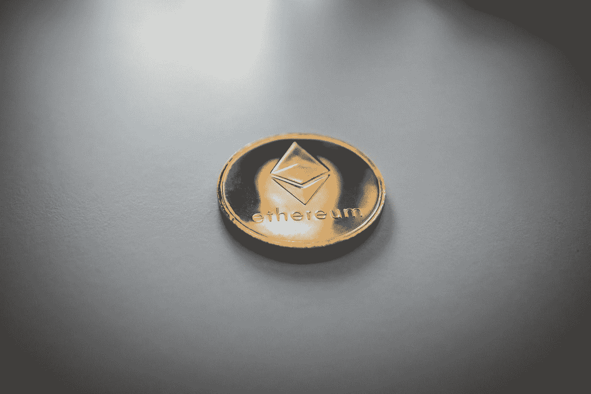
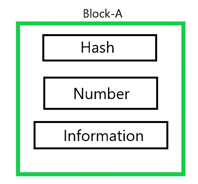
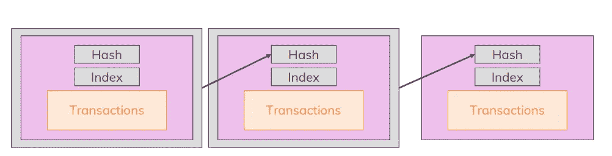

# 区块链——向五年级学生解释

> 原文：<https://pub.towardsai.net/blockchain-explained-to-a-5th-grader-a48ac91301ff?source=collection_archive---------3----------------------->

## [技术](https://towardsai.net/p/category/technology)

## “未来”技术简介

[尼克·钟](https://unsplash.com/@nick604?utm_source=medium&utm_medium=referral)在 [Unsplash](https://unsplash.com?utm_source=medium&utm_medium=referral) 上的照片

“区块链将改变世界。”哦，如果我每次收到一块钱，我就听到了这句话。

每个人都在谈论加密货币的含义，以及它将如何“彻底改变”我们所知的金融，但很少有人了解它将如何做到这一点。

“区块链”这个术语听起来有点“酷”，我必须承认，这就是为什么每当谈到“未来”时，每个人和他们的兄弟都在重复使用它。

是的，我知道你想在对话中听起来像一个知识分子，像“区块链”或“机器学习”这样的术语确实让你听起来像一个知识分子。但是仅仅知道这些术语是不够的。让自己了解这些技术，以及从长远来看它们将如何造福于我们人类。

所以不用再等了，让我们一起潜入区块链的世界吧。

我将一步一步地检查区块链的每个部分，并尽我最大的努力尽可能简单地解释这个概念。

## “块”和“链”

假设我有两个街区。

块 A 包含与个人所做的特定活动相关的信息。这种活动可以是任何事情，比如在特定的时间点转移一些钱或者发送信息。该块还包含一个数字和一个“hash”，我将在后面详细介绍。

典型街区

块 B 还包含关于由**完全不同的个人**在**不同的时间点完成的特定活动的信息。**

这两个块完全不同，没有任何关系，但是它们需要一个公共变量将它们“链接”在一起。

我们用一条“链”将这两个块“连接”在一起

这里的链只不过是块的“散列”变量。

“哈希”的计算方法是:获取块 A 的所有内容，**对其进行加密**，并将结果分配给块 b。

因此，如果有人要改变或更改块 A 的内容，他/她将间接改变块 b 的“散列”

这种机制保持所有块相互链接，并且一个块中的单个改变会影响它之后的所有连续块。

典型的区块链

这是典型的区块链跟踪每个区块的方式。

让我们继续前进。

## 工作证明

所以我们知道，当我们发送信息或转移资金时，一条记录会以块的形式保存下来，并添加到区块链中。

我们还知道，所有块都使用一个公共的“散列”变量链接在一起。

这一切都很好，但假设有人决定改变所有的块。那个人决定不仅仅改变一个块，而是改变链中的所有块来实现他们的恶意目标。

我们如何防范这种情况？

这就是“工作证明”的来源。

每当资金被转移，或一些信息被发送，我们说交易已经发生。
并且该记录被存储在块中并被“添加”到块链中。

事情是这样的，我们需要让给区块链添加区块的过程变得异常艰难。

我们希望人们在获得将区块添加到链中的特权之前实际上“投入了工作”。

“工作证明”所做的是，它给出了一个需要解决的极其复杂的问题，谁解决了它，谁就可以将该块添加到区块链中。但是问题来了，为什么有人会解决这么复杂的问题？

“这对他们有什么好处”？

## 节点网络

照片由[阿丽娜·格鲁布尼亚](https://unsplash.com/@alinnnaaaa?utm_source=medium&utm_medium=referral)在 [Unsplash](https://unsplash.com?utm_source=medium&utm_medium=referral) 上拍摄

所以你做一个交易，你的信息被存储在一个块中，在一个复杂的问题被解决后，这个块被添加到这个链中。

这听起来很简单，但它会变得更好。

区块链存在于被称为节点网络的广泛的对等网络中。

当进行交易时，每个节点都被告知该交易，并被给予一个复杂的问题来解决(工作证明)。

最先解决问题的节点**以加密货币的形式奖励**其努力。

在特定节点解决了问题并将解决方案通知给其他节点之后，其他节点仍然继续求解，并且只有在答案匹配的情况下才“同意”声明的有效性。

这样，任何节点都不能篡改事务数据并做出错误的声明。

块被存储到链中，并且所有节点更新它们已经存储到它们的机器上的块链的副本。

**私钥和公钥**

公钥只不过是你的“数字钱包”的地址假设我想从我的一个朋友那里收到一些比特币。我会把我的公钥给我的朋友，他会用它给我寄钱。

另一方面，我可以随时使用私钥来访问我的资金。但有趣的是。

私钥一旦丢失就再也找不回来了。

因此，如果一个人丢失了他/她的私钥，他们将永远无法使用他们的资金。

这里没有“恢复密码”。这就是为什么私钥必须始终保持安全的原因。

## **为什么选择区块链？**

因此，我们浏览了制作区块链的所有简洁和方便的细节，但问题出现了。

我们甚至需要区块链吗？为什么技术受到如此多的关注？它有什么特别之处？

如果让我用一个词来回答这个问题，我会说那就是隐私。

没人知道你是谁，你给谁寄钱，寄了多少钱。

这就是区块链技术的魅力所在，不像传统的交易系统，银行是“中间人”。区块链技术是完全去中心化的。
不用担心你的资产被冻结，也不用担心你的交易被追踪。

一些人可能会认为区块链的这些方面往往有利于参与非法活动的人，这是有道理的。

但事实仍然是，个人的身份和信息是完全安全和匿名的。

## **结论**

这是对区块链世界的简短介绍。

我试图以尽可能简单的方式复习基础知识。希望你们会发现这篇文章有用且方便。