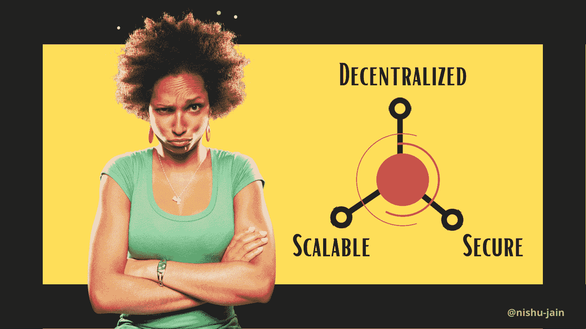
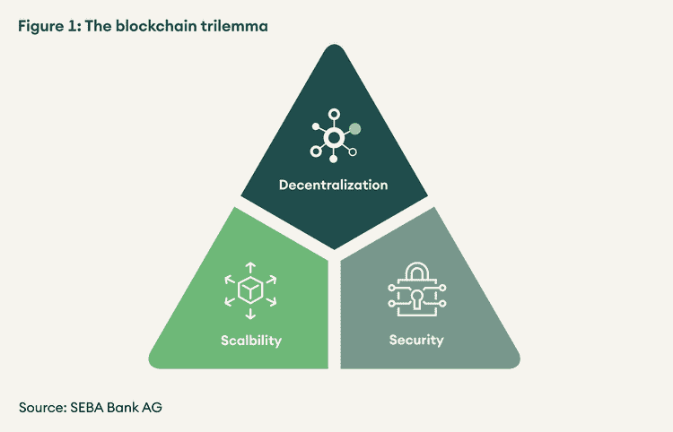
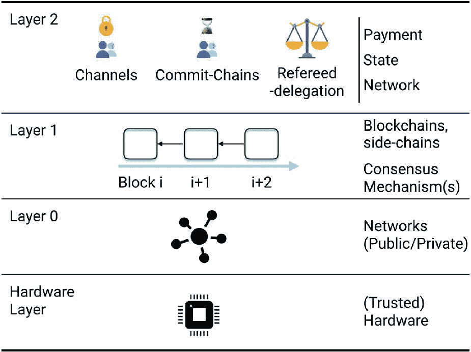

# 解决区块链三难问题——所有去中心化网络的最终目标

> 原文：<https://pub.towardsai.net/blockchain-trilemma-decentralized-networks-4e87088c9a9a?source=collection_archive---------1----------------------->

## [技术](https://towardsai.net/p/category/technology)

## 同时具备分散性、安全性和可伸缩性比看起来更难

图片由作者提供(使用 Canva 设计)

T 区块链是作为提供分布式安全交易的解决方案而开发的，可以扩展到全球范围。但是这项技术的三个特征——去中心化、安全性和可扩展性——本身在大多数实际应用中变得相互矛盾，导致了一种被称为**区块链三难困境**的情况。

这是一个不成文的规定，区块链应用程序必须在三个支柱中的一个上妥协，以加强其他两个。

一个支持很多币的主要区块链上的 [51%攻击](https://www.investopedia.com/terms/1/51-attack.asp#:~:text=A%2051%25%20attack%20is%20an,other%20miners%20from%20completing%20blocks.)。

正如你在上面看到的，以太坊经典就牺牲在这样的一根柱子上，导致了一场大灾难。这本来可以通过保持平衡来避免，但是…这总是可能的吗？

*如果是，那么如何？*

# 区块链技术的三大支柱

我们先来了解一下区块链的这三个基本原理在这个背景下本质上意味着什么，能解决吗？

1.  **去中心化** —区块链是关于提供不依赖于中央实体的服务，即使它可能由某个机构拥有或管理。它是在分布式账本的帮助下实现这一点的，分布式账本是一种以数字方式存储共识数据、在全球范围内共享和同步的方式，并借助于被智能合约破坏的政策。然而，这是有代价的，区块链中的每个参与实体都增加了它的分布式程度，也增加了它所包含的哈希的复杂性和深度。从而增加了链的安全性，但是同时使得每个节点为验证交易所做的每个计算更加计算密集，迫使系统在可扩展性上妥协。
2.  **可扩展—** 规模是区分实际应用和理论解决方案的标准。尤其是当你开发的东西被大众使用的时候。银行服务上的交易负载可以并且确实达到了*每秒数千笔交易，*如果区块链作为一种替代方案出现，需要确保它能够确保这样的服务。但是试图扩展到这两个极端，当前需要实现更简单的散列，并且更简单的散列也更容易被破坏，损害了安全性，另一方面，也可以减少参与代理以减小链的大小，但是这将再次抵消分散性以及安全性。
3.  **安全性—** 许多小规模企业如此渴望转向区块链，因为它固有地提供了安全性和对攻击的抵抗力。需要区块链上的共识来验证任何状态或交易，这只能通过至少 51%的节点支持*来实现。因此，任何攻击都应该首先获得相当于给定网络中 51%节点的计算能力。安全性也是所使用的散列方案的复杂性的函数，因此增加安全性也会影响网络的性能，这本质上意味着牺牲可扩展性。*

# 区块链为什么会遭遇三难困境？

如上所述，我们知道分散性、可伸缩性和安全性是相互依赖的:

你一定注意到这完全类似于国际经济学中的[不可能的三位一体](https://en.wikipedia.org/wiki/Impossible_trinity)，其中*固定外汇汇率*、*资本自由流动、*和*独立的货币政策*银行只能追求这三位一体中的几个。

Vitalik Buterin 提出，根据应用需求，从三种期望质量中选择两种是一种折衷。

数学上，

> 可扩展性 1/分散化

和

> 安全∝权力下放

虽然它不是基于数学证明，纯粹的实用启发式。

来源:[https://www.seba.swiss/research/the-blockchain-trilemma](https://www.seba.swiss/research/the-blockchain-trilemma)

## 例子

*   2020 年 8 月以太坊经典(ETC)区块链——与以太坊本身无关，经历了三次 51%共识攻击；它成为了一个易受攻击的目标，因为它用安全性换取了更好的可伸缩性。
*   提供产品 VISA 的集中式金融服务每秒平均处理 63000 笔交易，将其与 Blockchain，EOS 进行比较，在其白皮书中描述了一种为稳定性而设计的区块链，以*实现超过 100 万 TPS* ,但由于这是对安全性的赌博，也是去中心化的必然障碍，当前的实用方法仅声称最多 4000 TPS。
*   Hyperledger 的结构和其他企业区块链是安全的，可以支持高交易吞吐量，但被设计为遵循使用*非常少的核心节点的集中式架构。*

***那么我们还有什么可以做的呢，还是我们永远注定要失败？***

很明显，有一些方法并且已经被采用，所以让我们讨论一下主要的想法:

## 解决方法

你一定注意到了一件事，如果在不扰乱其他两个品质的情况下实现了哪怕一个品质，我们就可以解决这个问题。

几乎当今设计的每个系统都遵循分层设计，以实现更好的模块化，区块链也不例外——因此你猜对了，这些解决方案也针对不同的实现级别，或者更准确地说，第 1 层顾名思义是处理区块链自身内部复杂性的实现级别层，而第 2 层使用第 1 层的服务，即使用底层现有区块链，并用于开发应用程序，即在其上开发 dApps。

来源:[https://link . springer . com/chapter/10.1007/978-3-030-51280-4 _ 12](https://link.springer.com/chapter/10.1007/978-3-030-51280-4_12)

## 第 1 层解决方案-

1.  **利益证明—** 目前，区块链少校使用一种称为“工作证明”的协议，简称 PoW，也代表战俘，完全符合这个比喻，PoW 虽然安全，但速度很慢。在 Proof of Stake (PoS)中提出了一种新的方法，该方法根据验证者在给定网络中的股份或持有情况来选择验证者，因此它确实减少了所需的计算，允许在不影响其他两者的情况下解决可扩展性问题。
2.  **分片—** 如果你曾经研究过区块链的发展，它站在分布式数据库的肩膀上，因此它也采用了其中使用的另一种技术，即分片——简单地说，整个区块链被分区，每个交易不是由每个节点验证，而是仅由分片分区中的节点验证，这实现了分布式和可扩展性，并且通过充分的优化也实现了安全性。

## 第二层解决方案-

1.  **嵌套的区块链—** 区块链毕竟是一个网络，你可能知道计算机网络中用于可扩展性的解决方案。我们以独立的层级管理网络，主链和多个嵌套链遵循父子关系，父母将交易验证委托给子女。
2.  **状态通道—** 允许代理在区块链之外以 P2P 方式进行通信的方法称为链外通信，这是状态通道所促进的，如果这种通信与链连接，那么处理交易的网络负载将大大降低，并且仅限于必要的操作。
3.  **侧链—** 减少网络负载最明显的方法是什么？—我们只需创建另一个网络，侧链就是这简单的一步。它建议创建多个并行链，然后将一个链用于主要角色，而将其他链用于资源密集型用途。

这些解决方案并不是童话故事，一些杰出的玩家正在使用它们:

*   大家都在致力于尽快切换到以太坊 2.0，为什么？因为它用的是利害关系证明，而不是工作证明。
*   Zilliqa、Tezos 和 Qtum 是一些使用分片的主要区块链。
*   OMG 等离子体项目在以太坊第一层上使用嵌套链来实现可伸缩性和安全性。
*   作为国家渠道的一个例子，比特币闪电成为焦点。

比特币三难困境可能会成为过去的问题，而更多的改进正在进行中，即使目前的发展离区块链不断增加的应用范围也不远了。

如果你喜欢阅读这些故事，我相信你会很乐意成为一名中等付费会员。每月只需 5 美元，你就可以无限制地接触成千上万的故事和作家。你可以通过 [***注册使用此链接***](https://nishu-jain.medium.com/membership) ，*来支持我，我将赚取一点佣金，这将帮助我成长并出版更多像这样的故事。*

**您可能喜欢的其他文章—**

 [## 值得了解的 10 个改变游戏规则的人工智能突破

### 过去几十年中引人入胜的想法和概念

pub.towardsai.net](/10-game-changing-ai-breakthroughs-worth-knowing-about-b2076afc4930)  [## 为什么做一个 ML 研究员或者开发者超级难？

### 这一认识彻底改变了我的生活

pub.towardsai.net](/why-its-super-hard-to-be-an-ml-researcher-or-developer-67fa62fc1971)  [## 为什么机器学习正在成为一个笑话？

### 这个被过度宣传的职业令人不安的真相

medium.datadriveninvestor.com](https://medium.datadriveninvestor.com/machine-learning-is-becoming-a-joke-automl-downsides-c7634ce0572c)