# 蓝色与绿色，尺寸与度量，离散与连续:通向 Tableau 桌面专家认证之路

> 原文：<https://pub.towardsai.net/blue-vs-green-dimensions-vs-measures-discrete-vs-continuous-a-road-to-tableau-desktop-specialist-4bcfef832a66?source=collection_archive---------0----------------------->

## 第 6 章:蓝药丸和绿药丸、尺寸和度量、离散和连续、度量名称和度量值与示例问题之间的清晰对比

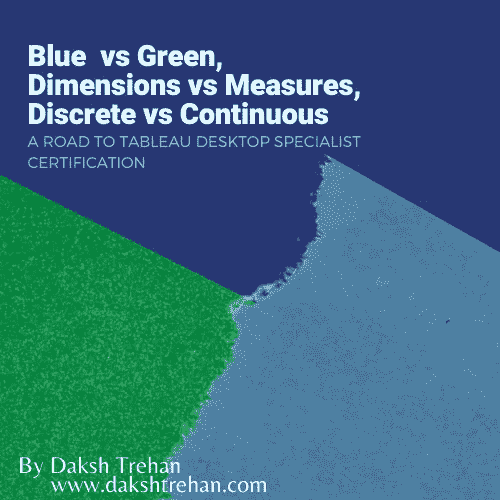

欢迎来到第六章，在这一章中，我们将学习维度、度量、蓝色药丸、绿色药丸、离散值和连续值。

> 如果你想浏览其他章节，请访问: [Tableau](https://medium.com/u/fcbe60d0bf8b?source=post_page-----4bcfef832a66--------------------------------) **:这是什么？为什么它是最好的？；Tableau 桌面专家认证之路。**

> 如果你想直接上 Tableau 桌面专家笔记，请在这里访问→[https://dakshtrehan . comment . site/Tableau-Notes-c 13 fceda 97 b 94 BDA 940 edbf 6751 cf 30](https://dakshtrehan.notion.site/Tableau-Notes-c13fceda97b94bda940edbf6751cf303)
> 
> 使用链接访问免费 Tableau 认证转储(有效期至 2022 年 7 月 6 日):
> 
> [https://www . udemy . com/course/tableau-desktop-specialist-certification-dumps-2022/？coupon code = e3f 08189 fa 4 bafae 72 BC](https://www.udemy.com/course/tableau-desktop-specialist-certification-dumps-2022/?couponCode=E3F08189FA4BAFAE72BC)

每当我们在 Tableau 中加载一些数据时，数据字段会被自动分配一个**角色** &一个**类型**。

数据字段可以被分配两个角色:

*   尺寸
*   措施

数据字段可以对应于以下数据类型:

*   线
*   数字
*   地理学的
*   布尔代数学体系的
*   日期
*   日期和时间

有关数据类型的更多信息，请参见 Tableau 中的[**数据类型:使用&清理**](/data-types-in-tableau-using-cleaning-a-road-to-tableau-desktop-specialist-certification-7793111f60bd)

# 目录

*   **尺寸与度量【什么】**
    –默认属性:尺寸与度量
    –颜色:尺寸与度量
*   **离散(蓝色)与连续(绿色)** **【如何】**
    –滤镜:离散与连续
*   把所有这些放在一起！
    –将尺寸转换为测量，反之亦然
    –将离散转换为连续，反之亦然
    –视图中的尺寸
    –视图中的测量
*   **测量值&测量名称**
*   **本题的样题**

# 维度与度量

Tableau 中的 Dimension 代表包含定性值(即描述性值)的任何数据字段。

Tableau 中的度量代表任何包含量化值的数据字段，即以数字形式传达信息的值。简而言之，我们可以对其执行聚合的任何东西(sum、count、avg 等)。)

每当我们对我们的行/列货架采取措施时，它会自动聚合*(默认为:sum)* 。

Tableau 自动将数据划分为维度和度量，它还提供了在两个角色之间切换数据的灵活性。

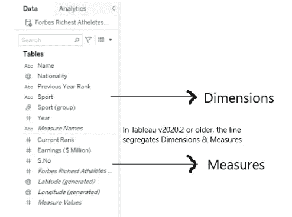

> 维度+度量:什么？

维度和度量有助于了解更多关于数据的信息，即**它代表/意味着什么。**

> 维度:独立变量
> 
> 度量:因变量

维度总是影响细节的级别，即维度越多，数据越细。更简单的说，你增加的维度越多，在我们看来就会产生越多的标记。

> Tableau 自动生成(以斜体格式显示):

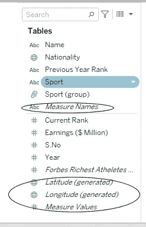

> 一维-度量名称
> 
> 4 个测量值—纬度、经度、记录数、测量值

定义如何对计算(执行计算的数据范围)进行分组的维度被称为**分区字段**。

执行表格计算的剩余维度被称为**寻址字段**，并确定计算的方向。

## 默认属性:维度与度量

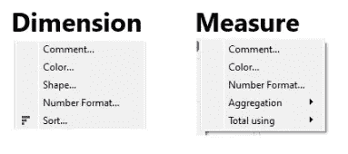

如果我们右击尺寸/度量并寻找“默认属性”，尺寸和度量共享**颜色&注释**。

> *对于维度，* ***数字格式*** *只会出现在日期类型字段中。*

## 颜色:尺寸与尺寸

> 颜色来自**默认属性**。不要把它和蓝色或绿色混淆！

当我们为 Dimension 选择 Color>>Default Properties 时，它给出了一个不同调色板的选项。但是如果我们对 Measure 做同样的事情，它将提供一个连续的调色板。

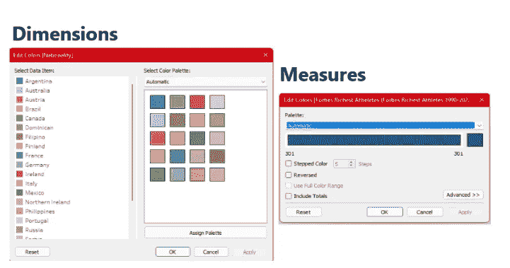

# 离散与连续

Tableau 中的 Discrete 代表任何单独的数据。以**蓝色药丸为代表。**这些用于**在我们的图表中创建标题**。

Continuous in Tableau 代表链格式的任何数据，即形成一个完整的整体，没有中断。这种类型的数据由**绿色药丸**表示。这些有助于**创建一个轴。**

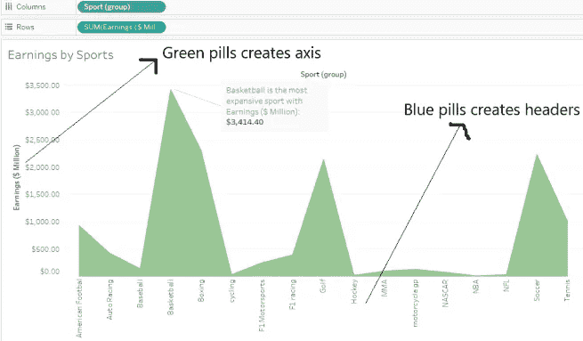

> 离散+连续:如何实现？

离散和连续有助于理解我们希望如何显示数据？

## 过滤器:离散与连续

当我们尝试使用离散字段作为过滤器时。我们得到四个选项: ***、通用、通配符、条件、顶级***

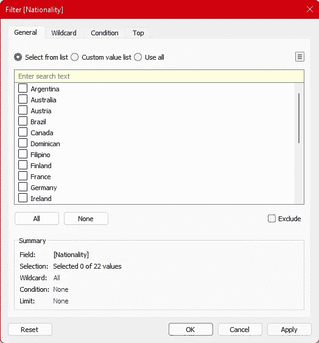

但是，如果我们使用连续字段作为过滤器，它会显示不同的选项。

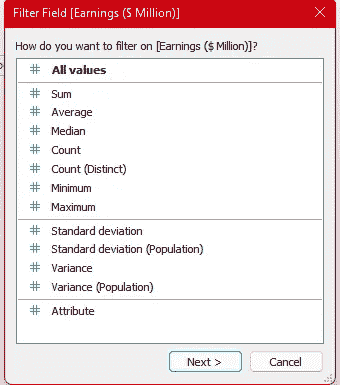

# 把所有的东西放在一起！

> 维度+度量:什么？
> 
> 离散(蓝色)+连续(绿色):如何？

现在，既然我们理解了维度、度量、离散、连续的核心含义。是时候把它们结合起来，放到一个真正的项目中去了。

> 维度可以是离散的，也可以是连续的。但是它通常是离散的。
> 
> 测量可以是离散的，也可以是连续的。但通常是连续的。

这意味着一个尺寸既可以生成一个轴，也可以生成一个标题。类似地，测量也能够生成轴或标题。

> 地理和日期可以是连续的，也可以是离散的。
> 
> **包含字符串或布尔值的维度不能是连续的。**

## 将尺寸转换为测量，反之亦然

要将数据字段用作尺寸或度量，只需将其拖放到分隔线之前或之后。

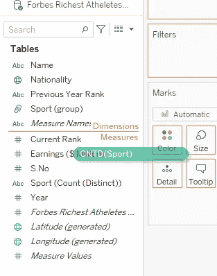

## 从离散到连续的转换，反之亦然

只需右键单击并选择所需选项，即可将离散字段转换为连续字段，反之亦然。

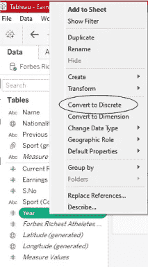

## 视图中的尺寸

**通常的情况** →当我们试图在视图中放置离散的维度时，它会创建一个标题。

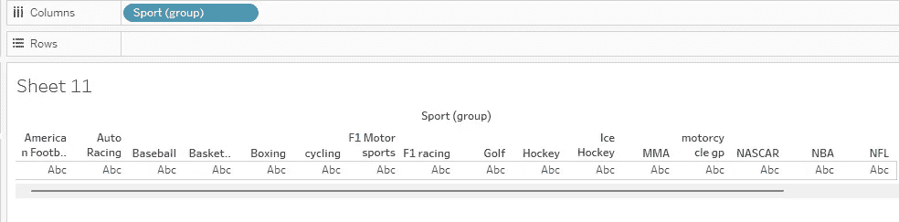

**不寻常的情况** →但是，如果我们试图在视图中放置一个连续的维度，Tableau 将试图聚合该维度，并将创建一个连续的轴。

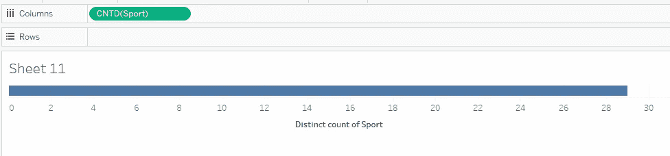

## 视图中的度量

**通常情况** →当我们试图在视图中放置连续的度量时，它会创建一个轴。

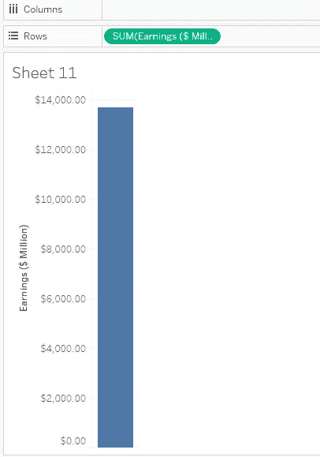

**异常情况** →但是，如果我们把连续测度转换成离散测度，就会给我们一个表头。

当我们只想创建标题或标签时，这种情况会很有用。

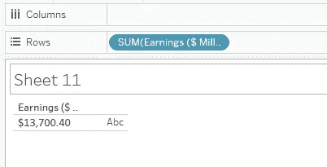

# 测量值和测量名称

每当您在 Tableau 中加载数据时，您总是会注意到数据窗格中的度量名称和度量值。**这些值由 Tableau 自动生成，不能删除。**

**测量值是连续测量**，它包含了数据中的所有测量值。

**度量名称是一个离散维度**，包含所有度量的名称。

> 测量名称和测量值的作用分别类似于其他离散尺寸和连续测量。

当我们想要创建显示多个度量的文本表格时，我们可以将度量名称和度量值一起添加。

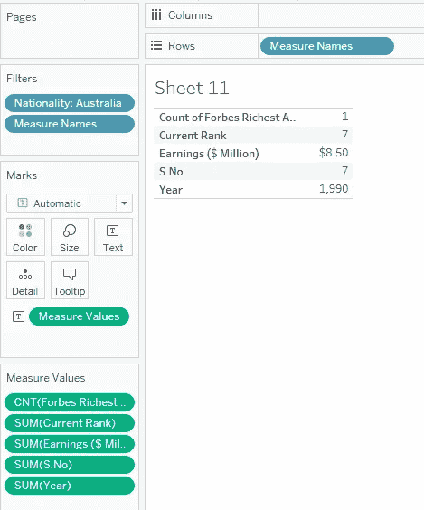

在本例中，如果对于国家“澳大利亚”,我们希望以文本表格的形式了解所有信息，而不是拖放每个度量，我们可以使用度量值。

> 如果我们处理涉及多个轴的图表，Tableau 将自动在视图中添加度量名称和度量值，即，向同一个轴添加两个或更多度量会自动向视图添加度量名称，通常还会添加度量值。

**文本表格最多可创建 50 行& 16 列。**

# **本题的样题**

**Tableau 自动生成 __ 个维度和 __ 个度量。** a. 2，4
b. 1，4
c. 4，1
d. 4，2

**解决方案:** 1，4

**我们可以对 __**
a .绿色字段
b .蓝色字段
c .离散
d .连续

**解决方案**:绿色田野

**维度和度量的通用默认属性是什么？【选择 2】**
a .注释
b .颜色
c .形状
d .总用

**解决方案**:注释，颜色

**测量值是 ____。** a .离散尺寸
b .连续尺寸
c .离散测量
d .连续测量

**解决方案:**连续测量

**包含 __ 或 __ 的维度不能连续？**
a .字符串
b .布尔
c .地理
d .日期

**解:**字符串，布尔

> 使用链接访问免费 Tableau 认证转储(有效期至 2022 年 7 月 6 日):
> 
> [https://www . udemy . com/course/tableau-desktop-specialist-certification-dumps-2022/？coupon code = e3f 08189 fa 4 bafae 72 BC](https://www.udemy.com/course/tableau-desktop-specialist-certification-dumps-2022/?couponCode=E3F08189FA4BAFAE72BC)

# 参考资料:

[1] [Tableau 帮助| Tableau 软件](https://www.tableau.com/support/help)

【2】[个人笔记](https://dakshtrehan.notion.site/Tableau-Notes-c13fceda97b94bda940edbf6751cf303)

[3] [Tableau 桌面专家考试(新花样— 2021) — Apisero](https://apisero.com/tableau-desktop-specialist-exam-new-pattern-2021/)

[4] [sqlbelle](https://www.youtube.com/watch?v=FtyVMvfzn1I)

# 感谢阅读！

请随意鼓掌，这样我就知道这篇文章对你有多有帮助，并分享到你的社交网络上，这对我会很有帮助。

如果你喜欢这篇文章，想了解更多**机器学习，数据科学，Python，BI。请考虑订阅我的时事通讯:**

> [达克什·特雷汉的简讯](https://mailchi.mp/b535943b5fff/daksh-trehan-weekly-newsletter)。

在网上找到我:[www.dakshtrehan.com](http://www.dakshtrehan.com/)

在 LinkedIn 和我联系:[www.linkedin.com/in/dakshtrehan](http://www.linkedin.com/in/dakshtrehan)

阅读我的科技博客:[www.dakshtrehan.medium.com](http://www.dakshtrehan.medium.com/)

在 Instagram 和我联系:【www.instagram.com/_daksh_trehan_ 

# 想了解更多？

[从无到有的画面](https://dakshtrehan.medium.com/list/tableau-from-scratch-d42e68d35bfd)(画面文章列表)

[从零开始的机器学习](https://medium.com/@dakshtrehan/list/machine-learning-from-scratch-e413c437fe7a)(ML 文章列表)

[YouTube 是如何利用 AI 推荐视频的？](/how-is-youtube-using-ai-to-recommend-videos-38a142c2d06d)
[利用深度学习检测新冠肺炎](https://towardsdatascience.com/detecting-covid-19-using-deep-learning-262956b6f981)
[逃不掉的 AI 算法:抖音](https://towardsdatascience.com/the-inescapable-ai-algorithm-tiktok-ad4c6fd981b8)
[GPT-3 向一个 5 岁的孩子解释。](/gpt-3-explained-to-a-5-year-old-1f3cb9fa030b)
[Tinder+AI:一场完美的牵线搭桥？](https://medium.com/towards-artificial-intelligence/tinder-ai-a-perfect-matchmaking-b0a7b916e271)
[一个内部人士的使用机器学习卡通化指南](https://medium.com/towards-artificial-intelligence/an-insiders-guide-to-cartoonization-using-machine-learning-ce3648adfe8)
[谷歌是如何做出“哼哼来搜索的？”](/how-google-made-hum-to-search-865f224b70d0)
[一行神奇的代码执行 EDA！](/one-line-magical-code-to-perform-eda-f83a731fbc35)
[给我 5 分钟，我给你深度假！](/give-me-5-minutes-ill-give-you-a-deepfake-ce83a645b0f9)

> *欢呼*