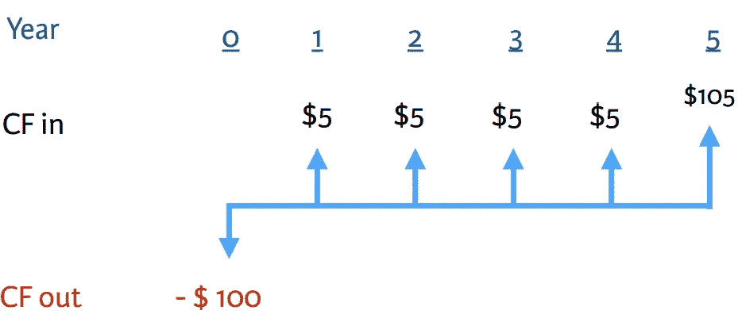
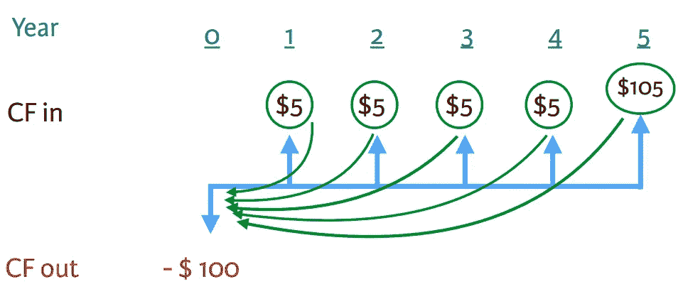
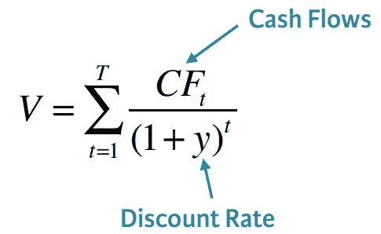
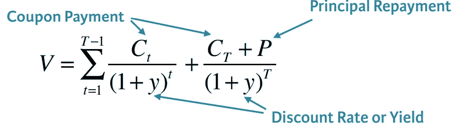

# 债券估值与分析(一)

> 原文：<https://pub.towardsai.net/bond-valuation-and-analysis-part-1-44df0ca25609?source=collection_archive---------1----------------------->


## 走进应用金融世界的一小步

## 如何计算货币的现值、未来值和时间值—一个实例

债券是由公司发行并作为可交易资产证券化的公司债务单位。传统上向债券持有人支付固定利率(息票)的固定收益工具(*可变或浮动利率现在也很常见)* — [Investopedia](https://www.investopedia.com/terms/b/bond.asp)


**债券特性**

● `**Issuer**`:借钱的实体

● `**Principal**`:借款金额(票面金额或面值)

● `**Coupon Rate**:`发行人同意支付的利息金额(每年、每半年或每季度|固定或浮动利率)

● `**Maturity Date:**`本金返还给投资者的日期(部分债券未到期)

● `**Embedded Options**`:

*   示例— **可赎回债券**(发行人可以以预先约定的价格提前回购债券)
*   需要更复杂的分析。

在本文中，我们将了解:

●年票

●固定利率

●固定期限

●无嵌入式选项

# 价格与价值

●有时，“价格”和“价值”这两个术语可以互换，但也有区别:

*   价格:获得一项资产所支付的金额
*   价值:资产的价值

●对于活跃交易的资产，价格可能被认为是价值的最佳估计

# 金钱的时间价值

●今天的 1 美元比明天的 1 美元更有价值

●假设你在一场游戏中赢了 1000 美元，你会选择什么？

*   今天收到 1000 美元了吗？
*   一年后收到 1000 美元？

## 未来价值

●未来价值是投资价格在未来某个时间点的价值

●从现在起一年和两年的未来值`(fv)`可以计算为:

```
fv1 <- pv * (1+r)
fv2 <- pv * (1+r) * (1+r)
***** r is interest rate
*** pv is present value**
```

## 现值

●未来价值的逆向逻辑

●未来 1 美元的价值在今天变得更低

●所以你会愿意今天拿不到 1 美元，而不是等一两年后再拿 1 美元

●这可以通过以下方式计算:

```
pv <- fv1 / (1 + r)
pv <- fv2 / ((1 + r) * (1 + r))
*****fv1 is future value calculated for one year from above
***fv2 is future value calculated for two years from above**
```

## TVM 适用于债券

●我们可以将货币的时间价值概念应用于债券

●示例:

*   面值 100 美元，票面利率 5%(= $ 5)，5 年后到期
*   价格=今天 100 美元

你应该购买这种债券吗？

为了确定债券的价值，我们可以用图表显示一段时间内的现金流入和现金流出。

假设今天是`‘zero’` 年，你将支付 100 美元购买债券，如下表所示。



您将通过`year four`获得$5 `year one` 。在第 5 年，你将得到最后一笔息票付款+100 美元本金付款。之后，债券到期，不再是未偿还的。

要知道今天放弃 100 美元是否值得，你需要知道息票和本金支付的现值`(pv)`大于 100 美元。

要做到这一点，你应该拿第一年的 5 美元，计算它的现值，并对第`year one`年到第`year four`年的 5 美元做同样的事情

在`year five,` 中，你将计算 105 美元的价值。

## **比较现金流**



这些现值的总和等于债券的价值

```
#Using the above example i.e Bond with 5 year to maturity and has a yield of 6%, which acts as the discount rate.
# Create vector of cash flowscf <- c(5,5,5,5,105) **#Create vector with cash flow**cf <- data.frame(cf)**# Convert to data frame**cf$t <- as.numeric(rownames(cf)) **# Add column t**cf$pv_factor <- 1 / (1 + 0.06)^cf$t **# Calculate pv_factor**cf$pv <- cf$cf * cf$pv_factor **# Calculate pv**sum(cf$pv)**# Calculate the bond price****95.78764**
```

> 如果现值之和**超过**100 美元，你**买入**债券。

# 债券估价

在本节中，我们将考虑一个简单的债券:

●固定年利率

●固定到期日

●无嵌入式选项

## 资产的价值

> 从经济学角度来看，任何资产的价值都等于预期未来现金流的现值。

这些现金流以适当的风险调整贴现率贴现，这在数学上反映如下。



债券也不例外，计算债券价值的第一步是规划我们要贴现的现金流。

到期前，债券投资者收到息票付款，到期时，债券投资者收到最后一笔息票付款**和**票面价值。

我们可以修改上面的公式，从机械的角度考虑这些现金流是如何分离的。



我们如何在**‘R’**中运行这个分析

**创建现金流向量**

在'**' R '**中，我们可以通过按原样布置现金流来创建现金流向量`(cf)` 。

```
cf <- c(c1,c2,c3,c4,c5....)
*****last cash flow equals the last coupon rate + principal**
```

**创建数据帧**

为了进行债券估值，我们需要向现金流向量添加额外的变量。为了做到这一点，我们需要将现金流向量转换为数据框架。

```
cf <- data.frame(cf)
```

**创建时间索引**

因为每个现金流都发生在特定的时间，所以我们需要添加一个时间指数变量。我们将这个变量标记为`‘t’`

时间指数被用作周期数，在我们的例子中是*‘年’，*我们将贴现每笔债券现金流。

```
cf$t <- c(1, 2, 3, 4, 5, . . . )
```

**计算现值系数**

接下来，我们将不得不计算`pv` 因子来贴现每笔债券现金流。

债券的**贴现率**称为**债券收益率**

```
cf$pv_factor <- 1 / (1 + y)^cf$t
*****y is discount rate**
```

比如我们有一个 ***10%*** 的折现率。从现在起 ***2 年*** 收到的现金流的`pv`因子为

```
pv_factor <- 1 / (1 + .10)^2
pv_factor
[1] 0.8264463
```

**现金流 PV**

倒数第二步是通过将每个现金流乘以适当的`pv`因子来计算每个债券现金流的现值

```
cf$pv <- cf$cf * cf$pv_factor
```

最后，我们将现金流的 PV 相加，得出债券的价值。

# 创建函数

现在让我们创建一个简单的函数来执行许多债券的估值，而不是像我们在上面学到的那样。

**输入概括**

● `p`面值

● `r`票面利率

● `ttm`到期时间

● `y`为产量

```
cf <- c(rep(p * r, ttm - 1), p * (1 + r))
```

●rep(x，y)-重复 y 次 x 的值

*   x = `p * r` =息票支付
*   y = `ttm — 1` =债券的到期时间减去一年

● `p * (1 + r)` =本金+最终息票支付

```
cf <- data.frame(cf) #Convert to data framecf$t <- as.numeric(rownames(cf))**#create time index**
```

*   `“cf”`向量的 rownames()等于 1，2，3，4，直到键的`“ttm”`
*   需要 as.numeric()来确保值被读取为数字

```
cf$pv_factor **#Calculate PV Factor**
cf$pv <- cf$cf * cf$pv_factor **#Calculate PV of each cash flow** sum(cf$pv) **#Sum PV to arrive at bond’s value**
```

现在把所有东西包装在一起

```
bond_price <- function(p, r, ttm, y){
 cf <- c(rep(p * r, ttm - 1), p * (1 + r))
 cf <- data.frame(cf)
 cf$t <- as.numeric(rownames(cf))
 cf$pv_factor <- 1 / (1 + y)^cf$t
 cf$pv <- cf$cf * cf$pv_factor
 sum(cf$pv)
}
```

> 检查`bond_price`函数是否给我们一个价格为 **$95.79** 的债券，面值 100 美元，票面利率 5%，5 年到期，到期收益率 6%。