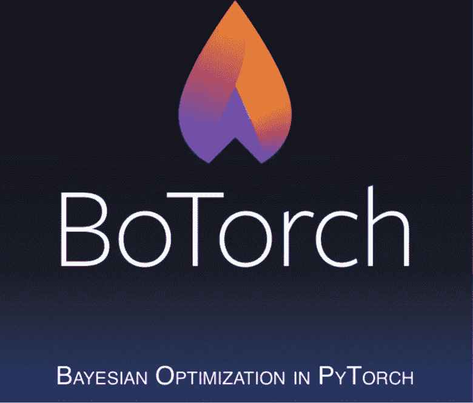

# BoTorch 是 PyTorch 中的贝叶斯优化框架

> 原文：<https://pub.towardsai.net/botorch-is-a-framework-for-bayesian-optimization-in-pytorch-7d0f90c69064?source=collection_archive---------0----------------------->

## [深度学习](https://towardsai.net/p/category/machine-learning/deep-learning)

## 开源框架支持底层贝叶斯优化算法的实现。

图片来源:BoTorch

> 我最近创办了一份专注于人工智能的教育时事通讯，已经有超过 10 万名订户。《序列》是一份无废话(意思是没有炒作，没有新闻等)的 ML 导向时事通讯，需要 5 分钟阅读。目标是让你与机器学习项目、研究论文和概念保持同步。请通过订阅以下内容来尝试一下:

 [## 序列

### 订阅人工智能世界中最相关的项目和研究论文。受到 120，000+的信任…

thesequence.substack.com](https://thesequence.substack.com/?r=2g8vk) 

贝叶斯优化是一种流行的技术，专注于在有限的资源内找到问题的最优解。通常，贝叶斯优化应用于黑盒优化问题，如机器学习算法的超参数优化、A/B 测试以及许多科学和工程问题。几个月前，Meta(脸书)开源的 BoTorch 是一个建立在 PyTorch 之上的[贝叶斯优化](https://en.wikipedia.org/wiki/Bayesian_optimization)库。

一个贝叶斯优化问题试图最大化一些评估昂贵的黑盒函数 ***f*** 而不访问关闭的函数形式。在这种情况下，优化技术在一系列测试点评估 ***f*** ，希望在少量评估后确定接近最优的值。为了优化 ***f*** 实现这一点，贝叶斯优化方法需要一种方式来推断 ***f*** 在我们尚未评估的点上看起来像什么。在贝叶斯优化中，这被称为代理模型。重要的是，代理模型应该能够以点***×点*** 处函数值***【f(x)】***的后验分布的形式量化其预测的不确定性。

图片来源:BoTorch

BoTorch 是脸书反复研究贝叶斯优化并将这些技术整合到 PyTorch 编程模型中的结果。从概念上讲，与其他优化方法相比，BoTorch 带来了一系列独特的优势。

**PyTorch 功能:** BoTorch 构建在 PyTorch 框架之上，利用了自动微分、使用设备无关代码支持高度并行化的现代硬件(如 GPU)以及有助于交互式开发的动态计算图等原生功能。

**最先进的建模:** BoTorch 在 [GPyTorch](https://l.facebook.com/l.php?u=http%3A%2F%2Fwww.gpytorch.ai%2F%3Ffbclid%3DIwAR3GkYzD8HCQBzQeSZhwiSpV0w8HZJJEcuUjx5G6LdqQDcZqfA3EW9-TMxw&h=AT30lP4v6QrwQGldJQJ9v4AXqG47Rk6mEoNa8m0SapnbEgO6NaD532lHVg_OIQeWU_26YLIdR1UTzzLykUUVRgjrVnESodruQPD0j3S9xIdxV9-9x6lNsg0wcvejy7Xl6lM) 中支持前沿的概率建模，包括支持多任务高斯过程(GPs)、可扩展 GPs、深度内核学习、深度 GPs 和近似推理。

**提高开发者效率:** BoTorch 提供了一个简单的编程模型，用于组合贝叶斯优化原语。具体来说，BoTorch 依赖于基于蒙特卡罗的获取函数，这使得实现新想法变得简单，而不必对底层模型施加限制性假设。

**并行性:** BoTorch 编程模型通过批量计算针对并发性和并行性进行了优化，提高了其在大型基础设施中的可扩展性。

BoTorch design 允许 PyTorch 开发人员更改、交换或重新排列深度神经网络架构的不同组件，而不必重建整个图形来重新训练整个模型。显然，构建低级贝叶斯优化原语是一项需要深厚专业知识的任务。为了应对这一挑战，脸书决定将 BoTorch 与另一个为深度学习实验提供简单编程模型的项目相集成:Ax。