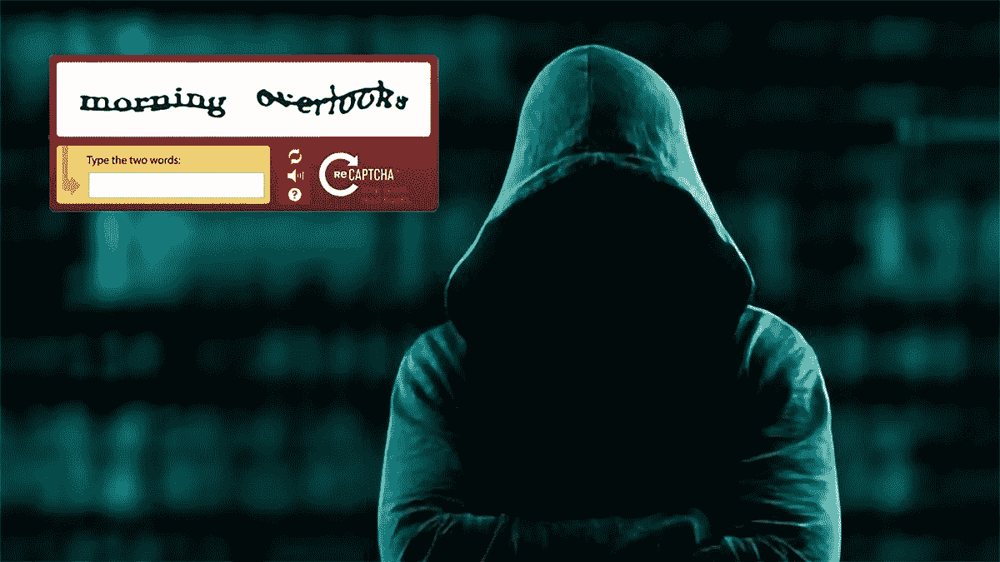
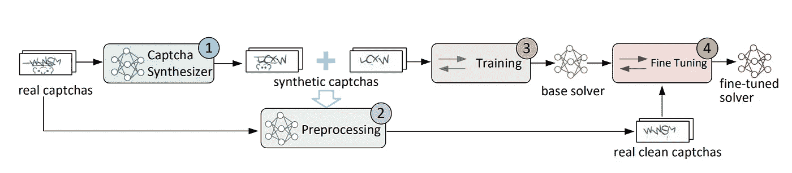
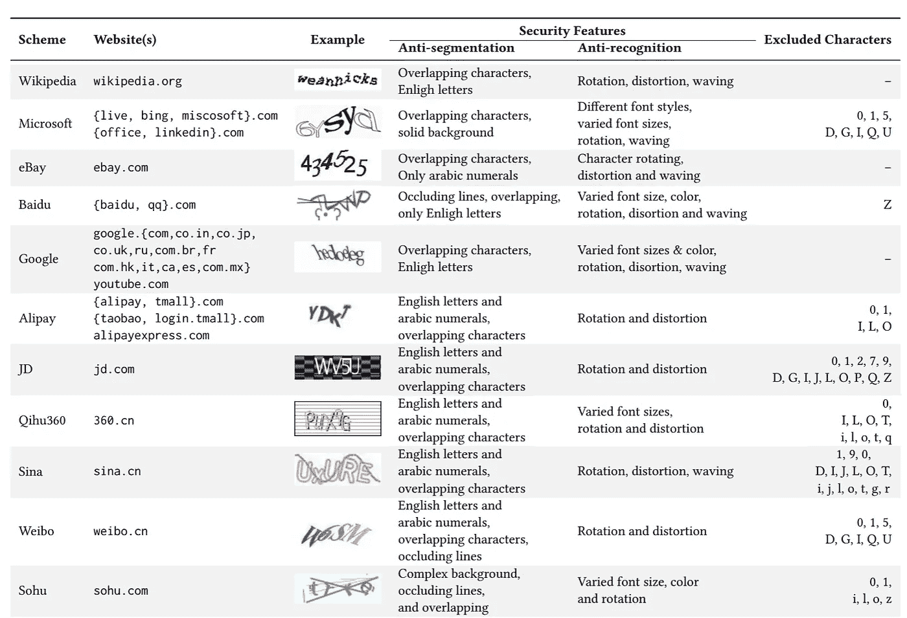
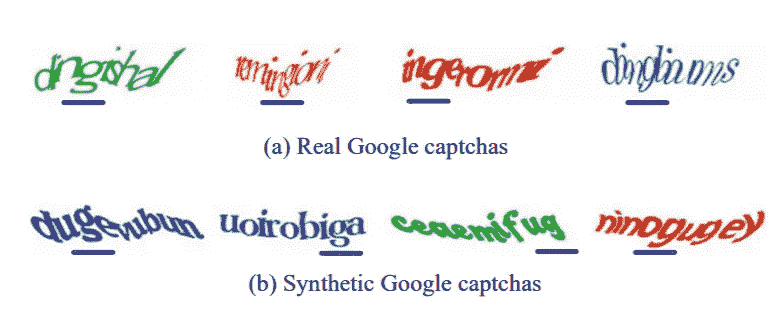

# 使用机器学习在 0.05 秒内破解验证码

> 原文：<https://pub.towardsai.net/breaking-captcha-using-machine-learning-in-0-05-seconds-9feefb997694?source=collection_archive---------0----------------------->

## 网络安全，[机器学习](https://towardsai.net/p/category/machine-learning)，[技术](https://towardsai.net/p/category/technology)

## [机器学习](https://mld.ai/mldcmu)模型破解了 33 个高访问量网站的验证码系统。该概念基于 GANs

2018 年 12 月 19 日，作者[罗伯托·伊里翁多](https://www.robertoiriondo.com)—2020 年 5 月 5 日更新

每个人都鄙视验证码(人类，因为机器人没有情感)——那些烦人的图像包含难以阅读的文本，在你可以访问或在线做“一些事情”之前，你必须输入这些文本。

验证码( **C** 完全 **A** 自动**P**public**T**在测试期间告诉**C**C 计算机和 **H** 人类 **A** 部分)被开发来防止自动化程序在万维网上进行恶作剧(填写在线表格、访问受限文件、访问网站不可思议的次数，等等)

尽管如此，过去已经提出过几次对验证码的攻击，但没有一次像下面显示的由兰卡斯特大学、西北大学和北京大学的一组研究人员提出的[机器学习](https://mldcmu.ai)算法那样准确和快速。

**图 1** :方法概述。研究人员首先使用一小组非合成的验证码来训练验证码合成器。(1)验证码合成器随后用于生成合成验证码，同时(2)合成验证码用于训练机器学习基础求解器，(3)对其进行提炼以构建非合成验证码的微调求解器。|[【1】](https://www.lancaster.ac.uk/staff/wangz3/publications/ccs18.pdf)

已知的第一个破解验证码的人是 [Adrian Rosebrock](https://twitter.com/PyImageSearch) ，他在他的书“用 Python 进行计算机视觉的深度学习”[4]中讲述了他如何使用机器学习绕过 E-ZPass 纽约网站上的验证码系统，在那里他使用深度学习来训练他的模型，通过下载大量验证码示例的图像数据集来破解验证码系统。

Adrian 的解决方案与来自 Lancaster、northwestern 和 Peking 的研究科学家的解决方案之间的主要区别在于，研究人员不需要下载大型图像数据集来破解 CAPTCHA 系统，相反，他们使用生成式对抗网络(GAN)的概念来创建合成的 CAPTCHA，以及小型真实 CAPTCHA 数据集来创建极其快速和准确的 CAPTCHA 求解器。

由 Ian Goodfellow 和其他研究人员[2]介绍的生成式对抗性网络是由两个神经网络组成的深度神经网络架构，这两个神经网络在零和游戏中相互竞争[3]以合成表面真实的样本。这在模型无法访问大型数据集的情况下尤其有用。

**图 2:** 有针对性的验证码安全特征。样本收集自百度、新浪、微软和京东验证码方案。| [1]

研究人员通过应用 33 种基于文本的验证码方案来评估他们的方法，11 种方案目前正在被全球 32 个最受欢迎的网站使用，这些网站由 [Alexa](https://alexa.com/) 排名。包括谷歌、微软、易贝、维基百科、百度和许多其他公司正在使用的验证码方案。用于攻击这些验证码系统的机器学习模型只需要 500 个非合成的验证码，而不是在此之前的其他攻击(如 Adrian 的攻击)所提出的数百万个示例。

**图 3:** 用作训练数据的基于文本的验证码方案列表，以及机器学习验证码求解器的测试。| [1]

一旦用图 2 所示的**中的验证码安全参数对模型进行了初始化，它就被用来生成一批合成验证码，以便用从图 3**所示的各种验证码方案中获得的 500 个真实验证码来训练合成器。研究人员使用 20，000 个验证码来训练预处理模型，以及 200，000 个合成验证码来训练基础求解器。****

机器学习原型是用 Python 实现的。预处理模型使用 Pix2Pix 框架构建，该框架使用 Tensorflow 实现。微调求解器使用 Keras 编码。[1]

**图 4:** 真实的谷歌验证码和研究人员的验证码合成器生成的合成版本| [1]

在通过使用合成的和真实的验证码样本来训练生成式对抗网络之后，然后使用验证码求解器来求解来自诸如 Megaupload、Blizzard、Authorize、Captcha.net、百度、QQ、reCaptcha、Wikipedia 等频繁访问的网站的验证码。这种方法的独特之处在于，大多数网站的验证码解决成功率超过 80%，在暴雪、Megaupload 和 Authorize.net 等网站上超过 95%，这种攻击方法已被证明比所有其他使用大量非合成训练数据集解决验证码的现有方法具有更好的准确性。

**图 5:** 比较了研究人员的验证码求解器与之前求解验证码的四种攻击方法。| [1]

除了提高准确性，研究人员在他们的论文中提到，他们的方法不仅更准确，而且更有效，实施其他方法的成本更低[1]。除了作为第一个基于文本的验证码的 GAN 解决方案，它还为攻击者打开了一扇大门，因此他们的效率和实施成本都很低。

然而，这种方法有一些限制，例如使用字符数可变的验证码。当前的方法使用固定数量的字符——如果它被扩展，原型就会被破坏。另一个是在验证码上使用可变字符。虽然原型可以被训练来支持这种变化，但它目前并不支持这种变化。

对于频繁访问的网站来说，使用更强大的方法来保护其系统至关重要，如僵尸检测措施、网络安全诊断和分析，以及多层安全措施，如设备位置、类型、浏览器等。—因为他们现在甚至更容易成为攻击目标。

**免责声明:**本文中表达的观点仅代表作者个人，不代表卡耐基梅隆大学或其他(直接或间接)与作者相关的公司的观点。这些文章并不是最终产品，而是当前思想的反映，同时也是讨论和改进的催化剂。

你可以在[我的网站](https://www.robertoiriondo.com)、[中](https://medium.com/@robiriondo)、 [Instagram](https://www.instagram.com/robiriondo) 、 [Twitter](https://twitter.com/robiriondo) 、[脸书](https://www.facebook.com/robiriondo)、 [LinkedIn](https://www.linkedin.com/in/robiriondo) ，或者通过我的 [SEO 公司](https://www.daibuilds.com/seo-services/)找到我。

# 推荐文章

一、[机器学习和数据科学最佳数据集](https://towardsai.net/p/machine-learning/best-datasets-for-machine-learning-and-data-science-d80e9f030279)
二。[艾薪资冲天](http://towardsai.net/ai-salaries)三世
。[什么是机器学习？](https://towardsai.net/p/machine-learning/what-is-machine-learning-ml-b58162f97ec7)
四世。[2020 年最佳机器学习硕士项目](https://towardsai.net/ml-masters)
五、[2020 年最佳机器学习博士项目](https://towardsai.net/ml-phd)
六、[最佳机器学习博客](https://towardsai.net/p/machine-learning/best-machine-learning-blogs-6730ea2df3bd)
七。[关键机器学习定义](https://towardsai.net/p/machine-learning/key-machine-learning-ml-definitions-43e837ec6add)
八。[用机器学习在 0.05 秒内破解验证码](https://towardsai.net/ml-captcha)
九。[机器学习 vs. AI 及其重要区别](https://towardsai.net/p/machine-learning/machine-learning-vs-ai-important-differences-between-them/robiriondo/3432/)
十.[确保成功开创机器学习事业(ML)](https://towardsai.net/p/machine-learning/moocs-vs-academia-ensuring-success-starting-in-a-machine-learning-ml-career-304b2e42315e)
XI。[机器学习算法初学者](https://towardsai.net/p/machine-learning/machine-learning-algorithms-for-beginners-with-python-code-examples-ml-19c6afd60daa)
十二。[神经网络从零开始详细用 Python 代码和数学](https://towardsai.net/neural-networks-with-python)
XIII。[用 Python 构建神经网络](https://towardsai.net/p/machine-learning/building-neural-networks-with-python-code-and-math-in-detail-ii-bbe8accbf3d1)
XIV。[神经网络的主要类型](https://towardsai.net/p/machine-learning/main-types-of-neural-networks-and-its-applications-tutorial-734480d7ec8e)
十五。[用 Python 编写的蒙特卡洛模拟教程](https://towardsai.net/p/machine-learning/monte-carlo-simulation-an-in-depth-tutorial-with-python-bcf6eb7856c8)
XVI。[Python 自然语言处理教程](https://towardsai.net/p/nlp/natural-language-processing-nlp-with-python-tutorial-for-beginners-1f54e610a1a0)

## 参考资料:

[1]另一种文本验证码求解器:一种基于生成性对抗网络的方法|叶桂新，唐占勇，，方，朱占兴，，冯，，，郑旺|兰卡斯特大学，西北大学，北京大学|[https://www . Lancaster . AC . uk/staff/wang3/publications/CCS 18 . pdf](https://www.lancaster.ac.uk/staff/wangz3/publications/ccs18.pdf)

[2]生成敌对网络|伊恩·j·古德菲勒、让·普盖-阿巴迪、迈赫迪·米尔扎、徐炳、大卫·沃德-法利、谢尔吉尔·奥泽尔、亚伦·库维尔、约舒阿·本吉奥|蒙特娄大学计算机科学与运筹学系|【https://arxiv.org/pdf/1406.2661.pdf】T2

[3]零和游戏|博弈论|斯坦福大学|[https://cs . Stanford . edu/people/eroberts/courses/soco/projects/1998-99/Game-Theory/Zero . html](https://cs.stanford.edu/people/eroberts/courses/soco/projects/1998-99/game-theory/zero.html)

[4]用 Python 进行计算机视觉的深度学习| Adrian rose Brock |[https://www . pyimagesearch . com/Deep-Learning-Computer-Vision-Python-book/](https://www.pyimagesearch.com/deep-learning-computer-vision-python-book/)

[5]高，h，唐，m，刘，y，张，p，刘，x .微软两层验证码的安全性研究.IEEE 信息取证与安全汇刊 12，7 (2017)，1671–1685

[6]高，h，魏，w，王，x，刘，x 和严，j .空心验证码的鲁棒性。在 ACM Sig |[https://www.lancaster.ac.uk/staff/yanj2/ccs13.pdf](https://www.lancaster.ac.uk/staff/yanj2/ccs13.pdf)

[7] Mohamed，m .，Sachdeva，n .，Georgescu，m .，Gao，s .，Saxena，n .，Zhang，c .，Kumaraguru，p .，Oorschot，P. C. V .，和 Chen w . b .对一个游戏的三方调查-captcha:自动攻击、中继攻击和可用性。美国计算机学会信息、计算机和通信安全研讨会(2014 年)，第 195–206 页

[8] Yan，j .和 Ahmad，A. S. E .对微软验证码的低成本攻击。在 ACM 计算机和通信会议上|[http://citeseerx.ist.psu.edu/viewdoc/download?doi = 10 . 1 . 1 . 295 . 9469&rep = re P1&type = pdf](http://citeseerx.ist.psu.edu/viewdoc/download?doi=10.1.1.295.9469&rep=rep1&type=pdf)