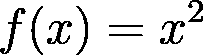
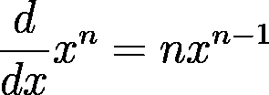
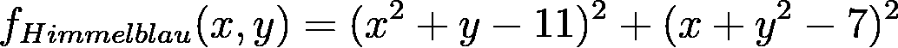

# 分解它:梯度下降

> 原文：<https://pub.towardsai.net/breaking-it-down-gradient-descent-b94c124f1dfd?source=collection_archive---------2----------------------->

## 使用 [Grad-Descent-Visualizer](https://github.com/JacobBumgarner/grad-descent-visualizer) 从头开始探索和可视化梯度下降的数学基础。

```
**Outline**1\. [What is Gradient Descent?](#d9c4)
2\. [Breaking Down Gradient Descent](#e501)
  2.1 [Computing the Gradient](#f7ef)
  2.2 [Descending the Gradient](#eec4)
3\. [Visualizing Multivariate Descents with Grad-Descent-Visualizer](#e4a7)
  3.1 [Descent Montage](#bfec)
4\. [Conclusion: Contextualizing Gradient Descent](#991f) 5\. [Resources](#2918)
```

## 1.什么是梯度下降？

梯度下降是一种优化算法，用于提高深度/机器学习模型的性能。在一系列重复的训练步骤中，梯度下降识别最小化成本函数输出的最佳参数值。

在这篇文章的下两个部分，我们将从这个卫星视图描述中走出来，把梯度下降分解成更容易理解的东西。我们还将使用我的 Python 包 [grad-descent-visualizer](https://github.com/JacobBumgarner/grad-descent-visualizer) 可视化各种测试函数的梯度下降。

## 2.分解梯度下降

要对梯度下降有一个直观的认识，我们先忽略机器学习和深度学习。让我们从一个简单的函数开始:



简单的一元函数

梯度下降的目标是找到函数的*最小值*或该函数的最低可能输出值。这意味着给定我们上面的函数 ***f(x)*** ，梯度下降的目标将是找到导致***【f(x)***的输出接近 ***0*** 的 ***x*** 的值。通过形象化这个函数(下图)，可以很明显的看到 ***x = 0*** 产生 ***f(x)*** 的最小值。

梯度下降的重要部分是:如果我们将 ***x*** 初始化为某个随机数，比如说 ***x = 1.8*** ，是否有办法让*自动*更新 ***x*** 使其最终产生函数的最小输出？事实上，我们可以通过两步过程自动找到这个最小输出:

1.  在我们的输入参数 ***x*** 所在的点找到函数的*斜率*。
2.  更新我们的输入参数 ***x*** ，使其*下降*梯度。

在我们的简单梯度下降算法中，这个两步过程被反复重复，直到我们的函数的输出稳定在最小值，或者达到定义的梯度容差水平。值得注意的是，其他更有效的下降算法采用不同的方法(例如， [RMSProp](https://en.wikipedia.org/wiki/Stochastic_gradient_descent#RMSProp) 、 [AdaGrad](https://en.wikipedia.org/wiki/Stochastic_gradient_descent#AdaGrad) 、 [Adam](https://en.wikipedia.org/wiki/Stochastic_gradient_descent#Adam) )。

## 2.1.计算梯度

为了找到函数***【f(x)***在*任意值处的斜率(或*梯度，*因此梯度下降)，我们可以对函数进行微分。微分简单例子函数简单用幂法则(下图)，为我们提供:***f’(x)= 2x***。*

**

*权力规则*

*利用我们的起点 ***x = 1.8*** ，我们发现我们的起点梯度***x***(***dx***)为 ***dx = 3.6*** 。*

*让我们用 python 写一个简单的函数，自动计算任意输入变量对 ***f(x) = x*** 的导数。*

> **我强烈建议查看 [3Blue1Brown 的视频](https://www.youtube.com/watch?v=9vKqVkMQHKk&list=PLZHQObOWTQDMsr9K-rj53DwVRMYO3t5Yr&index=2&t=2s)，直观地了解差异化。这个样本函数与第一原理的区别可以在[这里](https://socratic.org/questions/how-you-you-find-the-derivative-f-x-x-2-using-first-principles)看到。*

```
*Gradient at x = 1.8: dx = 3.6*
```

## *2.2.下降梯度*

*一旦我们找到了起点的梯度，我们想要更新我们的输入参数，这样它就使*下降*这个梯度。这样做将最小化函数的输出。*

*要向下移动变量的梯度，我们可以简单地从输入参数中减去梯度。然而，如果你仔细观察，你可能会注意到从输入参数 ***x=1.8*** 中减去整个渐变会导致它在 ***1.8*** 和 ***-1.8*** 之间无限地来回跳动，阻止它接近 ***0*** 。*

*相反，我们可以定义一个 ***学习率= 0.1 个*** 。在从 ***x*** 中减去之前，我们将用这个学习率来缩放 ***dx*** 。通过调整学习率，我们可以创造“更平滑”的下降。大的学习率沿着函数产生大的跳跃，小的学习率沿着函数产生小的步长。*

*最后，我们最终将不得不停止梯度下降。否则，当梯度接近 0 时，算法将无休止地继续。对于这个例子，一旦 ***dx*** 小于 ***0.01*** ，我们就简单地停止下降。在您自己的 IDE 中，您可以更改`learning_rate`和`tolerance`参数，以查看迭代和 ***x*** 的输出如何变化。*

```
*Function minimum found in 27 iterations. X = 0.00*
```

*从上面的视频中可以看出，我们的起始值 ***x = 1.8*** 能够通过梯度下降的迭代过程自动更新为 ***x = 0.0*** 。*

# *3.使用 Grad-Descent-Visualizer 可视化多元下降*

*希望这个单变量的例子为梯度下降实际上做什么提供了一些基础的见解。现在让我们扩展到多元函数的上下文。*

*我们将首先想象 Himmelblau 函数的梯度下降。*

**

*希梅尔布劳函数*

*多元函数的下降有几个关键的区别。*

*首先，我们需要计算*偏导数*来更新每个参数。在 Himmelblau 的函数中， ***x*** 的梯度依赖于 ***y*** (它们的和是平方的，需要[链式法则](https://g.co/kgs/8bwVeF))。这意味着用于区分 ***x*** 的公式将包含 ***y*** ，反之亦然。*

*第二，你可能已经注意到在第二节的简单函数中只有一个最小值。在现实中，在我们的成本函数中可能有许多未知的局部极小值。这意味着我们的参数找到的局部最小值将取决于它们的起始位置和梯度下降算法的行为。*

*为了可视化这种景观的下降，我们将初始化我们的起始参数为 ***x = -0.4*** 和 ***y = -0.65*** 。然后，我们可以观察每个参数在其自身维度上的下降，以及被相反参数的位置分割的 2D 下降。*

*对于更大的背景，让我们使用我的 [grad-descent-visualizer](https://github.com/JacobBumgarner/grad-descent-visualizer) 包在 [PyVista](https://github.com/pyvista/pyvista) 的帮助下创建的 3D 可视化同一点的下降。*

## *3.1 下降蒙太奇*

*现在让我们想象更多的[测试函数](https://www.sfu.ca/~ssurjano/optimization.html)的下降！我们将在每个函数上放置一个网格点，观察这些点在下降时是如何移动的。*

*[球体功能](https://www.sfu.ca/~ssurjano/spheref.html)。*

*[格里万克函数](https://www.sfu.ca/~ssurjano/griewank.html)。*

*[六峰骆驼功能](https://www.sfu.ca/~ssurjano/camel6.html)。注意函数的许多局部极小值。*

*让我们重新想象一下 [Himmelblau 函数](https://en.wikipedia.org/wiki/Himmelblau%27s_function)的网格下降。注意不同的参数初始化如何导致不同的最小值。*

*最后是 [Easom 功能](https://www.sfu.ca/~ssurjano/easom.html)。注意有多少点是静止的，因为它们是在平坦的梯度上初始化的。*

## *4.结论:语境化梯度下降*

*到目前为止，我们已经完成了一元函数的梯度下降，并可视化了几个多元函数的下降。事实上，现代深度学习模型的参数比我们研究的函数多得多。*

*比如拥抱脸最新的自然语言处理模型 Bloom，拥有*1750 亿*个参数。这个模型中使用的链式函数也比我们的测试函数更复杂。*

*然而，重要的是要认识到我们所学的梯度下降的基础仍然适用。在任何深度学习模型的训练的每次迭代期间，计算每个参数的梯度。然后，该梯度将在训练示例中进行平均，然后从参数中减去，以便它们“逐步降低”其梯度，推动它们从模型的成本函数中产生最小输出。*

*感谢阅读！*

## *5.资源*

```
*- [Grad-Descent-Visualizer](https://github.com/JacobBumgarner/grad-descent-visualizer)
- [3Blue1Brown](https://www.youtube.com/c/3blue1brown)
  - [Gradient Descent](https://www.youtube.com/watch?v=IHZwWFHWa-w)
  - [Derivatives](https://www.youtube.com/watch?v=9vKqVkMQHKk&t=10s)
- [Simon Fraser University: Test Functions for Optimization](https://www.sfu.ca/~ssurjano/optimization.html)
- [PyVista](https://docs.pyvista.org)
- [Michael Nielsen's Neural Networks and Deep Learning](http://neuralnetworksanddeeplearning.com/chap1.html)*
```