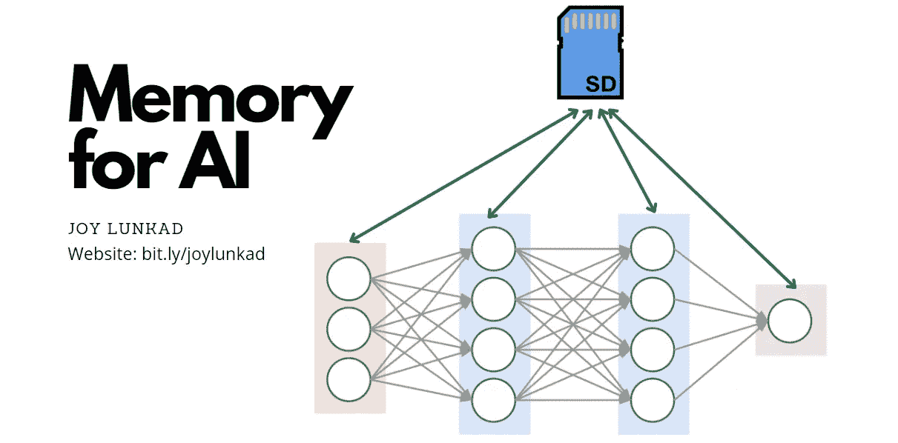
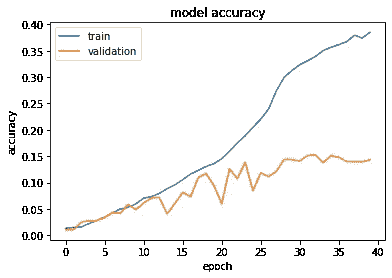
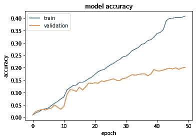

# 突破:给整个神经网络赋予记忆会是革命性的吗？

> 原文：<https://pub.towardsai.net/breakthrough-can-giving-memory-to-entire-neural-nets-be-revolutionary-8e98e119b13a?source=collection_archive---------5----------------------->

## [人工智能](https://towardsai.net/p/category/artificial-intelligence)，[深度学习](https://towardsai.net/p/category/machine-learning/deep-learning)

# 这是什么？

这可以用一个非常简单明了的例子来解释。

想象一下，如果人工智能是一个学生在翻阅一本书(数据集)并准备考试。我在这里所做的是，我试着给它一个笔记本，记下它认为重要的东西。

在学习 AI 时困扰我的一个问题是，如果有人给整个神经网络赋予记忆，会发生什么？听起来这很明显是可行的，对吗？我就是这样做的，我将与你分享，详细地，我是如何做到的，它是如何工作的，以及最重要的问题，**它工作吗**？

# 有用吗？

简短的回答:**是的**

我决定在斯坦福狗数据集上训练一个标准的 ResNet50 作为我的基础，然后给完全相同的架构添加一些内存，并以与 ResNet50 完全相同的方式训练它。

这就是**标准 ResNet50** 的表现，该模型在测试数据上达到的最高精度为 **15.14%** 。训练在第 40 个时期停止，因为验证准确性在 7 个时期中没有增加。

而同样的**AiM**resnet 50 就是这样执行的(AiM 来自于人工智能的记忆)。我只让它运行到第 50 纪元。在它的第五十个纪元，它在测试数据上获得了 20.06%的准确度，它仍然有潜力继续前进。

这只是一个猜测，但看看 AiM ResNet50 的验证精度如何波动不大，只是稳步上升，看起来它不仅可以学习更多，而且在从数据集学习东西时不会犯太多错误。

一个 ResNet50 大约有**2380 万个参数**。

一个内存大小约为 50000 个浮点的 aim-ResNet50(上面实验中使用的)，大约有**2410 万个参数**。

# 它是如何工作的？

我瞄准时的目标是-

*   每一层/神经元/单元都应该有访问存储器的方法。
*   神经网络应该有办法更新记忆。
*   新更新的内存应传递给下一批。

我实现它的方法是，我决定有一个“记忆”层，并将该层与前一层的输出一起传递到下一层，用于模型中的每一层。我还为“内存层”制作了更新块，以便满足第二个条件。这层的重量和偏见给了我一个传递它的方法。

# 我是怎么做到的？

对于 CNN，我使用 conv2D 层作为我的内存。通过线性激活将 1 的数组作为输入传递给该层，向前传递的值将只是权重和偏差。因此，它可以作为存储层。

如果该存储层与架构中最小的卷积层具有相同的行数和列数，则它可以被重新整形并连接到输入层，并且还可以从其他层输出，而没有问题。

当其他卷积层的 n_rows * n_columns 超过存储器层的总存储器(n_rows * n_columns *信道数)时，存储器可以被整形并用零填充到一个信道中，然后，它可以被连接到该层已经在接收的输入。

就像通过整形和填充一样，这个记忆层可以连接到几乎所有的输入。

将该存储层与一些其他数据/特征一起通过卷积块可以更新该存储层。

对于完全连接的神经网络，这甚至更容易做到，因为我们只是使用密集层作为记忆层。同样，通过传递它，一个 1 的数组作为输入并使用线性激活，我们可以使用 weight + bias 作为一个内存单元。然后，可以将该记忆层与每一层的输入连接起来，以获得具有记忆的神经网络。

# 有多百搭？

只要看一下实现它的方法，就很容易得出结论，存储器可以添加到大多数 CNN 和完全连接的神经网络架构中，只需很少的改变。我已经测试了向 ResNet50 和 VGG16 添加内存，如果这提高了它们的性能，**这很有可能实际上改善几乎所有深度神经网络架构**。

# 结论

我对这个看似简单却有效的想法寄予厚望。虽然这个实验很粗糙，有很多改进的空间，但我想通过这篇文章，让你注意到这个概念的证明。

我喜欢深度学习社区如此支持和帮助。如此多的论文、代码、有帮助的博客文章和笔记本都是免费的，我认为最好的回报方式是将其公之于众。

我很乐意听到你对我的工作的意见，我迫不及待地想看看深度学习社区如何进一步发展这个想法。

[了解我并联系我](https://www.notion.so/Contact-Me-8e6512526e8b4d4fa29e8b573992c370)