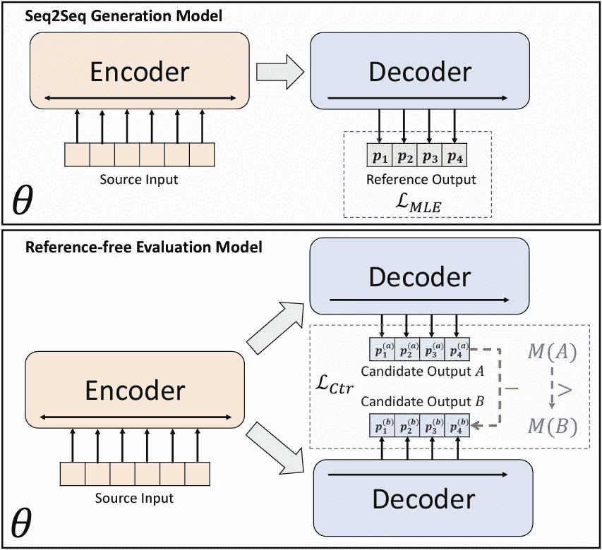
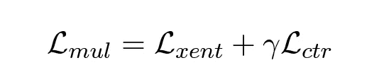
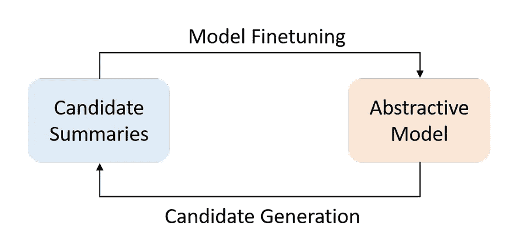
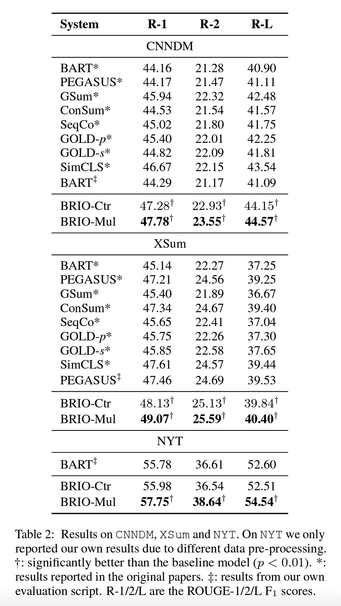

# BRIO:给抽象概括带来秩序

> 原文：<https://pub.towardsai.net/brio-bringing-order-to-abstractive-summarization-paper-review-described-62690ff4aa9d?source=collection_archive---------2----------------------->

*CNN/DM 和 XSum 数据集上的文本摘要任务的最新成果。它使用对比学习对候选人进行排名。*

图一。显示了 seq2seq 架构中使用的传统 MLE 损耗与无基准电压源对比损耗之间的差异。(图片来自[1])

在我写了关于 [SimCLS](https://medium.com/towards-artificial-intelligence/simcls-a-simple-framework-for-contrastive-learning-of-abstractive-summarization-review-explained-87f9d394c620) [2】(之前的 SOTA)的论文后不久，一个关于抽象文本摘要任务的最新(SOTA)结果发表了。有趣的是，他们在提到的论文的基础上加入了对比学习范式。(这并不奇怪，因为他们有相同的作者)该实验为 CNN/DM 数据集**两次**创造了新的 SOTA 胭脂评分。一次是通过引入具有 47.78 R1 分数的“BRIO-Mul”网络，并进一步将其在“BRIO-Loop”模型中的性能提高到 48.01。让我们看看他们的方法是什么…

# 本文想解决什么问题？

我们通常使用最大似然估计(MLE)损失来训练 [seq2seq](/a-full-introduction-on-text-summarization-using-deep-learning-with-sample-code-ft-huggingface-d21e0336f50c) 模型。本文认为，我们正在使用损失函数，对于一个实际上可能有多个正确输出(非确定性)的任务，该函数会将零分配给一个“正确”输出(单点/确定性)。在训练和推理过程之间也存在差异，其中模型是基于其自身在生成期间的先前预测步骤而不是目标概要来调节的。当模型在推理过程中开始偏离目标(变得更加混乱)时，就会造成困难。(称为“曝光偏差”)

# 贡献

他们提出了纳入评估指标的想法(例如，ROUGE、BERTScore 等)，以便模型可以学习如何对摘要进行排序。这是通过使用不同的波束搜索并为每篇文章生成多个候选项(本文中为 16 个)来实现的。设计了一个两级流水线，使用预先训练的网络(BART)生成候选，并从中选择最佳的一个。

**对比损失** (ctr)负责指导模型学习它应该如何对给定文章的多个候选项进行排序。它将在微调过程中用于改善**序列级协调**。讨论了仅基于对比损失的微调模型不能用于生成摘要。因此，上述损失的加权值与**交叉熵** (xnet)损失相加，以保证**令牌级预测精度**。(图 2)它被称为多任务微调损失(mul ),这导致了被描述为“双重角色”模型的 *BRIO-Mul* 。这是一个既能**生成**摘要又能**评估**所生成候选的质量的单一模型，这对于上述两阶段流水线是必要的。

图二。多任务微调损失目标。(图片来自[1])

变量 gamma (γ)控制对比损失对最终损失的贡献。使用不同伽马值(0、0.1、1、2 等)的研究。)表明，数字越大，收敛越快。此外，100 是报告的最佳 gamma 值，导致最高的胭脂分数。

图 3。BRIO 环路微调方案。(图片来自[1])

如前所述，本研究在生成阶段使用 BART 预训练模型。然而，使用 BRIO-Mul 模型是合乎逻辑的，因为它已经超越了 BART 的性能。(如图 3 所示)该循环可以进一步提高 ROUGE 分数。

# 结果

BRIO 方法为三个抽象概括数据集设置了新的 SOTA 结果:CNN/DailyMail、XSum 和 NYT。(参见图 4)这表明该方法对于具有长摘要和短摘要的数据集都能很好地执行。同样值得注意的是，BRIO-Loop 模型只在 CNN/DM 上进行了测试，并将 R-1 评分提高到了 48.01。

图 4。BRIO-Mul 与之前的 SOTA 车型的 ROUGE 评分比较。(图片来自[1])

我们来谈谈论文中的两个观察结果。*1)*BRIO[1]和 SimCLR [2](之前的 SOTA)模型之间的主要区别是使用单一模型进行生成和评分，最大化 BRIO 中的参数共享，而后者使用 RoBERTa 作为评估模型。XSum 基准使用 PEGASUS 作为基础模型(而不是 BART)，这表明该方法可以独立于模型的选择而使用。

# 分析

作者们做了大量的工作来分析和支持他们的观点。有深入的调查，以获得更多的了解引进的模式。我在下面的段落中[简要地]提到了其中的一些。

*   **增加波束宽度**:k 值越高，提出的模型性能越好。(特别是 k=100)与使用 k=4 产生最佳输出的原始 BART 不同。
*   **少量微调**:在 CNN/DM 数据集上仅用 100 个(随机选择的)样本，BRIO-少数就能胜过 BART，在 XSum 上用 1000 个样本，胜过 PEGASUS。
*   **新颖的 n-grams** :与 BART 相比，BRIO 在摘要中生成更多新颖的 n-grams

文中还有更多像**令牌级校准**、**异度训练**、**过滤推理噪声**的分析，我就不一一赘述了，但强烈推荐大家阅读。

# 最后的话，

作者能够用写得很好的分析部分和论文来支持他们的主张。我希望我们能看到更多像这样容易理解和遵循的论文。他们还在 [GitHub](https://github.com/yixinL7/BRIO) 上发布了代码，帮助我了解了一些方面。总的来说，这是一个伟大的阅读。

> 我每周给 NLP 的书呆子发一份时事通讯。如果您想了解自然语言处理的最新发展，可以考虑订阅。
> [阅读更多，订阅](https://nlpiation.github.io/) —加入酷孩子俱乐部，立即报名！

## 参考

[1]刘，杨，刘，p .拉杰夫，d .，&纽比格，G. (2022)。BRIO:给抽象概括带来秩序。 *arXiv 预印本 arXiv:2203.16804* 。
【2】刘，杨，&刘，P. (2021)。Simcls:抽象概括对比学习的简单框架。arXiv 预印本 arXiv:2106.01890。