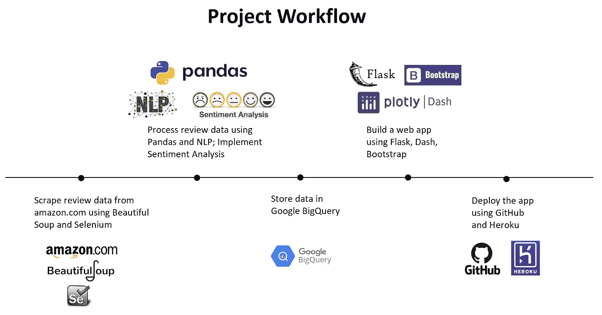
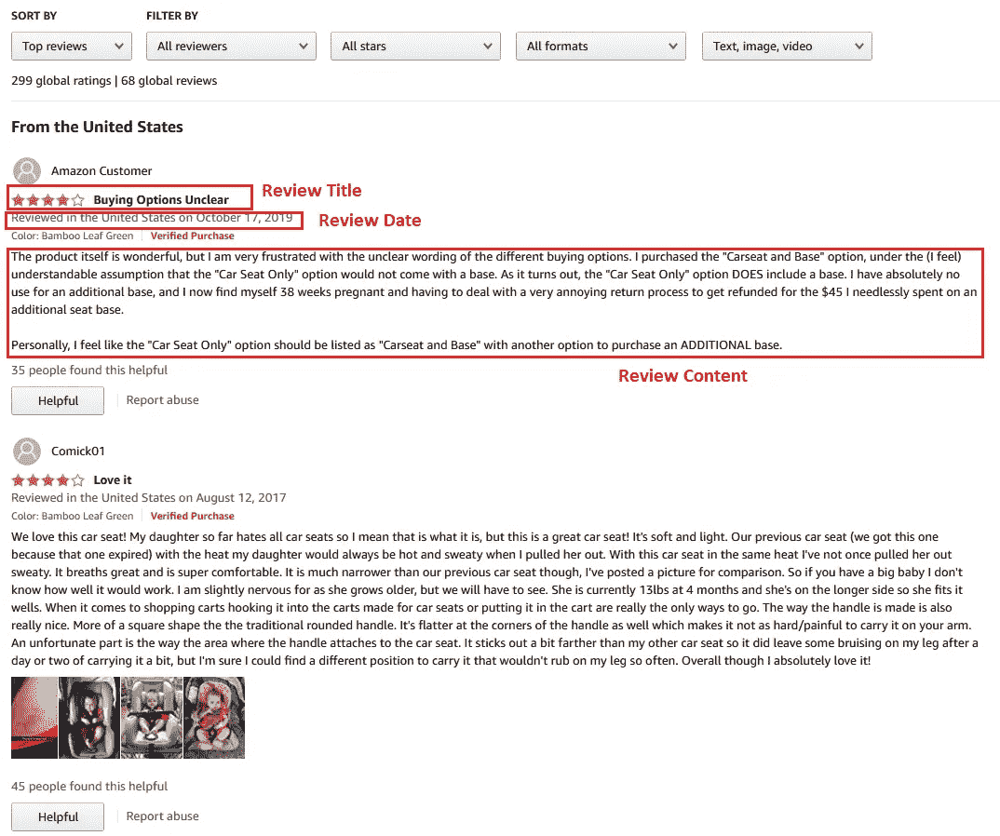
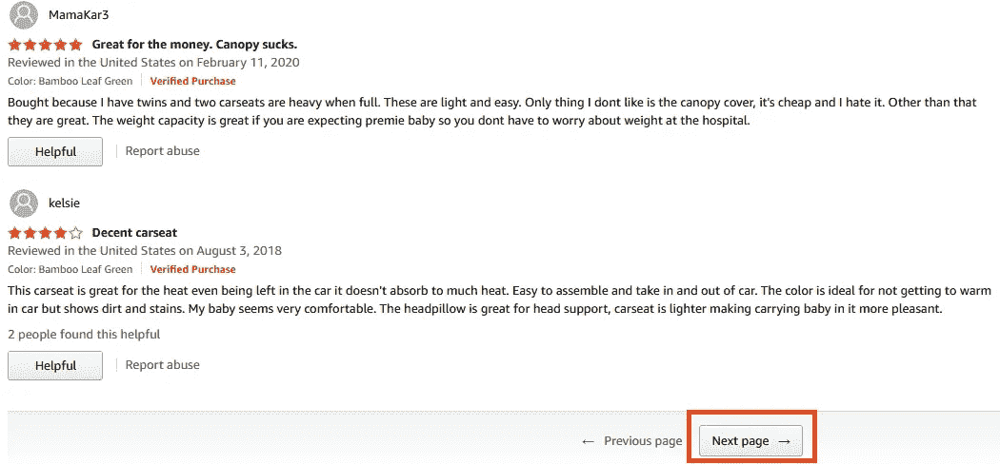
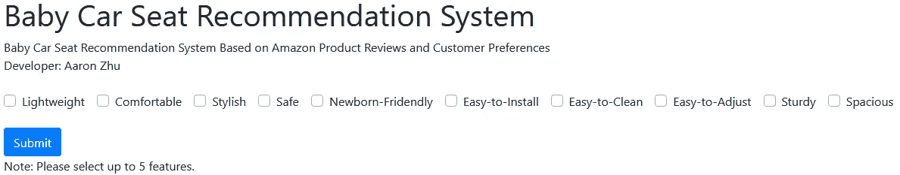
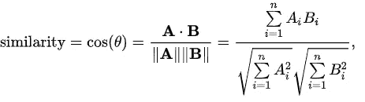
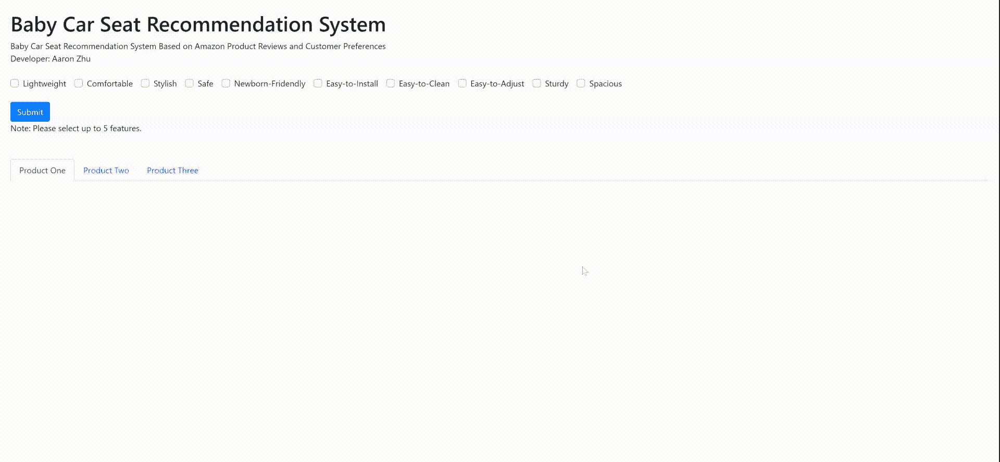

# 使用机器学习，用更少的时间在线找到想要的产品

> 原文：<https://pub.towardsai.net/build-a-recommendation-system-using-amazon-review-data-11db1b2f912f?source=collection_archive---------2----------------------->

## 利用自然语言处理和情感分析构建推荐系统


莎伦·麦卡琴在 [Unsplash](https://unsplash.com?utm_source=medium&utm_medium=referral) 上的照片

查看 [**Web App**](https://baby-car-seat-recommendation.herokuapp.com/) 和我的 [**GitHub**](https://github.com/aaronzhuclover/CarSeat_Recommendation) 上的代码，如果有任何问题，请随时告诉我！

# 项目背景

当你在网上购物时，你有和我一样的经历吗？您在电子商务网站上搜索产品名称。数百种产品可能会出现。你按照评级或价格对产品进行分类，逐一浏览这些相似的产品，浏览其他客户的评论，并试图找到其他客户是否对你感兴趣的产品功能给出过评论。**这一过程非常耗时，很快就会让人不知所措。似乎网上购物并没有让我们的生活变得更容易。**

作为一个像大多数人一样的普通购物者，我想创建一个应用程序，以便在从电子商务网站的众多产品中选择时快速找到所需的产品。

推荐系统是应对这一挑战的良好开端。但是在为电子商务网站开发推荐系统时，开发人员可能会面临一些问题。

*   **协同过滤**方法中的冷启动问题，因为缺少购物者的历史销售数据
*   在研究产品的相关特性时，**基于内容的过滤**方法中的长期学习疗法

在这个项目中，我想以不同的方式创建一个推荐系统。它将顾客的产品评论作为输入，这些评论现在在许多电子商务网站上都可以找到，比如 Amazon.com，并对顾客想要的特征进行**情感分析**。

这种方法不同于我们在电子商务网站上发现的平均客户评级，因为这种方法是基于功能级别的评级。所有顾客在搜索产品时需要做的就是提供他们感兴趣的产品特性。然后，推荐系统会根据其他客户的评论自动返回具有最高特征评级的产品。这种方法与普通购物者手动操作非常相似，只是这个推荐系统可以在一秒钟内返回您想要的产品。



(作者创作)

# 用硒和美汤获取亚马逊评论数据

在从任何网站抓取数据之前，您需要了解并遵守网站的使用条款。您收集的数据不应受版权保护或包含敏感的消费者信息。你应该保持适度的数据提取率，这样抓取操作就不会给网站带来负担。此外，请记住，刮出的数据不能用于商业用途。

刮亚马逊产品评论直截了当用硒和美汤。

Selenium 是一个以编程方式控制浏览器交互的框架，比如点击、表单提交和鼠标移动。此外，selenium 使处理网页变得更加容易，网页中的内容由 JavaScript 生成。

**BeautifulSoup** 是一个 Python 库，用于解析 HTML、XML 和其他标记语言。它创建了一个解析树，可以用来从 HTML 中提取数据。如果网页显示与您的项目相关的数据，但不提供下载数据的直接方式。BeautifulSoup 可以帮助你解析网页中的特定内容，移除 HTML 标记并抓取信息。



Amazon.com

以亚马逊网页为例，在给定的评论页面中，我们可以使用 BeautifulSoup 中的“find”功能，利用 HTML 标签元素提取数据(如评论标题、评论日期、评论内容等)。

```
# rating 
rating = i.find('i', {'data-hook': 'review-star-rating'}).get_text()
# title
title = i.find('a', {'data-hook': 'review-title'}).get_text()
# date 
r_date = i.find('span', {'data-hook': 'review-date'}).get_text()
# review
review = i.find('span', {'data-hook': 'review-body'}).get_text()
```



Amazon.com

我们可以在一个网页中导航，并使用 Selenium 函数“find_element_by_xpath”和“click”转到其他网页。

```
driver.find_element_by_xpath('//a[[@data](http://twitter.com/data)-hook="see-all-reviews-link-foot"]').click()
WebDriverWait(driver, 5).until(EC.element_to_be_clickable((By.XPATH, "//*[contains(text(), 'Next page')]"))).click()
```

# 使用 NLP 预处理审阅数据

从 Amazon.com 收集了评论数据后，我们需要通过分词、删除停用词、词干、将数字转换为文本和删除标点符号来预处理文本数据。Python 库，“ [**NLTK**](https://www.nltk.org/) ”为**文本预处理**任务提供了很多功能。

# 通过 TF-IDF 和余弦相似度过滤相关评论

在应用程序中，我创建了几个对产品很重要的预定义功能。当父母购买婴儿推车座椅时，他们会寻找一些关键的特征，如轻便、舒适、安全、易于安装、易于清洁、适合新生儿等。



(作者创作)

并非所有的评论都会提到这些产品特性。有些评论与我们感兴趣的功能无关。为了过滤与预定义特征相关的评论，我使用了一些技术，比如 **TF-IDF** 和**余弦相似度**来计算相关分数。

**TF-IDF** 代表“词频—逆文档频率”。将文本数据以数值的形式矢量化，使计算机能够理解文本，是一种流行的方法。与 **Bag-Words** 不同，它只是创建包含文档中单词出现次数的向量，TF-IDF 根据单词在文档中出现的次数成比例地增加单词的权重，但根据包含该单词的文档数量来抵消权重。例如，在每个文档中常见但不提供相关信息的单词(例如，这个、什么、如何和如果)将排名较低。

# **计算余弦相似度**

将评论数据转换成数值后，我可以使用以下数学公式计算每个产品评论和预定义产品特征之间的相似性得分。余弦相似性得分的范围从 0 到 1。余弦值为 0 意味着两个向量彼此成 90 度，这意味着这两个向量彼此不相关。余弦值越接近 1，产品评论与预定义的特征越相关。



我使用余弦相似度的阈值(0.1)来过滤与预定义特征相关的评论。这减少了审查数据，我们将实施情绪分析从 100K 到 10K，使运行时间大大减少。

# 通过情感分析获得特征评级

尽管产品评论的总体情绪得分是有用的，但我进一步计算了产品特定功能的情绪得分。

例如，在跟踪客户评论时，如果客户对汽车座椅是否易于安装和调整感兴趣。**以下评论中的“简单”一词将抓住“安装”和“调整”的情感，这是本推荐系统的精髓**。

```
**Review 1**: Easy to ***install,*** easy to ***adjust*** incline, 4 year old- almost 5, is comfortable.
**Review 2**: ***Installation*** is difficult. Not easy to ***adjust*** to the seat.
```

为了实现这一点，我做了一个假设，即客户将在特征词周围的词窗口中表达他们对某个特征的看法。所以我在特征词的左边和右边创建了一个由 3 个词组成的窗口，并将这个窗口的词输入情感分析器。

因此，对于每个评论，我将检测它是否包含特征关键字，如果包含，将产生与特定特征相关的情感分数。

在计算情感得分的过程中，我使用了一个 Python 包，“ [Swifter](https://github.com/jmcarpenter2/swifter) ”来加速 Pandas 的处理。Swifter 可以通过并行处理帮助重复执行许多不同的代码。

最后，在产品层面，我计算了每个特性的平均情感分数。最终的数据输出是非常轻量级的，因为每个产品只有一条记录。因为复杂的后端计算可以提前实现，所以前端应用程序的运行速度会非常快。

当顾客选择他们感兴趣的特征时，推荐系统将基于所有选择的特征的情感分数的总和返回具有最高情感分数的顶级产品。

# 在 Google BigQuery 中存储数据，并使用 **GitHub 和 Heroku** 创建 Dash 应用程序

一旦数据被清理和预处理，数据将被存储在 Google BigQuery 中，以便我的应用程序可以访问后端数据。

web 应用程序使用 Dash 创建，使用 GitHub 和 Heroku 部署。如果你对如何设置感兴趣。更多详情见[我之前的文章](https://aaron-zhu.medium.com/create-a-home-price-prediction-app-with-plotly-dash-google-bigquery-and-machine-learning-c86b715f8f04)。



(作者创作)

## 最后一个音符

*   我可以尝试提出一个度量标准来捕捉评论者的可信度，并使用这个度量标准作为权重来计算总的情感分数，而不是在产品级别计算每个功能的简单平均情感分数。
*   为了将来的改进，我可以尝试其他单词嵌入方法，比如 **Word2Vec** 模型来包含单词的本地上下文。对于这种应用，TF-IDF 就足够了

# 感谢您的阅读！！！

如果你喜欢这篇文章，并且想**请我喝杯咖啡，**请[点击这里](https://ko-fi.com/aaronzhu)。

您可以注册一个 [**会员**](https://aaron-zhu.medium.com/membership) 来解锁我的文章的全部访问权限，并且可以无限制地访问介质上的所有内容。如果你想在我发表新文章时收到电子邮件通知，请订阅。