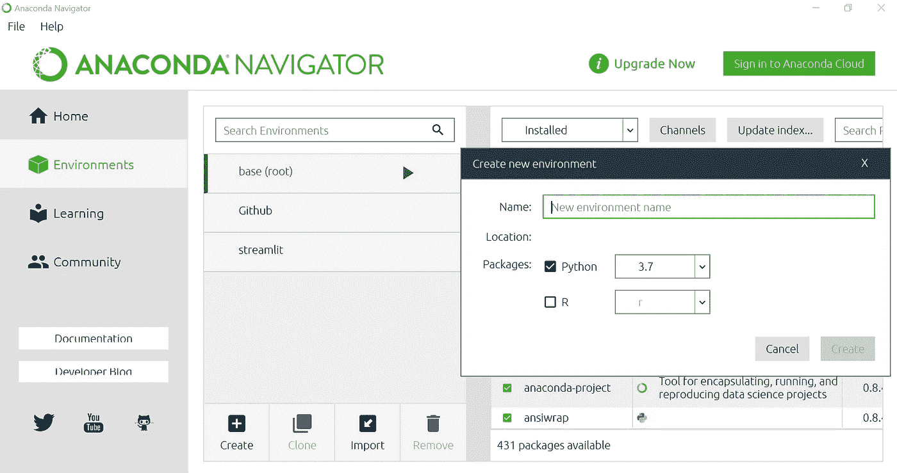
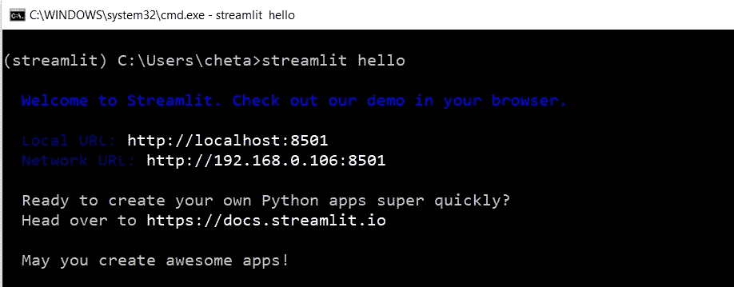
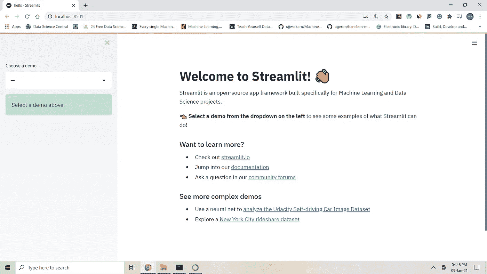
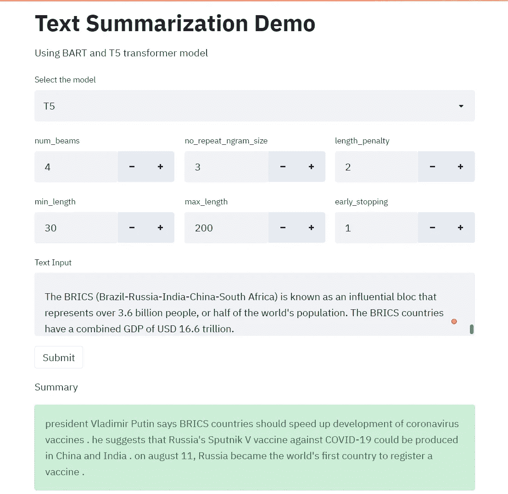

# 使用 Streamlit 在 30 分钟内创建一个文本摘要 Web 应用程序

> 原文：<https://pub.towardsai.net/build-a-text-summarization-web-app-using-streamlit-in-30-minutes-cbe78a8080af?source=collection_archive---------1----------------------->

## [数据科学](https://towardsai.net/p/category/data-science)，[机器学习](https://towardsai.net/p/category/machine-learning)

## 使用 Streamlit 总结 ML 应用程序利用变压器模型


来源: [Unsplash](https://unsplash.com/photos/xxHDLWmc1wE)

如果你正在阅读这篇文章，很明显你对文本摘要感兴趣。同时，你还想更进一步，打造一个文本摘要 app。但是你不知道怎么做，因为你没有前端经验。向 Streamlit 问好。借助 Streamlit，您无需了解前端技术，即可在数小时内构建出精美的应用。

相信我，正如本文标题所说，使用 Streamlit，你可以在 30 分钟内构建出漂亮的应用程序。通过参考官方文档，只需要 10-15 分钟就可以找出您的 web 应用程序需要的功能。在接下来的 15-20 分钟内，您可以将 Streamlit 和 summarization 代码放在一起，您的网站在 30 分钟内就准备好了。恭喜你！！您刚刚使用 Streamlit 创建了您的第一个 ML web 应用程序。

在本文中，我们将使用 BART 和 T5 变压器模型进行总结。让我们开始吧。

# 细流

Streamlit 是一个开源的 app 框架，主要用于机器学习和数据科学社区。您可以在几个小时内为您的机器学习项目创建简单而有效的 web 应用程序，只需最少的努力，无需前端经验。

## 装置

创建一个单独的虚拟环境总是一种好的做法。如果您使用的是 Windows，我建议您使用 Anaconda navigator 来创建一个虚拟环境并运行 Streamlit 应用程序。截至本文撰写之时(2021 年 1 月 9 日)，Python 3.6-Python 3.8 支持 Streamlit。



作者图片

创建虚拟环境后，使用以下选项打开终端，并安装所有必需的软件包，包括 Streamlit。


作者图片

```
(streamlit) C:\Users\cheta>pip install streamlit
(streamlit) C:\Users\cheta>pip install transformers
(streamlit) C:\Users\cheta>pip install torch
```

安装完成后，运行以下命令检查安装是否成功。

```
(streamlit) C:\Users\cheta>streamlit hello
```

如果安装成功，您将在命令提示符下看到下面的消息，并且新窗口将打开，地址指向 [http://localhost:8501/](http://localhost:8501/) 。这证实了 Streamlit 的成功安装。



作者图片



作者图片

# 变形金刚(电影名)🤗

变形金刚无需介绍。它提供了数百个预先训练好的模型，我们可以用它们来完成许多自然语言处理任务，例如分类、摘要、翻译、文本生成等。在本文中，我们将使用 T5 和 BART 模型进行总结。

# 完全码

从下面的代码中可以看出，如果您已经了解 python 的基础知识，这将非常简单明了。

*   导入所有需要的库，如 torch、streamlit、transformers 等。
*   接下来，使用 streamlit 的`title`和`markdown`方法向页面添加标题和副标题。
*   使用`selectbox`方法，您可以从下拉列表中选择 BART 或 T5 型号。默认情况下，打开应用程序时会选择 BART。
*   使用`beta_columns`方法，您可以获得 6 个输入参数，并将它们传递给各自的模型。
*   接下来，使用`text_area`方法从屏幕上读取需要进行摘要的输入文本。
*   最后，一旦你点击`submit`，输入的文本将被传递给函数`run_model`生成一个摘要，并最终显示在屏幕上。

要创建一个应用程序，运行下面的命令，你应该能够看到下面的总结应用程序。现在，您可以使用模型和调整参数来生成摘要。

```
(streamlit) C:\Users\cheta\streamlit run streamlit_demo.py
```



摘要应用程序(图片由作者提供)

# 结论

在本文中，您已经了解了如何使用 Streamlit 更快地创建 ML web 应用程序。在这里，我们只介绍了几个特性，但是在 Streamlit 中还有很多很酷的特性可以用来创建漂亮的 ML web 应用程序。如果您还没有尝试过 Streamlit，我强烈建议您今天就探索一下，我相信您不会后悔学习它。快乐学习！！

*原载于 2021 年 1 月 10 日 Pythonsimplified.com*****。****

**阅读更多关于 Python 和数据科学的有趣文章，* [***订阅***](https://pythonsimplified.com/home/) *到我的博客*[***pythonsimplified.com***](http://www.pythonsimplified.com/)***。*** 你也可以在[**LinkedIn**](https://www.linkedin.com/in/chetanambi/)**上联系我。***

****希望你喜欢读这篇文章。如果你喜欢我的文章并想订阅 Medium，你可以在这里这样做:****

*[](https://chetanambi.medium.com) [## Chetan Ambi -介质

### 阅读 Chetan Ambi 在媒体上的文章。数据科学|机器学习| Python。参观 https://pythonsimplified.com/…

chetanambi.medium.com](https://chetanambi.medium.com)* 

# *参考*

*[1].[https://www.streamlit.io/](https://www.streamlit.io/)*

*[2].[https://huggingface.co/transformers/model_doc/t5.html](https://huggingface.co/transformers/model_doc/t5.html)*

*[3].https://huggingface.co/transformers/model_doc/bart.html*