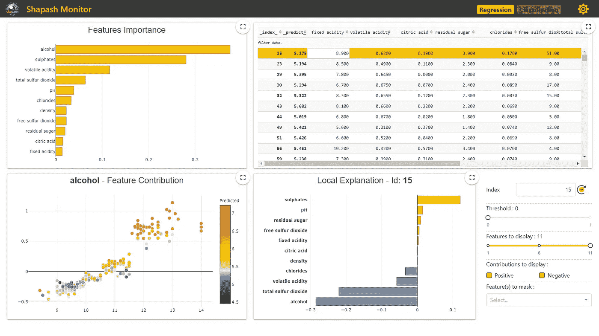
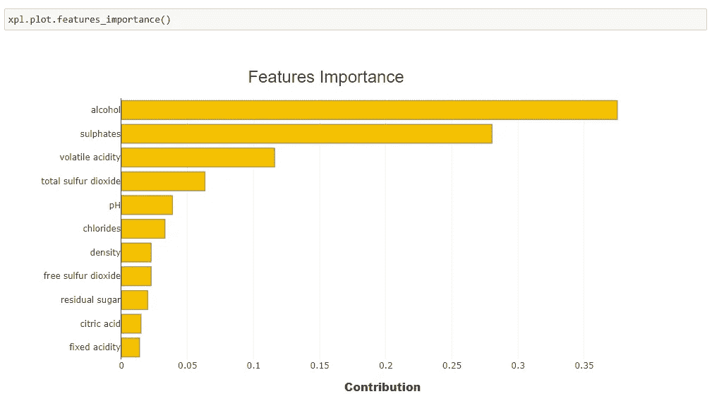
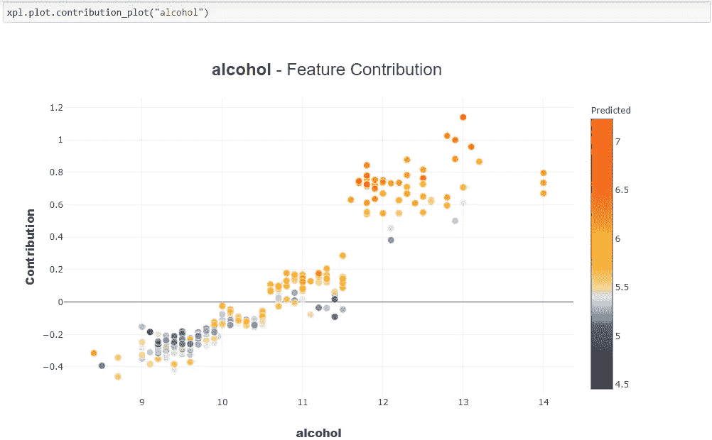
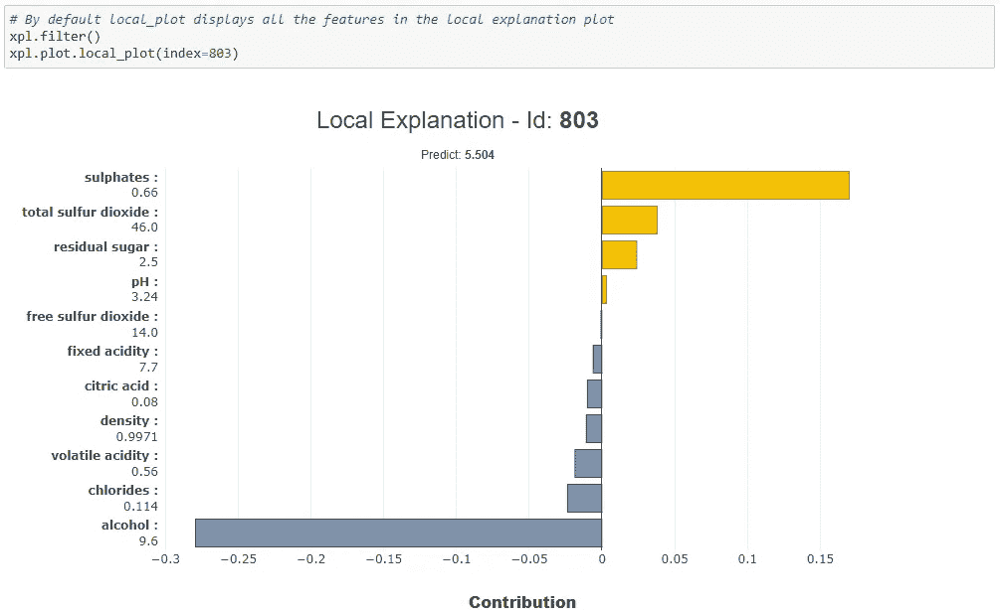
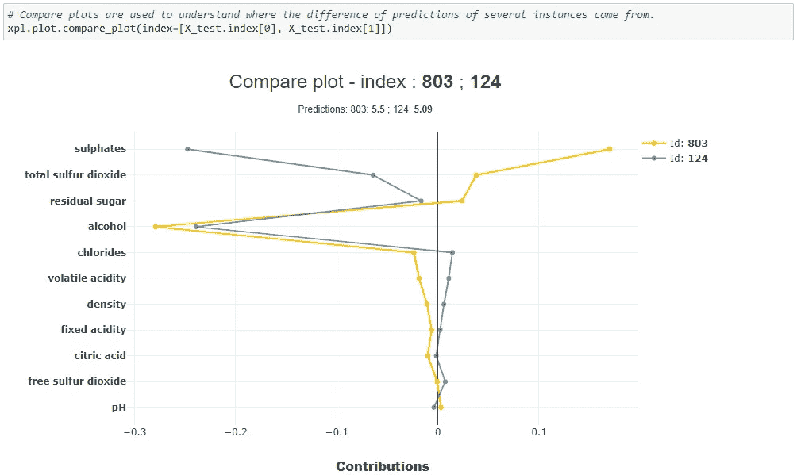
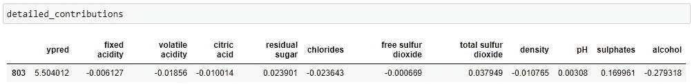
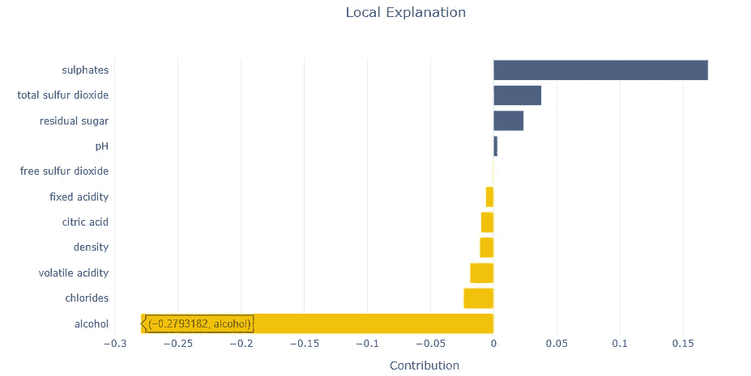

# 使用 Shapash 构建一个 Web 应用程序，在几秒钟内解释您的 ML 预测

> 原文：<https://pub.towardsai.net/build-a-web-app-to-interpret-your-ml-predictions-in-seconds-with-shapash-e2ddb2df4d02?source=collection_archive---------0----------------------->

## [数据科学](https://towardsai.net/p/category/data-science)，[机器学习](https://towardsai.net/p/category/machine-learning)

## 一个漂亮的网络应用程序，用于解释你的机器学习预测



图片由作者提供(摘自 Shapash web app)

**Shapash** 让你创建一个漂亮的网络应用程序，一旦你准备好模型，它就能在几秒钟内解释你的机器学习模型。你不必花时间创建自己的 web 应用程序。这为您和您的团队节省了大量时间。这难道不令人兴奋吗？如果你读到这里，我相信你会对此感兴趣。

# **目录**

[可讲解 ai(xai)](#56bc)
[shapash](#f9a9)
[安装](#7aa4)
[实现](#fcce)
∘ [步骤 1 —构建模型](#edb1)
∘ [步骤 2 —创建 SmartExplainer](#7082)
∘ [步骤 3 —编译](#dff8)
∘ [步骤 4 —启动、停止和序列化](#b17c)
∘

> 这篇文章假设你对 SHAP 和莱姆有一些基本的了解，这是 e**X**plain able**AI**最流行的两个软件包。因为 Shapash 在后端使用石灰和 SHAP 来使你的机器学习模型可以解释。即使你不了解 SHAP 和莱姆，你仍然可以浏览这篇文章。一旦你理解了 Shapash 如何帮助解释你的模型的预测，以后你就能更深入地理解石灰和 SHAP 是如何工作的。

# 可解释的人工智能(XAI)

可解释的人工智能是指可用于使机器学习模型可解释的工具和技术。以便模型被人类专家理解，这反过来有助于决策。有许多工具或软件包可用，如 SHAP，石灰，溜冰，解释毫升等。在可解释的人工智能市场。

还有其他类型的包(覆盖包)，如 **Shapash** 建立在 SHAP 和石灰之上，但提供了原始包中没有的附加功能。例如，使用 Shapash，您可以获得模型预测的解释，同时，它提供了一个现成的 web 应用程序来直观地解释您的 ML 预测。

*如果你有兴趣学习如何使用 SHAP 和莱姆来解释你的机器学习模型，我推荐以下资源。*

[](/lime-explaining-any-machine-learning-prediction-d663c457a740) [## LIME 解释任何机器学习预测

### 用石灰向可解释的人工智能迈出第一步

pub.towardsai.net](/lime-explaining-any-machine-learning-prediction-d663c457a740) [](/how-to-explain-your-machine-learning-predictions-with-shap-values-a8332c3e5a11) [## 如何用 SHAP 值解释你的机器学习预测

### SHapley 加法解释

pub.towardsai.net](/how-to-explain-your-machine-learning-predictions-with-shap-values-a8332c3e5a11) 

现在你已经对 e **X** plainable **AI** 和 **Shapash** 有了一些背景，让我们看看如何使用 Shapash 来解释你的模型预测。

# 沙帕什

Shapash 构建了一个开箱即用的 web 应用程序，用于解释您的机器学习模型预测。这些解释直接或间接地帮助了每个人，包括数据科学家、企业主、监管者、最终用户和客户。你也可以在 Jupyter 笔记本上看到这些图像。在撰写本文时，Shapash 支持大多数 Scikit-learn 模型 XGBoost、LightGBM、Catboost 等。

# 装置

安装非常简单，下面的命令将安装 Shapash 和所有的依赖项。

```
pip install shapash
```

# 履行

Shapash 的关键在于两个对象`SmartExplainer`和`SmartPredictor` ，它们帮助你解释你的机器学习预测。让我们来看看下面例子中的**红酒质量数据集**。本节末尾给出了完整的代码。

## 步骤 1 —构建模型

第一步是**建立模型**。使用红酒质量数据集，让我们建立随机森林回归模型。为了简单起见，使用默认参数，并且不进行超参数调整。

```
import shap
import pandas as pd
import numpy as np
import matplotlib.pyplot as plt
from sklearn.model_selection import train_test_split
from sklearn.ensemble import RandomForestRegressordataset_url = '[https://archive.ics.uci.edu/ml/machine-learning-databases/wine-quality/winequality-red.csv'](https://archive.ics.uci.edu/ml/machine-learning-databases/wine-quality/winequality-red.csv')
df = pd.read_csv(dataset_url, sep=';')y = df['quality']
X = df[['fixed acidity', ‘volatile acidity’, ‘citric acid’, ‘residual sugar’,’chlorides’, ‘free sulfur dioxide’, ‘total sulfur dioxide’, ‘density’,’pH’, ‘sulphates’, ‘alcohol’]]X_train, X_test, y_train, y_test = train_test_split(X, y, test_size = 0.2, random_state=42)model = RandomForestRegressor(max_depth=6, random_state=42, n_estimators=10)
model.fit(X_train, y_train)y_pred = pd.DataFrame(model.predict(X_test),columns=[‘pred’], index=X_test.index)
```

## 步骤 2 —创建 SmartExplainer

下一步是创建一个 **SmartExplainer** 对象。

```
from shapash.explainer.smart_explainer import SmartExplainer
xpl = SmartExplainer()
```

## 第 3 步—编译

在下一步中，您将运行**编译方法**。**编译**方法需要两个强制参数:模型&测试数据。它还提供额外的可选参数，如预处理、后处理**、**等。

```
xpl.compile(x=X_test, model=model, y_pred=y_pred)
```

## 步骤 4 —启动、停止和序列化

**步骤 4a)启动网络应用**

接下来，您可以通过在 **SmartExplainer** 对象上运行`app_run()`方法来启动 web 应用程序。

```
app = xpl.run_app(host='localhost')
```

一个新的网页将在你最喜欢的浏览器中打开，在那里你可以得到模型的解释。web 应用程序包含 3 种类型的可视化— *特性贡献、特性重要性、本地解释和测试数据*。

有两种解释——**全局解释和局部解释。特征重要性和特征贡献给出了全局解释(整体模型性能),而局部解释给出了对单个预测的解释。**

****

**请参考下面的**步骤 5** ，了解如何阅读这些可视化内容来解释模型的预测。**

****步骤 4b)停止服务****

**在查看了模型解释之后，如果您对结果满意，可以通过运行`kill()`方法来停止服务。**

```
app.kill()
```

****步骤 4c)串行智能解释器****

**一个重要的特性是您可以序列化`SmartExplainer`对象(xpl)。下一次你可以只使用腌渍对象，并立即启动网络应用程序。**

```
# Save
xpl.save('RedWineQuality_xpl.pkl')# Load
xpl = SmartExplainer()
xpl.load('RedWineQuality_xpl.pkl')
```

****步骤 4d)出口贡献给熊猫数据帧****

**使用 SmartExplainer 对象上的`to_pandas()` 方法，您可以将特性贡献导出到 DataFrame。此外，您可以使用`filter()`方法控制 summary_df 中包含的特性数量。**

```
summary_df = xpl.to_pandas(max_contrib=3)
```

## **步骤 5 —笔记本中的可视化**

**在**步骤 4b** 中，您已经看到了 3 种用于解释模型预测的可视化方式。您还可以在 Jupyter 笔记本中获得这些可视化效果以及其他功能。**

****特征重要性:**使用`xpl.plot.features_importance()`、**、**可以得到特征重要性可视化。根据下面的特征重要性图，`alcohol`和`sulphates` 是预测葡萄酒质量的两个最重要的特征。**

****

****特性贡献:**使用`xpl.plot.contribution_plot()`，你得到如下所示的贡献图。下图显示了“酒精”特性的贡献图。该图显示，随着酒精含量的增加，葡萄酒的质量也随之提高。通过替换酒精，你可以获得其他功能的贡献。**

****

**在 web 应用程序中，默认情况下，您将获得具有最高要素重要性的要素的贡献图(在我们的示例中为“酒精”)。通过单击不同的特性，您可以获得该特性的特性贡献图。**

****本地解释:**使用`xpl.plot.local_plot()`，您可以获得单个实例的本地解释。在下面的示例中，您从索引为 803 的测试数据中获得了一个局部解释— `sulphates`特征对该预测有很高的正面影响，而`alcohol`对该预测有最高的负面影响。**

****

**使用`filter()`方法，您可以控制包含在局部解释图中的特征数量。**

****比较图:**使用`xpl.plot.compare_plot()`，可以得到比较图，帮助你理解几个实例的预测差异来自哪里。**

****

## **第 6 步—部署的 SmartPredictor**

**你对 Shapash 提供的解释满意吗？现在您可以使用`SmartPredictor`对象进行部署。我们来看看 SmartPredictor 的特点。**

****步骤 6a)序列化并加载 SmartPredictor****

**与`SmartExplainer`类似，您可以序列化`SmartPredictor`对象并根据需要加载它。**

```
predictor.save('predictor.pkl')from shapash.utils.load_smartpredictor import load_smartpredictor
predictor_load = load_smartpredictor('predictor.pkl')
```

****步骤 6b)使用 SmartPredictor 解释新数据****

**假设您已经在生产中部署了`SmartPredictor`。如何用它来解释新进来的数据？这是通过将新数据传递给`SmartPredictor`上的`add_input()`方法来完成的。然后，您需要运行`detail_contributions()`方法，该方法为每个特性提供单独的贡献。为了测试，我将使用来自`X_test`的第一条记录。**

```
predictor_load.add_input(x=X_test.head(1))
detailed_contributions = predictor_load.detail_contributions()
```

****

****步骤 6c)—新数据的本地解释****

**Shapash 还不支持使用`local_plot`获得本地解释(然而，在撰写本文时，他们正试图尽快添加这一功能)。同时，您可以使用下面的代码获得本地解释。**

```
df = detailed_contributions.drop('ypred', axis=1).T.reset_index()
df.columns= ['features', 'contribution']
df = df.sort_values(by='contribution', ascending=True)import plotly.graph_objects as go
from plotly.graph_objs import *df['color'] = np.where(df['contribution']<0, '#f4c000', '#4a628a')fig = go.Figure(go.Bar(x=df['contribution'], 
 y=df['features'],
 orientation='h', 
 marker_color=df['color']) 
 )
fig.update_layout(template='plotly_white', title='Local Explanation', title_x=0.5)
fig.show()
```

****

**作者图片**

## **完整代码**

# **结论**

**在本文中，您已经了解了如何使用 Shapash 在几秒钟内构建一个漂亮的 web 应用程序来解释您的机器学习模型。就像你刚刚经历的，Shapash 有很多优点，就像这里提到的[](https://shapash.readthedocs.io/en/latest/#shapash-features)**。Shapash 文档和教程质量非常高，并且一目了然。我在下面的参考资料部分给出了链接，我建议您浏览所有的链接，以便充分利用 Shapash。****

*****最初发表于 2021 年 2 月 26 日*[***python 简化版***](https://pythonsimplified.com/shapash-build-a-web-app-to-interpret-your-ml-models-in-seconds/) *。*****

*****阅读更多关于 Python 和数据科学的有趣文章，* [***订阅***](https://pythonsimplified.com/home/) *到我的博客*[***www.pythonsimplified.com***](https://pythonsimplified.com/)***。*** 你也可以通过[**LinkedIn**](https://www.linkedin.com/in/chetanambi/)**联系我。******

****我希望你喜欢阅读这篇文章。如果你喜欢我的文章并想订阅 Medium，你可以在这里这样做:****

****[](https://chetanambi.medium.com) [## Chetan Ambi -介质

### 阅读 Chetan Ambi 在媒体上的文章。数据科学|机器学习| Python。参观 https://pythonsimplified.com/…

chetanambi.medium.com](https://chetanambi.medium.com)**** 

# ****参考****

****[1].[https://github.com/MAIF/shapash](https://github.com/MAIF/shapash)****

****[2].【https://github.com/MAIF/shapash/tree/master/tutorial ****

****[3].[https://shapash.readthedocs.io/en/latest/](https://shapash.readthedocs.io/en/latest/)****