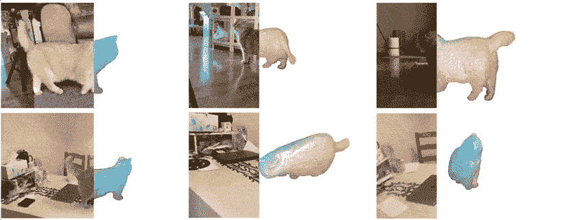
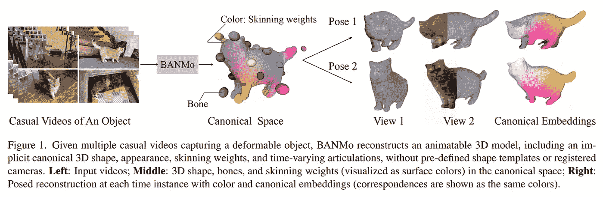
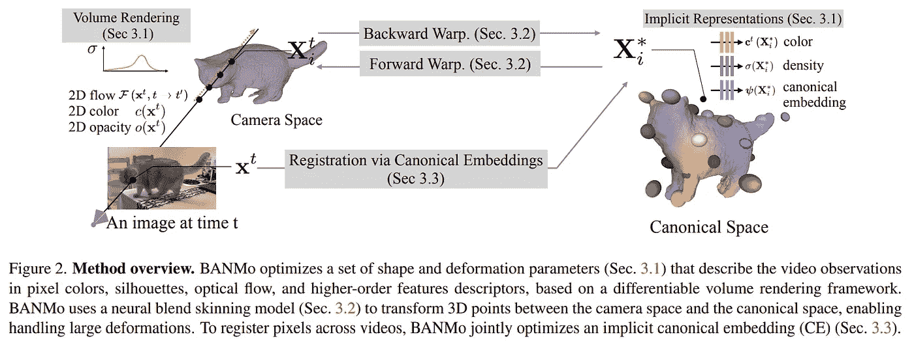
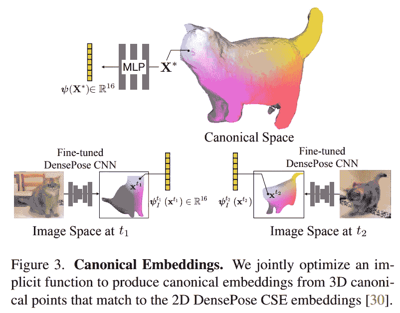
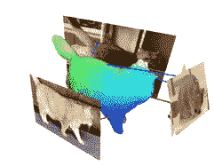
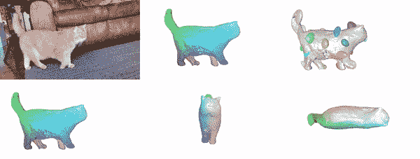

# 用人工智能构建可动画化的 3D 模型

> 原文：<https://pub.towardsai.net/build-animatable-3d-models-with-ai-507e921ea5a2?source=collection_archive---------0----------------------->

## 使用 BANMo 从图片创建可变形的 3D 模型！

> 最初发表于 [louisbouchard.ai](https://www.louisbouchard.ai/banmo/) ，前两天在[我的博客上读到的！](https://www.louisbouchard.ai/banmo/)

## 观看视频，了解更多结果！

如果你在 VFX，游戏开发，或创建 3D 场景，这种新的人工智能模型是给你的。很快在你的创作管道中看到这种模型或类似的方法，我不会感到惊讶，这使你在制作 3D 模型上花费更少的时间、金钱和精力。看看那个…

**左**:输入视频；**右**:每一时刻的重建。对应关系显示为相同的颜色。图片来自[作者的项目页面](https://banmo-www.github.io/)。

当然，它并不完美，但这是用手机拍摄的一个随意的视频即时完成的。它不需要昂贵的多摄像头设置或复杂的深度传感器。人工智能背后的美妙之处之一是:让复杂而昂贵的技术可供初创公司或个人使用，以创建具有专业质量结果的项目。只需拍摄一个对象，并将其转换为可以立即导入的模型。如果您不满意，您可以对细节进行微调，但整个模型将在几秒钟内出现！

你在上面看到的是一个名为 BANMo 的人工智能模型的结果，最近在我参加的 CVPR 活动上分享了这个结果。老实说，他们引起我的注意也是因为猫。尽管如此，它并不完全是一个诱饵。论文和方法实际上非常棒。它不像任何重建 3D 模型中的物体的 NeRF 方法。BANMo 解决了一个我们称为关节式 3D 形状重建的任务，这意味着它可以通过视频和图片来建模可变形的物体，还有什么比猫更容易变形呢？比看到结果更酷的是理解它是如何工作的…

图片来自[纸张](https://banmo-www.github.io/banmo-cvpr.pdf)。

该模型从一些你想捕捉的物体的随意拍摄的视频开始，显示它如何移动和变形。你要把你的猫咕噜咕噜地吃进花瓶的视频发到那里！

BANMo 利用这些视频来创建他们所谓的规范空间。这个初步的结果会给你关于物体的形状、外观和关节的信息。它是模型对你的对象的形状的理解，它如何在空间中移动，它属于砖块和斑点之间的哪个位置，通过那些大球和各种颜色来描述。

然后，它采用这个 3D 表示，并应用您想要的任何姿势，尽可能接近现实地模拟猫的行为和发音。

似乎很神奇，不是吗？那是因为我们还没说完。我们很快从视频转到模型，但这是有趣的地方。

图片来自[纸](https://banmo-www.github.io/banmo-cvpr.pdf)。

那么在这个规范空间中，他们用什么来把视频图像转换成这样的表示呢？你猜对了:一个类似 NeRF 的模型！

如果你不熟悉这种方法，我强烈建议你观看我制作的许多视频中的一个，然后回来看剩下的。

简而言之，NeRF 启发的方法必须预测物体的每个三维像素的三个基本属性，正如你在这里看到的:颜色，密度，以及使用为此训练的神经网络的规范嵌入。为了实现具有真实关节和运动的 3D 模型，BANMo 使用相机的空间位置和多个帧来了解拍摄光线，允许它通过视频的所有帧来迭代地重建和改进 3D 模型，类似于我们理解一个对象，移动它并从各个方向观察它。

图片来自[报社](https://banmo-www.github.io/banmo-cvpr.pdf)。

这部分是通过观察视频自动完成的，这要感谢我们刚刚提到的规范嵌入。这种嵌入将包含对象的每个部分的所有必要特征，以允许您使用对象的新的期望位置进行查询，从而在给定观察的情况下实施相干重建。它基本上将所需的位置从图片映射到具有正确视点和光照条件的 3D 模型，并为所需的形状和关节提供线索。

图片来自[作者项目页面](https://banmo-www.github.io/)。

最后要提的是我们的颜色。这些颜色代表了我们使用的不同视频和图像中共享的猫的身体属性。这是我们将学习和研究的功能，从所有视频中获取有价值的信息，并将它们合并到同一个 3D 模型中，以改善我们的结果。

瞧！

你最终得到了这只漂亮的 3D 可变形彩色猫，你可以在你的应用程序中使用它！

图片来自[作者的项目页面](https://banmo-www.github.io/)。

当然，这只是对 BANMo 的一个概述，我邀请您阅读本文以更深入地理解这个模型。

## 参考

项目页面:[、](https://banmo-www.github.io/)、【论文:杨、Vo、m、Neverova、n、Ramanan、d、Vedaldi、a、Joo、h、2022。Banmo:从许多休闲视频中构建可动画化的 3d 神经模型。在*IEEE/CVF 计算机视觉和模式识别会议论文集*(第 2863–2873 页)。
代码:[https://github.com/facebookresearch/banmo](https://github.com/facebookresearch/banmo)