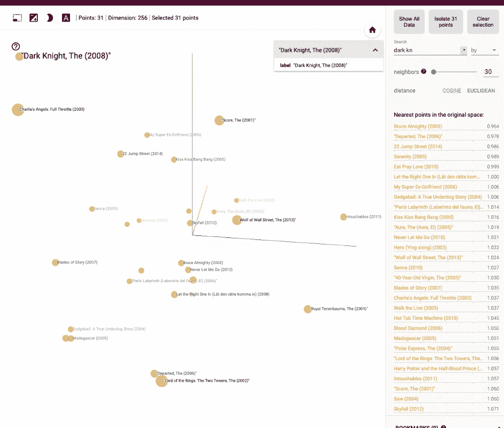
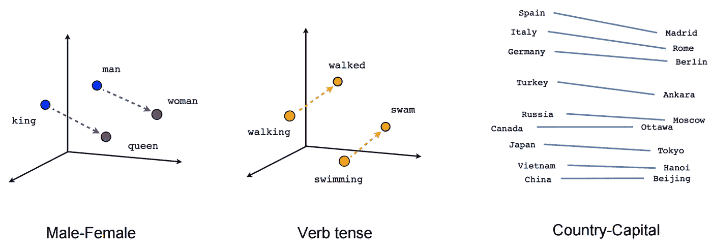
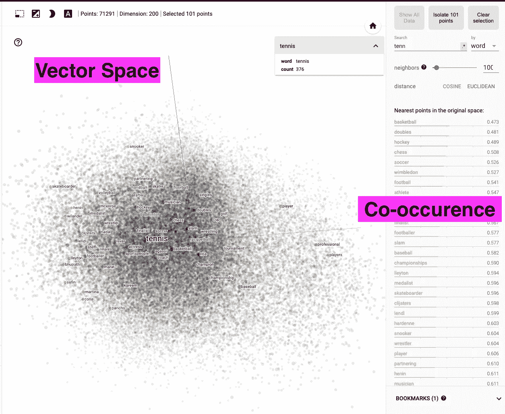
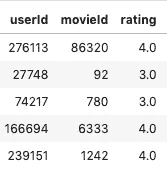
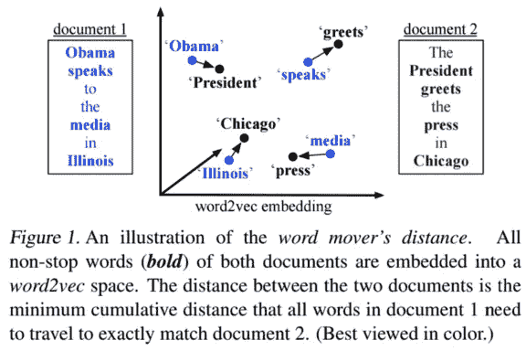
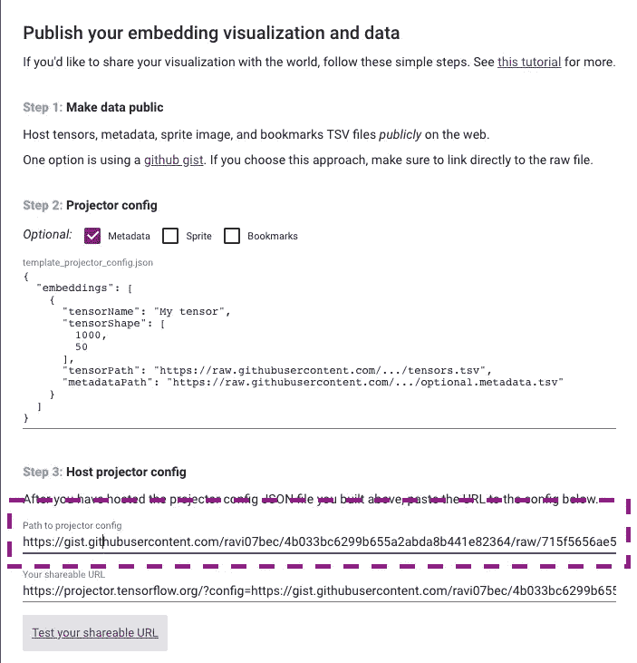
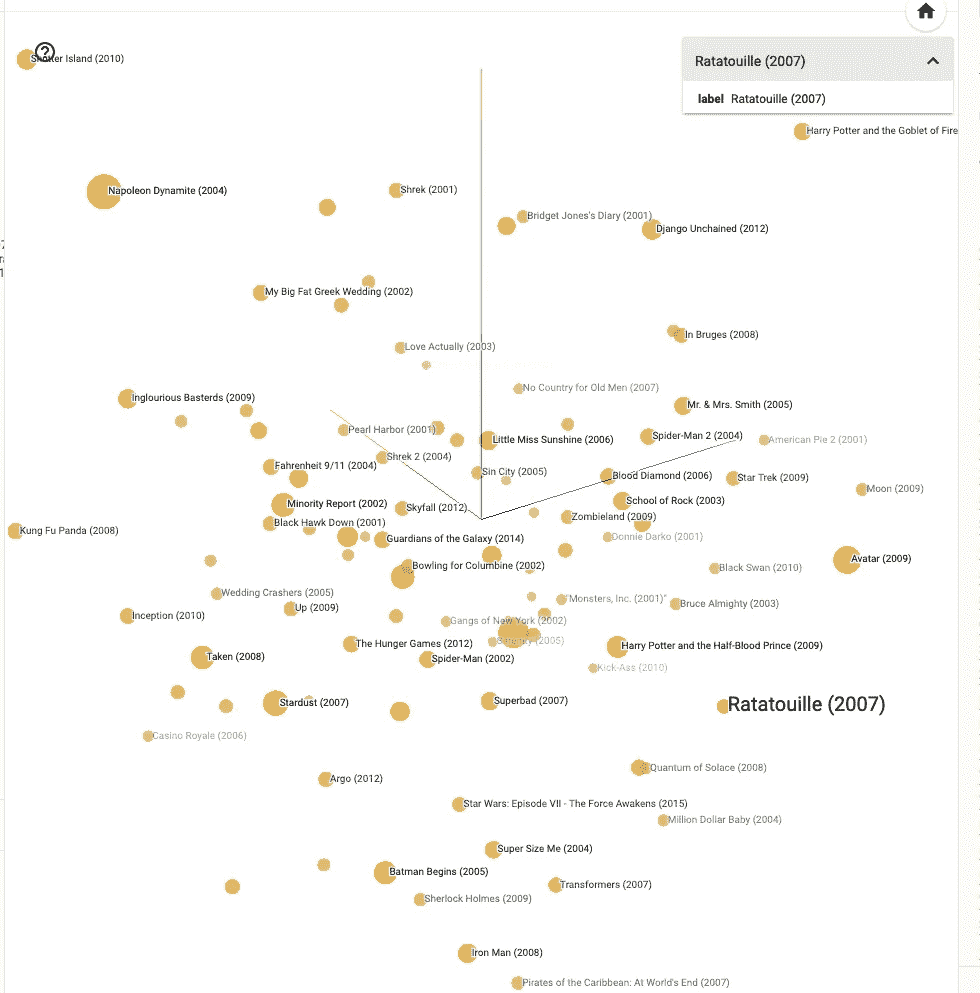
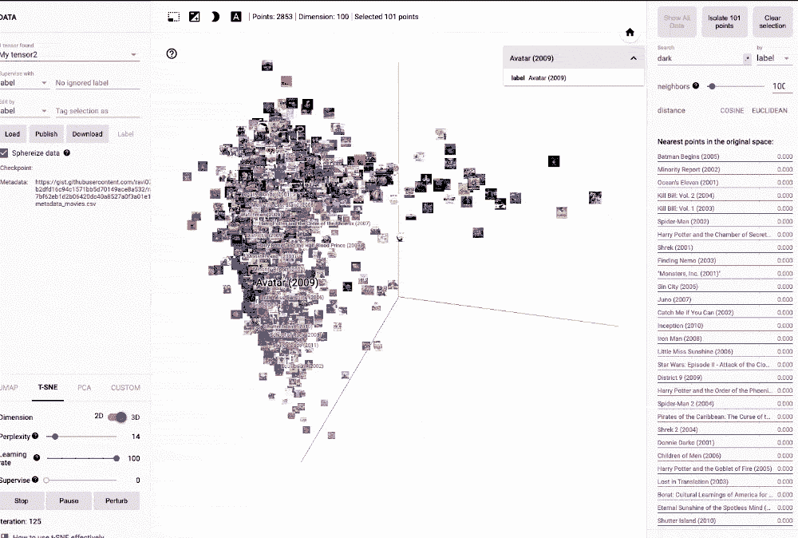

# 使用深度学习构建浮动电影推荐—在<10 Mins

> 原文：<https://pub.towardsai.net/build-floating-movie-recommendations-using-deep-learning-diy-in-10-mins-26f585821697?source=collection_archive---------0----------------------->

## [深度学习](https://towardsai.net/p/category/machine-learning/deep-learning)中 DIY

## 推荐送达你自己的 Webapp.com，观看 Netflix.com

基于深度学习的浮动电影推荐系统

你有没有看过《盗梦空间》,对梦中的梦和现实世界中的物品漂浮在太空中的可能性感到好奇？嗯，我们不能让真实的物品漂浮在空间中(至少到目前为止),但是我们绝对可以在多维空间中投射 python 向量。

在这篇文章结束之前，我们将会有一个以你的名字命名的浮动电影推荐系统，而不用担心租用服务器、编写脚本代码、数据收集或门户维护。此外，为什么仅仅局限于电影，而不把它扩展到我们的社交网络、股票、运动员、电视节目、书籍等等。猜猜看，我们在多维向量空间投影的时候是在同一页或者至少是相似的页。

对于那些想预览这个网络应用的人来说，[链接到这里](https://projector.tensorflow.org/?config=https://gist.githubusercontent.com/ravi07bec/4b033bc6299b655a2abda8b441e82364/raw/715f5656ae5dc2753f62ce4e9f89e7cb88f4e76e/test2.json)

主要先决条件:学习新概念的好奇心和部署自己的网络应用的渴望。

次要先决条件:了解 word2vec 嵌入、神经网络、Tensorflow、Github 和推荐系统。

## **工具包/概念:**

1.嵌入-它们是低维空间，可以投影高维向量。由于一幅图像/一个单词可能有数百万个参数，这些参数由像素或标记来表征，因此我们需要一个受约束的统一结构，它可以作为我们的 ML 模型的输入。当对高维或大量特征进行建模以在有限的数据量中获得模式时，我们通常会遇到维数灾难问题，即模型无法从输入数据中提取相关模式。我们可以使用像主成分分析(PCA)、TSNE 或 L1 正则化这样的技术来降低维数。然而，对于非常高的维数和稀疏的数据集，例如维基百科语料库中的数百万个标记，基于神经网络的嵌入更适合于提取相关属性。

嵌入捕捉跨记号或像素的语义相似性，并将它们投影到用户定义的向量空间中。例如- *“费德勒”*和*“网球”*一起被提及，因此在 100-D 嵌入中，费德勒将比特朗普更接近网球。

下图示例:

Word2Vec 向量相似度

2.tensor board Projector——一个由 Tensorflow 开源的 web 应用程序，它通过从我们的模型中读取嵌入内容并在较低的维度中呈现它们来交互式地可视化嵌入内容。在 [tensorboard 门户网站](https://projector.tensorflow.org/)上可以找到维基百科和 MNIST 语料库的示例投影仪。请花大量时间了解直观的投影仪、过滤器、嵌入空间和各种降维算法。

基于维基百科语料库训练的 Tensorboard 投影仪

3.降维算法——虽然我们为投影仪提供了 100 维的嵌入，但人眼只能看到 3 维的项目，我们需要将向量降维为 2 维或 3 维。

a.主成分分析——这是一种降低大数据集维度的技术，可以提高模型的可解释性，同时最大限度地减少信息损失。创建彼此不相关的新主分量，目的是最大化方差，即最大化大特征数据到低维主分量的信息。基于由主成分解释的增量方差，例如方差的 90%，我们可以决定截止值。

b.t-随机邻居嵌入-这是一种非线性的降维技术，通常用于高维数据集的可视化。其实现基于最小化两个分布之间的差异:测量输入对象的成对相似性的分布和测量嵌入中相应低维点的成对相似性的分布。

主成分分析和 TSNE 之间的主要区别是线性和非线性维数减少和目标函数，即主成分分析试图保持全局数据结构，而 TSNE 算法保持局部结构。

[极客对极客](https://www.geeksforgeeks.org/difference-between-pca-vs-t-sne/)提供了 TSNE 和 PCA 之间的 8 点差异，并作为我们未来实验的良好参考点。

4.电影镜头数据-电影镜头数据被认为是电影推荐系统的黄金标准数据集，它为 26Mn 收视率和 58k 电影提供[userid-movieid]级别的数据。自 1997 年以来，电影镜头数据在推荐系统的发展中发挥了突出的作用，从网飞到亚马逊，再到个别项目。电影镜头的压倒性影响力可以通过以下事实来衡量:*“在谷歌图书中搜索“电影镜头”产生 2750 个结果，在谷歌学术产生 7580 个结果”*。这些数据集可以被用于使用基于项目、基于用户、SVD 矩阵、神经网络等来构建推荐系统，其中因变量作为基于新用户过去偏好的评级预测。

使用上述概念，让我们努力创建一个浮动推荐 web 应用程序，其电影世界是网飞的倍数，例如，在我们的数据集中，3.7k 网飞电影与 58k 电影，数据来源[此处](https://www.foxbusiness.com/technology/how-many-movies-on-netflix)

类似于 word2vec 嵌入如何在向量空间中识别最接近的单词，我们在 100 维向量空间中创建最接近的电影，即，将维度从 58k 减少到 100。

输入数据集来自 MovieLens，它是用户给电影 0-5 分的交易数据。为了防止噪音，MovieLens 删除了少于 20 个评分和人口统计数据不准确的用户的评分。数据有多种变体，即从[1k 用户* 1.7k 电影]到[280，000 用户* 58k 电影]，请随时查看他们的[数据仓库](https://grouplens.org/datasets/movielens/)。对于我们的基于用户的协同过滤，我们可以忽略评级的质量，并将用户-电影组合视为二元关系，即用户是否对电影进行了评级。

回想一下这些概念，电影推荐可以有三种类型:

1.基于流行度-识别在尾随 X 时间段内观看时间最高的电影，并向所有用户推荐这些电影。

2.基于项目-基于电影的元标签，即演员、导演、语言、发行年份等，但是，项目的属性不会随时间而改变，并且推荐不会实时更新，用户行为没有被考虑在内。

3.基于用户-根据用户的观看模式将用户标记到特定群组/子群组，并推荐同一群组中的其他电影，例如，如果我已经开始观看《盗梦空间》和《黑暗骑士》,并且那些在我观看这两部电影之后在平台上的人，我将在下次访问时被推荐 Prestige。

几年前，我写过一篇关于使用基于项目的协同过滤创建推荐系统的博文。请随时查看，并提供基于项目和基于用户的推荐结果的反馈/比较。
博客链接:[https://towards data science . com/build-your-own-re commendation-engine-网飞-去神秘化-demo-code-550401d4885e](https://towardsdatascience.com/build-your-own-recommendation-engine-netflix-demystified-demo-code-550401d4885e)

对于新兴的 OTT 平台，基于用户的 CF 是一种快速启动的方式，因为他们可能没有资源来生成元标签和标记电影，而是更喜欢与他们的平台交互的隐式用户行为。对于像网飞、Youtube 这样的大玩家，Prime 视频混合推荐是事实上的方法。出于本帖的目的，我们将自己限制在基于用户的过滤，即通过用户向量来定义电影。数据结构如下所示:

从 MovieLens 输入数据

类似于 word2vec 嵌入，我们基于用户 id 训练这个浅层神经网络，一旦模型被训练，我们可以找到用户 id 的*‘网球-费德勒’*等价物。使用到目前为止的工作，我们可以找到长相相似的用户，并可能通过推送通知/电子邮件将用户划分为有针对性的通信集群。然而，除了用户定位，我们更感兴趣的是电影推荐，这需要一个额外的比较电影的步骤。

在 comes 中，句子嵌入，其中用户将被视为一个句子，句子的语义相似性将被捕获。随着 BERT、Elmo、Doc2Vec 和 Universal Sentence Encoder 的出现，在句子嵌入领域已经有了很多动作。然而，速度在这里是至关重要的，基于我个人的基准测试，我认为[Fast _ Sentence _ embeddeds](https://github.com/oborchers/Fast_Sentence_Embeddings)(FSE)是一条必经之路。FSE 基于单独的 word2vec 向量投影创建了一个复合向量，我们不会通过使用维基百科或谷歌新闻上预先训练的模型来获得任何附加值，因为用户 id 对于他们的 SOTA 系统来说是难以辨认的。这些模型不存在现有的语义相似性，因此我们可以放心地将我们算法的速度视为一个主要的决定因素(FSE 声称每秒处理大约 50 万个句子，而我个人使用通用句子编码器的经验表明速度低于 100/秒)。

一旦我们有了句子向量，我们可以将它们投射到多维空间中，例如"*奥巴马在伊利诺伊州对媒体讲话"*将类似于*"总统在芝加哥问候媒体"*

基于上下文的句子相似度

使用 Movielens 数据创建电影嵌入的代码:

使用 Word2vec 和 FSE 嵌入创建

一旦我们有了电影嵌入，我们将使用 tensorboard 投影仪和 Github 的组合来遍历部署的最后一英里，特别感谢 Google 开源他们的 tensorboard 投影仪。

使用嵌入创建令人惊叹的门户网站的一步一步的过程:

1.将嵌入数据上传到 GitHub gist，并在配置 JSON 中更新它。首先，你可以免费使用我在这里托管的嵌入。

2.将元数据上传到 Github [gist](https://gist.github.com/ravi07bec/b2dfd16c94c1571bb5d70149ace8a532) 上，这样气泡就有了标签

3.创建一个 JSON 文件，并将 URL 提供给 Tensorflow，Sample [JSON config](https://gist.githubusercontent.com/ravi07bec/4b033bc6299b655a2abda8b441e82364/raw/715f5656ae5dc2753f62ce4e9f89e7cb88f4e76e/test2.json)

来自 Github 的输入配置文件位置

4.部署 web 应用程序，瞧！

使用上述步骤部署的 Webapps:

a.[无图像的浮动推荐器](https://projector.tensorflow.org/?config=https://gist.githubusercontent.com/ravi07bec/4b033bc6299b655a2abda8b441e82364/raw/715f5656ae5dc2753f62ce4e9f89e7cb88f4e76e/test2.json)和 b. [有图像的浮动推荐器](https://projector.tensorflow.org/?config=https://gist.githubusercontent.com/ravi07bec/4b033bc6299b655a2abda8b441e82364/raw/915e0dbc1c69b6e9d31100c4967249a7a2548e85/test2.json)

《料理鼠王》的 Webapp 和 Reccos

5.使用投影仪四处播放，点击电影，查找最近的电影，使用 TSNE 或 PCA 投影电影矢量。

**总结:**我们已经了解了如何处理电影镜头数据的交叉网格、矢量嵌入背后的概念(本例中为用户 id)、使用 FSE 的句子相似度矩阵、创建精灵图像以及使用 Google 的 TensorFlow 部署 DIY 投影仪。来自下方[最终门户](https://projector.tensorflow.org/?config=https://gist.githubusercontent.com/ravi07bec/4b033bc6299b655a2abda8b441e82364/raw/915e0dbc1c69b6e9d31100c4967249a7a2548e85/test2.json)的快照

带有电影海报的推荐门户

我很乐意在电影或相关数据集上看到你的 DIY web 应用程序，欢迎在这里或 Linkedin 上联系我，如果你面临任何问题/改进，我很乐意与你聊天。

可用于推荐的相关数据集:

1.https://www.kaggle.com/zygmunt/goodbooks-10k

2.电子商务产品采购-[https://www.kaggle.com/c/instacart-market-basket-analysis](https://www.kaggle.com/c/instacart-market-basket-analysis)

3.餐馆-[https://towards data science . com/how-to-build-a-restaurant-recommendation-system-using-latent-factor-collaborative-filtering-FFE 08 DD 57 DCA](https://towardsdatascience.com/how-to-build-a-restaurant-recommendation-system-using-latent-factor-collaborative-filtering-ffe08dd57dca)

4.美食:[https://github.com/hasan-kamal/Cuisine-Prediction](https://github.com/hasan-kamal/Cuisine-Prediction)