# 使用 Amazon Rekognition 自定义标签构建自然花卉分类器

> 原文：<https://pub.towardsai.net/build-natural-flower-classifier-using-amazon-rekognition-custom-labels-8aabc3c8931c?source=collection_archive---------2----------------------->

## [计算机视觉](https://towardsai.net/p/category/computer-vision)

## 包含 AWS 最佳实践的完整指南


图片来自[皮克斯拜](https://pixabay.com/)

# **简介**

从头开始构建自己的计算机视觉模型会很有趣，也很有成就感。您可以决定您首选的用于训练和部署的机器学习框架和平台，设计您的数据管道和神经网络架构，编写定制的训练和推理脚本，并微调您的模型算法的超参数，以获得最佳的模型性能。

另一方面，对于没有或几乎没有计算机视觉和机器学习专业知识的人来说，这也可能是一项艰巨的任务。这篇文章展示了如何使用亚马逊 Rekognition 定制标签 和 AWS 最佳实践构建自然花朵分类器的分步指南。

# **亚马逊 Rekognition 定制标签概述**

**亚马逊 Rekognition 定制标签**是[亚马逊 Rekognition](https://aws.amazon.com/rekognition/) 的一项功能，是 [AWS 人工智能服务](https://aws.amazon.com/machine-learning/ai-services/)之一，通过机器学习进行自动图像和视频分析。它为定制计算机视觉端到端机器学习工作流提供**自动机器学习(AutoML)** 能力。

它适合任何想要快速构建自定义计算机视觉模型的人，以对图像进行分类，检测特定于其用例的对象和场景。不需要机器学习专业知识。

# **先决条件**

对于本演练，您应该具备以下先决条件:

*   一个 AWS 账户 —如果你还没有账户，你可以[创建一个新账户](https://portal.aws.amazon.com/billing/signup#/start)。
*   **AWS CLI —** 您应该安装或升级到最新的 [AWS 命令行界面(AWS CLI)版本 2](https://docs.aws.amazon.com/cli/latest/userguide/install-cliv2.html) 。

# 创建最低权限访问 IAM 用户和策略

作为[安全最佳实践](https://docs.aws.amazon.com/IAM/latest/UserGuide/best-practices.html#lock-away-credentials)，强烈建议不要在不需要 **AWS 账号 root 用户**的地方使用完成任何任务。相反，创建一个新的 IAM(身份和访问管理)用户，并使用[基于身份的策略](https://docs.aws.amazon.com/IAM/latest/UserGuide/access_policies.html)根据**最低权限原则**授予 IAM 用户所需的权限。这符合针对 [AWS 良好架构框架](https://aws.amazon.com/architecture/well-architected/)的[机器学习镜头](https://docs.aws.amazon.com/wellarchitected/latest/machine-learning-lens/welcome.html)中安全支柱下的 [IAM 最佳实践](https://docs.aws.amazon.com/wellarchitected/latest/machine-learning-lens/identity-and-access-management.html)。

在本演练中，新的 IAM 用户需要**编程访问**和 **AWS 管理控制台访问**。

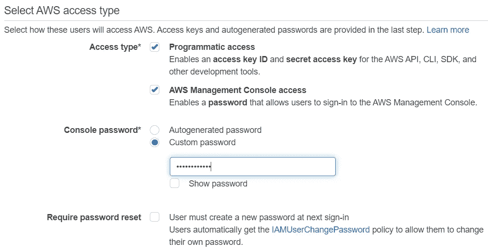

AWS 重新确认自定义标签 IAM 用户的访问类型

创建了一个新的[客户管理策略](https://docs.aws.amazon.com/IAM/latest/UserGuide/access_policies_managed-vs-inline.html#customer-managed-policies)来定义 IAM 用户所需的权限集。此外，一个现有的 S3 存储桶(在本例中为*my-rekognition-custom-labels-bucket*)也需要一个[存储桶策略](https://docs.aws.amazon.com/AmazonS3/latest/dev/using-iam-policies.html)，用于存储自然花卉数据集以进行访问控制。除了新 IAM 用户之外，任何用户都可以创建这个现有的存储桶。

JSON 格式的策略定义如下所示。

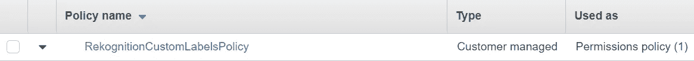

IAM 用户自定义标签的客户管理策略

JSON 形式的客户管理政策

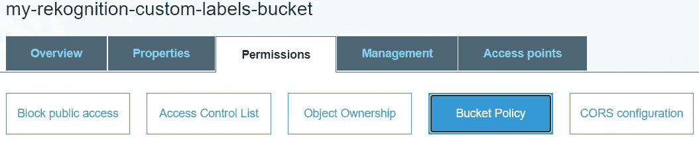

数据集存储桶策略

Amazon Rekognition 自定义标签花卉数据集 S3 存储桶的存储桶策略

# **花卉数据集**

我们使用来自[牛津 102 花卉 PyTorch Kaggle 竞赛](https://www.kaggle.com/c/oxford-102-flower-pytorch/)的 [**牛津花卉 102 数据集**](https://www.kaggle.com/c/oxford-102-flower-pytorch/data?select=flower_data.zip) 来构建使用亚马逊 Rekognition 定制标签的自然花卉分类器。我们使用这个而不是来自牛津大学视觉几何组[的](https://www.robots.ox.ac.uk/~vgg/index.html)[原始数据集](http://www.robots.ox.ac.uk/~vgg/data/flowers/102/102flowers.tgz)，因为它已经被分成*训练*、*有效*、*测试*数据集，更重要的是，这些数据已经被相应地标注了*训练*和*有效*的各自的花类别号。

该数据集共有**8189 张**花朵图像，其中*列车*分割有*6552 张*图像(**80%**)*有效*分割有 *818* 图像(**10%**)*测试*分割有 *819* 图像()下面的代码片段有助于将 102 种花的类别号转换成它们各自的名称。

```
import os
import jsonwith open('cat_to_name.json', 'r') as flower_cat:
    data = flower_cat.read()flower_types = json.loads(data)for cur_dir_name, new_dir_name in flower_types.items():
    os.rename(cur_dir_name, new_dir_name)
```

数据集存储桶应该具有相同的文件夹结构，如下所示，包括 train 和 valid 文件夹。每个应该有 102 个文件夹下，每个文件夹名称对应于一个特定的花卉类别名称。

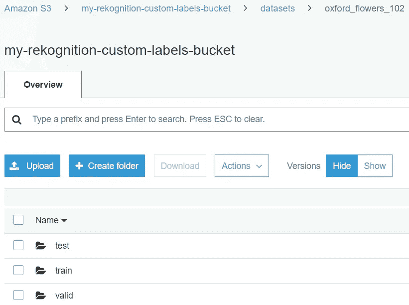

花卉数据集桶文件夹结构

# **创建新的花卉分类器项目**

完成必要的设置后，您可以作为 IAM 用户登录 AWS 管理控制台。按照本[指南](https://docs.aws.amazon.com/rekognition/latest/customlabels-dg/gs-step-create-bucket.html)中的步骤，为 Amazon Rekognition 自定义标签创建新项目。

# **创建新的训练和测试数据集**

我们通过[从 S3 桶](https://docs.aws.amazon.com/rekognition/latest/customlabels-dg/cd-s3.html#cd-procedure)导入图像，为亚马逊 Rekognition 自定义标签中的花卉分类器项目创建新的训练和测试数据集。重要的是给数据集一个清晰和独特的名称，以区分不同的数据集以及训练或测试。

对于训练数据集，S3 文件夹位置被设置为 S3 *列车*文件夹路径，如下所示。类似地，对于测试数据集，S3 文件夹位置被设置为 S3 *有效*文件夹路径。

*S3://my-rekognition-custom-labels-bucket/datasets/Oxford _ flowers _ 102/train/*

*S3://my-rekognition-custom-labels-bucket/datasets/Oxford _ flowers _ 102/valid/*

```
**train**
|- **alpine sea holly**
|  |- image_06969.jpg
|  |- image_06970.jpg
|  |- ...
|- **anthurium**
|  |- image_01964.jpg
|  |- image_01965.jpg
|  |- ...
|...
```

```
**valid**
|- **alpine sea holly**
|  |- image_06977.jpg
|  |- image_06978.jpg
|  |- ...
|- **anthurium**
|  |- image_01972.jpg
|  |- image_01975.jpg
|  |- ...
|...
```

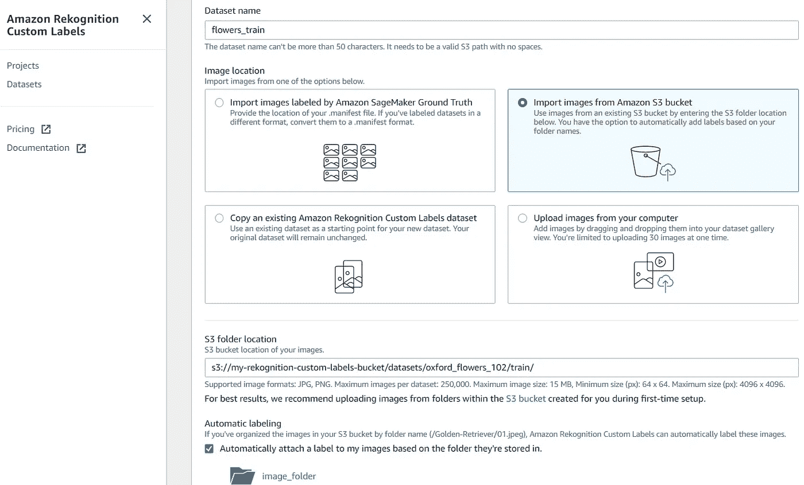

从 S3 桶导入图像创建训练/测试数据集

训练和测试数据集中的所有图像都被组织到代表它们各自的花类别标签的文件夹名称中。请确保通过选中如上所示的复选框来启用**自动标记**，因为 Amazon Rekognition 自定义标签支持在此类结构中自动标记这些图像。这可以节省手动标注大型影像数据集的大量时间和精力。

您可以放心地忽略“*确保您的 S3 存储桶配置正确*”消息，因为您应该更早地应用存储桶策略。如果您使用的名称不同于此示例中的名称，请确保您的存储桶名称是正确的。

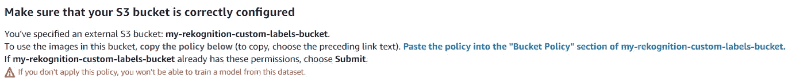

确保 S3 存储桶策略配置正确。

创建训练和测试数据集后，应该使用列出的数据集。

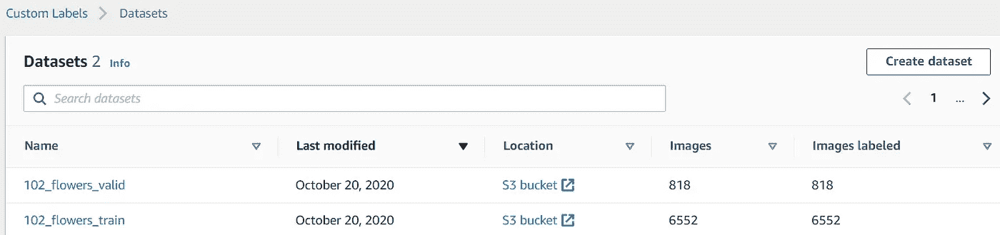

训练和测试数据集

当您单击任一数据集时，您应该会发现所有图像都有相应的标签。您可以单击任何标签来检查该标签的图像。您也可以在左侧的搜索文本框中搜索标签。

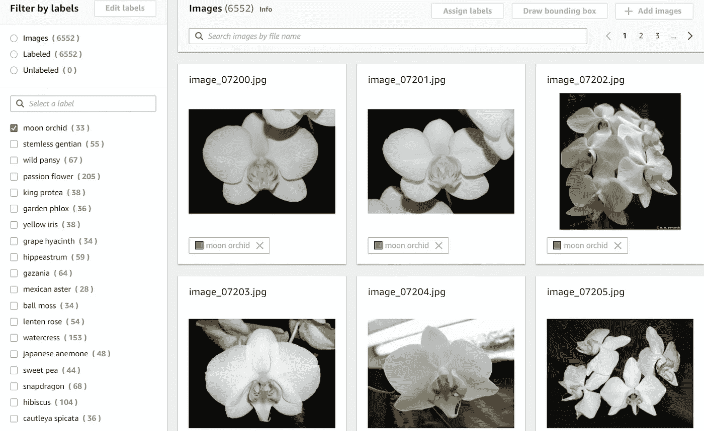

月兰的标签图像

# **训练新的花卉分类器模型**

您可以按照本[指南](https://docs.aws.amazon.com/rekognition/latest/customlabels-dg/tm-console.html)在 Amazon Rekognition 自定义标签控制台中训练一个新模型。要创建一个测试数据集，您应该使用“*选择一个现有的测试数据集*”选项，如下所示，因为它应该已经在前面的部分中被创建了。

基于该花卉数据集的训练可能需要一个多小时(在本例中大约 1 小时 20 分钟)才能完成。

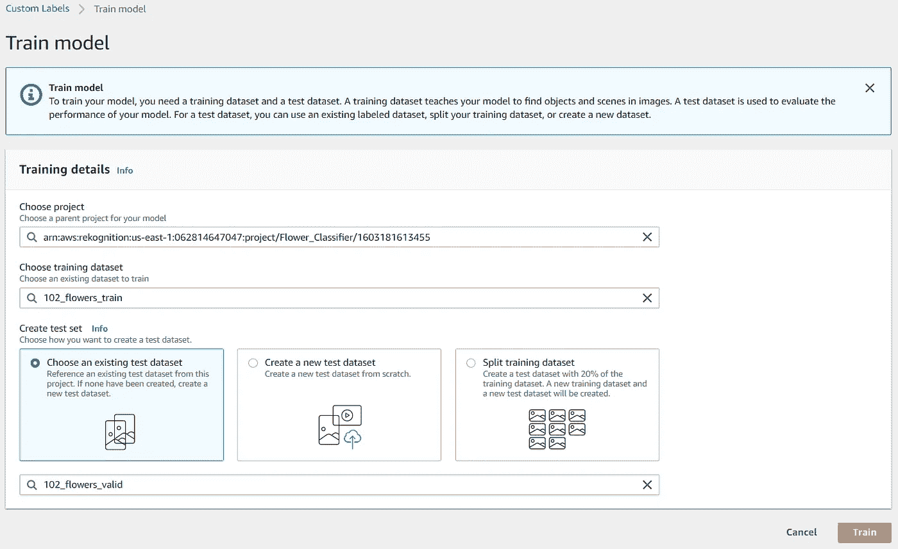

火车模型

# **评估训练好的模型性能**

花卉分类器模型训练完成后，您可以通过访问控制台中的[评估结果](https://docs.aws.amazon.com/rekognition/latest/customlabels-dg/tr-console.html)来查看模型性能，如图所示。通过本[指南](https://docs.aws.amazon.com/rekognition/latest/customlabels-dg/tr-metrics-use.html)，您可以更好地理解评估模型性能的指标。您应该能够在 Amazon Rekognition 自定义标签中使用相同的数据集获得类似的模型性能评估结果。

每个标签的**性能**是一个很棒的功能，允许您分析每个标签级别的性能指标，以便您更快、更容易地找出哪些标签的性能优于或差于平均水平。

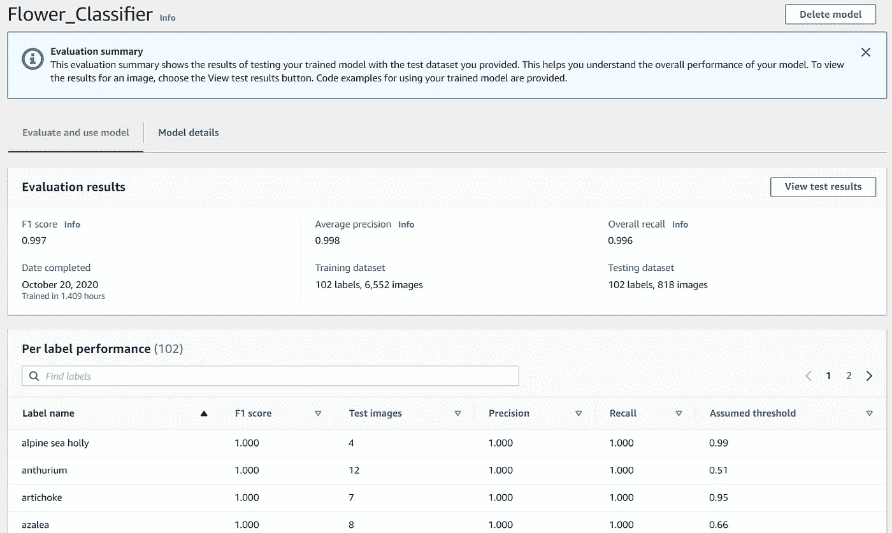

花卉分类器模型评估结果摘要和每个标签的性能

此外，您还可以查看和过滤测试图像的结果(**真阳性**、**假阳性**、**假阴性**)，以了解模型在哪里做出了不正确的预测。这些信息通过指示如何更改图像或将图像添加到定型数据集或测试数据集中，帮助您提高模型的性能。

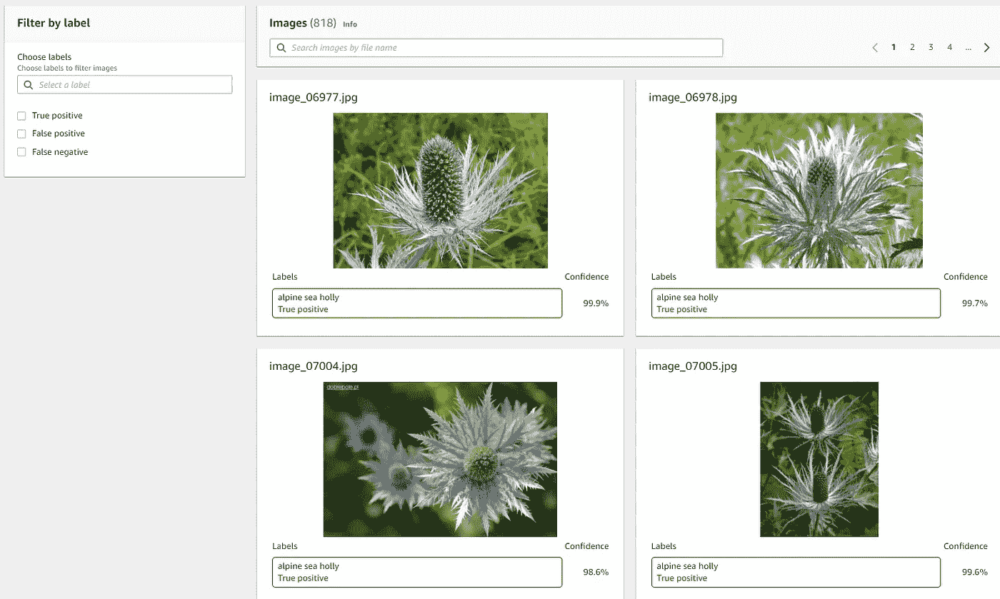

测试结果评估库

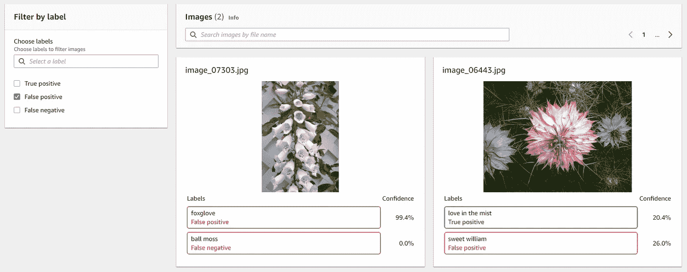

测试结果被误报过滤

# **启动花卉分类器模型**

当您对训练好的花卉分类器模型的性能感到满意时，您可以使用它来预测您选择的花卉。在使用它之前，您需要启动模型。在“模型评估结果”页面的底部，有关于如何使用模型启动、停止和分析花图像的示例 AWS CLI 命令。您可以参考本[指南](https://docs.aws.amazon.com/rekognition/latest/customlabels-dg/gs-step-start-model.html)了解启动模型和为 IAM 用户设置 AWS CLI 的详细步骤。

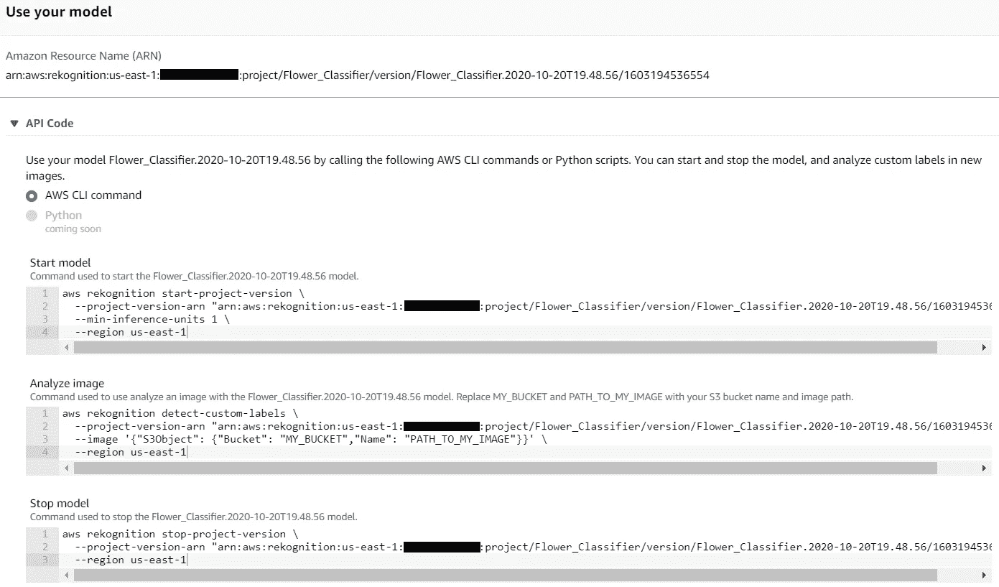

将模型与 AWS CLI 命令一起使用

要启动该模型，请使用 AWS CLI 命令，如下所示。请注意，您应该根据您的设置或偏好来更改命令行参数。命名配置文件特定于为 Amazon Rekognition 自定义标签创建的 IAM 用户。

```
**aws rekognition** **start-project-version** \
  **--project-version-arn** "MODEL_ARN" \
  **--min-inference-units** 1 \
  **--region** us-east-1 \
  **--profile** customlabels-iam
```

启动模型需要一段时间(在本例中大约 15 分钟)才能完成。您应该会在控制台中看到模型状态显示为正在运行，如图所示。

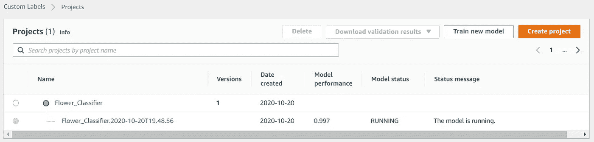

模型开始

# **用看不见的花图像分类**

模型运行后，您可以使用它来预测训练和测试数据集中不存在的图像的花朵类型，以确定您的模型在支持的花朵类型上的表现如何，这是以前从未见过的。您可以使用下面的 AWS CLI 命令来确定图像的预测标签。

```
**aws rekognition** **detect-custom-labels** \
  **--project-version-arn** "MODEL_ARN" \
  **--image** '{"S3Object": {"Bucket": "BUCKET_NAME", "Name": "IMAGE_PATH"}}' \
  **--region** us-east-1 \
  **--profile** customlabels-iam
```

以下是一些使用数据集的预测结果，这些数据集是自己获取的，或者独立于训练数据集和测试数据集。


玫瑰

```
{
    "CustomLabels": [
        {
            "Name": "rose",
            "Confidence": 99.93900299072266
        }
    ]
}
```


莲花

```
{
    "CustomLabels": [
        {
            "Name": "lotus",
            "Confidence": 99.7560043334961
        }
    ]
}
```


月兰

```
{
    "CustomLabels": [
        {
            "Name": "moon orchid",
            "Confidence": 98.02899932861328
        }
    ]
}
```


木槿

```
{
    "CustomLabels": [
        {
            "Name": "hibiscus",
            "Confidence": 98.11100006103516
        }
    ]
}
```


向日葵

```
{
    "CustomLabels": [
        {
            "Name": "sunflower",
            "Confidence": 99.86699676513672
        }
    ]
}
```


人造花 1

```
{
    "CustomLabels": []
}
```


人造花 2

```
{
    "CustomLabels": []
}
```

# **清理资源**

您将根据模型运行的时间付费。如果您已经使用完该模型，您应该停止它。您可以使用下面的 AWS CLI 命令来停止模型，以避免产生不必要的成本。

为了节省成本，如果不再需要自定义标注项目和数据集，也应将其删除到 S3 存储桶中。

```
**aws rekognition stop-project-version** \
 **--project-version-arn** "MODEL_ARN" \
  **--region** us-east-1 \
  **--profile** customlabels-iam
```

停止模型比启动模型更快。在这种情况下，大约需要 5 分钟。您应该会在控制台中看到模型状态显示为已停止。

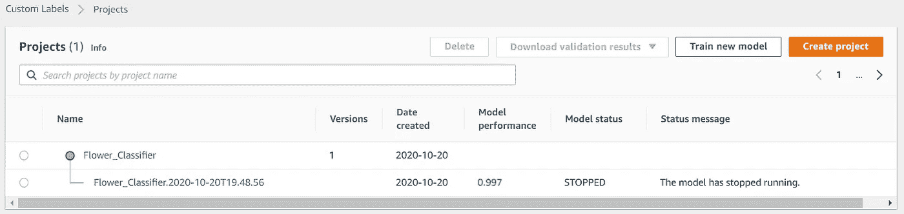

模型停止

# **结论和下一步措施**

这篇文章展示了使用 Amazon Rekognition 自定义标签和基于 AWS 良好架构框架的 AWS 最佳实践创建自然花卉分类器的完整分步演练。它还表明，在没有机器学习专业知识的情况下，您可以使用 Amazon Rekognition 自定义标签构建高性能的自定义计算机视觉模型。

在本演练中构建的模型的 *F1 分数*为 **0.997** ，，即使具有丰富的机器学习专业知识，如果从零开始构建，这对于相同的数据集也是不容易实现的。它还能够在看不见的天然花的样本上很好地执行，并且预计不能在人造花的样本上进行预测。

如果你有兴趣从头构建一个自然花卉分类器，你可能会对我的帖子感兴趣: [**使用 TensorFlow 2.3、Amazon SageMaker Python SDK 2.x 和定制 SageMaker 培训&服务 Docker 容器**](https://towardsdatascience.com/build-train-and-deploy-a-real-world-flower-classifier-of-102-flower-types-a90f66d2092a)构建、训练和部署一个包含 102 种花卉类型的真实世界花卉分类器 — 。