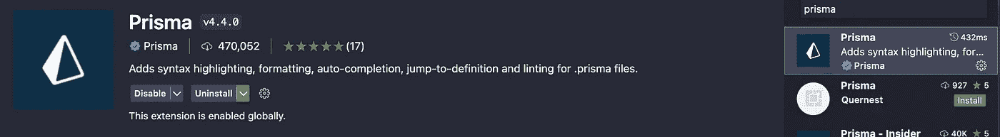
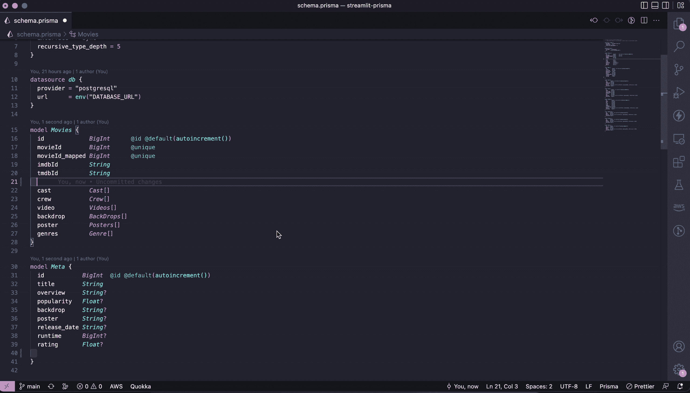
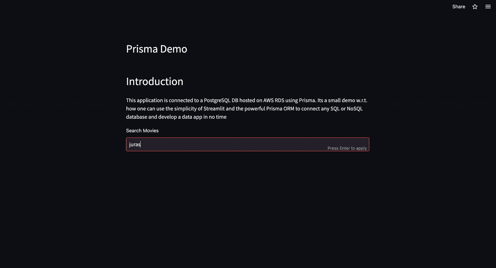

# 使用 Streamlit 和 Prisma 快速构建实时数据应用程序

> 原文：<https://pub.towardsai.net/build-real-time-data-applications-quickly-using-streamlit-and-prisma-ef6e6af81e30?source=collection_archive---------2----------------------->

## 将数据库支持集成到您的 Streamlit 应用中的快速实践指南


[弗朗西斯科·温加罗拍摄的照片](https://www.pexels.com/photo/low-angle-photography-of-tunnel-96381/)

Sstream lit 已经成为数据科学社区的福音，它提供了一种无需任何前端知识即可轻松快速构建数据应用的简单方法。Streamlit 支持许多不同类型的组件，这些组件与日俱增。人们使用 Pandas 和 CSV 文件在 Streamlit 中构建仪表板。缺乏将 Streamlit 连接到真实数据库(SQL 或 NoSQL)来构建仪表板的技术。在这篇博客中，我们将看看如何使用 Prisma 连接 PostgreSQL 数据库来简化 it。

*我已经创建了一个 Streamlit web 应用程序，并使用 Prisma 将其连接到一个实时 AWS RDS 实例。目前，该应用程序有一个单一的功能，使用电影名称搜索电影。您可以在*[*https://prisma.streamlitapp.com/*](https://prisma.streamlitapp.com/)*查看申请。该应用的代码库可从*获得

[https://github.com/vatsalsaglani/Streamlit-Prisma](https://github.com/vatsalsaglani/Streamlit-Prisma)

在继续讨论集成之前，让我们先看一下关于 Prisma 的简介

# Prisma 是什么？

risma 是一种 ORM，允许开发者使用面向对象的范例来读取、写入、更新&删除数据。Prisma 是使用 Typescript 开发的，它有一个直观的数据模型，完全是类型安全的，并提供自动迁移。Prisma 主要用在 NodeJS 应用程序中，但这要感谢 Robert Craige，他为 Prisma 创建了 Python 客户端，并提供给 Python 开发人员。Prisma Python 客户端[文档](https://prisma-client-py.readthedocs.io/en/stable/)提到不需要使用 Prisma，因为客户端使用 Rust 与 Prisma 接口通信。

可以使用以下命令安装 Prisma Python 客户端

```
pip install prisma
```

Prisma 需要一个数据模型来了解模式或数据库中的表之间的关系，以及与每个表中的每一列相关的数据类型，以确保类型安全。模式和数据库配置被添加到一个`schema.prisma`文件中。对于我们的教程，我们将使用以下数据模型

```
generator client {
  provider  = "prisma-client-py"
  interface = "sync"
  recursive_type_depth = 5
}datasource db {
  provider = "postgresql"
  url      = env("DATABASE_URL")
}model Movies {
  id             BigInt      @id @default(autoincrement())
  movieId        BigInt      @unique
  movieId_mapped BigInt      @unique
  imdbId         String
  tmdbId         String
  meta           Meta[]
  cast           Cast[]
  crew           Crew[]
  video          Videos[]
  backdrop       BackDrops[]
  poster         Posters[]
  genres         Genre[]
}model Meta {
  id           BigInt  @id @default(autoincrement())
  title        String
  overview     String?
  popularity   Float?
  backdrop     String?
  poster       String?
  release_date String?
  runtime      BigInt?
  rating       Float?
  Movies       Movies? @relation(fields: [moviesId], references: [id])
  moviesId     BigInt?
}model Cast {
  id        BigInt  @id @default(autoincrement())
  name      String?
  character String?
  profile   String?
  Movies    Movies? @relation(fields: [moviesId], references: [id])
  moviesId  BigInt?
}model Crew {
  id         BigInt  @id @default(autoincrement())
  name       String?
  real_name  String?
  department String?
  profile    String?
  job        String?
  Movies     Movies? @relation(fields: [moviesId], references: [id])
  moviesId   BigInt?
}model Videos {
  id          BigInt  @id @default(autoincrement())
  name        String?
  key         String?
  site        String?
  size        String?
  type        String?
  videoId     String?
  is_official Boolean?
  Movies      Movies? @relation(fields: [moviesId], references: [id])
  moviesId    BigInt?
}model BackDrops {
  id       BigInt  @id @default(autoincrement())
  path     String?
  Movies   Movies? @relation(fields: [moviesId], references: [id])
  moviesId BigInt?
}model Posters {
  id       BigInt  @id @default(autoincrement())
  path     String?
  Movies   Movies? @relation(fields: [moviesId], references: [id])
  moviesId BigInt?
}model Genre {
  id       BigInt  @id @default(autoincrement())
  genreId  BigInt?
  name     String?
  Movies   Movies? @relation(fields: [moviesId], references: [id])
  moviesId BigInt?
}
```

请下载 VS 代码中的 Prisma 扩展进行格式化，并自动完成对 Prisma 模式的支持。



作者图片

在`generator`下，我们指定客户端的类型和接口的类型。Prisma python 客户端提供了开箱即用的`sync`和`async`接口。在本教程中，我们将使用`sync`界面。

在`datasource`下，我们提供数据库的类型，即`provider`和`URL`来连接数据库。你可以使用 [Supabase](https://supabase.com/) 免费创建一个 Postgre SQL 数据库。因为我已经将数据存储在 AWS 上的 RDS 实例中，所以我将使用它。如果你正在使用 Supabase，那么`url`看起来会像`postgresql://postgres:[YOUR-PASSWORD]@[YOUR-HOST-NAME]:5432/postgres`。

`model <table_name>`包含列名和数据类型，以及与数据库中其他表的关系。例如，这里我们有`Movies`模型和`Meta`模型；`Movies`型号有以下字段`*id, movieId_mapped, movieId, imdbId, tmdbId*` *。另外，每部电影都有一些相关的元信息，我们把它们存储在不同的表中。现在要连接`Movies`和`Meta`表，我们可以有一个名为`meta`的字段，它的类型是`Meta`。*



作者 GIF

# 使用 Supabase 设置数据库

# 到使用相同的数据模型和相同的数据，您可以请求从 Google Drive 下载数据转储的请求权限。

如果您正在使用 [Supabase](https://supabase.com/) 下载数据转储后，您可以使用以下步骤。

**第一步**

从 Supabase 获取**数据库 URL** 。会在`settings/database`下。用数据库密码替换`[YOUR-PASSWORD-HERE]`。

**第二步**

转到您的终端，移动到下载数据转储的文件夹。您可以使用以下命令将数据复制到 Supabase 数据库中。检查`psql`命令在您的系统中是否可用。如果没有，按照[这个](https://www.timescale.com/blog/how-to-install-psql-on-mac-ubuntu-debian-windows/)教程来安装。

```
psql -d database_link < data-backup.psql
```

执行该命令后，将需要几分钟时间来导出数据。完成后，您应该会在数据库中看到以下表格。

作者图片

现在，如果你想学习 Prisma 的基础知识以及如何使用 Prisma Python 客户端进行 CRUD 操作，你可以跟随[这篇文档](https://prisma-client-py.readthedocs.io/en/stable/reference/operations/)。它提供了关于查询、创建和操作数据的深入信息。我不想在这个博客里复制同样的东西。

一旦安装了 Prisma 并设置了数据库，就可以进入集成部分了。

# 综合

如果您尚未安装 Streamlit，请安装它。

```
pip install streamlit
```

**第一步:**

创建一个`.env`文件，并提供您的数据库 URL，如下所示

```
DATABASE_URL=postgresql://postgres:[YOUR-PASSWORD]@[YOUR-HOST-NAME]:5432/postgres
```

**第二步:**

复制上面提到的`schema.prisma`文件。

**第三步:**

创建一个`utilities.py`文件并按照步骤操作

→ *在导入 Prisma 之前添加子进程调用生成 Prisma 客户端*

```
import os
import re
import subprocess
import json
from typing import List, Dictdef generate_prisma_client():
    """Generates the Prisma Client and loads it
    """
    print(f'GENERATING PRISMA CLIENT')
    subprocess.call(["prisma", "generate"])
    print(f'GENERATED PRISMA CLIENT')generate_prisma_client()
try:
    from prisma import Prisma
except RuntimeError:
    from prisma_cleanup import cleanup
    cleanup()
    print(f'GOT RUNTIME ERROR')
    generate_prisma_client()
    from prisma import Prisma
```

→ *添加一个* ***电影*** *类来初始化 Prisma 数据库并查询数据*

```
class Movies:
    """Movies class with methods to search and list movies
    """
    def __init__(self):
        self.db = Prisma()
        self.db.connect() def to_dict(self, obj: object):
        """Converts an Object to Dictionary Args:
            obj (object): Object to convert to dictionary Returns:
            Dict: Values of object in a dictionary
        """
        return json.loads(json.dumps(obj, default=lambda o: o.__dict__)) def list_movies_by_title(self, title):
        """Returns list of movies based on the title Args:
            title (str): Title or part of title Returns:
            List[Dict]: List of movies matching the title
        """
        matches = self.db.movies.find_many(where={
            "meta": {
                "every": {
                    "title": {
                        "contains": title,
                        "mode": "insensitive"
                    }
                }
            }
        },
                                           include={
                                               "meta": True,
                                               "cast": True,
                                               "poster": {
                                                   "take": 3
                                               }
                                           })
        matches = list(map(lambda m: self.to_dict(m), matches))
        return matches
```

**第四步:**

创建一个`components.py`文件夹，并添加以下函数来创建 HTML 组件

```
def card(title, image, overview): return f"""
    <div class="col">
        <div class="card" style="width: 18rem;margin-top:2px">
            " alt="Card image cap">
            <div class="card-body text-dark">
                <h5 class="card-title text-dark">{title}</h5>
            </div>
        </div>
    </div>
    """def rows(strings):
    return f"""
    <div class="row" >
        {strings}
    </div>
    """def grid(movies): card_strings = [
        card(title=movie.get("meta")[0].get("title"),
             image=movie.get("meta")[0].get("poster"),
             overview=movie.get("meta")[0].get("overview")) for movie in movies if movie.get("meta")[0].get("poster")
    ]
    row_strings = "\\n".join([
        rows("\\n".join(card_strings[ix:ix + 4]))
        for ix in range(0, len(card_strings), 4)
    ]) return f"""
    <div class="container" >
        {row_strings}
    </div>
    """
```

**第五步:**

创建`streamlitapp.py`文件来构建前端，并添加以下代码

```
import streamlit as st
from utilities import Movies
from components import card, gridmovObj = Movies()# add bootstrap css
st.markdown(
    """<link href="<https://cdn.jsdelivr.net/npm/bootstrap@5.0.2/dist/css/bootstrap.min.css>" rel="stylesheet" integrity="sha384-EVSTQN3/azprG1Anm3QDgpJLIm9Nao0Yz1ztcQTwFspd3yD65VohhpuuCOmLASjC" crossorigin="anonymous">
""",
    unsafe_allow_html=True)
st.header("Prisma Demo")movieText = st.text_input("Search Movies")if movieText:
    with st.spinner(text="Searching.."):
				# search the movies based on the movieText
        movies = movObj.list_movies_by_title(movieText.rstrip().lstrip())
        st.markdown("""<br />""", unsafe_allow_html=True)
				# render the html
        st.markdown(grid(movies), unsafe_allow_html=True)
```

**第六步:**

创建一个`requirements.txt`文件并添加以下模块

```
prisma
streamlit
requests
python-dotenv
```

使用以下命令运行应用程序

```
streamlit run streamlitapp.py
```

您应该会看到如下所示的内容



作者 GIF

# 托管应用程序

Y 您可以通过将您的代码推送到 GitHub，在 ***Streamlit 社区云*** 上托管此应用程序。然后你可以登录[https://share.streamlit.io/](https://share.streamlit.io/)并创建一个新的应用程序。

我选择 *Python3.7* 来运行这个应用程序。您可以单击高级链接并选择 Python 版本。此外，你可以用 TOML 格式指定你的环境变量。

在我们的例子中，我们需要指定`DATABASE_URL`作为唯一的环境变量。

```
DATABASE_URL = "postgresql://postgres:[YOUR-PASSWORD]@[YOUR-HOST-NAME]:5432/postgres"
```

一旦您添加了环境变量并选择了 Python 版本，您就可以点击 ***【部署】，*** ，过一段时间，您的应用程序就会启动并运行了。

# 结论

在这篇博客中，我们看到了如何使用 Streamlit 创建一个实时数据应用程序，通过利用 Prisma ORM 的功能从数据库中提取数据，将一个真实的数据库连接到 Streamlit。我们看到了如何查询已经可用的数据，我们还可以在 Streamlit 中创建一个表单，并使用 Prisma 将数据添加到数据库中。

*如果你觉得这篇文章很有帮助，请使用我的* [*推荐链接*](https://thevatsalsaglani.medium.com/membership) *或通过* [*在 Medium 上关注我的*](https://thevatsalsaglani.medium.com/) *并分享这篇博客来帮助支持我的内容。*