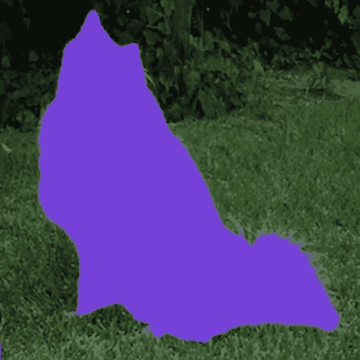
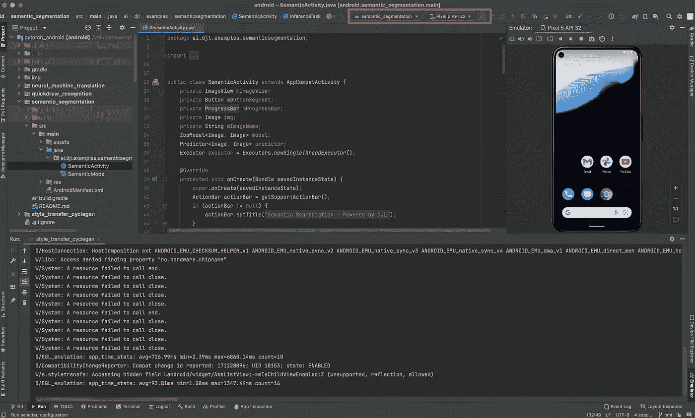
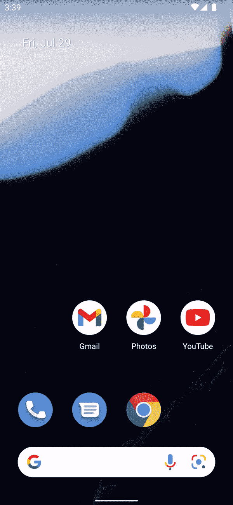

# 用深度 Java 库构建语义切分 App

> 原文：<https://pub.towardsai.net/build-semantic-segmentation-app-with-deep-java-library-723adbbaf225?source=collection_archive---------1----------------------->



Deep Java Library (DJL)有几个 PyTorch Android 演示应用，可以在你的手机上本地运行深度学习推理。这些例子很容易用作构建自己的应用程序的基础。今天，我想关注一个我为开源项目贡献的例子，语义分割:自动驾驶汽车和医学成像机器等广泛使用的深度学习领域。

语义分割是一个深度学习过程，它对图像进行排序以找到对象。语义分割模型通过图像逐个像素地进行，将每个像素分类为对象或背景。它不区分两个相同类型的对象，而是识别它们。例如，通过语义分割，图像中的两只狗都被着色为相同的颜色，但是模型不一定关心这是两只不同的狗。当运行推理的算法根据分类识别和着色每个像素时，分割部分就开始了，当它完成时，允许我们看到着色的对象。简而言之，模型将在你给它的图像中找到的任何对象中着色。[本文](https://www.jeremyjordan.me/semantic-segmentation/)对语义分割模型及其层次结构进行了更深入的探讨。

# 设置

在您的本地计算机/开发人员环境中，从 GitHub 克隆`djl-demo`存储库。你需要这样做，以便运行语义分段应用程序(或其他 DJL 应用程序之一)。

```
git clone [https://github.com/deepjavalibrary/djl-demo.git](https://github.com/deepjavalibrary/djl-demo.git)
```

按照这些[指令](https://github.com/awslabs/djl/blob/master/docs/development/setup.md)设置您的开发环境。

要在您自己的 Android 手机上运行该应用程序，请在您电脑的终端中执行以下步骤:

1.  `cd djl-demo/android/pytorch_android`
2.  然后再次进入你想运行的应用程序。如果你想运行语义分割，那么运行这个命令:`cd semantic_segmentation`
3.  从这里，根据您的计算机操作系统运行项目:

Mac: `./gradlew iD`

视窗:`..\gradlew iD`

如果你没有 Android 手机，你可以安装 Android Studio 来运行应用程序。

要在 Android Studio 仿真器中运行应用程序，请按照以下步骤操作:

1.  在 Android Studio 中打开`djl-demo`目录的`pytorch_android`文件夹。这将显示 4 个现有的 DJL PyTorch 应用程序，你可以运行。你可能得等一会儿，让格雷尔给这个项目编索引。
2.  点击右上角要运行的应用程序名称旁边的绿色播放按钮，以及所选的模拟器，就可以了。



就模型输入和输出而言，它们相对简单。输入是一个 PNG 或 JPG 图像，它被模型限制为 600x800 或更小。输出是一个带有彩色对象的图像，大小为 600x800。翻译者将图像尺寸缩小到其原始尺寸。

# 推理

下面的代码块直接取自 SemanticSegmentationTranslator.java 在 GitHub 上的 DJL 库。翻译器为模型准备输入，从模型的输出中获取信息，并将其转换为对人类有直观意义的输出。在创建语义分割应用程序时，我发现翻译器的创建对我理解 DJL 贡献最大。我学习了 DJL 提供的数据类型和结构，以及使用它们的有效方法。探索是有趣和令人兴奋的，就像把隐藏的碎片拼在一起。DJL 让您轻松找到合适的作品，并将其与您现有的作品搭配起来。

下面的代码是语义分割翻译器的核心后处理，最终创建图像输出。没有它，您只剩下一些对最终用户没有任何意义的输出数组。后处理对于深度学习模型的使用至关重要。

让我们深入研究一些翻译器代码，以了解发生了什么。

```
int imageSize = width * height;
ByteBuffer bb = manager.allocateDirect(CHANNEL * imageSize);
int r = 0; // adjustment for red pixel
int g = 1; // adjustment for green pixel
int b = 2; // adjustment for blue pixel
byte[][] colors = new byte[CLASSNUM][3];// randomly assign colors for each time the model is run
for (int i = 0; i < CLASSNUM; i++) {
    byte red = (byte) RandomUtils.nextInt(256);
    byte green = (byte) RandomUtils.nextInt(256);
    byte blue = (byte) RandomUtils.nextInt(256);
    colors[i][r] = red;
    colors[i][g] = green;
    colors[i][b] = blue;
}
```

上面的代码是在图像经过预处理并通过模型运行后的后处理方法中。这将创建一个随机生成的颜色的 2D 字节数组，每次进行推理时，这些颜色对应于图像中不同的已知对象。

下面的代码紧跟在颜色生成之后；此代码将分类的像素映射到它们的颜色，这些颜色随后被转换为图像。这是后期加工的肉。

```
// double for loop to loop through each pixel
for (int h = 0; h < height; h++) {
    for (int w = 0; w < width; w++) {
        int index = h * width + w;
        int maxi = 0;
        double maxnum = -Double.MAX_VALUE;

       // loops through each object probability at the specific pixel
        for (int i = 0; i < CLASSNUM; i++) {
            // get score for each i at the h,w pixel of the image
            float score = scores[i * (imageSize) + index];
            if (score > maxnum) {
                maxnum = score;
                maxi = i;
            }
        }

       // if an object was probabilistically found, color it in
        if (maxi > 0) {
            bb.put(colors[maxi][r]);
            bb.put(colors[maxi][g]);
            bb.put(colors[maxi][b]);
        } else {
            bb.position(bb.position() + 3);
        }
    }
}// image creation from the buffer
bb.rewind();
int originW = (int) ctx.getAttachment("originalWidth");
int originH = (int) ctx.getAttachment("originalHeight");
NDArray fullImage =
        manager.create(bb, new Shape(height, width, CHANNEL), DataType.UINT8);
NDArray resized = NDImageUtils.resize(fullImage, originW, originH);return ImageFactory.getInstance().fromNDArray(resized);
```

顶部的双 for 循环遍历我们的`scores`数组中的每个像素，这是从模型的输出中返回的。对于图像中的每个像素，有一个数组包含该像素是对应于该数组索引的对象的概率。如果没有概率大于 0 索引处的概率，则像素保持不着色(黑色)并成为背景的一部分。如果概率在非 0 的索引处最大，则像素被赋予代表该对象的相应的红色、绿色和蓝色值。

一旦着色完成，图像就会生成一个完整的 600 x 800 大小的数组。然后将其缩小到图像的原始宽度和高度，并原样返回。

这是从应用程序看起来的样子。



真的就这么简单。当然，像任何其他项目一样，理解 DJL 工具需要一个学习曲线，但是一旦你这样做了，你就真正开始理解 DJL 给你的力量。

# 摘要

起初，我怀疑自己能否开始研究并理解 DJL。我是一名即将进入迈阿密大学四年级的大学生，之前从未从事过开源项目。我原以为这将是极其困难的，但我实际上发现它非常有趣，它吸引了我。我很好奇每天能找到哪些新的 DJL 功能来帮助我更好地构建我的应用程序或未来的 DJL 应用程序。

语义分割可以大大扩展，超出这里显示的简单用法。正如我之前暗示的，这不是 DJL 唯一的应用。在写这篇博客的时候，实际上还有另外三个人。其中一个应用程序是 Quickdraw Recognition，它可以实时识别和分类你在应用程序中绘制的对象。另一个应用程序是 Style Transfer，它使用你拍摄的图像，并将其转换为符合文森特·梵高或克洛德·莫内等艺术家的风格。第三种是神经机器翻译，它接受法语文本输入，并返回翻译后的英语输出。因此，即使语义分割不完全符合你想要构建的应用程序的风格，DJL 还有其他几个选项和示例可以帮助你开始！