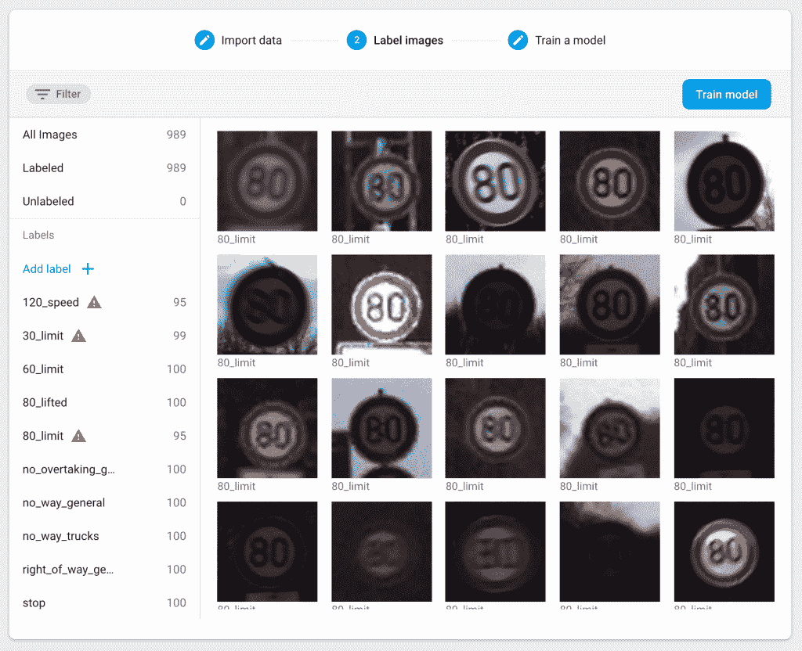
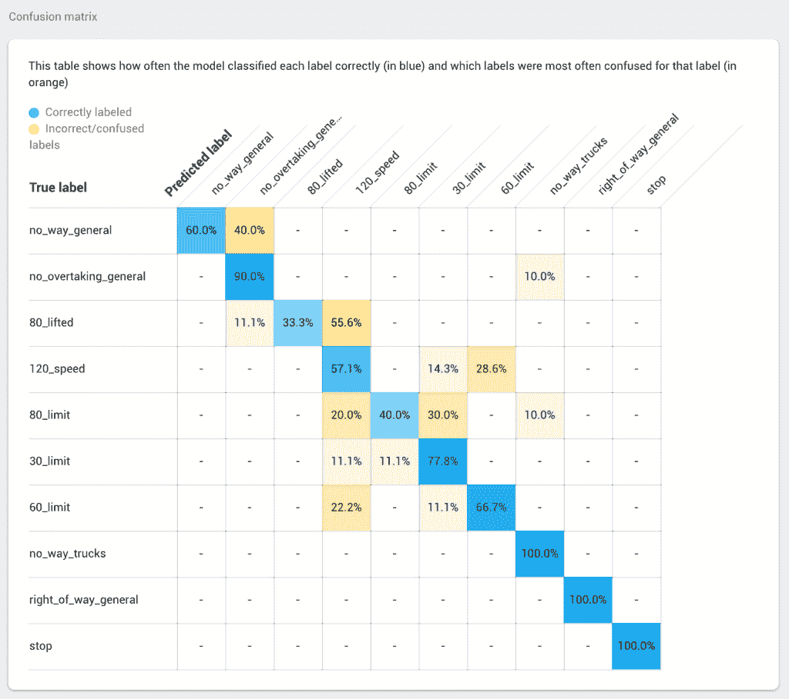
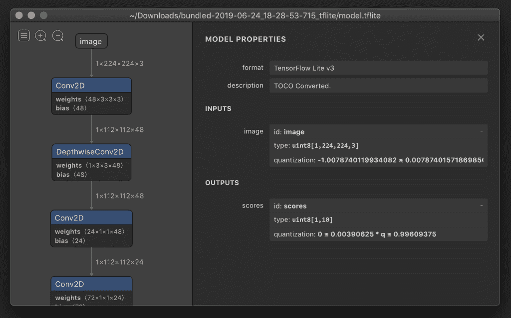
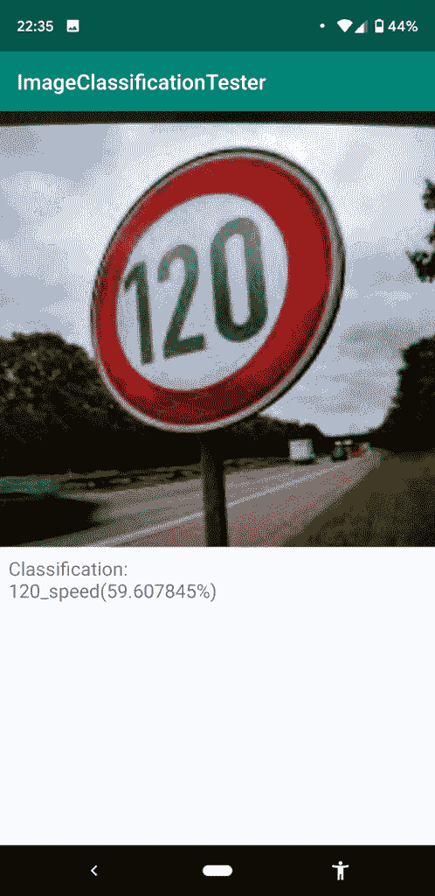

# 用 Firebase AutoML Vision Edge 构建 TensorFlow Lite 模型

> 原文：<https://pub.towardsai.net/build-tensorflow-lite-model-with-firebase-automl-vision-edge-580302435895?source=collection_archive---------1----------------------->

## 用 Firebase AutoML | [向 AI](https://towardsai.net) 构建 TFL 模型

## 用 Firebase ML 工具包训练第一个图像分类模型

*本文最初发表于*[*think mobile . dev*](https://thinkmobile.dev)*—一个关于在移动应用中实现智能解决方案的博客(* [*链接到文章*](https://thinkmobile.dev/build-tensorflow-lite-model-with-firebase-automl-vision-edge/) *)。*

一年多以来，Firebase——移动和 web 开发的后端平台，在其产品组合中包含了 ML Kit SDK。多亏了这个特性，在移动应用中实现机器学习解决方案变得更加容易，不管我们拥有什么样的 ML 技能。有了像文本识别或图像标签这样的 API，我们可以通过几行代码将这些功能添加到我们的应用程序中。
ML Kit 还提供了一种简单的方法来插入定制的机器学习解决方案——我们提供 TensorFlow Lite 模型，Firebase 负责将其部署到我们的应用程序中——多平台(Android 和 iOS)，离线或在线(模型可以在运行时按需下载与应用程序捆绑)，并提供简化的代码来实现解释器。

在 Google I/O 2019 期间，ML Kit 有一些新的公告。最有趣的事情之一是**AutoML Vision Edge**——基于图像的自动模型训练解决方案。

在本帖中，我们将为 [GTSRB 数据集](http://benchmark.ini.rub.de/?section=gtsrb&subsection=dataset)(交通标志)的一个小子集构建一个简单的分类模型，预览其结构，并将其放入 app 中测试实现。
如果你想看看我们还能如何建立交通标志分类模型，我鼓励你查看博客文章:[用再训练的 MobileNet 模型进行交通标志分类](https://thinkmobile.dev/mobile-intelligence-traffic-signs-classification-with-retrained-mobilenet-model/)。

 [## 交通标志分类与再培训移动网络模型“想，移动！

### 用于 GTSRB 数据集的 TensorFlow Lite 分类模型本文是关于构建机器学习的系列文章的一部分…

thinkmobile.dev](https://thinkmobile.dev/mobile-intelligence-traffic-signs-classification-with-retrained-mobilenet-model) 

# Firebase 限制

在 Firebase 平台中，免费计划[允许我们](https://firebase.google.com/docs/ml-kit/automl-image-labeling#pricing)为一个数据集训练一个模型，该数据集可以包含多达 1000 张图像。培训过程不会超过 1 小时，我们每个项目的总时间不会超过 3 小时。也许这看起来不多，但通常应该足以在一小部分数据上验证我们最初的想法。如果有任何指标表明该模型可以工作，那么为全尺寸数据集的训练支付几美元并不是一个坏主意。特别是如果我们在 ML 方面没有什么经验，或者没有强大的环境。

# 数据集准备

原始的 GTSRB 数据集包含超过 50 000 幅图像，其中每幅图像都由 40 个标签中的一个进行分类。更多关于 dataset 的信息可以在官网上找到。对于我们的演示项目，我们将使用一个包含 1000 张图片的子集，这些图片有 10 个不同的标签(每个标签 100 张图片)。
在 Firebase [文档](https://firebase.google.com/docs/ml-kit/train-image-labeler#prepare_training_data)上，你可以找到更多关于数据集需求的信息。简而言之，建议每节课 100 张以上。图像(jpg、png、BMP 或 gif)可以作为 zip 文件上传，其目录结构类似于:

Firebase AutoML 的示例数据结构([文档](https://firebase.google.com/docs/ml-kit/train-image-labeler#option_1_structured_zip_archive))

图像被组织在目录中，其中每一个都是根据其中所有文件的标签来命名的。

下面是这篇博文中使用的数据集的 zip 文件:[链接](https://github.com/frogermcs/TFLite-Checker/raw/master/assets/gtsrb_firebase.zip)。

# 培养

当我们有了想要的数据集，我们需要把它放到 Firebase ML 工具包中并运行训练过程。
为此:

1.  在 Firebase 控制台上创建一个新项目，
2.  开发-> ML 工具包-> AutoML ->添加数据集，
3.  设置名称，选择"单标签分类"、
4.  拖放。压缩图片，
5.  导入完成后，我们可以开始培训过程。在最后一步，您将能够选择一些选项，如模型大小或精度。
    这里我们挑选精度更高、延迟更高的。

培训过程应该需要一个多小时。完成后，我们应该会收到一封电子邮件通知我们。

在 ML 试剂盒 Auto ML 中导入和标记数据的过程。

# 模型概述

训练结束后，我们应该回到 Firebase 控制台。这是开始研究我们的模型的好地方——它的性能和准确性。我们还可以看到一个混淆矩阵——图像被正确分类的频率，或者哪些标签最常被混淆。在决定我们应该将哪些数据添加到我们的数据集中以提高模型的性能时，这可能很有帮助。

展示数据集性能的混淆矩阵示例。

现在，训练好的模型已经可以使用了。它可以发布在 Firebase 主机上——该应用程序将按需下载，但需要 Firebase SDK。或者我们可以下载训练好的模型。tflite 文件，然后决定如何在我们的代码中处理它(使用或不使用 Firebase SDK)。虽然 firebase 托管有很多优点(动态更新模型，A/B 测试模型)，但这里我们将选择第二个选项——get。tflite 文件并“手动”实现。关于发布或下载模型的更多信息可以在 [Firebase 文档中找到](https://firebase.google.com/docs/ml-kit/train-image-labeler#publish_or_download)。

太好了，我们有。tflite 文件，但现在还不想使用 Firebase SDK，那么该怎么办呢？我们应该从模型调查开始——它是输入和输出规范。为了学习它，我们将使用 [Netron](https://github.com/lutzroeder/netron) 应用程序。如果想了解更多关于调查 TensorFlow Lite 模型的信息，可以看看博文:[考察 TensorFlow Lite 图像分类模型](https://thinkmobile.dev/inspecting-tensorflow-lite-image-classification-model/)。

 [## 检查 TensorFlow Lite 图像分类模型“思考，移动！

### 在以前的帖子中在移动 app 中实现 TFLite 模型之前需要知道什么，要么是关于构建一个机器学习…

thinkmobile.dev](https://thinkmobile.dev/inspecting-tensorflow-lite-image-classification-model) 

以下是我们从 Netron 获得的模型的一些信息:

*   它是量化的(ML Kit AutoML 默认创建量化模型)，
*   输入张量具有 1×224×224×3 维度(224×224 图像大小，具有 3 个通道像素)，
*   输出张量具有 1×10 维(10 个标签)。

ML 套件 AutoML 模型在 Netron 中预览

# Android 应用程序

最后一步是关于将 TensorFlow Lite 模型放入我们的移动应用程序。在检查 TensorFlow Lite 图像分类模型的帖子[中做了非常类似的事情(参见](https://thinkmobile.dev/inspecting-tensorflow-lite-image-classification-model/) [TFLite-Checker](https://github.com/frogermcs/TFLite-Checker) Github 库的实现)。在帖子中，我们实现了*。对输入和输出张量使用浮点值的 tflite 模型(它们是非量化模型)。现在我们要添加一个量化版本的 TensorFlow Lite 模型。
反映这一点的所有更改都可以在[提交](https://github.com/frogermcs/TFLite-Checker/commit/7dde56cc2022d57c9015d874dee90e43b0c5f442)中看到。它们是关于什么的？

1-输入张量的 ByteBuffer 现在是字节数组，而不是浮点数组:

2-结果表示为字节数组。这意味着我们需要对值进行规范化——转换成表示范围[0，1]内概率的浮点数。

其余部分与[检查 TensorFlow Lite 图像分类模型](https://thinkmobile.dev/inspecting-tensorflow-lite-image-classification-model/)文章中介绍的实现非常相似。

当我们运行该应用程序时，分类结果远非完美(将限速 30 和 80 混淆，等等。)，但我们需要记住，在训练期间，我们使用了 50 000 幅可用图像中的 1000 幅。在完整数据集上训练的模型很可能会有更好的性能。
同样重要的是，我们还没有为机器模型训练编写一行代码(并为其在应用程序中的实现添加了一些基本代码)。然而，我们仍然有一个概念的工作证明。

示例应用程序的分类结果。

# 源代码

这篇博文的源代码可以在 [Github](https://github.com/frogermcs/TFLite-Checker) (Android 应用和 Colab 笔记本)上获得。

 [## frogermcs/TFLite-Checker

### 检查*。tflite 模型来获得足够的知识，以便在 Android 应用程序中实现它们。- frogermcs/TFLite-Checker

github.com](https://github.com/frogermcs/TFLite-Checker) 

感谢阅读！🙂
请在下面分享您的反馈。👇

*本文最初发表于*[*think mobile . dev*](https://thinkmobile.dev)*—一个关于在移动应用中实现智能解决方案的博客(* [*链接到文章*](https://thinkmobile.dev/build-tensorflow-lite-model-with-firebase-automl-vision-edge/) *)。*

 [## 使用 Firebase AutoML Vision Edge 构建 TensorFlow Lite 模型“思考，移动！

### 用 Firebase ML 工具包训练第一个图像分类模型已经一年多了，Firebase -后端平台…

thinkmobile.dev](https://thinkmobile.dev/build-tensorflow-lite-model-with-firebase-automl-vision-edge/)