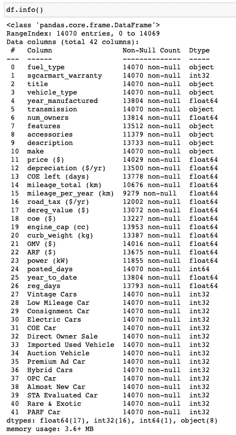
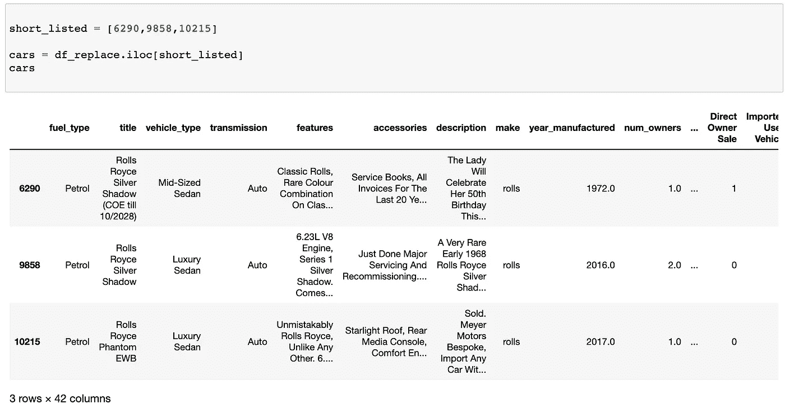
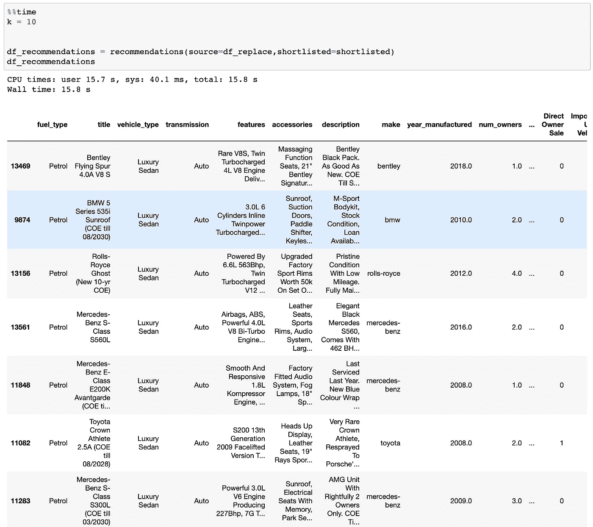

# 建立你的第一个推荐引擎

> 原文：<https://pub.towardsai.net/build-your-first-recommendation-engine-55a207a30380?source=collection_archive---------1----------------------->

## 有哪些不同类型的推荐算法？


卡米洛·希门尼斯在 [Unsplash](https://unsplash.com/s/photos/social-media?utm_source=unsplash&utm_medium=referral&utm_content=creditCopyText) 上拍摄的照片

> 你有没有想过为什么社交媒体总是给你提供你想看的东西？
> 
> 你是否总是沉迷于社交媒体中的下一个视频/提要，并最终浏览数小时？

推荐引擎背后的逻辑肯定非常复杂。本文将向您介绍推荐引擎背后的逻辑要点。我们还将利用新加坡二手车市场数据，共同打造我们的第一个推荐引擎。

# 不同类型的推荐算法:

1.  **关联推荐:**就像超市如何优化商品的位置。如果顾客购买牛奶，他/她将更有可能购买谷类食品，因此他们会将它们放在一起以促进两种商品的销售。如果我们能在数据的基础上找出关联，我们就能在高度关联的基础上提出建议。
2.  **按聚类组推荐:**我们可以使用聚类技术对所有项目进行分组，并推荐同一聚类中的项目。
3.  **基于分类模型的推荐:**根据我们拥有的用户活动或可用数据，我们可以预测用户是否会喜欢/购买该商品。它需要我们有关于用户活动和他们购买什么项目的历史事实数据。

> 下面的两个推荐算法将基于相似度。

4.**基于内容的过滤:**用户 A 喜欢过项目 1，系统会向用户 A 推荐与项目 1 相似的项目，这里的重点是我们如何基于有限的数据定义相似度。我们用来计算相似性的特征应该是什么？

5.**协同过滤:**向用户推荐在人口统计学、品味或需求方面相似的项目。如果用户 A 是 35 岁左右的金融专业人士，则该引擎可以向用户 A 推荐其他 35 岁左右的金融专业人士喜欢什么。它不需要特定于项目的特征，但需要具有人口统计信息。

> 请注意，推荐算法的选择没有对错之分，更多的**取决于可用数据的类型**。

# sgCarMart 案例研究

让我们基于基于内容的过滤，更具体地说，基于成对的项目相似性，一起构建推荐引擎。作为新加坡最大的网上二手车平台，sgCarMart data 将会是我们案例中的例子。


Samuele Errico Piccarini 在 [Unsplash](https://unsplash.com/s/photos/car?utm_source=unsplash&utm_medium=referral&utm_content=creditCopyText) 上的照片

**数据源:**数据源可以是从 sgcarmart.com 刮来的 web。你可以参考我之前的一篇关于如何使用 Scrapy 从 sgCarMart 中抓取数据的文章

[](/web-scraping-in-scrapy-c2d87796f677) [## Python 中使用 Scrapy 的 Web 抓取分步指南

### 如何检索新加坡的二手车信息

pub.towardsai.net](/web-scraping-in-scrapy-c2d87796f677) 

**目标:**作为汽车平台，如果我们有用户入围的汽车名单，平台应该如何向用户推荐汽车。

**方法:**我们将找到与用户入围的汽车相似的汽车，并根据相似性得分对它们进行排序。这里的相似度将基于不同汽车特征之间的**余弦距离来计算。最终的输出是通过相似度的排名来推荐汽车的名单。**

在这里，我们已经对数据集进行了一些数据清理，您可以看到下面的功能列表。



作者图片|推荐汽车功能列表

## 履行

**步骤 1:** 将整个数据集分为数值和类别，并相应地填充缺失数据。在这种情况下，我将通过列的中值来填充缺失的数值数据，而通过‘NA’来填充分类数据。这里可能有其他可用的方法，如**模式或简单地删除丢失的行**。

```
#fill categorical na value with string 'NA'
df_cat= df.select_dtypes(include='object')
df_cat=df_cat.fillna('NA')#fill numerical missing value with median value
numerics = ['int64', 'float64']
df_num = df.select_dtypes(include=numerics)
for num_var in df_num.columns:
    df_num[num_var].fillna(df_num[num_var].median(),inplace=True)#combine sub-dataframes with each dtypes
df_replace=pd.concat([df_cat,df_num],axis=1)
```

**第二步:**我们将标准化数字特征。这是因为如果我们不这样做，**那些具有较大数值的特征将支配最终结果**，因为它们往往具有较大的变化。这里我简单地使用最大最小标准化。

```
scaler = MinMaxScaler()
scaler.fit(df_num)
converted_numerics=scaler.transform(df_num)
```

对于分类列，我们不能直接计算它们的余弦距离。我们有几个选择。我们可以对列进行编码，将它们转换成数字特征，或者进行一些自然语言处理，以获得一些特征。

在这种情况下，我将使用选项 1，但是由于许多列都有自由文本，所以我们不能使用一次性编码。这里我们将使用 BERT 模型将文本特征转换成数字嵌入。BERT(来自变压器的双向编码器表示)模型是一种在大文本数据(如维基百科)上预训练的深度学习模型，嵌入结果可以更精确地表示文本信息。

> 关于 bert 模型在 Python 中的实现，可以参考[https://www . analyticsvidhya . com/blog/2019/09/demystifying-BERT-grounding-NLP-framework/](https://www.analyticsvidhya.com/blog/2019/09/demystifying-bert-groundbreaking-nlp-framework/)。

```
#Select categorical features for recommendation
df_bert=df_replace[['fuel_type','vehicle_type','transmission','features','accessories','description','title']]#Calculate embedding file for the whole categorical features
bc = BertClient()
embeddings=[]
for i in range(len(df_bert)):
    embeddings.append(bc.encode(list(df_bert.iloc[i])))
```

**第 4 步:**计算数字特征的余弦距离&分类嵌入，并将它们聚集在一起

接下来，我们将计算入围汽车与市场上所有其他汽车之间的余弦距离，分别用于数值和分类特征。之后，我们可以将两个分数加在一起。在我的例子中，我使用 50%-50%的数字和分类特征输出，您可以根据场景确定权重，甚至使用动态权重。

```
for i in range(len(source)):
  similarity[i]=0
  for car_index in short_listed:
    if car_index==i:
      pass
    else: #compute cosine distance for numerical features      
      num_dist=1-spatial.distance.cosine(converted_numerics.iloc[row_id], converted_numerics.iloc[i])

      # Calculate cosine distance for text features
      embedding1 = embedding[car_index]
      embedding2 = embedding[i]
      num=len(embedding1)
      total=0
      for j in range(num):
        dist = 1-spatial.distance.cosine(embedding1[j], embedding2[j])
        total=total+dist
        cat_dist=total/num #Aggregate numerical and text feature by 50-50
        final_dist=(num_dist+cat_dist)/2
        similarity[i]=similarity[i]+final_dist
```

从上面的代码中，我们可以根据不同的汽车特性，获得入围名单中的汽车列表与所有其他汽车之间的相似性得分。完事了吗？不，我们还需要扭转一下局面。

**第五步:**在最终排名分数中加入随机元素

我们不希望每次用户登录平台时看到相同的汽车列表，因为大多数汽车功能都是相当稳定的。因此，我们可以在最终排名得分中输入一定比例的随机元素。

```
#calculate ranking score based on 95% similarity and 5% random number
        similarity[i]=similarity[i]/id_count*0.95+np.random.rand()*0.05
```

在这里，我使用了 95%的基于相似性的排名和 5%的纯粹随机生成。可能需要一些尝试和错误来找到最佳的权重，并且它可能因不同的用户而异。例如，具有冒险性格的用户需要有更高权重的随机元素，因为他们更喜欢在每次登录时看到新车。

## 决赛成绩

现在我们已经完成了计算。让我们看看我们的推荐算法将如何执行。

假设我们有一个富有的客户，他只入围了 3 辆劳斯莱斯汽车。



作者图片|用户入围车单

让我们看看推荐输出是什么



作者照片|推荐结果

我们可以看到，推荐结果只包含高端汽车，但并不局限于“劳斯莱斯”，而是在汽车品牌方面有很大的变化。

# 结论和建议

这只是基于内容的过滤推荐的一个简单说明。像脸书或 Tiktok 这样的大平台会有一个更复杂的推荐引擎，有更多的数据点可用。例如，网站可以跟踪用户活动，并喜欢那些用户停留时间较长的项目。

也可以有一个混合模型来组合基于内容的过滤和协作过滤。这意味着它不仅基于项目的相似性推荐项目，还基于相似的用户配置文件推荐项目。然而，它要求平台具有关于项目和用户的大型数据集。它可能不适用于小规模或新平台。

最后，感谢我的朋友 [Timothy Ye](https://medium.com/u/b9b791def441?source=post_page-----55a207a30380--------------------------------) 对编码的帮助！

感谢阅读伙计们，并希望你有一个美好的一天！