# 使用 Pytorch 构建您自己的生成性对抗网络(GAN)

> 原文：<https://pub.towardsai.net/build-your-own-generative-adversarial-network-gan-using-pytorch-c367b8506987?source=collection_archive---------0----------------------->

## [深度学习](https://towardsai.net/p/category/machine-learning/deep-learning)

## 使用 PyTorch 使用 DCGANS 生成面的简单分步指南。

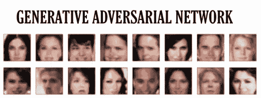

> 生成对抗网络是近十年来机器学习中最有趣的概念
> 
> ——Yann le Cun(脸书艾导演)

GANs 是由蒙特利尔大学的博士生 Ian Goodfellow 在 2014 年首次提出的。GANs 最常见的例子是生成图像。有一个[网站](https://thispersondoesnotexist.com/)包含不存在的人的面孔。这是甘斯所能做的一个例子。这就是我们在本课中要构建的内容。

生成对抗网络由两个相互竞争的神经网络**生成器**和**鉴别器**组成。我将在本课的后面部分详细解释每个步骤。如果你对这个话题完全不熟悉。我建议你先学习以下课程。

*   Luis Serrano 对 GANs 的介绍
*   伊恩·古德菲勒的研究论文

本课结束时，你将能够从头开始训练和构建自己的生成性对抗网络。所以事不宜迟，让我们开始吧。

我也在 Google Colab [这里](https://github.com/Ahmad-shaikh575/Face-Generation-using-GANS/blob/master/dlnd_face_generation_colab.ipynb)建立了这个生成网络。你可以很容易地打开 Google Colabatory，然后很容易地跟进。

# 前方的路

*   步骤 0:导入数据集
*   步骤 1:图像的加载和预处理
*   步骤 2:定义鉴别器算法
*   步骤 3:定义生成器算法
*   步骤 4:编写训练算法
*   第五步:训练模型
*   步骤 6:测试模型

你兴奋吗？？？让我们开始吧！

# 步骤 0:导入数据集

第一步是下载数据并将其加载到内存中。所以我们在这里做。我们将使用[名人面孔属性数据集(CelebA)](http://mmlab.ie.cuhk.edu.hk/projects/CelebA.html) 来训练你的敌对网络。

*   点击从[下载数据集。](https://s3.amazonaws.com/video.udacity-data.com/topher/2018/November/5be7eb6f_processed-celeba-small/processed-celeba-small.zip)
*   解压缩数据集。
*   克隆这个 Github [库](https://github.com/Ahmad-shaikh575/Face-Generation-using-GANS.git)。

完成后，您可以在 colab 环境中打开它，也可以使用自己的 pc 来训练模型。

# 导入必要的库

在笔记本的第一个块中导入所有要使用的库总是被认为是一个好的做法。

# 步骤 1:图像的加载和预处理

在这一步中，我们将对在上一节中下载的图像数据进行预处理。

将采取以下步骤

1.  调整图像大小
2.  转换成张量
3.  将其加载到 PyTorch 数据集中
4.  将其加载到 PyTorch 数据加载器中

图像的大小应该足够小，这将有助于更快地训练模型。张量基本上是 NumPy 数组，我们只是将图像转换成 PyTorch 中需要的 NumPy 数组。

然后，我们将这个转换加载到 PyTorch 数据集。之后，我们将训练我们的数据成小批量。这个数据加载器将在每次迭代中为我们的模型提供图像数据。

然后，我们将使用 NumPy 和 pyplot 检查加载的图像数据。该显示[助手功能](https://www.javatpoint.com/pytorch-testing-of-image-recognition-model)在笔记本中提供。调用这个函数后，你会得到这样的输出。

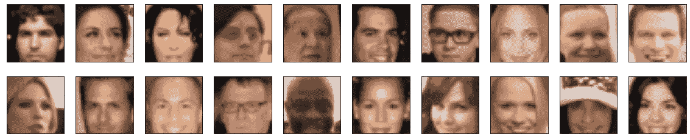

从数据集中加载

当数据被加载时。现在，我们可以对图像进行预处理。

# 图像预处理

我们将在训练中使用 [tanh](https://stackoverflow.com/questions/41489907/generative-adversarial-networks-tanh) 激活发电机。这台发电机的输出功率在 1 比 1 的范围内。我们也需要在这个范围内重新调整我们的图像。所以你会照做。

这个函数将缩放任何输入图像。我们将在稍后的培训中使用该功能。

现在我们完成了无聊的预处理步骤。

激动人心的部分来了。现在我们需要为我们的生成器和鉴别器神经网络编写代码。

# 步骤 2:定义鉴别器算法

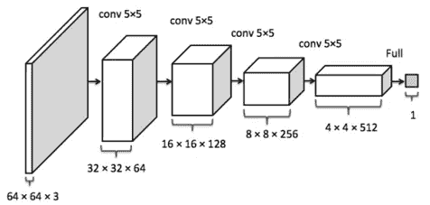

鉴别器模型视觉效果。[礼遇](https://www.google.com/search?q=generator+model+in+gans&tbm=isch&ved=2ahUKEwiNwfSS-dLxAhUHXxoKHSLfBsUQ2-cCegQIABAA&oq=generator+model+in+gans&gs_lcp=CgNpbWcQAzoECAAQGFD5K1jnMmDfOWgAcAB4AIABgwKIAbYMkgEDMi03mAEAoAEBqgELZ3dzLXdpei1pbWfAAQE&sclient=img&ei=najmYM3-HYe-aaK-m6gM&bih=819&biw=1920#imgrc=6zeXQnrqCq4NMM)

鉴别器是一种神经网络，可以区分真假图像。真实图像和生成器生成的图像都将被提供给它。

我们将首先定义一个助手函数，它在创建卷积网络层时非常方便。

这个助手函数接收创建任何卷积层所需的参数，并返回一个顺序容器。现在我们将使用这个辅助函数来创建我们自己的鉴别器网络。

# 步骤 3:定义生成器算法

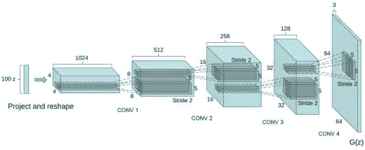

发电机模型视觉效果[。礼遇](https://www.google.com/search?q=generator+model+in+gans&tbm=isch&ved=2ahUKEwiNwfSS-dLxAhUHXxoKHSLfBsUQ2-cCegQIABAA&oq=generator+model+in+gans&gs_lcp=CgNpbWcQAzoECAAQGFD5K1jnMmDfOWgAcAB4AIABgwKIAbYMkgEDMi03mAEAoAEBqgELZ3dzLXdpei1pbWfAAQE&sclient=img&ei=najmYM3-HYe-aaK-m6gM&bih=819&biw=1920#imgrc=6zeXQnrqCq4NMM)

从图中可以看出，我们将一个高斯或噪声矢量输入网络，它以 s 为单位输出，图中的“z”表示噪声，右边的 G(z)表示生成的样本。

与鉴别器一样，我们将首先创建一个助手函数来构建我们的生成器网络，如下所示:

现在，是时候建立发电机网络了！！

为了帮助模型更快地收敛，我们将初始化线性层和卷积层的权重。根据[的研究论文。](https://arxiv.org/pdf/1511.06434.pdf)

> *所有权重均从以零为中心的正态分布初始化，标准偏差为 0.02。*

我们将为此定义一个函数，如下所示:

现在，我们将初始化超参数和两个网络，如下所示:

输出应该是这样的:

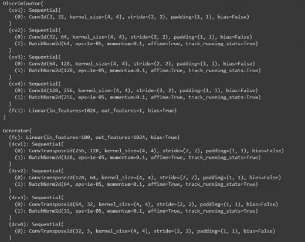

鉴频器损耗:

> *对于鉴别器，总损失是真实和虚假图像的损失之和，d_loss = d_real_loss + d_fake_loss。*
> 
> *记住，我们希望鉴别器为真实图像输出 1，为虚假图像输出 0，因此我们需要设置损耗来反映这一点。*
> 
> *来源:* [*DCGAN 研究论文*](https://arxiv.org/pdf/1511.06434.pdf)

我们将定义双损失函数。一个是真实损失，另一个是虚假损失，如下所示:

发电机损耗:

> *发电机损耗仅在标签翻转时看起来相似。生成器的目标是让鉴别器*认为*它生成的图像是*真实的*。*
> 
> *来源:* [*DCGAN 研究论文*](https://arxiv.org/pdf/1511.06434.pdf)

现在，是时候为我们的网络设置优化器了

我将使用 Adam optimizer 进行培训。因为它被认为对甘的身体有好处。看[这个](https://arxiv.org/abs/1906.04848)就可以选择自己的了。超参数的值是根据这篇研究论文设定的。他们用它做了实验，结果证明这些是最好的！

# 步骤 4:编写训练算法

我们必须为我们的两个神经网络编写训练算法。首先，我们需要初始化噪声向量。我们会在整个训练过程中保持固定。

**对于鉴别器:**

我们首先将真实图像通过鉴别器网络，然后计算它的真实损耗。然后，我们将生成假图像并通过鉴别器网络，以便计算假损失。

在计算真实和虚假损失后，我们将它们相加，并采取优化步骤进行训练。

**发电机:**

我们将对发电机网络的训练做同样的事情。刚才在通过鉴别器传递假图像后，我们将计算它的真实损失。然后优化我们的发电机网络。

# 第五步:训练模型

现在我们将开始关于 **100 个纪元:D** 的训练

经过训练后，损失图看起来会像这样。

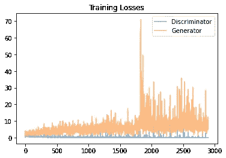

我们可以看到，鉴频器损耗非常平滑，甚至在 100 个历元之后也收敛到某个特定数值。但由于发电机损耗，损耗急剧上升。

我们可以从下面的结果中看到，在 60 个时期之后，生成的图像是失真的。因此，我们可以得出结论，60 岁的时期可以被认为是最佳的训练时期。

因为这两个损失在那一点上是最小的，并且发生器正在产生一些非常好的图像！

# 步骤 6:测试模型

**10 个时期后:**

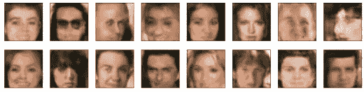

**20 个周期后:**

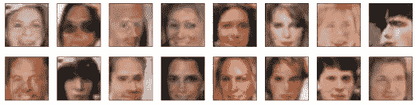

**30 个时期后:**

**40 个时期后:**

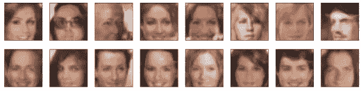

**50 个时期后:**

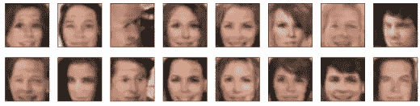

**60 个时期后:**

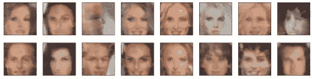

# 结论:

我们可以看到，训练一个生成性对抗网络并不意味着它会生成好的图像。

我们可以从结果中看到，在 40-60 个时期中，生成器生成的图像相对其他生成器更好。

你可以尝试改变优化器，学习率，和其他超参数，使其产生更好的图像！你能坚持到现在真是太好了！

这整个笔记本可以在[这里](https://github.com/Ahmad-shaikh575/Face-Generation-using-GANS)找到。

这是我的 Github 和 Linkedin 账户。请随意连接。

# 参考

[DCGAN 原始论文](https://arxiv.org/pdf/1511.06434.pdf)

亚历克·拉德福德的研究论文。

[研究论文作者](https://arxiv.org/abs/1906.04848) [雨果·贝拉德](https://arxiv.org/search/cs?searchtype=author&query=Berard%2C+H)

[Udacity 深度学习纳米学位](https://www.udacity.com/course/deep-learning-nanodegree--nd101)