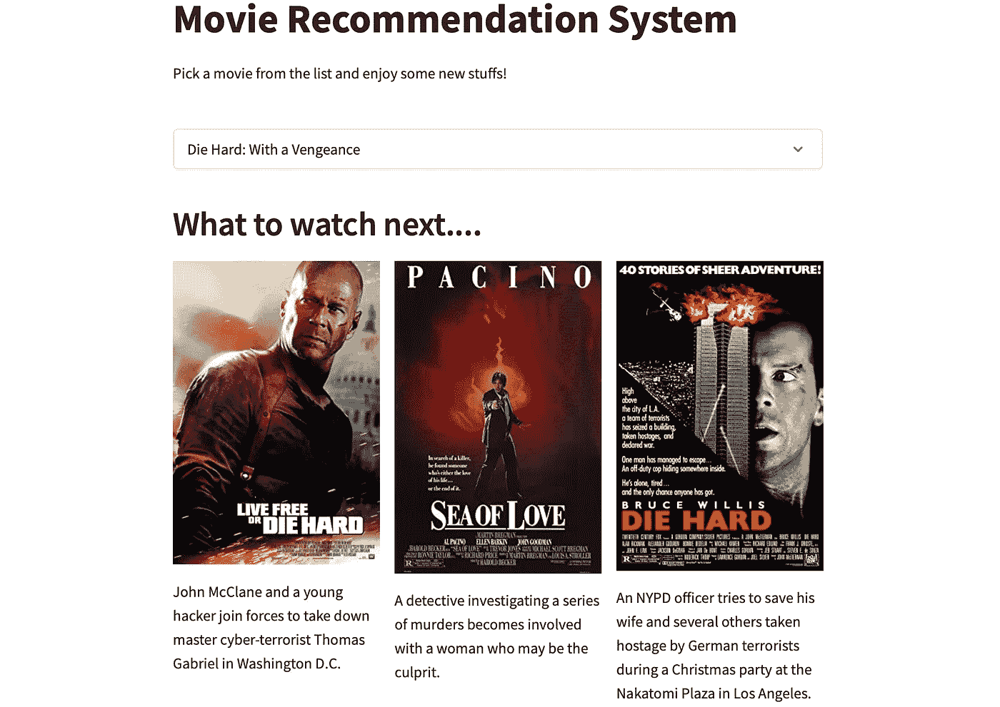
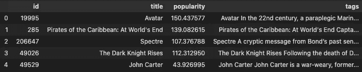
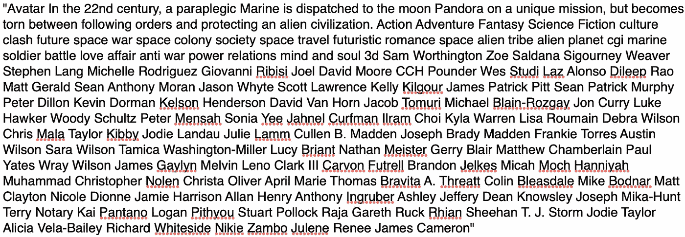
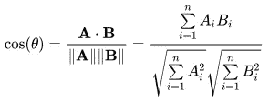

# 构建基于内容的推荐系统

> 原文：<https://pub.towardsai.net/building-a-content-based-recommender-system-2c854ba64f59?source=collection_archive---------0----------------------->

## 一个简单的电影推荐 web 应用程序

推荐者应用。图片由作者提供。

## 介绍

推荐系统 (RSs)无处不在**。亚马逊、网飞、Spotify、YouTube 以及我们日常使用的更多服务和应用在**后端**都有某种**推荐引擎**。**

**RSs 帮助用户**找到他们感兴趣的项目**，这可以**增加平台上的参与度**:如果一个平台推荐感兴趣的项目，用户会**在那个平台上花更多的时间**。**

**我刚刚在波尔扎诺自由大学完成了 RS 课程，我意识到这个领域有多广阔。基于特定的**应用领域**(音乐、旅游、电影……)，有许多技术和策略来**构建现代而强大的 RSs****

**在本文中，我将为**电影推荐构建一个**简单的 web 应用程序**。特别是，我将采用一种基于内容的方法。****

## **1.基于内容的 RSs**

**主要有两种类型的 RSs: **基于内容的 RSs** 和**协同过滤 RSs** 。然后，不同的**高级技术**可以应用于**以提高推荐的质量**(上下文感知、会话感知、重新排序等等)。**

**在**中，基于纯内容的 RSs** 条目被表示为一组**特征**，通常用自然语言表示为**元数据(标题、描述、关键字、标签……)。这个名字来源于我们用每个项目的**内容**作为**描述**。****

**这组元数据然后被**转换成一个矢量**(矢量化)，并且所有的矢量被**相互比较，形成一个“**相似性矩阵**”。通过查找该矩阵，可以获得给定项目**的**建议。****

**当建立一个 RS 的时候，有很多事情**到**到**到**需要考虑，**伦理方面**就是其中之一。一个 RS 应该通过向**所有用户**和覆盖所有**物品空间**的**推荐**好物品**来**公平**。例如，我们不希望只有**少数用户收到好的推荐**，我们也希望**所有可用的项目**有**相同的概率被检索**。****

**另一个重点是关于**评估**。由于数据的**稀疏性**(在协作过滤方法的情况下)和**缺乏基础事实**(标签)，评估一个 RS 不是无足轻重的，需要知识和实验。**

## **2.数据集和预处理**

**在本节中，我报告了我对电影上的**提取**和**组合** **信息**执行的**预处理** **操作**的**概述。****

**对于这个项目，我使用的是 **TMDB 5000 电影数据集**，它包含了来自“电影数据集”(TMDB) [1]的大约 **5000 个电影元数据**。**

**数据集来自**两个 CSV 文件** : *credit.csv、*包含电影的**演职人员信息，以及 *movies.csv、*包含所有**其他信息**，排列在 **20 列**中。并非所有的列都将被使用。****

**需要注意的是，有些列包含 **JSON 属性**。**

**第一个操作是**合并两个数据集**，然后我**解析 JSON 值**以获得普通属性。这个操作之后，我**选择了属性**作为**“内容”**来描述物品(电影)。我特别选了:**片名**、**剧情简介**、**流派**、**关键词**、**演职人员**、**剧组人员**。**

**最后，我创建了一个包含所有**电影和相关元数据**的**新数据集**，连接在一个名为“tags”的**单列中。该列包含代表每部电影**的**属性。****

**我还添加了“ **popularity** ”列:该信息可用于**细化推荐**，但我不会在这个简单的项目中使用它。**

****

**元数据数据集。图片由作者提供。**

**例如，下面是**头像**电影的**“标签”**列的内容:**

****

**“阿凡达”电影的元数据示例。图片由作者提供。**

## **3.计算相似性矩阵**

**相似性矩阵是基于内容的 RSs 的基本组成部分。该矩阵包含物品之间的**成对相似性，**并且给出一个物品允许系统**检索最相似的物品**。**

**在这个项目中，我使用了三种不同的**矢量化方法**将**元数据转换成矢量**，然后我使用**余弦相似度**计算**相似度矩阵**。**

**首先:**什么是余弦相似度？****

**余弦相似性是一个相似性度量**用来表达**两个数字向量**的相似程度。该度量的范围从-1，表示**完全不同，**到 1，表示**完全相似**。给定向量 A 和 B，下面的公式将计算余弦相似度。[2]****

****

**余弦相似度。图片由作者提供。**

**正如我所说的，我使用了**三种矢量化方法**，然后是相似性矩阵的**计算:****

*   ****TF-IDF 矢量器** :
    术语频率—逆文档频率是一种技术，用于**对文档集合中文档中每个单词的重要性进行评分**。其思想是，如果单词 *w* 在文档 *a* 中频繁出现，但在集合 *D* 的所有其他文档中不频繁出现，那么单词 *w* 在文档*a*中是重要的，该工具产生一个向量，其值表示每个文档 *中单词的**重要性。*** [3]**

**TF-IDF 矢量化和相似性矩阵。作者代码。**

*   ****计数矢量器** :
    该工具产生一个矢量，其值基于所有文档中每个单词的**频率**(计数)**。主要思路是映射出**最多**和**最少**的常用词【4】。****

**计数矢量化和相似性矩阵。作者代码。**

*   ****哈希矢量器** :
    该矢量器对每个文档中的词频应用**哈希函数。它是计数矢量器[5]的变体。****

**哈希矢量化和相似矩阵。作者代码。**

****最终矩阵**通过**乘以**来自先前步骤的矩阵获得:**

**组合相似性矩阵。作者代码。**

**最后，我**连载了**的《黑客帝国:**

**矩阵序列化。作者代码。**

**现在我们可以在我们的**推荐函数**中使用这个矩阵。**

## **4.推荐功能**

**推荐系统的**核心部分**是**推荐功能**。该功能**根据与所选项目的相似性对现有项目进行排序:**当用户选择一部电影时，该功能将推荐与 *a.* 相似的 *n* 部电影**

**该函数将电影的**标题和**相似矩阵**作为输入，并且**返回**前 n 部相似电影**的**海报**和**剧情**。海报和情节由" **get_poster_plot()** "函数检索，该函数使用 **OMDb** API [6]。**

**代码如下:**

**推荐功能。作者代码。**

## **5.最终网络应用+演示**

**作为最后一步，我决定**用**Streamlit**【7】构建一个简单的 web 应用程序**，以**展示推荐系统**。你可以在我的拥抱脸上找到这个应用程序:**

** [## 只是电影，接下来是什么？

### 发现由社区制作的令人惊叹的 ML 应用程序

huggingface.co](https://huggingface.co/spaces/EdBianchi/JustMovie) 

app 由**三个主要部分**组成。在第一部中，一个**选择栏**允许用户**在可用电影**之间搜索/滚动并选择一部。

第二部分展示 **top-9 推荐电影**，有海报和剧情。最后一部分显示了**最近查看的项目**。

如果您**不熟悉 Streamlit** 并希望**了解更多**，请参考本文:

 [## 如何用 8 个简单的步骤构建一个有效的 Web 应用程序

### 不，你不需要成为全栈开发者

python .平原英语. io](https://python.plainenglish.io/how-to-build-an-effective-web-app-in-8-simple-steps-391310ebfbea) 

下面是**网络应用**的**完整代码**:

## 结论

在本文中，我为电影构建了一个简单、纯粹的**基于内容的 RS。试一试，让我知道你的想法。**

除了简单之外，我认为**的建议还不错**。由于我们只利用了“**内容**”，即**项目描述**，因此所提出的推荐是**非个性化的**(对所有用户都一样)。

更多**高级 RSs** 会考虑多个方面，如用户**历史**和**上下文**，通常还会考虑**用户到用户的相似性**(需要用户的数据)。这些因素导致**个性化推荐**，也就是说**不同的用户**即使选择了**同一个项目**也会得到**不同的建议**。

一般来说，现代 RSs 结合了不同的技术来进一步细化推荐。

*感谢阅读！*

## 参考

[1]电影数据库、 [TMDB 5000 电影数据集](https://www.kaggle.com/datasets/tmdb/tmdb-movie-metadata) (2017)、ka ggle
【2】[余弦相似度](https://en.wikipedia.org/wiki/Cosine_similarity) (2022)、维基百科
【3】[tfidf 矢量器](https://scikit-learn.org/stable/modules/generated/sklearn.feature_extraction.text.TfidfVectorizer.html) (2022)、Scikit-learn
【4】[计数矢量器](https://scikit-learn.org/stable/modules/generated/sklearn.feature_extraction.text.CountVectorizer.html) (2022)、Scikit-learn
【5】[哈希矢量器](https://scikit-learn.org/stable/modules/generated/sklearn.feature_extraction.text.HashingVectorizer.html#sklearn.feature_extraction.text.HashingVectorizer)**