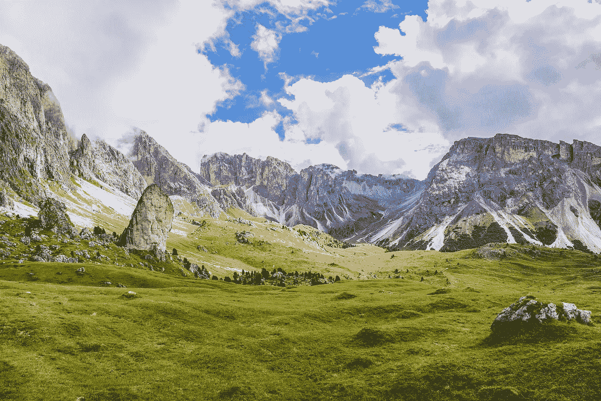
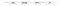
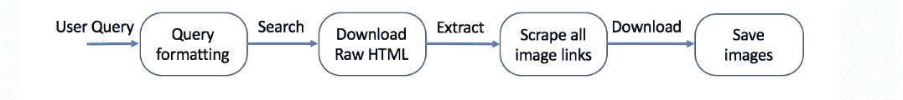

# 为深度学习项目构建自定义图像数据集

> 原文：<https://pub.towardsai.net/building-a-custom-image-dataset-for-deep-learning-projects-7f759d069877?source=collection_archive---------0----------------------->

图片由来自 [Pixabay](https://pixabay.com/?utm_source=link-attribution&utm_medium=referral&utm_campaign=image&utm_content=5544365) 的[马里奥·哈根](https://pixabay.com/users/mariohagen-17468991/?utm_source=link-attribution&utm_medium=referral&utm_campaign=image&utm_content=5544365)拍摄

## [深度学习](https://towardsai.net/p/category/machine-learning/deep-learning)、[编程](https://towardsai.net/p/category/programming)

## 展示了使用 google images 和 Bing image downloader 构建自定义图像数据集的简单方法

在过去的三个月里，我主要在 NLP 工作。我花了很长时间处理图像数据。因此，我决定建立一个独特的图像分类器模型，作为我个人项目和学习的一部分。

在现在的疫情，我最想念的一件事就是旅行。这几天经常在 Instagram 上看到很多旅行的 vlogs 和旅行的图片，想知道我们什么时候才能回到正常的世界。

这让我想到创建一个图像分类器模型，它有五个类别，如山脉、海滩、沙漠、湖泊和博物馆。然而，我没有图像数据集来建立模型，也无法从谷歌获得任何数据集。一种方法是手动刮图像，但需要时间。我偶然发现谷歌图片下载和必应图片下载，并发现它非常容易建立您的自定义图像数据集。

我打算使用迁移学习，所以我只需要少量的图像。因此，我决定用谷歌图片下载收集每班 100 张图片。这篇博客解释了如何使用 google images download 和 bing image downloader 建立一个自定义的图像数据集。

为了简单起见，我将只为两个类构建:*【Mountain】*和*【Beach】*

# 谷歌图片下载

## 谷歌图片下载的安装

最初，我尝试用 pip 安装 google_image_download。然而，它不起作用。我引用了[栈溢出](https://stackoverflow.com/questions/60370799/google-image-download-with-python-cannot-download-images)并使用 JoeClinton 的 GitHub [链接](https://github.com/Joeclinton1/google-images-download)安装了这个库。

你可以点击查看谷歌官方图片下载页面[。](https://google-images-download.readthedocs.io/en/latest/)

# 密码

下一步是从 google image 导入 google image 下载，并启动名为 response 的类。

# 密码

现在我们需要传递我们的论点。我需要山，海滩图片，所以我通过“山”，“海滩”作为关键词。

**格式** —这是一个文件选项。我在找一个 jpg 文件。这支持 gif，png，bmp，svg，webp，ico，raw 根据文档。

**极限:**指图像的数量。默认大小为 100。*如果你想下载超过 100 张图片，那么我们需要安装 Selenium 和 Chromedriver 扩展。*我没有试过，因为我只需要 100 张图片。

有时，由于下载图像时的偶然错误，我们得到的图像少于 100。

**打印 URL:**打印提取的图像的 URL

还有其他可用的参数，如颜色、纵横比等。请检查他们的[文档并尝试一下。](https://google-images-download.readthedocs.io/en/latest/arguments.html)

下面的流程图解释了这个过程。它接受查询(参数)，搜索，下载原始的 HTML 链接，抓取所有的图片链接，下载并保存图片。

[https://github . com/Joe Clinton 1/Google-images-download/blob/patch-1/images/flow-chart . png](https://github.com/Joeclinton1/google-images-download/blob/patch-1/images/flow-chart.png)

# 密码

所有的图片都被下载，并保存在名为**【下载】**的文件夹中，子文件夹为 ***【山】*** 和 ***【沙滩】。*** 山的图片存储在山文件夹中，沙滩的图片存储在沙滩文件夹中。

# 输出

我们可以看到所有图像都存储在各自的文件夹中。这些图像大小不同。在将图像输入模型之前，它需要调整图像的大小。如果您想要为图像分类器构建自定义图像数据集，这个库非常有用。

# 2)必应图片下载器

Bing 图像下载器是一个 python 库，用于从 bing.com 下载大量图像。请查看[这里的](https://pypi.org/project/bing-image-downloader/)了解更多信息。

## Bing 图像下载程序的安装

在这里，我将只提取山脉图像。因此，创建一个名为“mountain”的本地目录来存储图像。

现在，导入 bing 图像下载程序并传递参数。我们需要山的图像，因此我将 mountain 作为要搜索的字符串传递。

**限制** =下载的图像数量。必应搜索可以下载批量图片。由于我的内存，我限制为 200。你可以试着用一个更大的数字来检查。

**输出目录** =输出目录的名称。它是可选的。我创建了一个名为 mountain 的目录来存储所有的图片。如果你不指定目录，那么所有的图像都存储在你的路径目录中。

**成人 _ 过滤 _ 关闭** =帮助禁用成人过滤。默认情况下为 true。

**force_replace** :删除文件夹(如果有)并重新开始下载

检查 mountain 目录中的图像文件

目录中存储了 200 个图像文件。让我们使用 IPython 读取一些图像文件

另一个

我们可以从 bing 图像下载器下载大量图像。然而，有时获得准确的图像是具有挑战性的。

# 注意

请确保在将这些图像用于任何商业目的之前，因为它违反了其版权条款。Google 或 bing downloader 不拥有图片的版权，它由图片的原始创建者拥有。

感谢阅读。请继续学习，并关注更多内容！

感谢阿尼鲁德·库尔

# 参考

1.  [https://Google-images-download . readthedocs . io/en/latest/arguments . html](https://google-images-download.readthedocs.io/en/latest/arguments.html)
2.  [https://github.com/Joeclinton1/google-images-download](https://github.com/Joeclinton1/google-images-download)
3.  [https://stack overflow . com/questions/60370799/Google-image-download-with-python-cannot-download-images](https://stackoverflow.com/questions/60370799/google-image-download-with-python-cannot-download-images)
4.  [https://pypi.org/project/bing-image-downloader/](https://pypi.org/project/bing-image-downloader/)