# 用 AWS 构建数据湖

> 原文：<https://pub.towardsai.net/building-a-data-lake-with-aws-c22556356700?source=collection_archive---------1----------------------->

## [云计算](https://towardsai.net/p/category/cloud-computing)

## 了解数据湖的优势以及如何通过 AWS Lake Formation 快速设置数据湖

图片由来自 Pixabay 的[沃克斯克](https://pixabay.com/users/walkerssk-1409366/?utm_source=link-attribution&utm_medium=referral&utm_campaign=image&utm_content=1899264)拍摄

# 介绍

每天，大大小小的公司都在收集越来越多的数据。企业通常收集有关公司运营、客户、竞争、产品等的数据。他们需要高效地存储、处理和分析所有这些信息。

建立仓库和数据库的传统解决方案根本无法满足公司处理大量数据的需求。这些解决方案也没有促进近年来非常流行的分析或机器学习技术的使用。

传统仓库的问题最初导致了云存储和云计算技术的发展。这进一步导致了数据湖概念的发展。

在本教程中，您将学习什么是数据湖，以及如何用 AWS 建立一个数据湖。

# 什么是数据湖？

詹姆斯·迪克森在 2010 年首次使用了术语[数据湖](https://lakefs.io/data-lakes/)，他用这些词来描述它。

如果你把数据集市想象成一个桶装水的商店，经过净化、包装和构造，以方便饮用，那么数据湖就是一个更自然状态的大水体。“数据湖的内容从一个源头流入湖中，湖的各种用户可以来检查、潜水或采集样本。”

就存储和分析数据而言，这意味着什么？

数据湖本质上是存储各种数据的仓库:结构化的(行和列)、半结构化的(XML、JSON 等)和非结构化的(文本文档等)。它们还包括所有类型的文件:照片、视频和音频文件。这意味着可以在一个集中的位置访问、查看和分析所有公司数据。

[*图像来源*](https://www.tenfold.com/what-is/leveraging-data-lakes)

# 用 AWS 构建数据湖的好处

现在有许多工具可以用来为公司建立数据湖。最明显的选择之一是 AWS 服务。AWS 是市场上的领导者，以合理的价格提供云对象存储和云计算解决方案。

用 AWS 构建数据湖有很多好处。首先，AWS 对象存储 S3 允许快速、经济高效且简单的数据检索。AWS 还提供可扩展且易于实施的分析和机器学习云计算解决方案。

上述特征使 AWS 成为建立数据湖的理想平台。此外，他们还推出了一个名为 AWS Lake Formation 的新工具，可以简化整个过程，使事情更加顺利。

接下来，您将学习如何使用该服务创建您的第一个数据湖。

# AWS 湖泊形成入门

为了开始使用 AWS Lake Formation，您需要已经设置了一个 AWS 帐户，并且已经用将要使用的数据创建了一个 s3 存储桶。

出于本教程的目的，您可以使用这个[网飞数据集](https://www.kaggle.com/shivamb/netflix-shows)作为您的数据。创建一个名为“你的名字-数据湖”的 S3 存储桶，并将网飞 _ 头衔. csv 上传到此存储桶。

一旦您将数据安全地存储在 S3 桶中，您就可以开始设置 AWS Lake Formation 了。前往他们的[网站](https://aws.amazon.com/lake-formation/?whats-new-cards.sort-by=item.additionalFields.postDateTime&whats-new-cards.sort-order=desc)，点击“AWS 湖泊形成入门”。

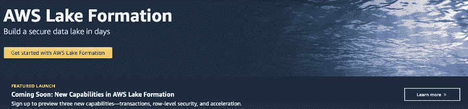

作为根用户登录，你会看到一个“欢迎来到湖泊形成”的信息。

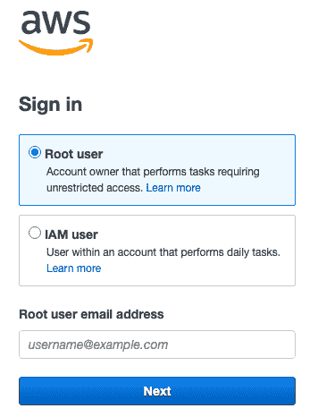

询问时将自己添加为管理员。一旦你这样做，你应该看到自动气象站湖形成控制台。它将类似于下面的截图。

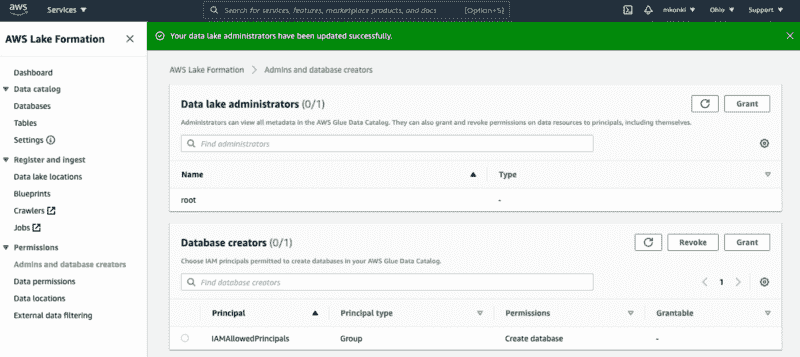

AWS 湖形成控制台将允许您创建您的第一个数据湖。我将带你完成本文中的步骤，但是 AWS 会给你一个非常详细的总结，告诉你在 Lake Formation 控制台的 Dashboard 选项卡上必须做什么。

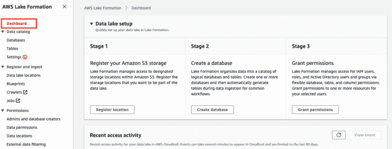

如您所见，第一步是注册 S3 存储桶。单击步骤 1 中的“注册位置”,并填写您已上传数据集的存储桶的名称。您可以将其余设置保留为默认设置。因此，您应该将注册位置列在您的数据湖位置中。

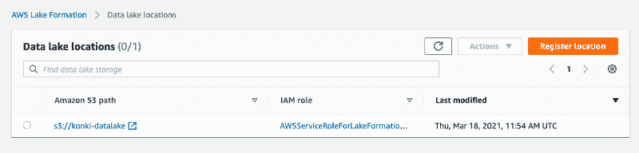

现在，您可以导航回仪表板并完成该过程的第二步，即创建数据库。

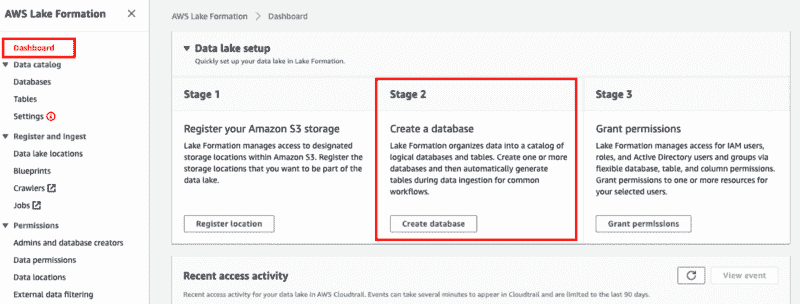

你可以复制我用过的设置。我将我的数据库命名为“网飞数据库”,并将其定向到名为 konki-datalake 的存储桶(我在那里有我的 netfllix_titles.csv 文件)。

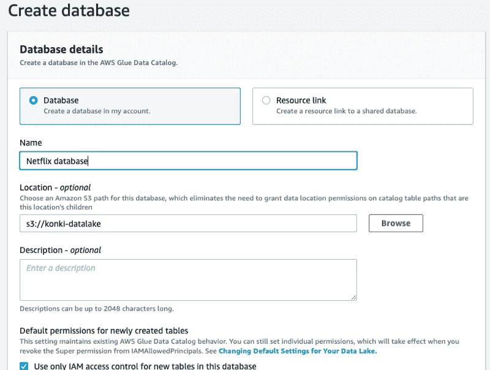

如果您已经遵循了这些步骤，那么您应该已经创建了您的数据库，并且应该可以在控制台中看到它。

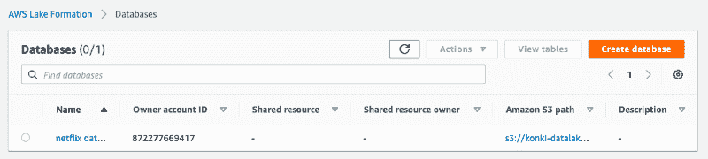

下一步是创建一个爬虫。前往 AWS Lake Formation 控制台中的 crawler 选项卡。

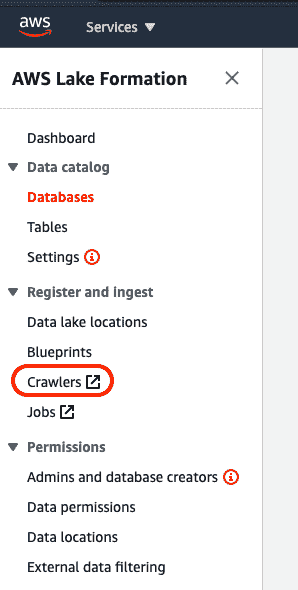

这将打开一个带有 AWS Glue 控制台的新窗口。点击“创建爬虫”按钮，并通过给它一个名字开始这个过程:例如网飞-标题-爬虫。这个过程包括几个子步骤。您可以将大多数设置保留为默认设置，并模仿下面截图中的结构。

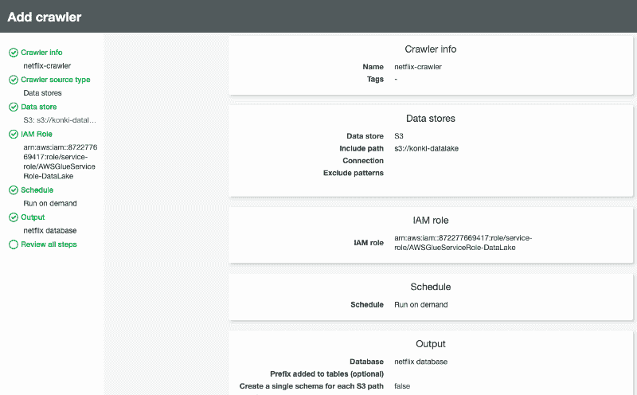

您需要在爬虫信息中填入您之前设置的数据信息(S3 存储桶路径，数据库名称等。).唯一需要注意的是，在第 4 个检查点，您需要为此服务创建一个 IAM 角色。我将我的命名为 AWSGlueServiceRole-DataLake，如下图所示。

完成设置后，您应该会看到爬行器出现在 AWS Glue 控制台中。您现在可以运行爬虫了。一旦对数据进行了爬网，就会在 AWS 粘合数据目录中创建数据和元数据表的模式。

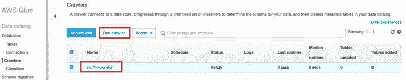

等到 crawler 停止运行，然后转到 AWS Lake Formation 控制台中的 Tables 选项卡。

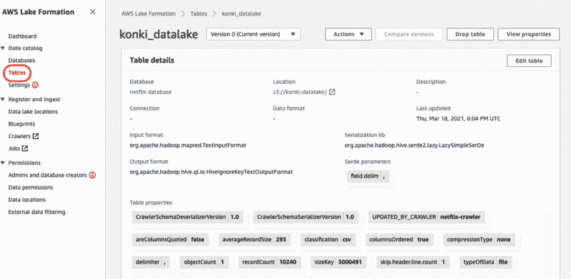

您可以看到，该表现在已填充了来自网飞 _titles.csv 文件的数据。现在，您可以让其他 Amazon 服务(如 Athena 或 Redshift)使用您的数据库。

您刚刚创建了您的第一个小型数据湖！

# 摘要

在本文中，您了解了什么是数据湖，并了解了当前企业为什么需要它们。

还指导您如何使用 AWS Lake Formation 建立第一个数据湖。

尽管这是一个非常基础的教程，但我希望它能说明使用新的 Amazon 工具创建数据湖是多么容易，并鼓励您开始创建第一个数据湖。如果你是一名有抱负的数据科学家，理解和使用数据湖是成功职业生涯的第一步。确保您还学习了更多关于使用数据湖进行数据存储和处理的知识。

*PS:我正在 Medium 和***上撰写深入浅出地解释基本数据科学概念的文章。你可以订阅我的* [***邮件列表***](https://medium.com/subscribe/@konkiewicz.m) *每次我写新文章都会收到通知。如果你还不是中等会员，你可以在这里加入**[***。***](https://medium.com/@konkiewicz.m/membership)**

**下面还有一些你可能喜欢的帖子**

** [## 关于 jupyter 笔记本你不知道的 9 件事

### 用这些建议提高你的工作效率

towardsdatascience.com](https://towardsdatascience.com/9-things-you-did-not-know-about-jupyter-notebook-d0d995a8efb3)  [## 9 大 Jupyter 笔记本扩展

### 改进笔记本电脑功能，提高您的工作效率

towardsdatascience.com](https://towardsdatascience.com/top-9-jupyter-notebook-extensions-7a5d30269bc8)  [## python f 字符串简介

### 以及为什么您应该开始使用它们…

towardsdatascience.com](https://towardsdatascience.com/introduction-to-f-strings-3822ed8683cc)  [## Jupyter 笔记本中的 8 大魔法命令

### 通过学习最有用的命令来提高您的生产力

towardsdatascience.com](https://towardsdatascience.com/top-8-magic-commands-in-jupyter-notebook-c1582e813560)**