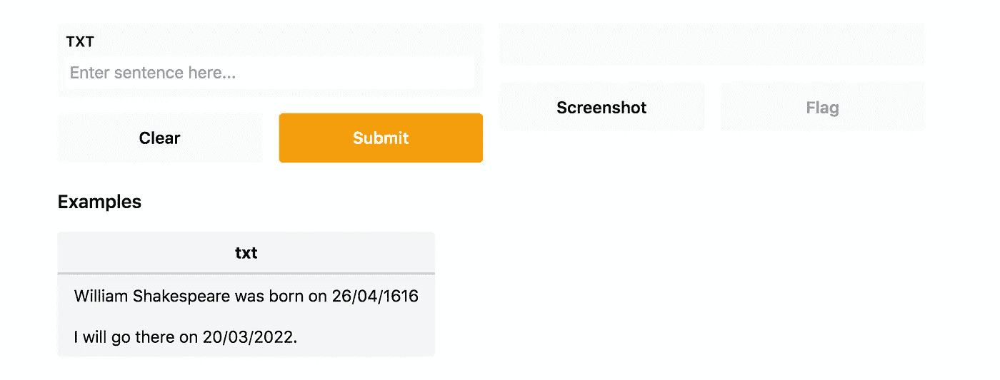
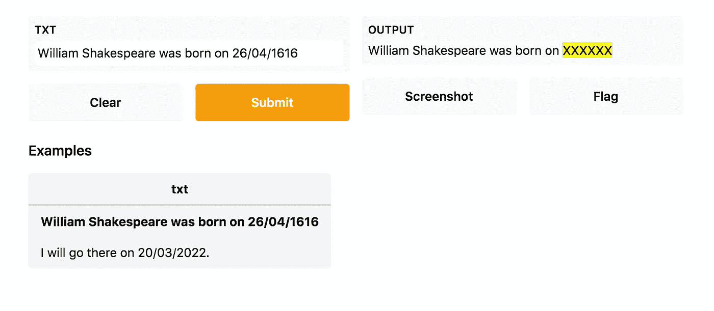
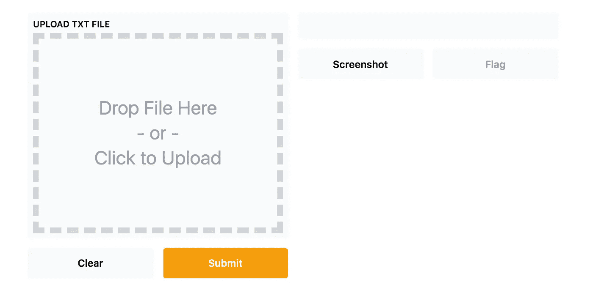

# 通过 Gradio 在 Jupyter 中构建快速交互式仪表板

> 原文：<https://pub.towardsai.net/building-a-fast-interactive-dashboard-in-jupyter-through-gradio-95a1981772aa?source=collection_archive---------0----------------------->

## [机器学习](https://towardsai.net/p/category/machine-learning)

## 关于 Gradio 的现成教程，这是一个非常强大的 Python 包，用于机器学习演示。


照片由 [Arie Wubben](https://unsplash.com/@condorito1953?utm_source=medium&utm_medium=referral) 在 [Unsplash](https://unsplash.com?utm_source=medium&utm_medium=referral) 上拍摄

前几天，我发现了一个非常有趣的 Python 包，名为 [Gradio](https://www.gradio.app/) 。根据其作者的说法， **Gradio 允许为机器学习**构建演示。谷歌、脸书和亚马逊的机器学习团队开发了这个包。

因此，我决定研究这个包并构建一个小演示。在阅读文档时，我很高兴地发现了一个有趣的特性，其他类似的包，如 [streamlit](https://streamlit.io/) 没有提供。

> Gradio 可以很容易地与 Jupyter 实验室集成。

这个特性使得这个包**非常有前途**。让我们发现格拉迪欧！

本教程组织如下:

*   Gradio 包的简短概述
*   一个基本的例子，它匿名化通过文本框提供的文本中包含的所有日期
*   一个更高级的例子，匿名化通过输入文件提供的文本中包含的所有日期。

# Gradio 概述

Gradio 可以通过 Python 包索引进行安装，如下所示:

```
pip install gradio
```

安装后，Gradio 可以作为标准 Python 包导入:

```
import gradio as gr
```

Gradio 提供了一个基础类，名为`Interface()`，包含了构建接口所需的所有信息。下图显示了一个界面示例:



作者图片

在左边，界面显示了输入(一个文本框和前面例子中的一些例子)，以及一个 submit 按钮，它将运行用户定义的操作。在右边，界面将显示执行定义的操作后的输出。

这个`Interface()`类接收三个参数作为输入:

*   **fn** —一个可调用的函数，执行用户定义的操作。该函数接收接口的输入，并返回接口显示的输出。
*   **输入** —单个 Gradio 输入组件，或一系列 Gradio 输入组件。输入组件的例子有文本框、图像、视频、滑块、复选框等等。
*   **输出** —单个 Gradio 输出组件或一系列 Gradio 输出组件。与输入组件类似，输出组件可能包括文本框、图像、视频等等。

有关输入和输出组件的更多信息，您可以阅读 [Gradio 文档](https://www.gradio.app/docs)。

一旦构建了接口，就可以通过调用`launch()`函数来运行它。

# 基本接口

第一个示例构建了一个接口，该接口从 textbox 中读取文本，然后匿名化文本中包含的日期，最后显示匿名化的文本。

首先，我定义了一个名为`anonymise_text()`的函数，它接受一个文本作为输入，然后用 HTML 文本替换文本中包含的所有日期，这突出显示了匿名化的日期。

```
import redef anonymise_date(txt):
    date_RE="(\d{1,2}[\.-/]\d{1,2}[\.-/]\d{4})|(\d{4})"
    matches=re.findall(date_RE,txt)
    if matches:
        for match in matches:
            index = 0
            if match[index] == '':
                index = 1
            txt = txt.replace(match[index], "<span style='background-color:yellow'>XXXXXX</span>")
    return txt
```

然后，我导入 Gradio 包并构建`Interface()`对象，它接收以下参数作为输入:

*   先前定义的`anomyise_date`功能
*   一个输入框`gr.inputs.Textbox()`，它将捕获输入的文本。文本框接收一个占位符作为输入，其中包含默认文本
*   一个输出 HTML 对象，包含由`anonymise_date()`函数返回的结果
*   一些默认文本的列表，通过关键字`examples`识别，用户可以使用。

```
import gradio as griface = gr.Interface(
    anonymise_date,
    gr.inputs.Textbox(placeholder="Enter sentence here..."),
    gr.outputs.HTML(),
    examples=[
        ["William Shakespeare was born on 26/04/1616"],
        ["I will go there on 20/03/2022."],
    ]
)
```

最后，我启动界面:

```
iface.launch()
```



作者图片

# 高级界面

现在我可以改进前面的例子，用一个通过界面动态上传的文件替换 textbox。在这个例子中，我只管理纯文本文件(例如 txt)。Gradio 上传一个文件作为[临时文件](https://docs.python.org/3/library/tempfile.html)。

我定义了一个名为`process_text()`的函数，它接收一个临时文件作为输入，检查其扩展名，读取文件内容，最后返回原始文本和匿名文本。请注意，txt 临时文件的扩展名不是。txt 但是.平平淡淡。

```
def process_text(tmp_file):
    if not tmp_file.name.endswith('.plain'):
        return 'Not Supported File. Please provide a txt file', ''
    with open(tmp_file.name, 'r') as f:
        txt = f.read()return txt, anonymise_date(txt)
```

现在我可以构建接口了。关于前面的例子，我传递了一个`gr.inputs.File()`对象作为输入，并构建了一个输出文件列表。

```
iface = gr.Interface(
    process_text,
    gr.inputs.File(label='Upload TXT file'),
    [gr.outputs.HTML(label='Original Text'),gr.outputs.HTML(label='Anonymised Text')],
)iface.launch()
```



作者图片

# 摘要

在本教程中，我展示了 Gradio Python 包，这是一个非常简单的包，它允许非常快速地构建交互式演示。

Gradio 提供了一个基础类，名为`Interface()`，可以配置来构建整个工作流:输入—流程—输出。

本教程的完整代码可以从我的 [Github 库](https://github.com/alod83/data-science/tree/master/DataVisualization/Gradio)下载。

# 相关文章

[](https://towardsdatascience.com/data-visualisation-principles-part-1-a-practical-example-in-altair-b6e16f665fc6) [## 数据可视化原理第 1 部分 Altair 中的一个实际例子

### 关于如何在 Python Altair 中构建、定制和添加注释到简单条形图的实用教程

towardsdatascience.com](https://towardsdatascience.com/data-visualisation-principles-part-1-a-practical-example-in-altair-b6e16f665fc6) [](https://towardsdatascience.com/how-to-run-animations-in-altair-and-streamlit-2a0624789ad) [## 如何在 Altair 和 Streamlit 中运行动画

### 一个现成的教程，描述了如何使用 Altair 和 Streamlit 构建动画折线图。

towardsdatascience.com](https://towardsdatascience.com/how-to-run-animations-in-altair-and-streamlit-2a0624789ad) [](https://towardsdatascience.com/how-to-build-a-narrative-from-data-85e327940c13) [## 如何从数据中构建叙事

### 根据设置-冲突-解决范式分析数据的一些技巧

towardsdatascience.com](https://towardsdatascience.com/how-to-build-a-narrative-from-data-85e327940c13)