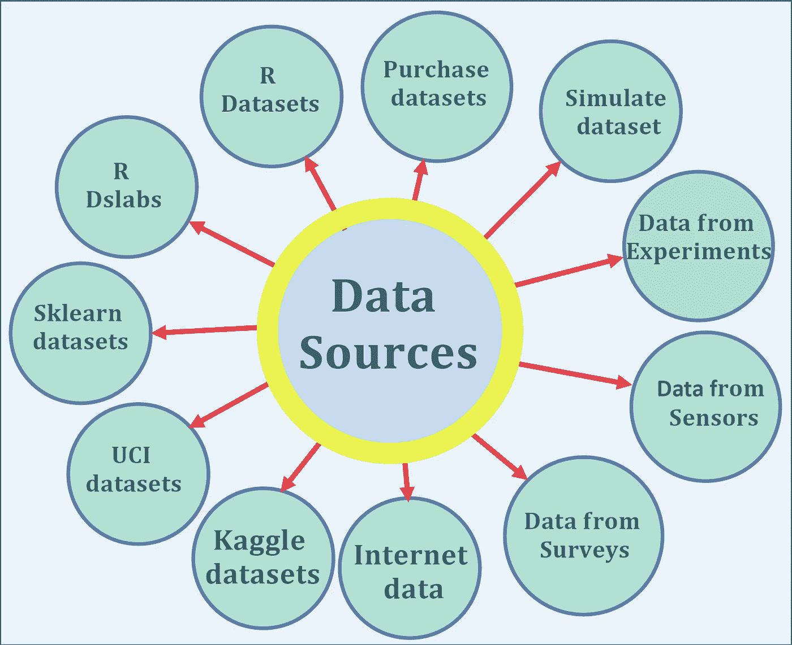

# 在数据不可用时构建机器学习模型

> 原文：<https://pub.towardsai.net/building-a-machine-learning-model-when-data-isnt-available-fce8d20f0fd0?source=collection_archive---------1----------------------->

## [数据科学](https://towardsai.net/p/category/data-science)，[机器学习](https://towardsai.net/p/category/machine-learning)



在执行任何数据科学任务(如探索性数据分析或构建模型)之前，您必须问自己以下重要问题:

***你想利用你的数据发现或发现什么？***

***你有合适的数据来分析吗？***

数据是任何数据科学和机器学习任务的关键。数据有不同的形式，如数字数据、分类数据、文本数据、图像数据、声音数据和视频数据。模型的预测能力取决于构建模型时所用数据的质量。

## 高质量数据的优势

a)高质量的数据不太可能产生错误。

b)高质量的数据可以导致较低的泛化误差，即模型很容易捕捉真实生活的影响，并可以应用于预测目的的看不见的数据。

c)由于较小的不确定性，高质量的数据将产生可靠的结果，即数据捕捉真实的效果并且具有较小的随机噪声。

d)包含大量观察值的高质量数据将减少方差误差(根据 C **中心极限定理**，方差误差随着样本大小而减少)。

本文将讨论可用于分析和建模的各种数据源。

如果您只是在寻找数据来练习和磨练您的数据科学技能，我们将在第一部分中讨论如何访问开放和免费的数据集。有时用于分析或建模的数据不可用。在这种情况下，个人或组织必须设计一个实验来收集数据或简单地购买数据。这将在第二部分的**中讨论。**

# I .在数据可用时构建机器学习模型

如果你对可以用来练习数据科学和机器学习技能的开放和免费数据集感兴趣，这里有一些开放资源:

## a) R 数据集包

[R 数据集包](https://stat.ethz.ch/R-manual/R-devel/library/datasets/html/00Index.html)包含各种数据集。如需完整列表，请使用`library(help = "datasets")`

例如， **women** 是属于包含女性身高和体重的数据集包的数据集，可通过以下方式访问:

```
data("women")head(women)
```

## b) R Dslabs 包

R [**dslabs**](https://www.rdocumentation.org/packages/dslabs/versions/0.7.1) 包包含数据集和函数，可用于数据科学课程和研讨会中的数据分析练习、作业和项目。26 个数据集可用于数据可视化、统计推断、建模、线性回归、数据争论和机器学习方面的案例研究。

可以按如下方式安装和访问 dslabs 软件包:

```
install.packages("dslabs")library("dslabs")data(package='dslabs')
```

## c) Python Sklearn 数据集

[Python sklearn 数据集](https://scikit-learn.org/stable/datasets/index.html#toy-datasets)附带了一些标准数据集，例如用于分类的[虹膜](https://en.wikipedia.org/wiki/Iris_flower_data_set)和[数字](https://archive.ics.uci.edu/ml/datasets/Pen-Based+Recognition+of+Handwritten+Digits)数据集以及用于回归的[波士顿房价数据集](https://archive.ics.uci.edu/ml/machine-learning-databases/housing/)。

Sklearn 数据集的访问方式如下:

```
from sklearn import datasetsiris = datasets.load_iris()digits = datasets.load_digits()breast_cancer_data = datasets.load_breast_cancer()
```

## d)加州大学欧文分校(UCI)机器学习知识库

UCI 目前维护着 487 个[数据集](https://archive.ics.uci.edu/ml/datasets.php)作为对机器学习社区的服务，可用于数据科学课程和研讨会中的数据分析实践、作业和项目。

## e) Kaggle 数据集

[Kaggle datasets](https://www.kaggle.com/datasets) 也包含大量用于非常具有挑战性的数据科学和机器学习项目的数据集。

## **f)来自互联网**

有时你可以从网站上搜集数据，但要清理、组织和重塑这些数据，还需要做大量的工作。然而，一些网站包含的数据格式清晰且结构化。一个例子是可以从维基百科上搜集的大学城数据集列表。然后可以将抓取的数据整理并保存为文本文件，以供进一步分析: [**数据整理教程:大学城数据集**](https://medium.com/towards-artificial-intelligence/tutorial-on-data-wrangling-college-towns-dataset-a0e8f8dfb6ae) 。

Python 和 R 程序提供了一些资源，如果您知道文件的 URL，就可以从 CSV 文件导入数据。

**(i)使用 Python 和文件的 URL 导入 CSV 文件**

```
import pandas as pddf = pd.read_csv('https://archive.ics.uci.edu/ml/machinelearning-databases/breast-cancer-wisconsin/wdbc.data',header=None)
```

**(ii)使用 R 和文件的 URL 导入 CSV 文件**

*   **download.file()函数**

此功能将下载一个 CSV 文件，并将其另存为一个新文件:

```
download.file(“[https://raw.githubusercontent.com/bot13956/datasets/master/introduction_to_physics_grades.csv](https://raw.githubusercontent.com/bot13956/datasets/master/introduction_to_physics_grades.csv)", “grades.csv”)
```

*   **read.csv()函数**

此函数将下载文件并将其保存为数据框:

```
data<-read.csv(“[https://raw.githubusercontent.com/bot13956/datasets/master/introduction_to_physics_grades.csv](https://raw.githubusercontent.com/bot13956/datasets/master/introduction_to_physics_grades.csv)")
```

**(iii)从 pdf 文件中提取数据**

除了 CSV 文件格式，还可以从 pdf 文件中提取互联网数据: [**使用 Python 和 R**](https://medium.com/towards-artificial-intelligence/extracting-data-from-pdf-file-using-python-and-r-4ed8826bc5a1) 从 PDF 文件中提取数据。

# 二。在数据不可用时构建机器学习模型

在第一节中，我们一直假设我们已经有了数据，或者我们假设我们想要的任何数据都可以很容易地收集到，例如，如果我们想使用一个人的 twitter 或脸书订阅源的内容来预测这个人关注某个音乐家的可能性，那么在需要时可以从 Twitter 或脸书订阅源获得数据。

有时我们没有数据，获取完整的数据集要么是不可能的，要么会花费太长时间。如果是这种情况，那么我们需要设计一种收集最佳数据子集的方法，这种方法可以快速、经济地获得。在这种情况下，我们需要确保收集的数据足以回答我们需要的问题。

以下是一些获取非公开免费数据的方法:

## **a)从组织或公司购买原始数据**

这种方法成本高。但它节省了时间，因为有时从公司或组织购买的数据可能已经是结构化格式，可以直接用于分析，而无需清理和重新整理数据。

## **b)调查数据**

这种方法涉及成本，因为设计和实施调查需要资金。此外，从调查中收集的数据可能包含大量缺失数据或格式不正确的数据，例如，有人可能将自己的年龄输入为“28”，而不是 28，因此需要做大量工作来预处理、组织、清理和调整从调查中收集的数据。

## **c)来自实验的数据**

在这种情况下，您需要决定您的因变量或预测变量是什么，例如，查看给定社区的房价，您可能决定根据预测变量或特征(如卧室数量、平方英尺、邮政编码、学区、建造年份等)来预测房价。

## **d)来自传感器的数据**

传感器可以用来收集数据。工业和公司可以构建用于收集数据的传感器，例如，用于收集温度数据、压力数据、湿度数据等的传感器。

## 模拟数据

这种方法主要用于随机过程。例如，您可以使用蒙特卡罗模拟来模拟遵循给定概率分布(如毒物分布或正态分布)的数据。这种生成原始数据的方法是免费的。在这种情况下，概率方法可用于建立模型。用来模拟现实生活现象的一些著名的概率分布有**均匀分布**、**高斯或正态分布**、**伯努利分布**、**泊松分布**，或**指数分布**。

下面是一个机器学习模型的例子，其中蒙特卡罗模拟用于创建原始样本数据集的副本: [**随机过程的机器学习模型**](https://medium.com/towards-artificial-intelligence/machine-learning-model-for-stochastic-processes-c65a96f0b8c5) 。

总之，我们已经讨论了可用于数据科学项目的几种数据源。数据是数据科学和机器学习任务的关键。确保用于模型构建的数据随时可用并且具有高质量总是明智的。如果所需的数据不可用，那么我们需要设计一个收集数据的实验。在这种情况下，我们必须确保收集的数据足以回答我们需要的问题。