# 在谷歌云平台上构建产品推荐引擎

> 原文：<https://pub.towardsai.net/building-a-product-recommendation-engine-on-google-clouds-platform-cf559abafe6a?source=collection_archive---------0----------------------->

## [云计算](https://towardsai.net/p/category/cloud-computing)

## 使用 DataProc、云 SQL 和云存储


图片提供:谷歌

在我的上一篇文章中，我讨论了如何使用 Amazon Sagemaker 轻松创建一个端到端的推荐引擎。
今天，我们将利用谷歌云平台和 Apache Spark 来创建一个推荐引擎，您可以轻松地将其与数据工程管道集成。可以用同样的机制，部署在 AI 平台笔记本上。

**先决条件:**

1.  你需要一个谷歌云平台订阅[链接](https://cloud.google.com/pricing/?utm_source=google&utm_medium=cpc&utm_campaign=japac-IN-all-en-dr-bkws-all-all-trial-e-dr-1009137&utm_content=text-ad-none-none-DEV_c-CRE_438601541971-ADGP_Hybrid%20%7C%20AW%20SEM%20%7C%20BKWS%20~%20T1%20%7C%20EXA%20%7C%20Pricing%20%7C%20M%3A1%20%7C%20IN%20%7C%20en%20%7C%20google%20cloud-KWID_43700036927608605-kwd-277810791968&userloc_9302223-network_g&utm_term=KW_try%20google%20cloud&gclid=EAIaIQobChMIvKCJ1_Sp7QIViR0rCh3x0wVbEAAYASAAEgJMu_D_BwE)。
2.  访问 google 云服务:云存储、dataproc、云 SQL。
3.  PySpark 和 SQL 知识。

在深入探讨之前，我们先讨论几个术语。

**矩阵分解:**

这是一种协作过滤技术，其中生成用户嵌入和项目嵌入矩阵。两个矩阵的矩阵乘积给出了产品推荐的用户反馈的近似。这些矩阵嵌入是经过一段时间学习的。

更多信息，你可以查看我上一篇[帖子](https://medium.com/towards-artificial-intelligence/building-an-end-to-end-recommendation-engine-using-matrix-factorization-with-cloud-deployment-using-f878d43c1005)或者查看谷歌开发者[文档](https://developers.google.com/machine-learning/recommendation/collaborative/matrix)。

在数学上，它可以用下面的公式表示:

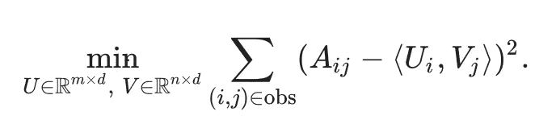

其中 U 和 V 是用户嵌入和项目嵌入矩阵。

a 是您想要表示的接近用户-项目交互的实际表示的点积。这个距离也被称为弗罗贝纽斯距离。
在现实世界中，我们还需要考虑未观察到的配对，例如，假设一个用户是新用户，从未对某一类型的产品表现出兴趣，而现有用户对更多类别的产品表现出兴趣。

因此，目标函数采用以下形式，也称为加权矩阵分解。

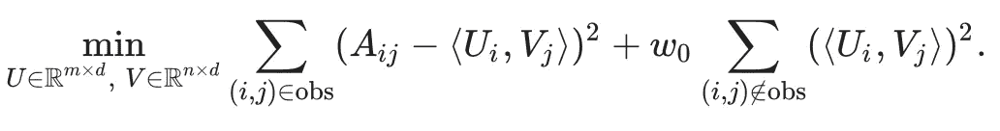

其中 w0 是超参数，它经过调整，对于平衡观察到的和未观察到的实体的总和非常重要。

有两种算法来最小化上述目标函数:

**SGD(随机梯度下降)**:广义技术

**优点**:灵活，可以并行化

**缺点**:收敛较慢，处理未被观察到的条目很困难。

**WALS(加权交替最小二乘法):**专门针对我们的目标。

**优点**:快速收敛，并行化，处理未观察到的条目。

**缺点**:依赖损失平方函数。

现在让我们进入现实世界的问题。

1.  跟随此[链接](https://console.cloud.google.com/)打开谷歌云控制台。确保为您的工作创建或选择一个项目。组织- >项目- >文件夹是 google 云平台中遵循的文件夹层级。

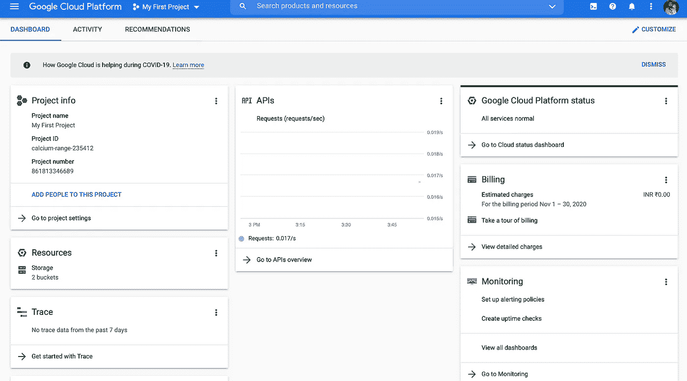

2.打开导航菜单，通过导航到数据库->SQL->创建实例->mySQL 来创建云 SQL 实例

确保选择唯一的实例 ID 和 root 密码。

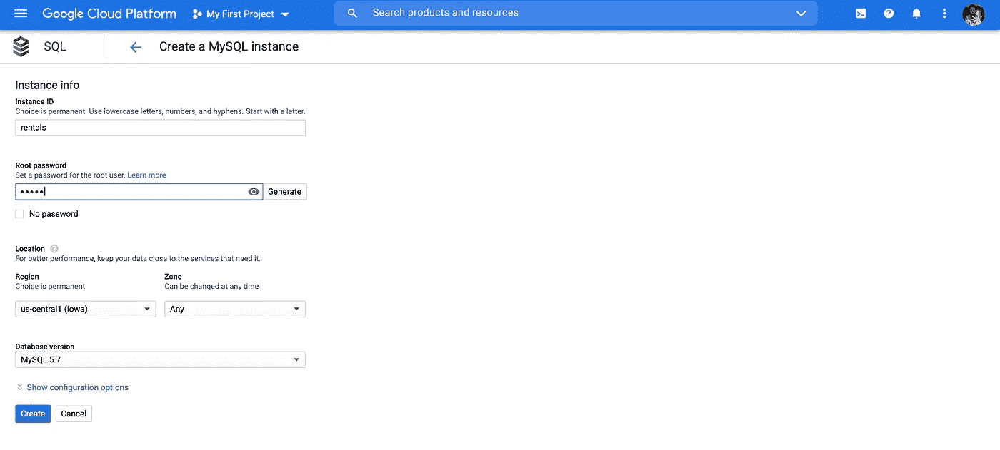

3.现在，让我们在 MySQL 中创建表。

一旦实例准备就绪，就可以使用 google cloud shell 连接到数据库。

在右上角，您会注意到一个激活云外壳的图标。单击云壳。

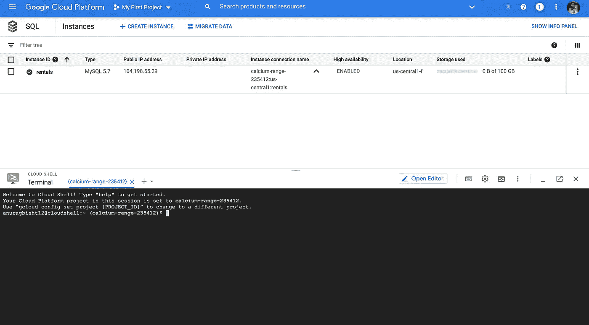

现在让我们使用云 shell 连接到我们新创建的数据库。

```
gcloud sql connect rentals --user=root --quiet
```

如果系统提示您启用 SQL admin API，请按照错误链接启用它。

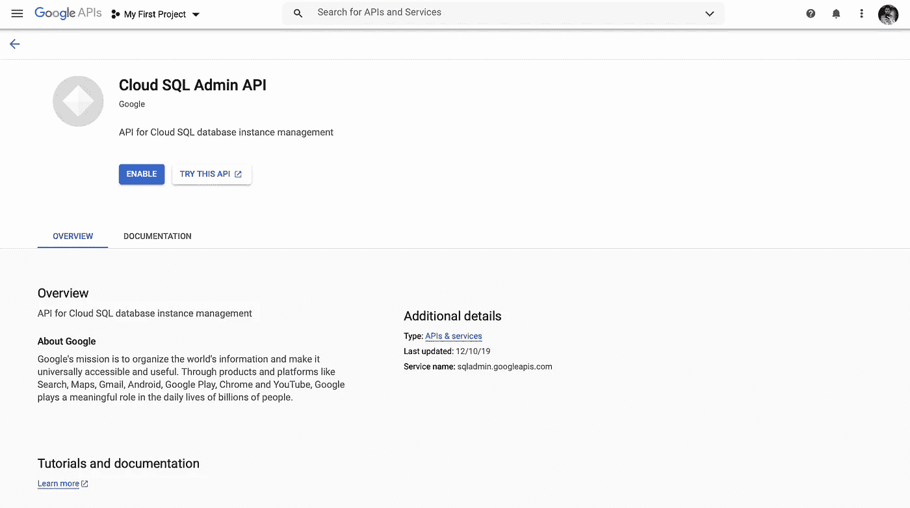

将您的 IP 加入白名单可能需要 5 分钟。

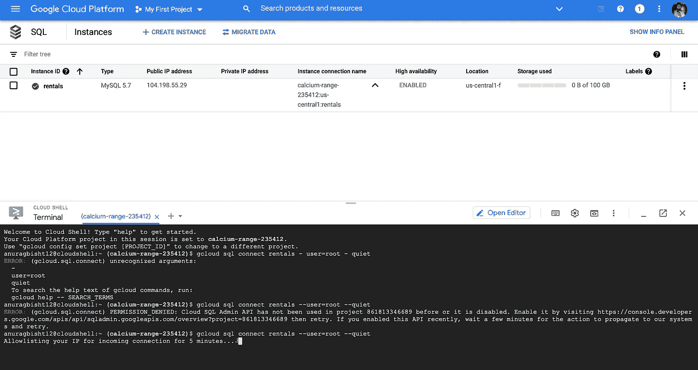

4.进入 MySQL 控制台后，创建一个数据库和 3 个表来存储推荐数据。

```
CREATE DATABASE IF NOT EXISTS recommendation_spark;USE recommendation_spark;DROP TABLE IF EXISTS Recommendation;DROP TABLE IF EXISTS Rating;DROP TABLE IF EXISTS Accommodation;CREATE TABLE IF NOT EXISTS Accommodation(id varchar(255),title varchar(255),location varchar(255),price int,rooms int,rating float,type varchar(255),PRIMARY KEY (ID));CREATE TABLE IF NOT EXISTS Rating(userId varchar(255),accoId varchar(255),rating int,PRIMARY KEY(accoId, userId),FOREIGN KEY (accoId)REFERENCES Accommodation(id));CREATE TABLE IF NOT EXISTS Recommendation(userId varchar(255),accoId varchar(255),prediction float,PRIMARY KEY(userId, accoId),FOREIGN KEY (accoId)REFERENCES Accommodation(id));SHOW DATABASES;
```

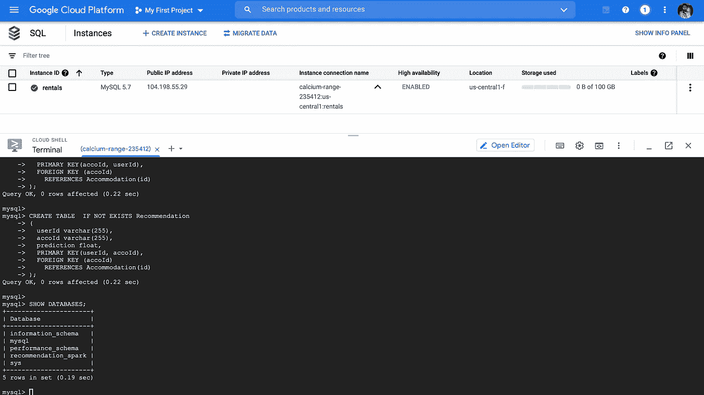

现在，桌子会是空的。您将把数据存放在云 SQL 中，然后将其拉至云 SQL。

5.在云外壳中创建新窗口，创建存储桶并将数据拉入云存储桶。

```
echo “Creating bucket: gs://$DEVSHELL_PROJECT_ID”gsutil mb gs://$DEVSHELL_PROJECT_IDecho “Copying data to our storage from public dataset”gsutil cp gs://cloud-training/bdml/v2.0/data/accommodation.csv gs://$DEVSHELL_PROJECT_IDgsutil cp gs://cloud-training/bdml/v2.0/data/rating.csv gs://$DEVSHELL_PROJECT_IDecho “Show the files in our bucket”gsutil ls gs://$DEVSHELL_PROJECT_IDecho “View some sample data”gsutil cat gs://$DEVSHELL_PROJECT_ID/accommodation.csv
```

您可以通过导航菜单->存储->浏览器->项目 ID 来检查内容。

6.让我们将云存储桶中的数据加载到云 SQL 中。

导航至 SQL->租赁->导入数据

指定存储桶、数据库和表名，然后单击导入。

对评级数据重复上述步骤。

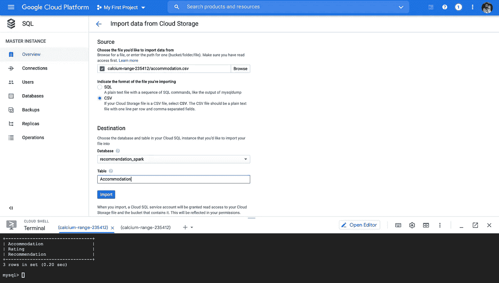

7.使用 cloud shell 并运行一些命令来探索数据

```
SELECTuserId,COUNT(rating) AS num_ratingsFROM RatingGROUP BY userIdORDER BY num_ratings DESC;
```

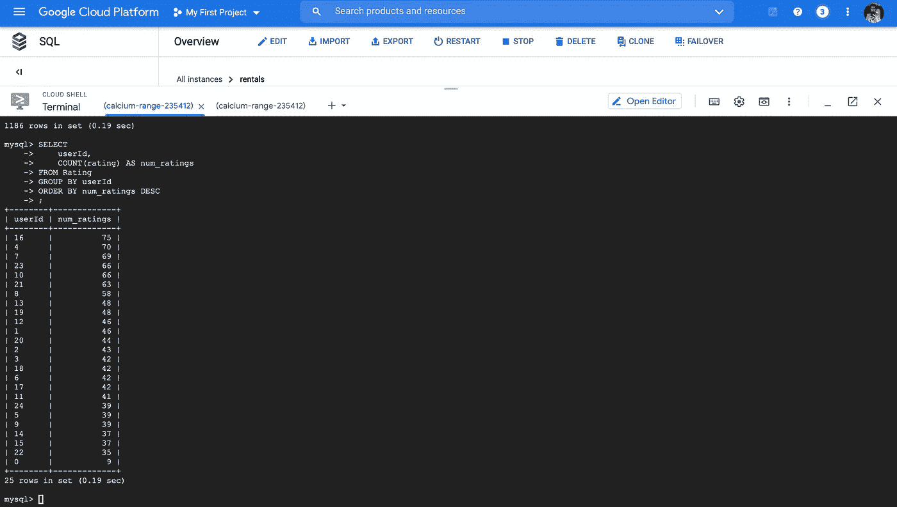

8.让我们使用 dataproc 创建一个推荐引擎。

通过导航到 API 和服务->仪表板->搜索云 dataproc API 来启用 Dataproc API。

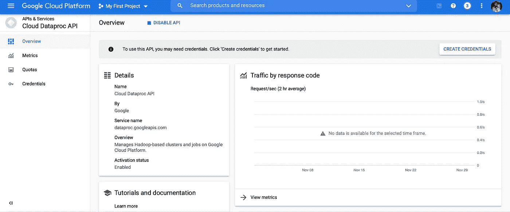

完成后，导航到 BigData-> data proc-> Cluster-> create Cluster

确保该区域与您的云 SQL 实例相同。

另外，请注意集群中的名称、区域和工作节点总数。

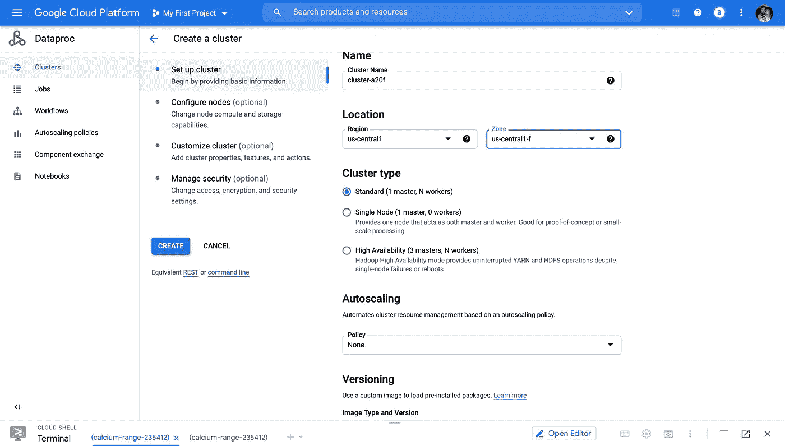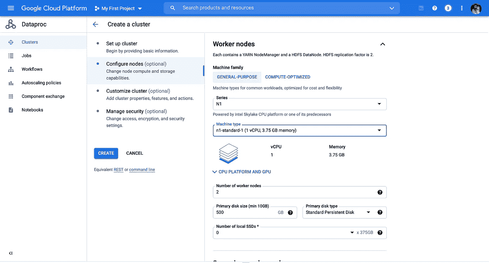

8.授权 dataproc 连接到云 SQL 实例

在云壳中使用下面的脚本。确保检查集群名称、区域和工作线程数量。

```
echo “Authorizing Cloud Dataproc to connect with Cloud SQL”CLUSTER=cluster-a20fCLOUDSQL=rentalsZONE=us-central1-fNWORKERS=2machines=”$CLUSTER-m”for w in `seq 0 $(($NWORKERS — 1))`; domachines=”$machines $CLUSTER-w-$w”doneecho “Machines to authorize: $machines in $ZONE … finding their IP addresses”ips=””for machine in $machines; doIP_ADDRESS=$(gcloud compute instances describe $machine — zone=$ZONE — format=’value(networkInterfaces.accessConfigs[].natIP)’ | sed “s/\[‘//g” | sed “s/’\]//g” )/32echo “IP address of $machine is $IP_ADDRESS”if [ -z $ips ]; thenips=$IP_ADDRESSelseips=”$ips,$IP_ADDRESS”fidoneecho “Authorizing [$ips] to access cloudsql=$CLOUDSQL”gcloud sql instances patch $CLOUDSQL — authorized-networks $ips
```

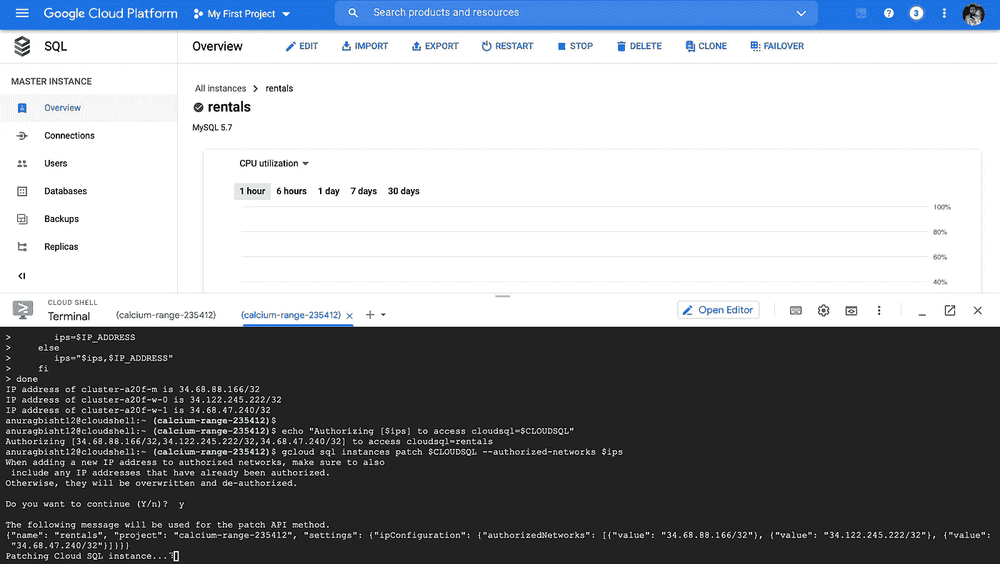

9.将 ML 模型复制到 datarproc 集群，并使用 cloud shell 对其进行编辑。

```
gsutil cp gs://cloud-training/bdml/v2.0/model/train_and_apply.py train_and_apply.pycloudshell edit train_and_apply.py
```

下面是 pyspark 代码片段

```
import osimport sysimport pickleimport itertoolsfrom math import sqrtfrom operator import addfrom os.path import join, isfile, dirnamefrom pyspark import SparkContext, SparkConf, SQLContextfrom pyspark.mllib.recommendation import ALS, MatrixFactorizationModel, Ratingfrom pyspark.sql.types import StructType, StructField, StringType, FloatType# MAKE EDITS HERECLOUDSQL_INSTANCE_IP = ‘104.155.188.32’ # ← — CHANGE (database server IP)CLOUDSQL_DB_NAME = ‘recommendation_spark’ # ←- leave as-isCLOUDSQL_USER = ‘root’ # ←- leave as-isCLOUDSQL_PWD = ‘root’ # ← — CHANGE# DO NOT MAKE EDITS BELOWconf = SparkConf().setAppName(“train_model”)sc = SparkContext(*conf*=conf)sqlContext = SQLContext(sc)jdbcDriver = ‘com.mysql.jdbc.Driver’jdbcUrl = ‘jdbc:mysql://%s:3306/%s?user=%s&password=%s’ % (CLOUDSQL_INSTANCE_IP, CLOUDSQL_DB_NAME, CLOUDSQL_USER, CLOUDSQL_PWD)# checkpointing helps prevent stack overflow errorssc.setCheckpointDir(‘checkpoint/’)# Read the ratings and accommodations data from Cloud SQLdfRates = sqlContext.read.format(‘jdbc’).options(*driver*=jdbcDriver, *url*=jdbcUrl, *dbtable*=’Rating’, *useSSL*=’false’).load()dfAccos = sqlContext.read.format(‘jdbc’).options(*driver*=jdbcDriver, *url*=jdbcUrl, *dbtable*=’Accommodation’, *useSSL*=’false’).load()print(“read …”)# train the modelmodel = ALS.train(dfRates.rdd, 20, 20) # you could tune these numbers, but these are reasonable choicesprint(“trained …”)# use this model to predict what the user would rate accommodations that she has not ratedallPredictions = Nonefor USER_ID in range(0, 100):dfUserRatings = dfRates.filter(dfRates.userId == USER_ID).rdd.map(*lambda* *r*: r.accoId).collect()rddPotential = dfAccos.rdd.filter(*lambda* *x*: x[0] not in dfUserRatings)pairsPotential = rddPotential.map(*lambda* *x*: (USER_ID, x[0]))predictions = model.predictAll(pairsPotential).map(*lambda* *p*: (*str*(p[0]), *str*(p[1]), *float*(p[2])))predictions = predictions.takeOrdered(5, *key*=*lambda* *x*: -x[2]) # top 5print(“predicted for user={0}”.format(USER_ID))if (allPredictions == None):allPredictions = predictionselse:allPredictions.extend(predictions)# write themschema = StructType([StructField(“userId”, StringType(), True), StructField(“accoId”, StringType(), True), StructField(“prediction”, FloatType(), True)])dfToSave = sqlContext.createDataFrame(allPredictions, schema)dfToSave.write.jdbc(*url*=jdbcUrl, *table*=’Recommendation’, *mode*=’overwrite’)
```

出现提示时，单击在新窗口中打开。

更改云实例 IP 和 root 密码。

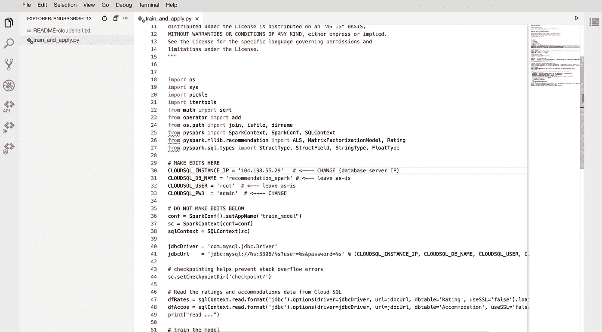

现在保存并复制到桶中。我们将使用 dataproc 从存储位置选取代码。

```
gsutil cp train_and_apply.py gs://$DEVSHELL_PROJECT_ID
```

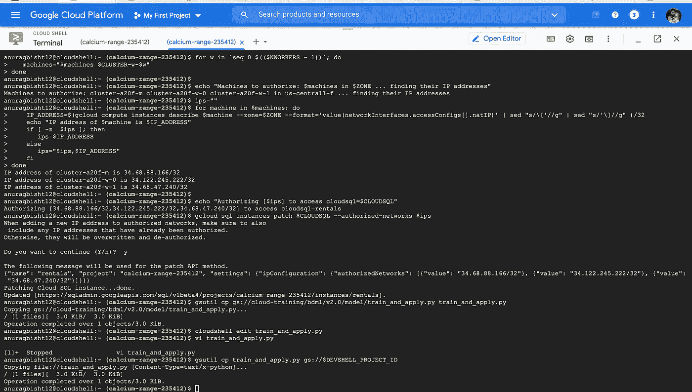

10.向 dataproc 集群提交 ML 作业的时间

导航到 dataproc->作业->提交作业

指定作业 id、集群、pyspark 形式的作业类型、主 python 文件存储桶路径，然后单击提交作业。

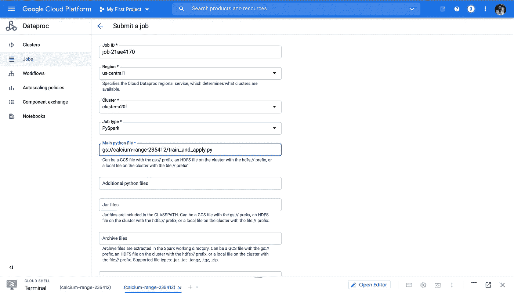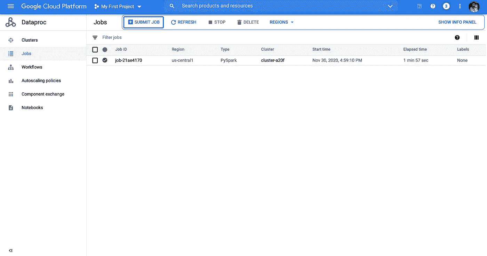

11.查询推荐表

一旦作业成功完成，您就可以查询 MySQL 表建议，以获得基于 user_id 的特定建议。

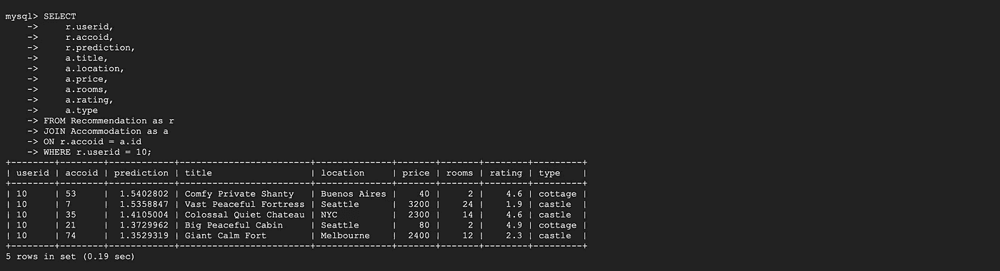

注意:确保删除资源并关闭服务，以避免谷歌云的计费出现任何意外。

一定要让我知道你的想法。你可以关注我关于人工智能/机器学习、数据分析和商业智能的教程。你可以在 [LinkedIn](https://www.linkedin.com/in/anurag-bisht-39935a59/) 上和我联系。

**参考文献**

_【http://yifanhu.net/PUB/cf.pdf 

_[https://spark . Apache . org/docs/latest/ml-collaborative-filtering . html](https://spark.apache.org/docs/latest/ml-collaborative-filtering.html)

_[http://Stanford . edu/~ rezab/classes/CME 323/S15/notes/LEC 14 . pdf](http://stanford.edu/~rezab/classes/cme323/S15/notes/lec14.pdf)

_[https://developers . Google . com/machine-learning/recommendation/collaborative/matrix](https://developers.google.com/machine-learning/recommendation/collaborative/matrix)