# 用 AWS SageMaker 构建产品推荐引擎

> 原文：<https://pub.towardsai.net/building-a-product-recommendation-engine-with-aws-sagemaker-321a0e7c7f7b?source=collection_archive---------0----------------------->

## [机器学习](https://towardsai.net/p/category/machine-learning)，[教程](https://towardsai.net/p/category/tutorial)

## 了解如何使用 Amazon SageMaker 因式分解机构建和训练个性化推荐引擎

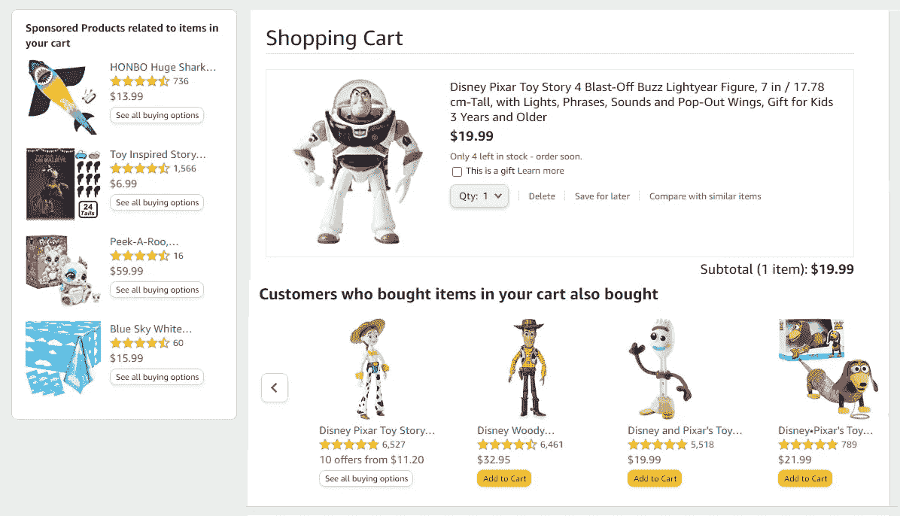

从 Amazon.com 捕获的截屏零件

信不信由你，随着互联网的使用已经成为我们生活中不可或缺的一部分，推荐系统几乎无处不在。

在万维网上，我们每天都会遇到一个(或多个)。推荐系统正在形成网络个性化的一个重要方面，创造定制的体验，推动内容参与，增强互动，并提高销售。

在**脸书**、 **Linkedin** 或 **Twitter** 上，他们向你推荐你可能认识的人或你可以关注的社区。

在 **Pinterest** 上，它会根据你关注的话题或你之前看过的类似内容，推荐你可能感兴趣的图钉或图板。


Pinterest 邮件内容中的推荐。作者图片

在**亚马逊**上，当购买一件商品时，它会推荐其他人经常一起购买的其他商品。

同样，在 Coursera 或 Udemy 上，除了你正在学习的课程之外，他们还会推荐其他学生已经注册的类似课程。

那么，为什么我们需要推荐系统，为什么它们如此重要？

> “我们从一个匮乏的时代走向了一个富足的时代”

> 货架空间是一种稀缺商品，它限制了零售商可以销售的商品数量。
> 
> 一个电视网只能播放这么多节目，因为一天只有这么多小时。
> 
> 电影院也是如此。电影院只有这么多，所以他们现在只能为银幕提供一定数量的电影。
> 
> 一旦互联网被开发出来，事情就变了。网络实现了零成本的产品信息传播，这意味着我们可以拥有比以往更多的产品。
> 
> 来源:[推荐系统概述](https://www.youtube.com/watch?v=1JRrCEgiyHM&list=PLLssT5z_DsK9JDLcT8T62VtzwyW9LNepV&index=41)


照片由 [Nico Smit](https://unsplash.com/@nicosmit99?utm_source=medium&utm_medium=referral) 在 [Unsplash](https://unsplash.com?utm_source=medium&utm_medium=referral) 上拍摄

在当今世界，越来越多的事情是通过互联网在线完成的，从杂货店购物到看视频、听音乐、为下次度假预订住宿和交通工具、为生日庆祝预订餐饮和餐馆等等。

在传统的实体店中，产品陈列在货架上，你可以看到并挑选你喜欢的并购买。

然而在网络世界，可用的物品、选择和供应品的数量是如此多样和广泛。我们的选择几乎是无限的。即使提供了搜索功能，有时我们甚至不知道要找什么。这就是推荐系统的作用所在。它帮助我们发现事物，解开新的内容。如果没有推荐系统，许多产品或服务将会远离人们的视线，永远不会出现。这并不意味着他们不好，只是他们被其他更受欢迎的人所掩盖。

为了说明推荐系统的威力，[《长尾理论》](https://www.wired.com/2004/10/tail/)引用了一本名为 ***《触摸虚空》*** 的书获得了不错的评价，但很快就被遗忘了。然后，十年后，一本名为《消失在空气中的*的新书轰动了出版界。随着亚马逊的推荐，一个积极的反馈循环开始了。 ***触空*** 又开始卖了，而且卖得比*多了两倍。**

> **“亚马逊通过将无限的货架空间与关于购买趋势和公众意见的实时信息结合起来，创造了**触空**现象。结果是:对一本晦涩难懂的书的需求不断上升。”— [长尾巴](https://www.wired.com/2004/10/tail/)**

**在本文中，我们将演示如何使用 Amazon Sagemaker 因式分解机器为在线零售店构建和训练个性化推荐引擎。我们还将把训练好的模型部署到 Amazon SageMaker 托管的端点，并进行实时推理。**

# **内容**

**[1。亚马逊 SageMaker 因式分解机](#b27c)
[2。数据集](#e5c1)
[3。数据清理](#d158)
[4。创建稀疏矩阵](#3638)
∘ [分类数据的一键编码](#8528)
∘ [文本数据的 TF-IDF 编码](#3106)
∘ [所有特征的稀疏矩阵](#2eed)
[5 .将数据拆分成训练集和测试集](#b70a)
[6。创建稀疏记录文件](#36b4)
[7。训练工作&超参数](#0f27)
[8。列车型号](#e94c)
[9。部署型号](#f24d)
[10。模型推断](#02cd)
[总结](#6f54)**

# **1.亚马逊 SageMaker 因子分解机**

**[**亚马逊 SageMaker**](https://aws.amazon.com/sagemaker/) 是一个完全托管的服务，你可以用它来构建、训练、调优、部署和优化机器学习模型。**

**[**因式分解机**](https://docs.aws.amazon.com/sagemaker/latest/dg/fact-machines.html) 是亚马逊 SageMaker 的内置算法之一。这种受监督的机器学习算法可以对回归和二元分类类型的问题进行操作，并且能够处理稀疏数据。如果你有兴趣阅读 Steffen Rendle 关于因式分解机器的原始论文，你可以点击这个[链接](https://www.csie.ntu.edu.tw/~b97053/paper/Rendle2010FM.pdf)。**

**我们将用于构建推荐引擎的方法，如 one-hot 编码和 TF-IDF 编码(我们将在后面介绍)，改编自[如何使用 Amazon SageMaker](https://www.youtube.com/watch?v=o_p_8HXh0tY) 提供个性化推荐。**

# **2.数据集**

**我们将要使用的数据集是[亚马逊客户评论数据集](https://s3.amazonaws.com/amazon-reviews-pds/readme.html)。该公共数据集在 AWS 美国东部地区的`amazon-reviews-pds` S3 桶中可用，采用制表符分隔值(TSV)格式和拼花格式。**

**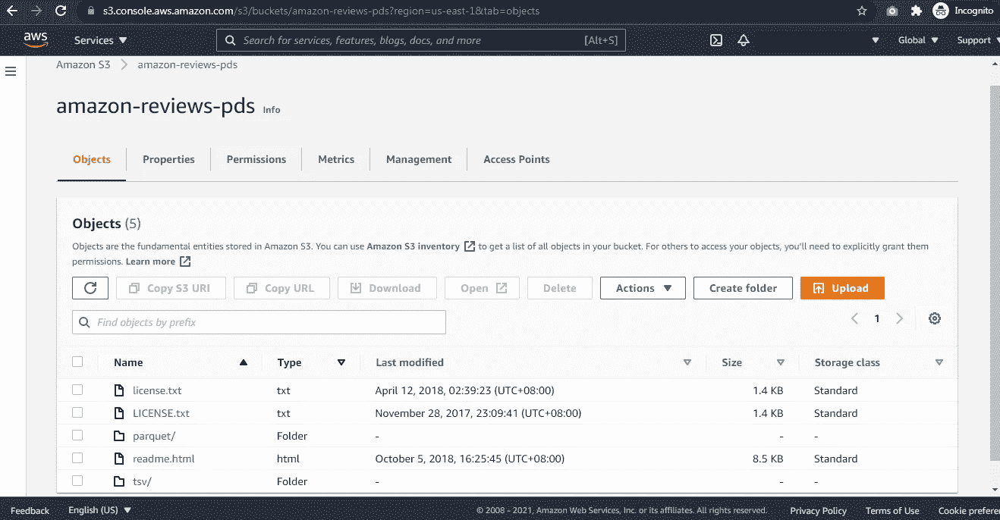**

**`amazon-reviews-pds`AWS 中的 S3 斗**

**出于本教程的目的，我们将只使用 TSV 格式的数据，用于两个类别的美国评论:*个人护理设备*和*主要设备*。**

**关于每个字段信息的更多细节可以在 TSV 索引文件的[数据列](https://s3.amazonaws.com/amazon-reviews-pds/tsv/index.txt)部分找到。**

# **3.数据清理**

**需要对这个数据集进行一些数据清理。**

**让我们从检查和处理重复记录开始。对于我们的任务，我们希望客户对某个特定产品只有一个评论和评级。然而，在现实生活中，对于一个客户来说，同一个产品确实有可能有多个评论和评级。我们认为这是重复的，尽管我们知道每个记录中的评论和评级可能不同。**

**这种情况通常发生在客户在购买产品后不久给出一个评论和评级，然后在使用一段时间后对同一产品提供另一个评论和评级。在这种情况下，我们将只考虑最近的评论和评级，它更准确地反映了客户对该特定产品的情绪和意见。**

**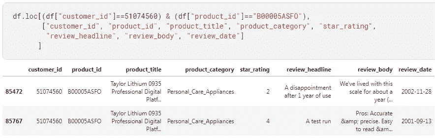**

**客户对特定产品有多个评论和评级的示例**

**我们可以通过`customer_id`、`product_id`、`product_title`和`product_category`对记录进行分组，以找到这样的事件。**

**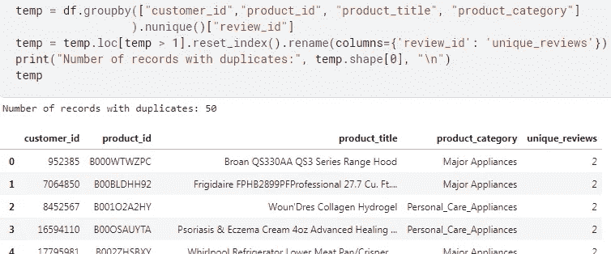**

**为了只保留最近的记录，我们对数据进行排序，然后通过指定`keep=‘last’`来调用 Pandas `drop_duplicates()`方法。**

```
**df.sort_values(by=['customer_id', 'product_id', 'review_date'], inplace=True)df.drop_duplicates(['customer_id', 'product_id'], keep='last', inplace=True)**
```

**我们还检查丢失的数据，并用空字符串替换`product_title`丢失的内容。**

```
**df["product_title"].fillna("", inplace=True)**
```

**在我们的任务中，我们将在过滤已验证购买的记录(`df['verified_purchase']=='Y'`)后，只处理以下各列:**

*   **`customer_id` —唯一的客户标识符**
*   **`product_id` —唯一的产品标识符**
*   **`product_title` —产品的标题**
*   **`product_category` —产品类别**
*   **`star_rating` —点评的 1-5 星级**

**让我们来看看按产品类别划分的记录分布。我们在`Major Appliances`下有将近 7 万条记录，在`Personal_Care_Appliances`下有大约 6.3 万条记录。**

**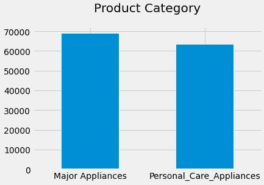**

**作者图片**

**对于星级评定，大多数唱片都获得了 5 星级评定，其中有近 80K 张。大约 22K 张唱片获得了 4 星评级，而三星级及以下的唱片都远低于 20K 张。**

**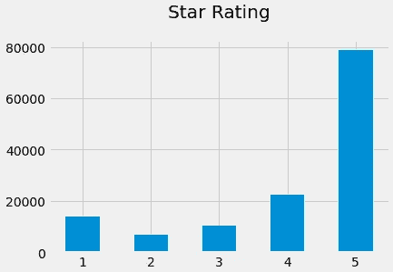**

**作者图片**

**下面的条形图显示了两个产品类别中独特客户和独特产品的分布情况。**

**`Major Appliances`下约有 66K 个独立客户和 8K 个独立产品，而`Personal_Care_Appliances`下约有 62K 个独立客户和 12K 个独立产品。**

**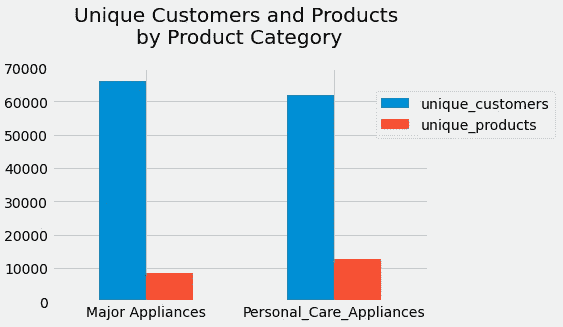**

**作者图片**

# **4.创建稀疏矩阵**

## **分类数据的一键编码**

**对于分类数据，我们将对`customer_id`、`product_id`和`product_category`执行[一键编码](https://machinelearningmastery.com/why-one-hot-encode-data-in-machine-learning/)。结果将是 132，044 行和 147，967 列的稀疏矩阵。**

**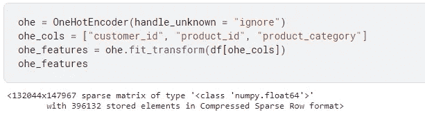**

## **文本数据的 TF-IDF 编码**

**至于文本数据，我们将执行 TF-IDF 编码。**

****TF-IDF** 代表“ ***词频——逆文档频率****”***。**根据[维基百科](https://en.wikipedia.org/wiki/Tf%E2%80%93idf)、*的定义，它是一种数字统计，旨在反映一个词对集合或语料库中的文档(或我们上下文中的产品)有多重要。结合了逆文档频率因子，其减少了在文档集中非常频繁出现的术语的权重，并增加了很少出现的术语的权重。*”**

**我们会用`[sklearn.feature_extraction.text.TfidfVectorizer](https://scikit-learn.org/stable/modules/generated/sklearn.feature_extraction.text.TfidfVectorizer.html)`。这将把文本集合转换成 TF-IDF 编码特征的矩阵。**

**为了让大家了解 TF-IDF 编码的结果是什么样的，我们使用下面一个包含 4 条文本数据记录的例子。TF-IDF 编码的相应结果，也称为 TF-IDF 编码特征矩阵，如下所示:**

**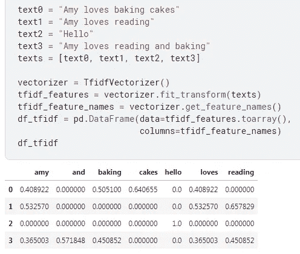**

**Scikit-learn 的[文本特征提取](https://scikit-learn.org/stable/modules/feature_extraction.html#text-feature-extraction)文档提供了关于标记化、出现计数和 TF-IDF 公式的细节。**

**回到我们的数据集，在`product_title`上应用 TF-IDF 编码的结果将是一个 132，044 行和 8，671 列的稀疏矩阵。**

**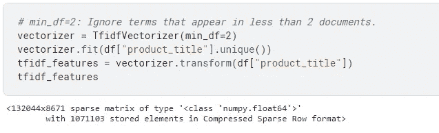**

## **所有特征的稀疏矩阵**

**`X`是一个稀疏矩阵，它包含了我们所有的特征(即一键编码特征和 TF-IDF 编码特征)。我们将通过并排堆叠上述矩阵来构造`X`。结果是一个 132，044 行和 156，638 列的矩阵！**

**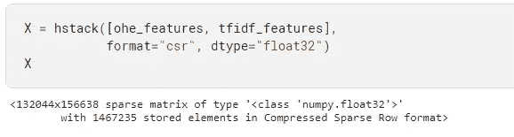****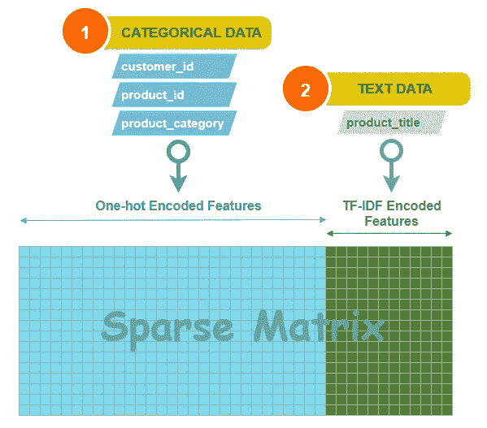**

**稀疏矩阵的构成**

**那标签呢？嗯，至于标签(或目标变量)，我们将有`y`，数组形式的`star_rating`。这是我们将在回归任务中预测的。我们假设预测值越高，客户就越有可能喜欢或购买该产品。**

```
**y = df["star_rating"].values.astype("float32")**
```

**如果你想知道我们的数据有多稀疏，那么，我们的数据是 99.9929%稀疏！**

**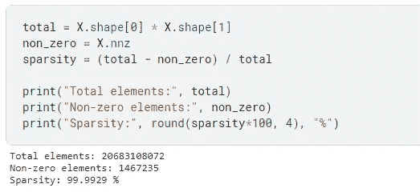**

# **5.将数据分为训练集和测试集**

**我们现在将使用`[sklearn.model_selection.train_test_split](https://scikit-learn.org/stable/modules/generated/sklearn.model_selection.train_test_split.html)`将我们的数据分成 80%的训练集和 20%的测试集。拆分后，我们的训练数据包含约 105.6K 条记录，我们的测试数据包含约 26.4K 条记录。**

**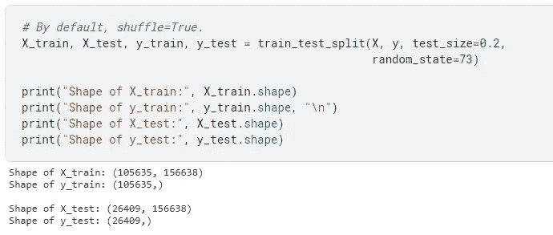**

# **6.创建稀疏记录文件**

> **对于**训练**，因式分解机器算法目前仅支持具有`*Float32*`张量的`*recordIO-protobuf*`格式。因为它们的用例主要基于稀疏数据，`*CSV*`不是一个好的候选。**
> 
> **对于**推理**，因式分解机算法支持`*application/json*`和`*x-recordio-protobuf*`格式。**
> 
> **来源: [AWS](https://docs.aws.amazon.com/sagemaker/latest/dg/fact-machines.html)**

**我们将创建一个函数来编写稀疏 RecordIO 文件，这些文件将用于模型训练。为此，我们使用`[sagemaker.amazon.common](https://github.com/aws/sagemaker-python-sdk/blob/master/src/sagemaker/amazon/common.py)`包中的`write_spmatrix_to_sparse_tensor`函数将`scipy`稀疏矩阵转换为稀疏张量。**

**我们还将创建一个将文件上传到亚马逊 S3 的功能。这是因为 Amazon SageMaker 希望培训和测试文件位于 S3。**

**要将文件上传到 S3，我们首先需要定义 bucket、前缀(您可以将前缀想象成一个文件夹)和 key(对象名)。**

**在下面的代码中，我们还指定了`output_location`，在 S3 的位置，由训练作业创建的模型工件将被存储在这里。**

****

# **7.培训工作和超参数**

**这里，我们为我们的培训工作定义了`job_name`。我们使用`[sagemaker.image_uris.retrieve](https://sagemaker.readthedocs.io/en/v2.68.0/api/utility/image_uris.html)`为我们将要使用的内置算法(因式分解机器)获取一个预构建的 Docker 容器。为了获得允许 Amazon SageMaker(一个托管服务)代表我们执行操作的角色，我们使用了`[sagemaker.get_execution_role()](https://docs.aws.amazon.com/sagemaker/latest/dg/sagemaker-roles.html)`。**

**如果我们计划使用[管理的现场训练](https://docs.aws.amazon.com/sagemaker/latest/dg/model-managed-spot-training.html)，我们需要设置`max_run`时间和`max_wait`时间，并指定`checkpoint_s3_uri`，在 S3 的位置将保存检查点。这些参数连同`container`、`role`、`output_location`、`sess`、`job_name`将在用`[ml.m4.xlarge](https://aws.amazon.com/sagemaker/pricing/)`实例初始化`Estimator`时被传递。**

**`[Estimator](https://sagemaker.readthedocs.io/en/stable/api/training/estimators.html)`是一个高级接口，可以处理 Amazon SageMaker 培训和部署任务。**

**对于因式分解机器超参数，我们将 83 设置为要运行的`epochs`的数量，将`predictor_type`设置为“回归变量”,因为我们正在运行回归任务。`feature_dim`是指特征维度，即我们训练数据的列数。我们将为`num_factors`使用默认值 64，为`mini_batch_size`使用默认值 1000。**

**你可以阅读[这里](https://docs.aws.amazon.com/sagemaker/latest/dg/fact-machines-hyperparameters.html)关于因式分解机器超参数的细节。如果您希望对因式分解机器执行超参数调整，请参考[可调超参数](https://docs.aws.amazon.com/sagemaker/latest/dg/fm-tuning.html#fm-tunable-hyperparameters)。**

> ****托管现场培训**可以优化培训模型的成本，与按需实例相比，最多可降低 90%。SageMaker 代表您管理现场中断。**
> 
> **来源: [AWS](https://docs.aws.amazon.com/sagemaker/latest/dg/model-managed-spot-training.html)**

# **8.火车模型**

**为了开始训练我们的模型，我们调用`fit()`方法并传入我们的训练和测试文件的位置。**

```
**estimator.fit({'train':train_file_location, 
               'test':test_file_location})**
```

**当作业运行时，我们将能够在屏幕上看到打印的日志。**

**作业完成后，结果、状态、训练秒数和计费秒数将显示在最后。**

**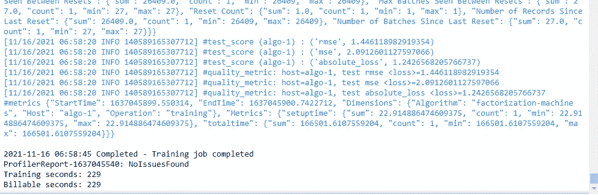**

# **9.部署模型**

**在模型训练成功完成后，我们可以调用`deploy()`方法将训练好的模型部署到 Amazon SageMaker 托管的端点。这是我们可以进行调用以获得实时推断的地方。**

# **10.模型推理**

**对于模型推断，我们将演示一个从促销产品池中预测前 3 名产品以推荐给客户的示例。**

**在我们的例子中，我们将使用`customer_id` 42799904，它是顶级客户之一。该客户之前为`Personal_Care_Appliances`下的 3 个产品和`Major Appliances`下的 2 个产品提供了评级。**

**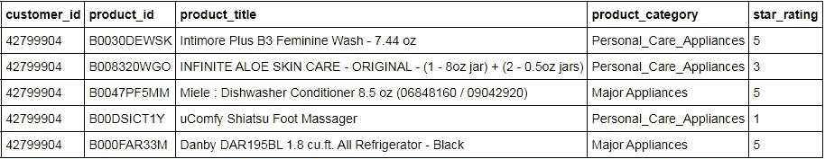**

**`customer_id` 42799904 给出的产品评级历史记录**

**我们可以在下面看到总共 8 个趋势产品，每个类别 4 个。想象一下，这就是我们想要向客户提供和推荐的促销产品。我们将该数据称为*趋势产品数据集*。**

**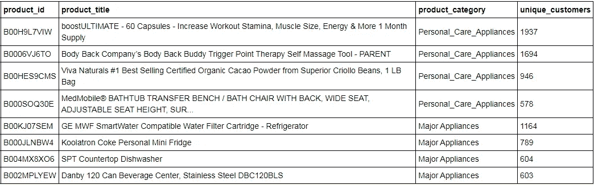**

**趋势产品数据集。每个类别有 4 种产品。**

**从*趋势产品数据集*中，我们的目标是获得前 3 名产品推荐给`customer_id` 42799904(基于`star_rating`的预测值)。**

**在调用模型推理之前，我们需要再次执行与之前相同的 one-hot 编码和 TF-IDF 编码，只是这次`transform`位于*趋势产品数据集*上。**

**为了调用模型推理，我们调用`predict()`方法，传入已经转换为数组的`X_trending`稀疏矩阵。**

**如下所示，该模型返回了`score`，这是*趋势产品数据集*中相应记录的预测值。**

**`[argsort()](https://numpy.org/doc/stable/reference/generated/numpy.argsort.html)`用于获取将对返回的预测数组进行排序的索引。**

**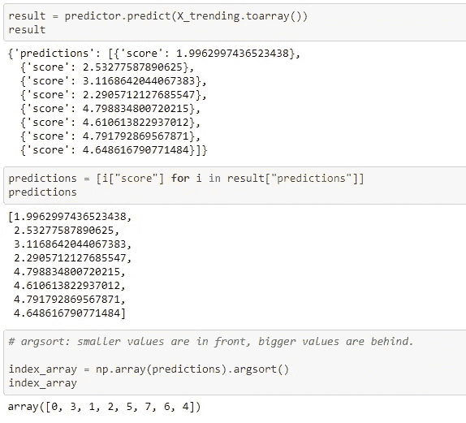**

**这里，我们使用`ohe.inverse_transform`将数据转换为原始表示，我们得到了`product_id`的列表。**

**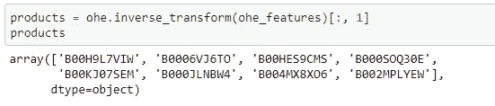**

**最后，我们逆序取最后 3 个乘积，因为排序后，预测值较大的记录在最后。**

**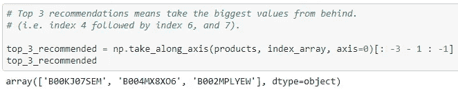**

**瞧啊。开始吧，这些是`customer_id` 42799904 的前 3 个推荐产品。**

**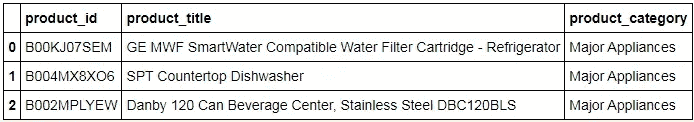**

**`customer_id` 42799904 前 3 名推荐产品。**

**目前就这些。我们已经使用 Amazon Sagemaker 因式分解机成功地构建和训练了个性化推荐引擎，部署了模型，并调用了实时推理。**

**如果您正在跟进，不要忘记删除端点并停止 SageMaker 实例，以避免 AWS 产生不必要的费用。**

# **摘要**

**☑️:我们对数据集进行了必要的数据清理。**

**☑️我们对分类数据应用了一键编码，对文本数据应用了 TF-IDF 编码，以创建模型特征的稀疏矩阵。**

**☑️:我们把数据转换成 RecordIO 格式，然后上传到 S3。**

**☑️:我们学习了如何使用亚马逊 SageMaker 因式分解机来构建和训练一个推荐引擎。**

**☑️培训之后，我们在 SageMaker 管理端点上部署了该模型。**

**☑️:我们通过一个实时模型推断的例子，根据预测的星级来获得推荐给客户的前 3 名产品。**

**我希望你喜欢这个教程。**

***如果你喜欢我的帖子，别忘了点击* [***关注***](https://peggy1502.medium.com/) *和* [***订阅***](https://peggy1502.medium.com/subscribe) *以获得邮件通知。***

***你也可以选择* [*注册*](https://peggy1502.medium.com/membership) *成为媒体会员，以获得媒体上所有故事的完整访问权限。***

**📑*访问这个*[*GitHub repo*](https://github.com/peggy1502/Data-Science-Articles/blob/main/README.md)*获取我在帖子中分享的所有代码和笔记本。***

**2021 保留所有权利。**

# **参考资料:**

**【1】[亚马逊 SageMaker 因子分解机](https://docs.aws.amazon.com/sagemaker/latest/dg/fact-machines.html)**

**[2] [推荐系统概述](https://www.youtube.com/watch?v=1JRrCEgiyHM&list=PLLssT5z_DsK9JDLcT8T62VtzwyW9LNepV&index=41)**

**[3] [如何使用亚马逊 SageMaker 提供个性化推荐](https://www.youtube.com/watch?v=o_p_8HXh0tY)**

**如果你想查看更多关于机器学习、亚马逊 SageMaker 的资源，或者如果你打算参加 [AWS 认证机器学习专业](https://towardsdatascience.com/aws-certified-machine-learning-specialty-97eacbd1a0fe)，请点击下面的[链接](https://towardsdatascience.com/aws-certified-machine-learning-specialty-97eacbd1a0fe)。**

**[](https://towardsdatascience.com/aws-certified-machine-learning-specialty-97eacbd1a0fe) [## AWS 认证机器学习—专业

### 关于如何准备和通过考试的提示和建议

towardsdatascience.com](https://towardsdatascience.com/aws-certified-machine-learning-specialty-97eacbd1a0fe) 

有兴趣了解变形金刚吗？我有以下的帖子给你。

[](https://towardsdatascience.com/transformers-can-you-rate-the-complexity-of-reading-passages-17c76da3403) [## 变形金刚，你能评价阅读段落的复杂程度吗？

### 用 PyTorch 微调 RoBERTa 以预测文本摘录的阅读难易程度

towardsdatascience.com](https://towardsdatascience.com/transformers-can-you-rate-the-complexity-of-reading-passages-17c76da3403) [](https://towardsdatascience.com/advanced-techniques-for-fine-tuning-transformers-82e4e61e16e) [## 微调变压器的先进技术

### 学习这些先进的技术，看看它们如何帮助改善结果

towardsdatascience.com](https://towardsdatascience.com/advanced-techniques-for-fine-tuning-transformers-82e4e61e16e)**