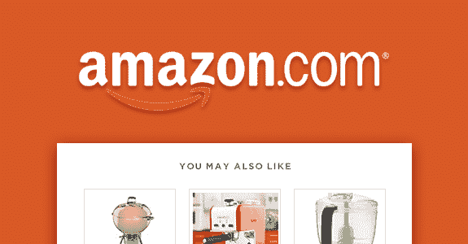
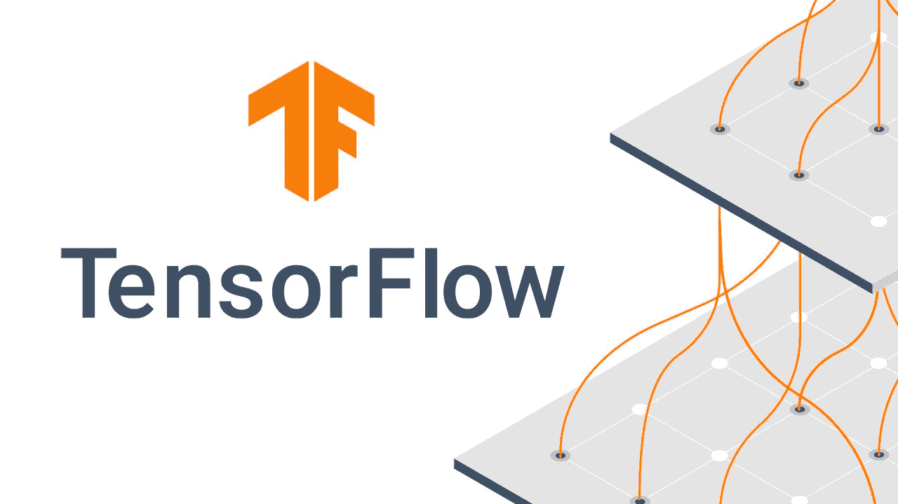
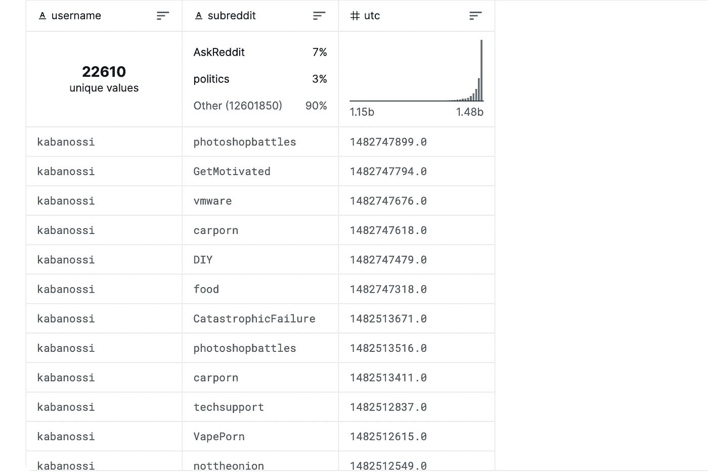

# 利用 TFRS 构建推荐系统

> 原文：<https://pub.towardsai.net/building-a-recommender-system-using-tfrs-4043db00ab79?source=collection_archive---------2----------------------->

## 第 1 部分:简介、导入和清理数据集


Alesia Kazantceva 在 [Unsplash](https://unsplash.com?utm_source=medium&utm_medium=referral) 上拍摄的照片

不知道接下来看什么电影，看什么文章，或者买什么产品？有数以百万计的产品和服务可供选择，如今的客户比以往任何时候都更容易受到选择过多的困扰，这就是推荐系统拯救世界的地方，它们能够不断地向客户推荐有利可图的节目和产品。如今，许多公司都在花费小笔财富来构建和不断改进他们自己的推荐系统，因此毫不奇怪，对于一些公司来说，他们创造的大部分收入完全是由这种复杂的系统带来的。那么推荐系统的其他好处是什么呢？有哪些著名的公司使用这种系统呢？

# 推荐系统的好处

# 1-增加销售动力

随着向用户提供个性化的产品和服务，预计将产生更多的销售，客户更有可能购买与他们以前购买的产品味道相似的产品。

# 2-提供更好的用户体验

推荐系统通过不断地向客户提供他们自己的个性化销售人员，为客户提供独特的关怀感和优质体验，这些销售人员在什么产品或服务适合客户口味方面具有丰富的专业知识。

# 3-提高客户参与度

通过不断地引导顾客到他们喜欢的产品、展览、文章等等，顾客不太可能因为有大量的选择而感到困惑。这种指导将使客户对特定服务提供的内容更感兴趣。

# 现实生活中的推荐系统示例

1.  油管（国外视频网站）


Youtube 推荐系统的图片([来源](https://www.socialnationnow.com/youtubes-recommendation-system/))

最大的推荐系统用户之一是在线视频分享和社交媒体平台 Youtube。Youtube 的收入主要来自其先进的推荐算法，该算法根据每个客户的独特偏好不断推荐热门视频。这种偏好可以包括相同类别的相似视频、同一创作者的视频、高度喜欢的视频等等。

2.亚马孙



亚马逊推荐系统的图片([来源](https://www.rejoiner.com/resources/amazon-recommendations-secret-selling-online))

电子商务世界的另一个巨头亚马逊充分利用推荐系统，不断推荐新产品供客户选择，让客户保持稳定。

# 张量流和 TFRS



张量流图像([来源](https://analyticsindiamag.com/tensorflow-tfrs-recommenders-package/)

由著名的张量框架创建的[张量流推荐器](https://www.tensorflow.org/recommenders)或 TFRS 是专门为构建推荐系统模型而创建的。除了相当容易学习之外，TensorFlow 推荐框架还有助于整个推荐系统构建过程，从数据收集到评估和部署。在本文的教程部分，我们将把 TensorFlow 推荐系统集成到我们的推荐系统模型中，同时解释我们的模型的结构，并简要说明代码中的每个步骤。

# 我们的模型想要实现什么？

在本文的实践部分，我们将提供一个机器学习模型，能够向用户建议新的 Reddit 帖子。我们将给出所使用的数据集，以及如何构建所需模型的分步指南。您可以使用 Kaggle 或 GoogleColab 等网站，这些网站为其用户提供了能够编译 python 代码的云资源和托管笔记本。

# 资料组

作为任何机器学习模型最重要的部分之一，我们有自己的数据集。要找到本教程中使用的数据集，请查看以下链接: [Reddit 数据](https://www.kaggle.com/code/gauthierhaas/tensorflow-subreddit-recommender-system/notebook)。这个数据集包含了数百万的 Reddit 帖子，以及这些帖子的用户名、帖子类别和时间戳。



Reddit 数据集的图像([来源](https://www.kaggle.com/code/gauthierhaas/tensorflow-subreddit-recommender-system/data))

# 辅导的

# 步骤 1:导入所需的库

至于任何机器学习模型，我们都必须从下载我们的库和包开始。首先，我们有我们的随机包，它可以用来生成随机数。接下来，我们将使用熊猫在我们的模型中绘制不同的图形。这些图表将用于可视化，以便更好地理解模型。最后，我们有了 NumPy 库，它为我们提供了所需的代数函数。

```
import random
import pandas as pd
import numpy as np
```

步骤 2:定义所需的方法

在这一部分，我们将定义一些必需的方法。我们的第一个方法是 **chunks(l，n)** ，它将数据集分成多个组块或片段。

```
def chunks(l, n):
  n = max(1, n)
return (l[i:i+n] for i in range(0, len(l), n))
```

normalize(lst)方法将执行数据规范化的过程。一般来说，规范化是将数据集中的数值列的值转换为使用通用比例，而不会扭曲值范围的差异或丢失信息的过程。

```
def normalize(lst):
  s = sum(lst)
  normed = [itm/s for itm in lst]
  normed[-1] = (normed[-1] + (1-sum(normed)))#pad last value with whatever difference needed to make sum to exactly 1
return normed
```

步骤 3:导入和读取我们的数据集

下载 Reddit 数据集后，我们将使用 read_csv 函数来读取存储在其中的数据。我们将使用 head(100，000)方法仅获取前 100，000 个帖子。

```
df = pd.read_csv(“../input/reddit_data.csv”).head(100000) #reduce dataset size to first 100,000 comments
```

然后，我们将计算 subreddit 列中唯一值的数量，还将计算每个唯一值出现的次数。之后我们会计算每个数据点的逆概率。

```
vocab_counts = df[“subreddit”].value_counts()
tmp_vocab = list(vocab_counts.keys())
total_counts = sum(vocab_counts.values)
inv_prob = [total_counts/vocab_counts[sub] for sub in tmp_vocab]
vocab = ["Unseen-Sub"] + tmp_vocab #build place holder, Unseen-Sub, for all subs not in vocab
tmp_vocab_probs = normalize(inv_prob)
#force probs sum to 1 by adding difference to "Unseen-sub" probability
vocab_probs = [1-sum(tmp_vocab_probs)] + tmp_vocab_probs
```

在下一部分中，我们将进一步清理数据集，训练和评估模型。敬请期待！