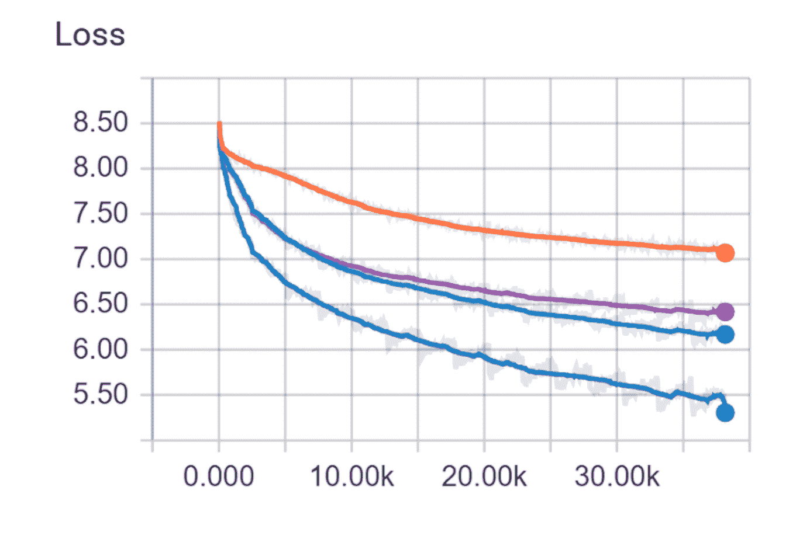
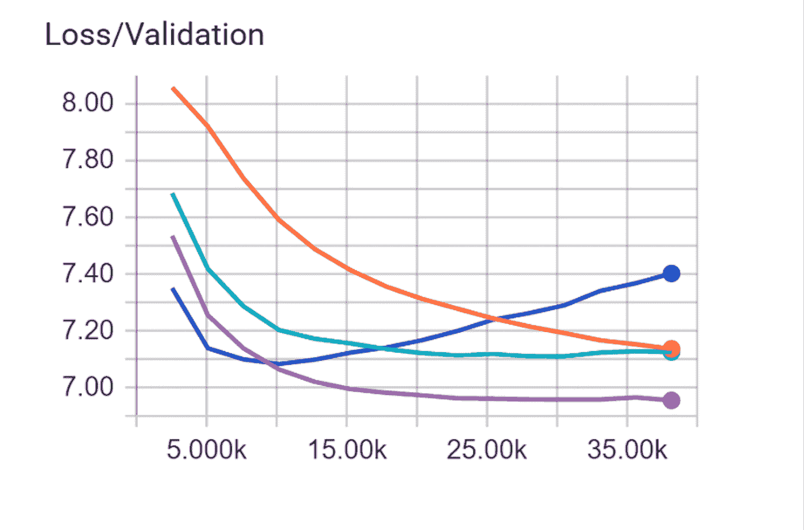

# 利用 TFRS 构建推荐系统

> 原文：<https://pub.towardsai.net/building-a-recommender-system-using-tfrs-93da18f7a955?source=collection_archive---------3----------------------->

## 第 2 部分:建模和评估


马丁·亚当斯在 [Unsplash](https://unsplash.com?utm_source=medium&utm_medium=referral) 上的照片

本教程的[第一部分](https://medium.com/towards-artificial-intelligence/building-a-recommender-system-using-tfrs-4043db00ab79)是关于导入和清理数据集的。在这一部分中，我们将更多地关注特征工程、训练和评估模型。

# 步骤 1:清理和过滤数据集

在接下来的部分中，我们将运行 **remove_repeating_subs()** 和**build _ training _ sequences()**函数。注意，为了简洁起见，我们不会包括这两个函数的代码。这两个函数的代码可以在本教程末尾的链接中找到。

顾名思义，使用**remove _ repeating _ subs()**函数将检查并删除数据集中所有重复的 subs，从重复数据中过滤掉数据集。

**build _ training _ sequences()**函数将获取一个给定的数据集，并将用户子序列分割成定义大小的块。接下来，对于每个块，我们将筛选出潜在的标签来选择一个训练标签，然后通过顶部的子过滤器列表进行过滤。然后，我们将从过滤的子序列中随机选择标签，使用 vocab 概率分布来平滑它。最后，我们将通过确保用户的子序列存在于模型的词汇表中并过滤掉所选择的子序列来构建一个序列。

```
pp_user_data = remove_repeating_subs(df)
train_data = build_training_sequences(pp_user_data)
seqs,lbls,lngths = zip(*train_data)
```

在这一部分中，我们将在执行 remove_repeating_subs 和 build_training_sequences 函数后获取数据集的新值，并将它们存储到一个新的数据集中，新的列名为{sub_seqs，sub _ label。序列长度}。从现在开始，将使用这个新数据集。

```
train_df = pd.DataFrame({‘sub_seqs’:seqs,
'sub_label':lbls,
'seq_length':lngths})
```

## 步骤 2:导入 TensorFlow 和 tflearn

然后，我们将 TensorFlow 和 tflearn 库导入到我们的模型中。这两个库都将在模型的后续部分中使用。

```
import tensorflow as tf
import tflearn
from tflearn.data_utils import to_categorical, pad_sequences
```

## 步骤 3:设置模型的参数

我们将从向我们的训练模型传递所需的参数开始。一些 train_model 函数参数包括:

**训练**:过滤后的训练数据集。

**测试:**过滤后的测试数据集。

**vocab_size:** 要创建的词汇表的大致大小。

**n_epoch:** 表示机器学习算法已经完成的整个训练数据集的通过次数。

**n_units:** 神经网络中选择的节点数。

**丢失:**是训练一层中给定节点的概率，其中 1 表示没有丢失，0 表示该层没有输出。

**learning_rate:** 是模型在每次迭代中为达到最小损失函数所采取的实际步长。

```
def train_model(train,test,vocab_size,n_epoch=2,n_units=128,dropout=0.6,learning_rate=0.0001):
```

定义新的培训和测试数据。

```
trainX = train[‘sub_seqs’]
trainY = train['sub_label']
testX = test['sub_seqs']
testY = test['sub_label']
```

## 步骤 4:序列填充

使用序列填充，我们将确保列表中的所有序列具有相同的长度。这是通过在每个序列的开头添加额外的 0，直到它们达到可用的最高序列的长度来实现的。

```
trainX = pad_sequences(trainX, maxlen=sequence_chunk_size, value=0.,padding=’post’)
```

```
testX = pad_sequences(testX, maxlen=sequence_chunk_size, value=0.,padding=’post’)
```

然后我们将把标签转换成二进制向量

```
trainY = to_categorical(trainY, nb_classes=vocab_size)
```

```
testY = to_categorical(testY, nb_classes=vocab_size)
```

# 第五步:网络建设

对于这个模型的主要部分，我们将使用 tflearn 库来构建我们的神经网络。这里使用的神经网络总共有 4 层。然后将每一层的输出作为输入插入到下一层。

我们的第一隐藏层是**嵌入层**。嵌入层负责[字嵌入](https://machinelearningmastery.com/use-word-embedding-layers-deep-learning-keras/#:~:text=The%20Embedding%20layer%20is%20defined,vocabulary%20would%20be%2011%20words.)。这个模型中嵌入层的大小等于 vocab_size 的大小。

第二层是 [**LSTM 层**](https://towardsdatascience.com/lstm-networks-a-detailed-explanation-8fae6aefc7f9) 这是**长短期记忆**的简称。这一层使用 128 个神经元(单元)。第三层是[全连通层](https://indiantechwarrior.com/fully-connected-layers-in-convolutional-neural-networks/)。在这一层中，输入乘以一个权重矩阵，然后将一个偏置向量添加到最终结果中。

第四层也是最后一层是[](https://www.mathworks.com/help/deeplearning/ref/regressionlayer.html;jsessionid=38604f8c811874db641c9ab60e05)**回归层。回归层返回模型的最终输出，也就是 subreddit post 推荐的权重。**

```
net = tflearn.input_data([None, 15])
net = tflearn.embedding(net, input_dim=vocab_size, output_dim=128,trainable=True)
net = tflearn.lstm(net, n_units=n_units, dropout=dropout,weights_init=tflearn.initializations.xavier(),return_seq=False)
net = tflearn.fully_connected(net, vocab_size, activation='softmax',weights_init=tflearn.initializations.xavier())
net = tflearn.regression(net, optimizer='adam', learning_rate=learning_rate,
loss='categorical_crossentropy')
```

## **步骤 6:训练我们的模型**

**我们将把训练和测试数据集传递到最终模型中，并确定批量大小为 512。**

```
model = tflearn.DNN(net, tensorboard_verbose=2)
model.fit(trainX, trainY, validation_set=(testX, testY), show_metric=False,batch_size=512,n_epoch=n_epoch)
return model
```

## **步骤 7:拆分数据集**

**我们将把数据集分成 80%的训练数据集和 20%的测试数据集。**

```
split_perc=0.8
train_len, test_len = np.floor(len(train_df)*split_perc), np.floor(len(train_df)*(1-split_perc))
train, test = train_df.ix[:train_len-1], train_df.ix[train_len:train_len + test_len]
```

## **步骤 8:运行最终模型**

**为了运行我们的最终模型，我们将把**训练**、**测试**和**词汇长度**传递给 train_model 函数。**

```
model = train_model(train,test,len(vocab))
```

# **步骤 9:模型评估**

**为了检查我们模型的性能，我们提供了**损失**和**验证**函数的图表。这两个图表是一个模型如何评估的可靠表示。**

# **损失图**

****

**损失图图片([来源](https://www.kaggle.com/code/gauthierhaas/tensorflow-subreddit-recommender-system/notebook)**

**一个[损失图/函数](https://www.datarobot.com/blog/introduction-to-loss-functions/)是检查你的模型性能的最简单的方法之一。它们给我们一个模型学习方向的快照。如果模型的结果完全偏离(不准确)，损失函数将返回高数值。另一方面，如果模型运行良好，将返回较低的值。**

# **验证图**

**损失图显示模型如何拟合训练数据，而[损失/验证](https://www.baeldung.com/cs/training-validation-loss-deep-learning)图显示模型如何拟合新数据。**

****

**损失/验证图的图像([来源](https://www.kaggle.com/code/gauthierhaas/tensorflow-subreddit-recommender-system/notebook))**

**要找上面教程的原代码，查看下面链接[原代码](https://www.kaggle.com/code/gauthierhaas/tensorflow-subreddit-recommender-system/data)。**

# **结论**

**随着公司为他们的客户提供个性化的定制销售人员，客户倾向于在新产品上花费越来越多的钱，使得今天的销售额比以往任何时候都多。无论是在流媒体、零售还是就业领域，公司的推荐系统都是举足轻重的。随着推荐系统日益流行，越来越多的公司将这种系统集成到他们自己的系统中，更多的公司肯定会效仿。**