# 用熊猫构建推荐系统

> 原文：<https://pub.towardsai.net/building-a-recommender-system-with-pandas-1ca0bb03fdce?source=collection_archive---------0----------------------->

## 全指南打造推荐系统| [走向 AI](https://towardsai.net)

H**ello World**，在短短几分钟内，我将向你展示一些使用熊猫进行数据科学的非常有效的方法。

我假设您经常使用 Pandas，并且对 Pandas 系列和数据框的结构和常用方法有基本的了解。

因此，我们将探索一些现实生活中的数据，并建立一个**基于内容的电影推荐系统**，专门使用熊猫*。*

## 目录

*   [数据:](https://medium.com/p/1ca0bb03fdce#a46b)
*   [推荐系统的定义:](https://medium.com/p/1ca0bb03fdce#a493)
*   [读取数据:](https://medium.com/p/1ca0bb03fdce#577b)
*   [数据清理和预处理:](https://medium.com/p/1ca0bb03fdce#4356)
*   [基于内容的推荐系统:](https://medium.com/p/1ca0bb03fdce#3dac)
*   [最终输出:](https://medium.com/p/1ca0bb03fdce#523b)
*   [利弊:](https://medium.com/p/1ca0bb03fdce#978a)
*   [概要:](https://medium.com/p/1ca0bb03fdce#abf8)

> 事不宜迟，让我们开始吧！


*来源:*[*img _ credit*](https://hips.hearstapps.com/hmg-prod.s3.amazonaws.com/images/best-kids-movies-netflix-2019-1558104198.jpg)

让我们把熊猫进口到 Colab。

```
# Dataframe manipulation library.
import pandas as pd
```

# 数据:

我们将使用来自[***【Grouplens.org***](https://grouplens.org/datasets/movielens/)的电影分级公共数据集。这是一个 [***压缩文件***](http://files.grouplens.org/datasets/movielens/ml-latest-small.zip) ，我从其中提取了两个文件用于这个练习。原始文件在 Github 中为[***ratings . CSV***](https://raw.githubusercontent.com/Lawrence-Krukrubo/Building-a-Content-Based-Movie-Recommender-System/master/ratings.csv)和[***movies . CSV***](https://raw.githubusercontent.com/Lawrence-Krukrubo/Building-a-Content-Based-Movie-Recommender-System/master/movies.csv)*。*

该数据是更大的电影镜头数据集 的子集 [***，其用于构建混合电影推荐系统，部署内容和协同过滤。***](https://grouplens.org/datasets/movielens/)

movies.csv 包含来自 600 个用户的 9742 部电影，ratings.csv 有 100836 个电影评级。

> 在我们构建基于内容的推荐系统时，让我们来研究这些数据。

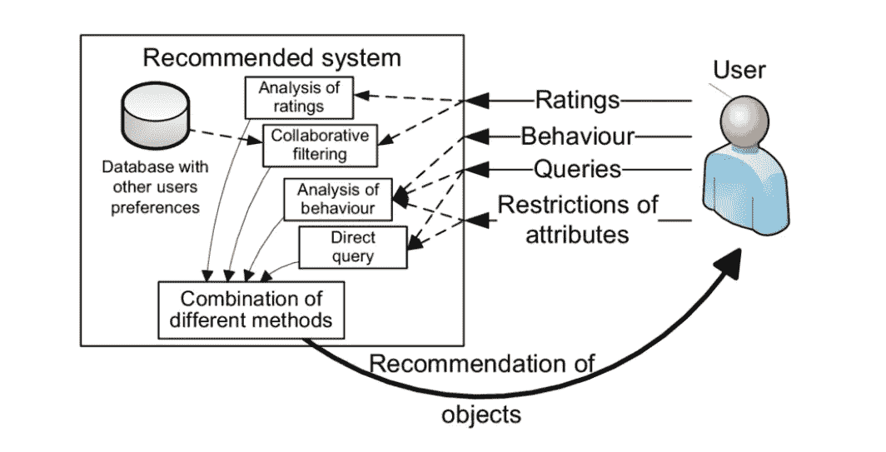

基于内容的推荐系统—来源: [*img_credit*](https://www.researchgate.net/profile/Alan_Eckhardt/publication/220827211/figure/fig2/AS:394007092973580@1470950019808/Structure-of-a-recommender-system.png)

> 嘿，劳伦斯！等等……什么是基于内容的推荐系统？

哎呀！原谅我动作太快…

# 推荐系统的定义:

[***推荐系统***](https://courses.cognitiveclass.ai/courses/course-v1:CognitiveClass+ML0101ENv3+2018/courseware/c6143d9ff5764057a91e53fa8a3a6dff/0b487a2c255f4c95a9ba58d5f8ebf041/) 是用于基于从用户处获取的信息向用户推荐项目的算法集合。这些系统在网上商店、电影数据库和求职者中随处可见。

例如，下次网飞向你推荐一部电影时，这就是推荐系统算法在起作用。

> 基于内容的推荐系统试图根据用户的简档向用户推荐项目。用户简档围绕用户的偏好和口味，或者基于用户评级。

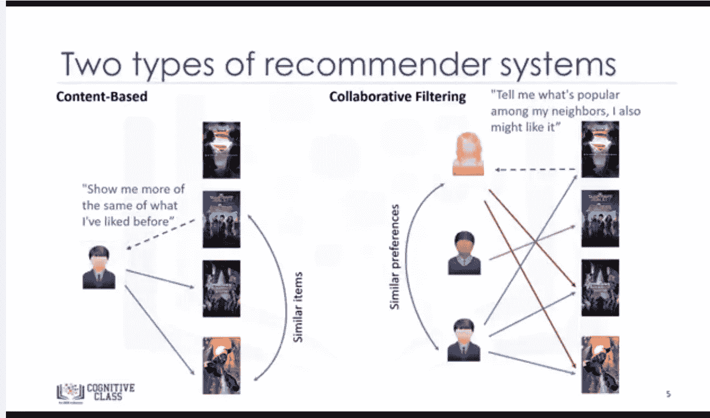

两大类推荐系统是基于内容和协同过滤系统。

[***IBM 链接了解更多详情***](https://courses.cognitiveclass.ai/courses/course-v1:CognitiveClass+ML0101ENv3+2018/courseware/c6143d9ff5764057a91e53fa8a3a6dff/0b487a2c255f4c95a9ba58d5f8ebf041/)

那就是说…让我们继续前进。


计划就是坚持计划… Lol |来源: [*img_credit*](https://www.google.com/url?sa=i&source=images&cd=&cad=rja&uact=8&ved=2ahUKEwiVv9-T87DiAhVLExoKHXtUCywQjRx6BAgBEAU&url=%2Furl%3Fsa%3Di%26source%3Dimages%26cd%3D%26ved%3D%26url%3Dhttps%253A%252F%252Fwww.whatstheplanstan.govt.nz%252F%26psig%3DAOvVaw16huAXqd2_77HOTCzN1Md2%26ust%3D1558674790598522&psig=AOvVaw16huAXqd2_77HOTCzN1Md2&ust=1558674790598522)

# 读取数据:

首先，我们保存来自 Github 的原始文件

```
movies_data = '[https://raw.githubusercontent.com/Lawrence-Krukrubo/Building-a-Content-Based-Movie-Recommender-System/master/movies.csv](https://raw.githubusercontent.com/Lawrence-Krukrubo/Building-a-Content-Based-Movie-Recommender-System/master/movies.csv)['](https://raw.githubusercontent.com/Blackman9t/EDA/master/movies.csv')
ratings_data = '[https://raw.githubusercontent.com/Lawrence-Krukrubo/Building-a-Content-Based-Movie-Recommender-System/master/ratings.csv](https://raw.githubusercontent.com/Lawrence-Krukrubo/Building-a-Content-Based-Movie-Recommender-System/master/ratings.csv)['](https://raw.githubusercontent.com/Blackman9t/EDA/master/ratings.csv')
```

让我们设置选项，将任何给定时间显示的最大行数限制为 20

```
# Setting max-row display option to 20 rows.
pd.set_option('max_rows', 20)
```

接下来，我们定义缺失值的另一种可能的表示。这些在实景数据中经常出现，但是 [***熊猫默认不会全部发现***](https://pandas.pydata.org/pandas-docs/stable/reference/api/pandas.read_csv.html) ***。***

```
# Defining additional NaN identifiers.
missing_values = ['na','--','?','-','None','none','non']# Then we read the data into pandas data frames.
movies_df = pd.read_csv(movies_data, na_values=missing_values)
ratings_df = pd.read_csv(ratings_data, na_values=missing_values)
```

让我们看看每个数据框的形状和前几行

```
print('Movies_df Shape:',movies_df.shape)
movies_df.head()
```

**用于评级 _df**

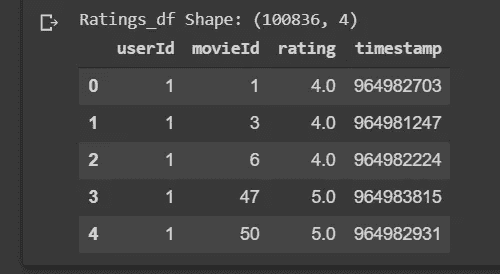

显示 ratings_df 的形状和前 5 个观察值

**对于电影 _df**

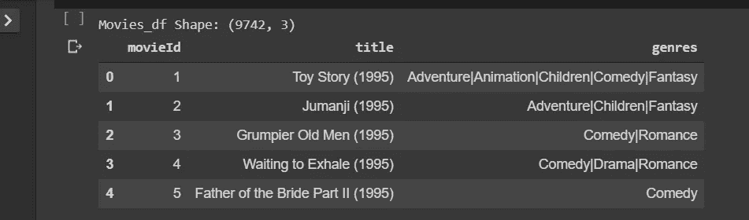

展示电影的形状和前 5 个观察结果 _df

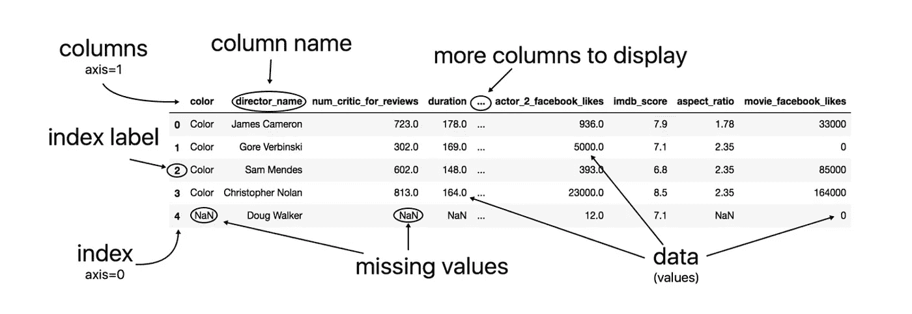

解剖熊猫数据框，礼貌:-熊猫食谱。

# 数据清理和预处理:

**movies_df 数据集:**

让我们使用 pandas 的便捷的 [*提取*](http://pandas.pydata.org/pandas-docs/stable/generated/pandas.Series.str.extract.html#pandas.Series.str.extract) 功能，将年份从标题列中移除，放入它自己的列中。

```
#Using regular expressions to find a year stored between parentheses
#We specify the parentheses so we don't conflict with movies that have years in their titles.movies_df['year'] = movies_df.title.str.extract('(\(\d\d\d\d\))',expand=False)#Removing the parentheses.
movies_df['year'] = movies_df.year.str.extract('(\d\d\d\d)',expand=False)# Note that expand=False simply means do not add this adjustment as an additional column to the data frame.#Removing the years from the 'title' column.
movies_df['title'] = movies_df.title.str.replace('(\(\d\d\d\d\))', '')#Applying the strip function to get rid of any ending white space characters that may have appeared, using lambda function.movies_df['title'] = movies_df['title'].apply(lambda x: x.strip())
```

我们来看看结果吧！

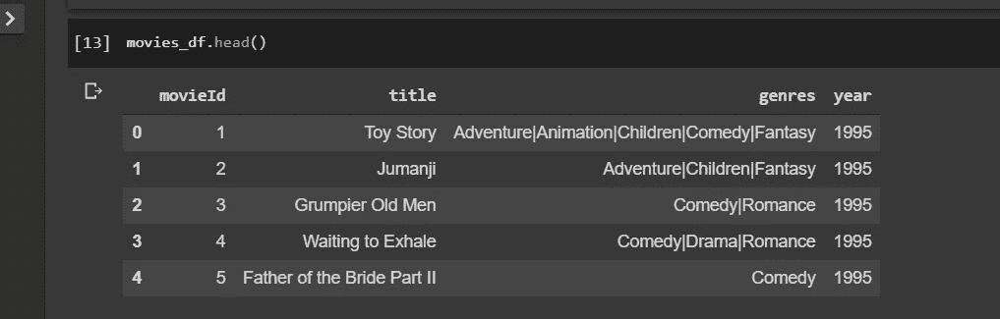

年份现在是一个独特的列。

为了方便起见，让我们将**流派**列中的值拆分成一个**流派列表**。使用 Python 的拆分字符串函数。

```
#Every genre is separated by a | so we simply have to call the split function on |.movies_df['genres'] = movies_df.genres.str.split('|')
movies_df.head()
```

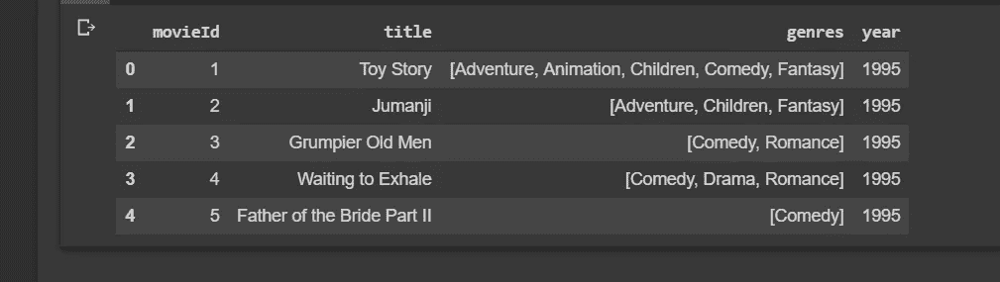

将熊猫系列拆分成一个字符串列表。

让我们来查看数据摘要，

```
movies_df.info()
>><class 'pandas.core.frame.DataFrame'> 
RangeIndex: 9742 entries, 0 to 9741                              Data columns (total 4 columns):                               movieId    9742 non-null int64                                  title      9742 non-null object                                genres     9742 non-null object                                  year       9729 non-null object                               dtypes: int64(1), object(3) memory usage: 304.5+ KB
```

让我们检查缺失的值

```
movies_df.isna().sum()
>>movieId     0 
title       0 
genres      0 
year       13 
dtype: int64
```

year 列中只有 13 个缺失值，让我们用零(0)填充它们，并将 year 列从 object type 转换为 *int* 。

```
# Filling year NaN values with zeros.
movies_df.year.fillna(0, inplace=True)# Converting columns year from obj to int16 and movieId from int64 to int32 to save memory.movies_df.year = movies_df.year.astype('int16')
movies_df.movieId = movies_df.movieId.astype('int32')
```

让我们再次查看数据类型的汇总。

```
# Checking the data types.
movies_df.dtypes
>>movieId      int32 
title      object 
genres     object 
year         int16 
dtype: object
```


数据预处理… |来源: [*img_credit*](http://www.datapreparator.com/_Media/kddpicture-3.jpeg)

现在，让我们将[](https://hackernoon.com/what-is-one-hot-encoding-why-and-when-do-you-have-to-use-it-e3c6186d008f)*这几个流派一一编码。这种编码是输入分类数据所必需的。我们在包含 1 或 0 的列中存储每个不同的流派。1 表示电影有那种类型，0 表示没有。让我们将这个数据框存储在另一个变量中，以防我们在某个时候需要没有流派的数据框。*

```
*# First let's make a copy of the movies_df.
movies_with_genres = movies_df.copy(deep=True)# Let's iterate through movies_df, then append the movie genres as columns of 1s or 0s.
# 1 if that column contains movies in the genre at the present index and 0 if not.x = []
for index, row in movies_df.iterrows():
    x.append(index)
    for genre in row['genres']:
        movies_with_genres.at[index, genre] = 1# Confirm that every row has been iterated and acted upon.
print(len(x) == len(movies_df))movies_with_genres.head(3)*
```

*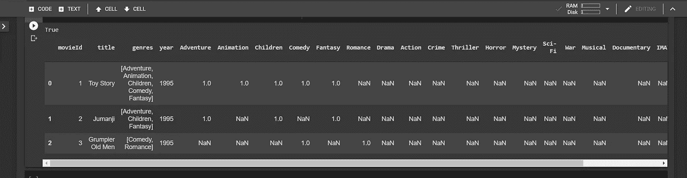*

*显示电影类型栏的输出。如果电影类型存在，每个索引填充 1，否则填充 NaN。*

*让我们简单地用零填充 NaNs，以表明一部电影不属于该列的类型。*

```
*#Filling in the NaN values with 0 to show that a movie doesn't have that column's genre.
movies_with_genres = movies_with_genres.fillna(0)
movies_with_genres.head(3)*
```

*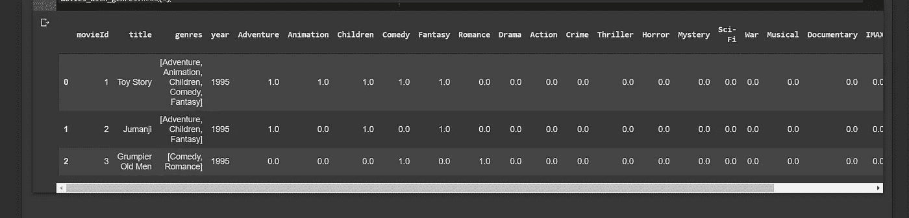*

*用 1 或 0 填充的电影类型列。*

***评分 _df 数据集:***

*让我们再次查看前 5 行。*

```
*# print out the shape and first five rows of ratings data.
print('Ratings_df shape:',ratings_df.shape)          ratings_df.head()*
```

**

*收视率数据集的前五个观察值。*

*分级数据框中的每一行都有一个与至少一个电影 Id 相关联的用户 Id、一个分级和显示他们何时观看它的时间戳。我们不需要时间戳，所以为了节省内存，我们放弃它。*

```
*# Dropping the timestamp column
ratings_df.drop('timestamp', axis=1, inplace=True)# Confirming the drop
ratings_df.head(3)*
```

*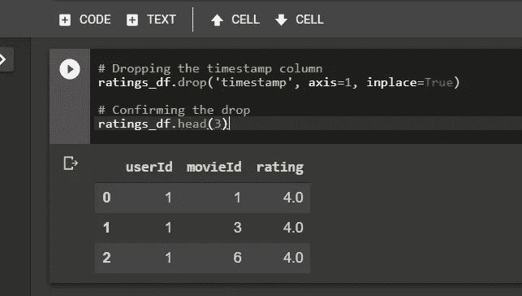*

*没有时间戳列的 ratings_df。*

*让我们确认评级数据集中的每一列都存在正确的数据类型*

```
*# Let's confirm the right data types exist per column in ratings data_setratings_df.dtypes
>>
userId       int64 
movieId      int64 
rating     float64 
dtype: object# All data types are correct.*
```

*让我们检查丢失的值，*

```
*# Let's check for missing valuesratings_df.isna().sum()
>>
userId     0 
movieId    0 
rating     0 
dtype: int64# No missing values*
```

*数据清理和预处理已经完成！让我们开始构建…*

**

*[img_credit](https://sigmoidal.io/wp-content/uploads/2017/09/Recommendation-systems.jpg)*

# *基于内容的推荐系统；*

*让我们实现一个基于内容或条目的推荐系统。我们会根据用户看过的电影和对电影的评价，找出用户喜欢的电影类型。*

*让我们从创建一个推荐电影的输入用户开始。用户的名字将会是**劳伦斯*。****

***注意:**请随意在下面的词典列表中添加或删除电影！一定要用大写字母写，如果一部电影以“The”开头，比如“复仇者联盟”，那么就像这样写:“复仇者联盟，The”。*

> *如果您添加的电影不在这里，那么它可能不在原始的
> movies_df 中，或者它的拼写可能不同，请检查大小写。*

***步骤 1** :创建*劳伦斯的个人资料**

```
*# so on a scale of 0 to 5, with 0 min and 5 max, see Lawrence's movie ratings below.
Lawrence_movie_ratings = [
            {'title':'Predator', 'rating':4.9},
            {'title':'Final Destination', 'rating':4.9},
            {'title':'Mission Impossible', 'rating':4},
            {'title':"Beverly Hills Cop", 'rating':3},
            {'title':'Exorcist, The', 'rating':4.8},
            {'title':'Waiting to Exhale', 'rating':3.9},
            {'title':'Avengers, The', 'rating':4.5},
            {'title':'Omen, The', 'rating':5.0}
         ] 
Lawrence_movie_ratings = pd.DataFrame(Lawrence_movie_ratings)
Lawrence_movie_ratings*
```

*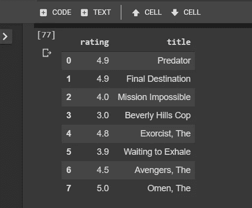*

*劳伦斯看过并评价过的电影精选。*

*让我们从上面的 movies_df 数据帧中提取电影 Id，将电影 Id 添加到 Lawrence_movie_ratings 中。*

```
*# Extracting movie Ids from movies_df and updating lawrence_movie_ratings with movie Ids.Lawrence_movie_Id = movies_df[movies_df['title'].isin(Lawrence_movie_ratings['title'])]# Merging Lawrence movie Id and ratings into the lawrence_movie_ratings data frame. 
# This action implicitly merges both data frames by the title column.Lawrence_movie_ratings = pd.merge(Lawrence_movie_Id, Lawrence_movie_ratings)# Display the merged and updated data frame.Lawrence_movie_ratings*
```

*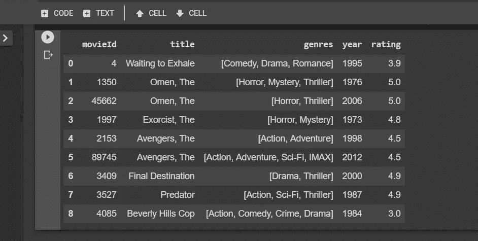*

*将电影 id 添加到电影选择中。*

*步骤 1 的最后一步是删除不相关的列*

```
*#Dropping information we don't need such as year and genres
Lawrence_movie_ratings = Lawrence_movie_ratings.drop(['genres','year'], 1)# Final profile for Lawrence
Lawrence_movie_ratings*
```

*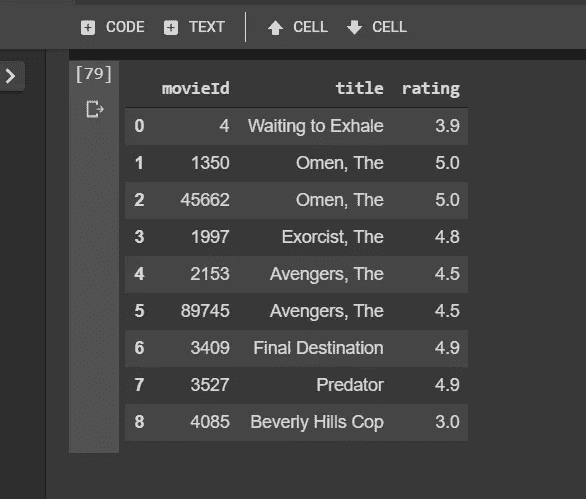*

*劳伦斯电影评级的最终看法。*

***第二步** : *学习劳伦斯的简介**

*让我们从包含具有二进制值的类型的 movies _ with _ genres 数据帧中获得 Lawrence 已经评级的电影的子集。我们姑且称这个子集为劳伦斯 _ 流派 _df。*

```
*# filter the selection by outputing movies that exist in both Lawrence_movie_ratings and movies_with_genres.Lawrence_genres_df = movies_with_genres[movies_with_genres.movieId.isin(Lawrence_movie_ratings.movieId)]Lawrence_genres_df*
```

*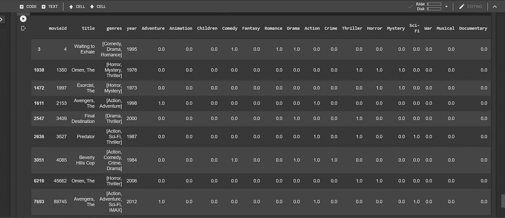*

*Lawrence _ genres _ df 显示他已评级的电影类型*

*让我们稍微清理一下 Lawrence _ genres _ df，重置索引，删除我们不需要的列。*

```
*# First, let's reset index to default and drop the existing index.
Lawrence_genres_df.reset_index(drop=True, inplace=True)# Next, let's drop redundant columns
Lawrence_genres_df.drop(['movieId','title','genres','year'], axis=1, inplace=True)# Let's view changesLawrence_genres_df*
```

*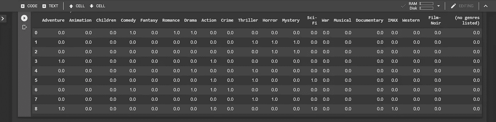*

*更新后的 Lawrence _ genres _ df 仅包含电影类型和 1 或 0，表示电影是否属于该类型。*

***第三步**:建立劳伦斯的个人资料*

*要做到这一点，我们要把每个流派变成权重，通过劳伦斯 _ 流派 _df 表的转置乘以劳伦斯的电影评级。然后按列对结果表求和。这个操作实际上是一个矩阵和一个向量之间的 [***点积。***](https://stattrek.com/matrix-algebra/vector-multiplication.aspx?Tutorial=matrix)*

*首先，让我们确认一下我们最近定义的数据框的形状。*

```
*# let's confirm the shapes of our data frames to guide us as we do matrix multiplication.print('Shape of Lawrence_movie_ratings is:',Lawrence_movie_ratings.shape)
print('Shape of Lawrence_genres_df is:',Lawrence_genres_df.shape)
>>
Shape of Lawrence_movie_ratings is: (9, 3) Shape of Lawrence_genres_df is: (9, 20)*
```

*配置文件本身…*

```
*# Let's find the dot product of transpose of Lawrence_genres_df by Lawrence rating column.
Lawrence_profile = Lawrence_genres_df.T.dot(Lawrence_movie_ratings.rating)# Let's see the result
Lawrence_profile*
```

**

*劳伦斯的完整个人资料，显示他的电影类型偏好。*

*仅仅从他的简介就可以看出，劳伦斯最喜欢“惊悚片”、“动作片”和“恐怖片”。*

# *最终输出:*

**

*部署基于内容的推荐系统。*

***第四步** : *部署基于内容的推荐系统*。*

*现在，我们有了他所有偏好的权重。这就是所谓的**用户档案**。我们现在可以推荐符合劳伦斯档案的电影。*

*让我们首先编辑包含所有电影及其流派列的原始 movies _ with _ genres 数据框。*

```
*# let's set the index to the movieId.
movies_with_genres = movies_with_genres.set_index(movies_with_genres.movieId)# let's view the head.
movies_with_genres.head()*
```

*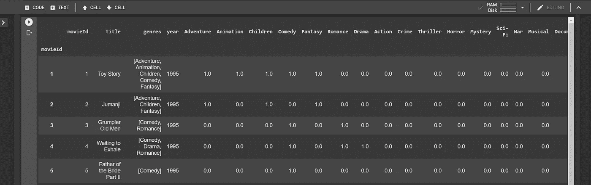*

*让我们再清理一下…*

*让我们从包含所有 9742 部电影和不同类型列的 movies _ with _ genres 数据框中删除不相关的列。*

```
*# Deleting four unnecessary columns.
movies_with_genres.drop(['movieId','title','genres','year'], axis=1, inplace=True)# Viewing changes.
movies_with_genres.head()*
```

*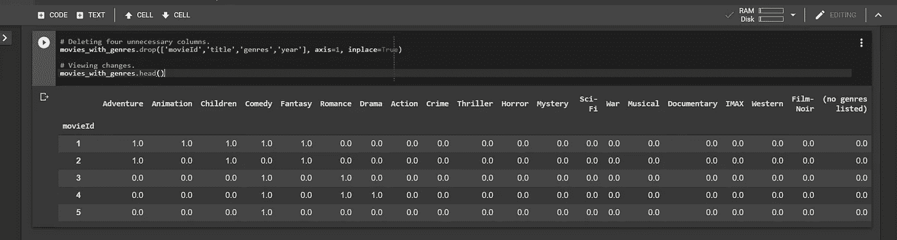*

*有了劳伦斯的简介和电影及其流派的完整列表，我们将定义一个**推荐表**。根据他的个人资料对每部电影进行加权平均，并推荐符合他偏好的前二十部电影…*

*这或多或少是 Lawrence_profile 的 movies _ with _ genres 数据帧的点积除以 Lawrence_profile 的总和。*

```
*# Multiply the genres by the weights and then take the weighted average.
recommendation_table_df = (movies_with_genres.dot(Lawrence_profile)) / Lawrence_profile.sum()*
```

*让我们按降序排列推荐 _ 表 _df。*

```
*# Let's sort values from great to small
recommendation_table_df.sort_values(ascending=False, inplace=True)#Just a peek at the values
recommendation_table_df.head()*
```

*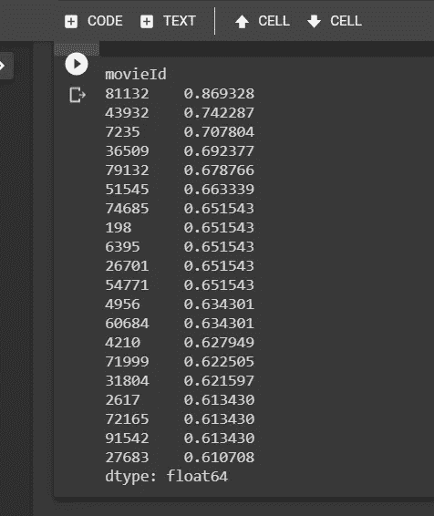*

*显示劳伦斯的前 20 部电影 id/分级的推荐表*

*现在下面是推荐表！按照与劳伦斯的档案匹配的偏好降序排列的前 20 部电影的电影细节和类型。*

```
*# first we make a copy of the original movies_df
copy = movies_df.copy(deep=True)# Then we set its index to movieId
copy = copy.set_index('movieId', drop=True)# Next we enlist the top 20 recommended movieIds we defined above
top_20_index = recommendation_table_df.index[:20].tolist()# finally we slice these indices from the copied movies df and save in a variable
recommended_movies = copy.loc[top_20_index, :]# Now we can display the top 20 movies in descending order of preference
recommended_movies*
```

*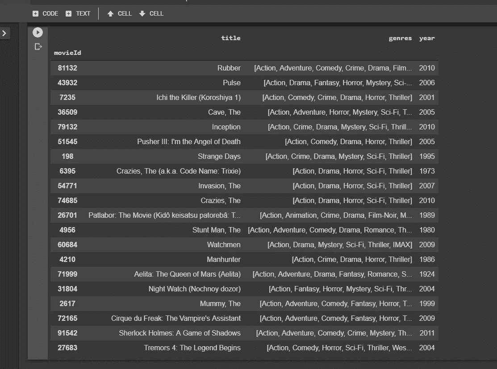*

*劳伦斯的前 20 部电影，基于他的个人资料，喜好和评分。*

# *利弊:*

*赞成的意见*

*   *了解用户的偏好*
*   *高度个性化的用户*

*骗局*

*   *没有考虑到其他人对商品的看法，因此可能会出现低质量的商品推荐*
*   *提取数据并不总是直观的*
*   *确定用户不喜欢或喜欢项目的什么特征并不总是显而易见的*
*   *没有新的电影类型会被推荐给用户，除非用户评价或表明他/她对该类型的偏好。*

*[***参见此处链接***](https://courses.cognitiveclass.ai/courses/course-v1:CognitiveClass+ML0101ENv3+2018/courseware/c6143d9ff5764057a91e53fa8a3a6dff/00c2cd249d94403688ae979661e8eebf/)*

# *总结:*

*感谢您耐心阅读这篇文章。我希望你已经学会了一两件事…学习最好是通过做，请随意在 Github 的 这里浏览 [***笔记本，并在下面发表评论或观察。***](https://github.com/Lawrence-Krukrubo/Building-a-Content-Based-Movie-Recommender-System/blob/master/building_a_content_based_recommendation_system.ipynb)*

*如需进一步学习，请查看 IBM[***cognitive class . ai***的免费课程](https://cognitiveclass.ai/badges/machine-learning-python/)*

***干杯！***

## *关于我:*

*劳伦斯是技术层的数据专家，对公平和可解释的人工智能和数据科学充满热情。我持有 IBM 的 ***数据科学专业*** *和* ***高级数据科学专业*** *证书。我已经使用 ML 和 DL 库进行了几个项目，我喜欢尽可能多地编写函数代码，即使现有的库比比皆是。最后，我从未停止学习和实验，是的，我拥有几个数据科学和人工智能认证，并且我已经写了几篇强烈推荐的文章。**

*请随时在以下网址找到我*

*[**Github**](https://github.com/Lawrence-Krukrubo)*

*[**领英**](https://www.linkedin.com/in/lawrencekrukrubo/)*

*[**推特**](https://twitter.com/LKrukrubo)*