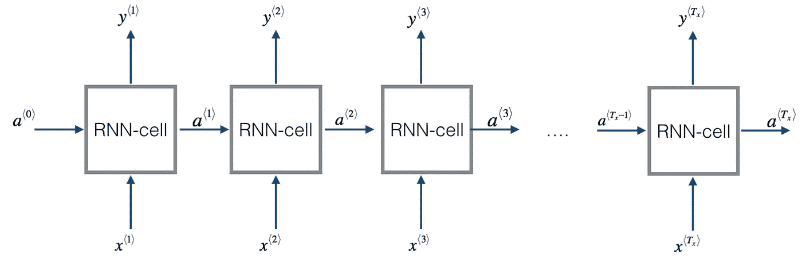
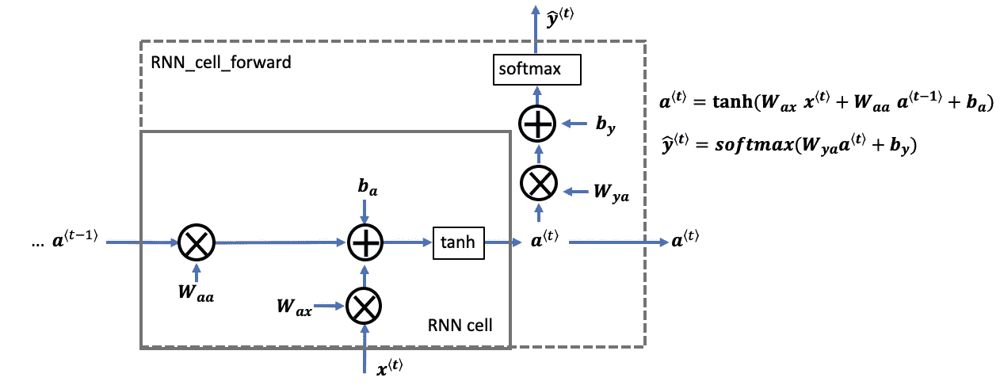
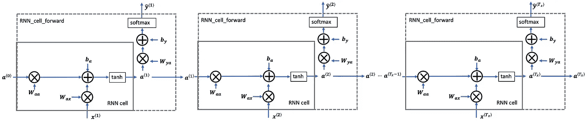
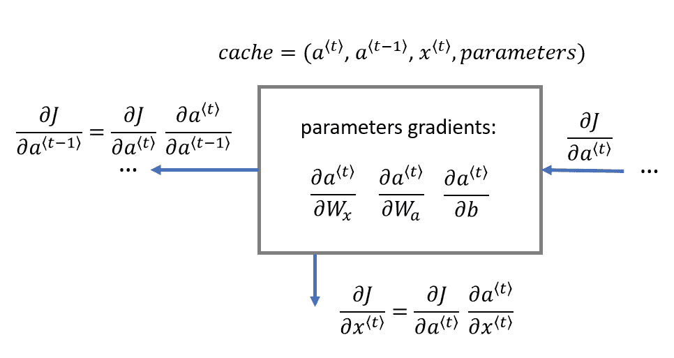
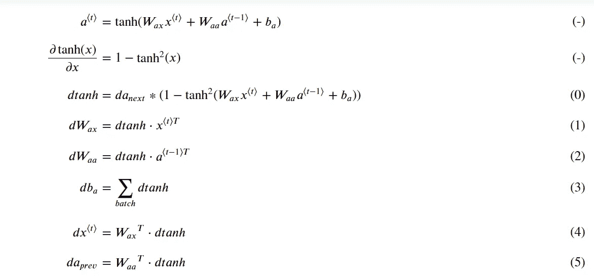

# 用 Python 从头开始构建递归神经网络

> 原文：<https://pub.towardsai.net/building-a-recurrent-neural-network-from-scratch-in-python-3ad244b1054f?source=collection_archive---------1----------------------->

## 如何使用基本的 Python 库构建基本的 RNN

通用神经网络(RNN)是一个非常强大的自然语言处理和其他序列建模任务的模型，因为它们有一个所谓的记忆细胞。他们可以一次读取一个输入𝑥⟨𝑡⟩(如单词)，并通过从一个步骤传递到下一个步骤的隐藏层激活来记住一些上下文信息。这允许单向(单向)RNN 从过去获取信息来处理后来的输入。双向(双向)RNN 可以从过去和未来获取上下文。

在本文中，我们将使用 Python 编程语言的基本函数和库从头开始实现 RNN 模型。我们首先将开始构建 RNN 的前向传播，然后是 RNN 的后向传播，并将它们结合在一起以得到一个功能完整的 RNN 模型。


照片由 [DeepMind](https://unsplash.com/@deepmind?utm_source=medium&utm_medium=referral) 在 [Unsplash](https://unsplash.com?utm_source=medium&utm_medium=referral) 上拍摄

## 目录:

1.  **递归神经网络的前向传播
    1.1。RNN 细胞
    1.2。RNN 向前传球**
2.  **递归神经网络的反向传播
    2.1。RNN 向后单元格
    2.2。RNN 向后传球**
3.  **参考**

**如果你想免费学习数据科学和机器学习，看看这些资源:**

*   免费互动路线图，自学数据科学和机器学习。从这里开始:[https://aigents.co/learn/roadmaps/intro](https://aigents.co/learn/roadmaps/intro)
*   数据科学学习资源搜索引擎(免费)。将你最喜欢的资源加入书签，将文章标记为完整，并添加学习笔记。[https://aigents.co/learn](https://aigents.co/learn)
*   想要在导师和学习社区的支持下从头开始学习数据科学吗？免费加入这个学习圈:[https://community.aigents.co/spaces/9010170/](https://community.aigents.co/spaces/9010170/)

如果你想在数据科学&人工智能领域开始职业生涯，但不知道如何开始。我提供数据科学指导课程和长期职业指导:

*   长期指导:[https://lnkd.in/dtdUYBrM](https://lnkd.in/dtdUYBrM)
*   辅导会议:[https://lnkd.in/dXeg3KPW](https://lnkd.in/dXeg3KPW)

***加入*** [***中等会员***](https://youssefraafat57.medium.com/membership) ***计划继续无限制学习。如果你使用下面的链接，我会收到一小部分会员费，不需要你额外付费。***

[](https://youssefraafat57.medium.com/membership) [## 加入我的介绍链接媒体-优素福胡斯尼

### 阅读 Youssef Hosni(以及媒体上成千上万的其他作家)的每一个故事。您的会员费直接支持…

youssefraafat57.medium.com](https://youssefraafat57.medium.com/membership) 

# 1.递归神经网络的前向传播

我们将从 RNN 的正向传播开始。在本文中，我们将实现如图 1 所示的基本 RNN 模型。

**输入𝑥:的尺寸**

用𝑛𝑥单位数输入

*   对于单个输入示例的单个时间步长，𝑥(𝑖)⟨𝑡⟩是一维输入向量。
*   以语言为例，一种有 5000 个单词的语言可以一次性编码成一个有 5000 个单位的向量。所以𝑥(𝑖)⟨𝑡⟩would 有形状(5000，)。
*   这里使用符号𝑛𝑥来表示单个训练示例的单个时间步长中的单位数。

**𝑇𝑥尺寸的时间步长**

*   一个递归神经网络有多个时间步长，你可以用𝑡.来索引

**批量𝑚**

*   假设我们有小批量，每个小批量有 20 个训练样本
*   为了从矢量化中受益，您将堆叠 20 列𝑥(𝑖)示例
*   例如，这个张量的形状是(5000，20，10)
*   您将使用𝑚m 来表示训练样本的数量
*   S9o，小批量的形状是(𝑛𝑥，𝑚，𝑇𝑥)

**三维形状张量(𝑛𝑥,𝑚,𝑇𝑥)**

*   形状的三维张量𝑥x(𝑛𝑥,𝑚,𝑇𝑥)表示被馈入 RNN 的输入𝑥。

为每个时间步长取一个 2D 切片:𝑥⟨𝑡⟩

*   在每个时间步骤，您将使用一个小批量的训练示例(不仅仅是一个示例)
*   因此，对于每一个时间步𝑡，你将使用一个二维切片的形状(𝑛𝑥,𝑚)
*   这个 2D 切片被称为𝑥⟨𝑡⟩.

**隐藏状态𝑎的定义**

*   从一个时间步骤到另一个时间步骤传递给 RNN 的激活𝑎⟨𝑡⟩a⟨t⟩被称为“隐藏状态”

**隐藏状态𝑎的维度**

*   类似于输入张量𝑥x，单个训练示例的隐藏状态是长度为𝑛𝑎的向量
*   如果包括小批量的𝑚m 培训示例，小批量的形状为(𝑛𝑎,𝑚)
*   当包括时间步长维度时，隐藏状态的形状为(𝑛𝑎,𝑚,𝑇𝑥)
*   您将使用索引𝑡t 循环时间步长，并使用 3D 张量的 2D 切片
*   这个 2D 切片被称为𝑎⟨𝑡⟩a⟨t⟩
*   这个二维切片的形状是(𝑛𝑎,𝑚)

**预测𝑦̂的维度**

*   类似于输入和隐藏状态，𝑦̂是一个三维形状张量(𝑛𝑦,𝑚,𝑇𝑦)
*   代表预测的向量中的𝑛𝑦:单位数
*   小批量样品的𝑚:数量
*   预测中的𝑇𝑦:时间步数

对于单个时间步长𝑡，2D 切片𝑦̂ ⟨𝑡⟩已经成形(𝑛𝑦,𝑚)

**下面是你如何实现一个 RNN:**

*   实现 RNN 的一次性步骤所需的计算。
*   在𝑇𝑥Tx 时间步长上执行循环，以便一次处理一个输入。



图一。基本 RNN 模型

## 1.1.递归神经网络细胞

我们可以把图 1 所示的 RNN 模型看作是图 2 所示的单个细胞的重复使用。首先，我们将实现一个单个单元，然后我们可以循环遍历它，将多个单个单元相互堆叠起来，并创建 RNN 模型的正向传递。



图二。基本 RNN 细胞。

基本 RNN 单元将𝑥⟨𝑡⟩(当前输入)和𝑎⟨𝑡−1⟩(包含来自过去的信息的先前隐藏状态)作为输入，并输出𝑎⟨𝑡⟩a⟨，该被提供给下一个 RNN 单元，并且也用于预测𝑦̂ ⟨𝑡⟩.

让我们通过以下四个主要步骤来实现图 2 所示的 RNN 单元:

1.  用 tanh 激活计算隐藏状态:𝑎⟨𝑡⟩=tanh(𝑊⟨𝑎𝑎⟩*𝑎⟨𝑡−1⟩+𝑊⟨𝑎𝑥⟩*𝑥⟨𝑡⟩+𝑏⟨𝑎⟩)
2.  使用新的隐藏状态𝑎⟨𝑡⟩，计算预测𝑦̂ ⟨𝑡⟩ = 𝑠𝑜𝑓𝑡𝑚𝑎𝑥(𝑊⟨𝑦𝑎⟩*𝑎⟨𝑡⟩ +𝑏⟨𝑦⟩).
3.  商店(𝑎⟨𝑡⟩、𝑎⟨𝑡−1⟩、𝑥⟨𝑡⟩、𝑝𝑎𝑟𝑎𝑚𝑒𝑡𝑒𝑟𝑠)中的一家`cache`
4.  返回𝑎⟨𝑡⟩、𝑦̂ ⟨𝑡⟩和`cache`

让我们首先实现 softmax 激活函数:

```
def softmax(x):
    e_x = np.exp(x - np.max(x))
    return e_x / e_x.sum(axis=0)
```

接下来，让我们使用下面的代码实现上面显示的四个步骤:

```
def rnn_cell_forward(xt, a_prev, parameters):
    """
    Implements a single forward step of the RNN-cell as described in Figure (2)

    Arguments:
    xt -- your input data at timestep "t", numpy array of shape (n_x, m).
    a_prev -- Hidden state at timestep "t-1", numpy array of shape (n_a, m)
    parameters -- python dictionary containing:
                        Wax -- Weight matrix multiplying the input, numpy array of shape (n_a, n_x)
                        Waa -- Weight matrix multiplying the hidden state, numpy array of shape (n_a, n_a)
                        Wya -- Weight matrix relating the hidden-state to the output, numpy array of shape (n_y, n_a)
                        ba --  Bias, numpy array of shape (n_a, 1)
                        by -- Bias relating the hidden-state to the output, numpy array of shape (n_y, 1)
    Returns:
    a_next -- next hidden state, of shape (n_a, m)
    yt_pred -- prediction at timestep "t", numpy array of shape (n_y, m)
    cache -- tuple of values needed for the backward pass, contains (a_next, a_prev, xt, parameters)
    """

    # Retrieve parameters from "parameters"
    Wax = parameters["Wax"]
    Waa = parameters["Waa"]
    Wya = parameters["Wya"]
    ba = parameters["ba"]
    by = parameters["by"]

    # compute next activation state using the formula given above
    a_next = np.tanh(np.dot(Wax,xt) + np.dot(Waa,a_prev) + ba)
    # compute output of the current cell using the formula given above
    yt_pred = softmax(np.dot(Wya,a_next) + by) 

    # store values you need for backward propagation in cache
    cache = (a_next, a_prev, xt, parameters)

    return a_next, yt_pred, cache
```

## 1.2.RNN 向前传球

递归神经网络(RNN)是我们刚刚建立的 RNN 细胞的重复。如果你的数据输入序列是 10 个时间步长，那么你将重复使用 RNN 单元 10 次。这如图 3 所示。

每个单元在每个时间步长接受两个输入:

*   𝑎⟨𝑡−1⟩:来自前一个单元格的隐藏状态
*   𝑥⟨𝑡⟩:当前时间步的输入数据

它在每个时间步有两个输出:

*   一个隐藏的国家(𝑎⟨𝑡⟩)
*   一个预言(𝑦⟨𝑡⟩)

权重和偏差(𝑊𝑎𝑎、𝑏𝑎、𝑊𝑎𝑥、𝑏𝑥)在每个时间步重复使用

*   它们在调用“参数”字典中的`rnn_cell_forward`之间被维护



图 3。RNN 模型

**实现如图 3** 所示的 RNN 模型:

1.  创建一个由 0 和形状(𝑛𝑎、𝑚、𝑇𝑥)的**和**组成的 3D 数组，该数组将存储 RNN 计算出的所有隐藏状态。
2.  创建一个形状为(𝑛𝑦，𝑚，𝑇𝑥)的零，𝑦̂的三维数组来存储预测。请注意，在这种情况下，𝑇𝑦=𝑇𝑥(预测和输入具有相同数量的时间步长)
3.  通过将 2D 隐藏状态`a_next`设置为初始隐藏状态𝑎0 来初始化它
4.  在每个时间步𝑡 :
    4.1。**得到** 𝑥⟨𝑡⟩，这是一个单一时间步长𝑡.的𝑥的二维切片𝑥⟨𝑡⟩有形状(𝑛𝑥，𝑚)，x 有形状(𝑛𝑥，𝑚，𝑇𝑥).
    4.1。**更新**2d 隐藏状态𝑎⟨𝑡⟩(变量名`a_next`)、预测𝑦̂⟨𝑡⟩和缓存通过运行`rnn_cell_forward .`a⟨t⟩已经成形(𝑛⟨𝑎⟩、𝑚).
    4.3。**存储**3d 张量𝑎中的 2D 隐藏状态，在𝑡-th 位置 a 有形状(𝑛𝑎，𝑚，𝑇⟨𝑥⟩)
    4.4。**在𝑡-th 位置的 3D 张量𝑦̂ 𝑝𝑟𝑒𝑑中存储**2d𝑦̂⟨𝑡⟩预测(变量名`yt_pred`)。𝑦̂ ⟨𝑡⟩有形状(𝑛𝑦,𝑚)和𝑦̂有形状(𝑛𝑦,𝑚,𝑇𝑥)
    4.6。**将缓存添加到缓存列表中**
5.  返回 3D 张量𝑎a 和𝑦̂，以及缓存列表

```
def rnn_forward(x, a0, parameters):
    """
    Implement the forward propagation of the recurrent neural network described in Figure (3).

    Arguments:
    x -- Input data for every time-step, of shape (n_x, m, T_x).
    a0 -- Initial hidden state, of shape (n_a, m)
    parameters -- python dictionary containing:
                        Waa -- Weight matrix multiplying the hidden state, numpy array of shape (n_a, n_a)
                        Wax -- Weight matrix multiplying the input, numpy array of shape (n_a, n_x)
                        Wya -- Weight matrix relating the hidden-state to the output, numpy array of shape (n_y, n_a)
                        ba --  Bias numpy array of shape (n_a, 1)
                        by -- Bias relating the hidden-state to the output, numpy array of shape (n_y, 1)

    Returns:
    a -- Hidden states for every time-step, numpy array of shape (n_a, m, T_x)
    y_pred -- Predictions for every time-step, numpy array of shape (n_y, m, T_x)
    caches -- tuple of values needed for the backward pass, contains (list of caches, x)
    """

    # Initialize "caches" which will contain the list of all caches
    caches = []

    # Retrieve dimensions from shapes of x and parameters["Wya"]
    n_x, m, T_x = x.shape
    n_y, n_a = parameters["Wya"].shape

    # initialize "a" and "y_pred" with zeros (≈2 lines)
    a = np.zeros((n_a, m, T_x))
    y_pred = np.zeros((n_y, m, T_x))

    # Initialize a_next (≈1 line)
    a_next = a0

    # loop over all time-steps
    for t in range(T_x):
        # Update next hidden state, compute the prediction, get the cache (≈1 line)
        a_next, yt_pred, cache = rnn_cell_forward(x[:,:,t], a_next, parameters)
        # Save the value of the new "next" hidden state in a (≈1 line)
        a[:,:,t] = a_next
        # Save the value of the prediction in y (≈1 line)
        y_pred[:,:,t] = yt_pred
        # Append "cache" to "caches" (≈1 line)
        caches.append(cache)

    # store values needed for backward propagation in cache
    caches = (caches, x)

    return a, y_pred, caches
```

# 2.递归神经网络的反向传播

在所有现代的深度学习框架中，你只需要实现前向传递，框架负责后向传递，所以大多数深度学习工程师不需要为后向传递的细节费心。然而，如果你正处于学习阶段，或者你有足够的好奇心去看看 RNN 模型是如何真正工作的，那么看一看或者甚至从头开始实现它将是很重要的。

## 2.1. **RNN 落后的牢房**

RNN 的向后传球如下图所示。我们将首先实现该单元，然后使用它来实现 RNN 的反向传播:



图 4。RNN 的反向传递细胞。

要计算 RNN 向后像元，可以使用以下公式:



现在让我们使用下面的代码来实现这些等式:

```
def rnn_cell_backward(da_next, cache):
    """
    Implements the backward pass for the RNN-cell (single time-step).

    Arguments:
    da_next -- Gradient of loss with respect to next hidden state
    cache -- python dictionary containing useful values (output of rnn_cell_forward())

    Returns:
    gradients -- python dictionary containing:
                        dx -- Gradients of input data, of shape (n_x, m)
                        da_prev -- Gradients of previous hidden state, of shape (n_a, m)
                        dWax -- Gradients of input-to-hidden weights, of shape (n_a, n_x)
                        dWaa -- Gradients of hidden-to-hidden weights, of shape (n_a, n_a)
                        dba -- Gradients of bias vector, of shape (n_a, 1)
    """

    # Retrieve values from cache
    (a_next, a_prev, xt, parameters) = cache

    # Retrieve values from parameters
    Wax = parameters["Wax"]
    Waa = parameters["Waa"]
    Wya = parameters["Wya"]
    ba = parameters["ba"]
    by = parameters["by"]

    # compute the gradient of tanh with respect to a_next (≈1 line)
    dtanh = (1-a_next*a_next)*da_next

    # compute the gradient of the loss with respect to Wax (≈2 lines)
    dxt = np.dot(Wax.T,  dtanh)
    dWax = np.dot(dtanh,xt.T)

    # compute the gradient with respect to Waa (≈2 lines)
    da_prev = np.dot(Waa.T, dtanh)  
    dWaa = np.dot( dtanh,a_prev.T)

    # compute the gradient with respect to b (≈1 line)
    dba = np.sum( dtanh,keepdims=True,axis=-1)

    # Store the gradients in a python dictionary
    gradients = {"dxt": dxt, "da_prev": da_prev, "dWax": dWax, "dWaa": dWaa, "dba": dba}

    return gradients
```

## 2.2. **RNN 向后传球**

在每个时间步长 t 计算成本相对于𝑎⟨𝑡⟩at 的梯度是有用的，因为这有助于梯度反向传播到前一个 RNN 小区。要做到这一点，我们需要迭代所有的时间步骤，从最后开始，在每一步，你增加整个𝑑𝑏⟨𝑎⟩，𝑑𝑊⟨𝑎𝑎⟩，𝑑𝑊⟨𝑎𝑥⟩和你存储𝑑𝑥.

**指令**:

执行`rnn_backward`功能。首先用零初始化返回变量，然后在每个时间步长调用`rnn_cell_backward`时循环所有时间步长，并相应地更新其他变量。

```
def rnn_backward(da, caches):
    """
    Implement the backward pass for a RNN over an entire sequence of input data.

    Arguments:
    da -- Upstream gradients of all hidden states, of shape (n_a, m, T_x)
    caches -- tuple containing information from the forward pass (rnn_forward)

    Returns:
    gradients -- python dictionary containing:
                        dx -- Gradient w.r.t. the input data, numpy-array of shape (n_x, m, T_x)
                        da0 -- Gradient w.r.t the initial hidden state, numpy-array of shape (n_a, m)
                        dWax -- Gradient w.r.t the input's weight matrix, numpy-array of shape (n_a, n_x)
                        dWaa -- Gradient w.r.t the hidden state's weight matrix, numpy array of shape (n_a, n_a)
                        dba -- Gradient w.r.t the bias, of shape (n_a, 1)
    """

    ### START CODE HERE ###

    # Retrieve values from the first cache (t=1) of caches (≈2 lines)
    (caches, x) = caches
    (a1, a0, x1, parameters) = caches[0]

    # Retrieve dimensions from da's and x1's shapes (≈2 lines)
    n_a, m, T_x = da.shape
    n_x, m = x1.shape 

    # initialize the gradients with the right sizes (≈6 lines)
    dx = np.zeros((n_x, m, T_x)) 
    dWax = np.zeros((n_a, n_x))
    dWaa = np.zeros((n_a, n_a))
    dba = np.zeros((n_a, 1)) 
    da0 = np.zeros((n_a, m))
    da_prevt = np.zeros((n_a, m))  

    # Loop through all the time steps
    for t in reversed(range(T_x)):
        # Compute gradients at time step t. Choose wisely the "da_next" and the "cache" to use in the backward propagation step. (≈1 line)
        gradients = rnn_cell_backward(da[:, :, t] + da_prevt, caches[t])
        # Retrieve derivatives from gradients (≈ 1 line)
        dxt, da_prevt, dWaxt, dWaat, dbat = gradients["dxt"], gradients["da_prev"], gradients["dWax"], gradients["dWaa"], gradients["dba"]
        # Increment global derivatives w.r.t parameters by adding their derivative at time-step t (≈4 lines)
        dx[:, :, t] = dxt  
        dWax += dWaxt  
        dWaa += dWaat  
        dba += dbat  

    # Set da0 to the gradient of a which has been backpropagated through all time-steps (≈1 line) 
    da0 = da_prevt
    ### END CODE HERE ###

    # Store the gradients in a python dictionary
    gradients = {"dx": dx, "da0": da0, "dWax": dWax, "dWaa": dWaa,"dba": dba}

    return gradients
```

***如果你喜欢这篇文章并愿意支持我，请务必:***

*   **👏为这个故事鼓掌(50 次)并跟我来👉**
*   **📰查看我的媒体档案中的更多内容**
*   **🔔关注我:**[**LinkedIn**](https://www.linkedin.com/in/youssef-hosni-b2960b135/)**|**[**Medium**](https://medium.com/@youssefraafat57)**|**[**GitHub**](https://github.com/youssefHosni)**|**[**Twitter**](https://twitter.com/Youssef70125494)
*   *🚀👉* ***加入*** [***中等会员***](https://youssefraafat57.medium.com/membership) ***计划继续无限制学习。如果你使用下面的链接，我会收到一小部分会员费，不需要你额外付费。***

[](https://youssefraafat57.medium.com/membership) [## 加入我的介绍链接媒体-优素福胡斯尼

### 阅读 Youssef Hosni(以及媒体上成千上万的其他作家)的每一个故事。您的会员费直接支持…

youssefraafat57.medium.com](https://youssefraafat57.medium.com/membership)