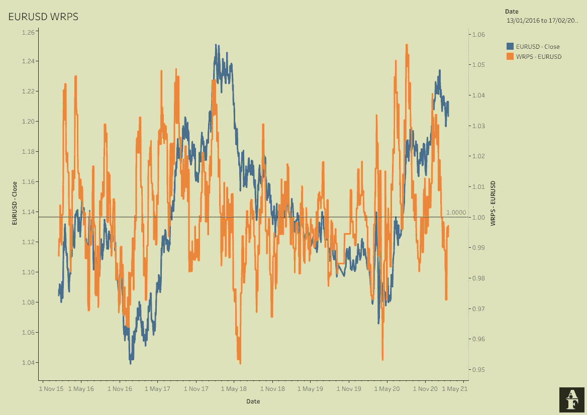
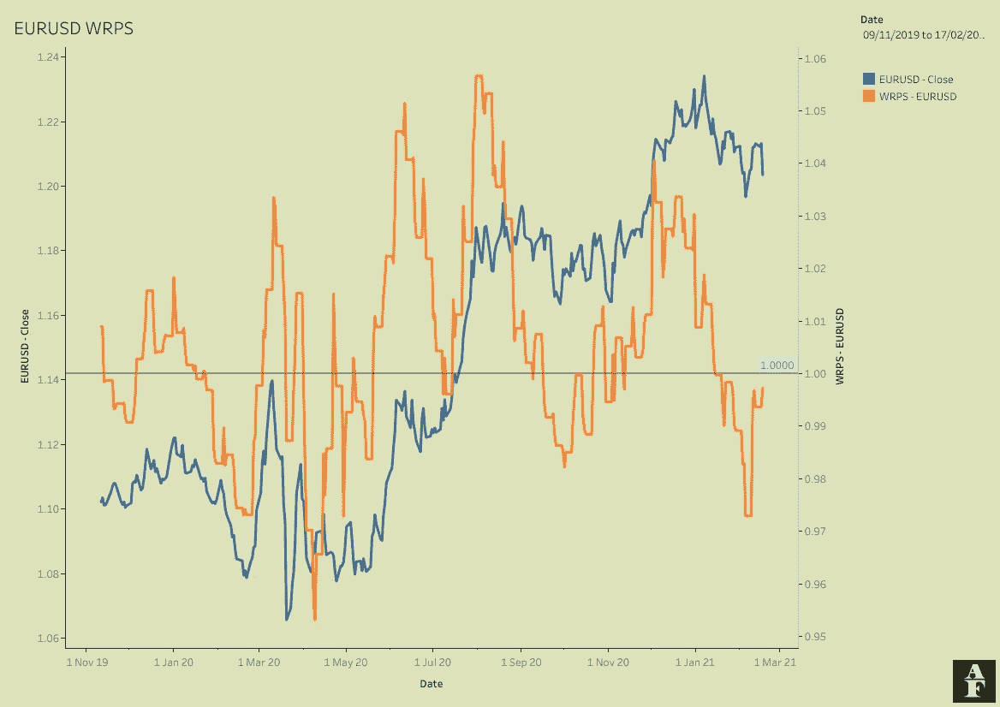
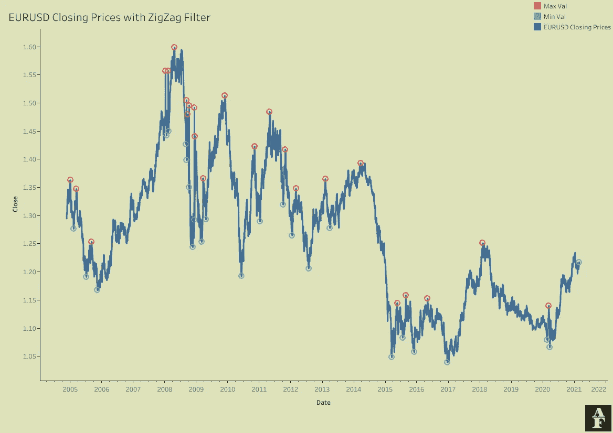
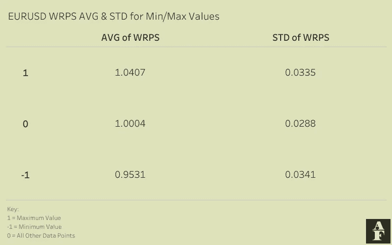

# 构建相对价格强度指标

> 原文：<https://pub.towardsai.net/building-a-relative-price-strength-metric-865c73c3028f?source=collection_archive---------2----------------------->

## [编程](https://towardsai.net/p/category/programming)


由[乔希·阿佩尔](https://unsplash.com/@joshappel?utm_source=unsplash&utm_medium=referral&utm_content=creditCopyText)在 [Unsplash](https://unsplash.com/s/photos/money?utm_source=unsplash&utm_medium=referral&utm_content=creditCopyText) 上拍摄的照片

时机是市场交易的关键。你可能知道整体情绪很低，但一旦你有了基本面，你需要用技术分析来支持这一点，以确保你抓住了一个资产的回调结束，而不是开始。这可以避免你在开始对你有利之前长时间亏损，或者在很多情况下，因为害怕市场继续对你不利而过早退出交易。

在这篇文章中，我想介绍 WRPS 指标——加权相对价格优势。这是一个相对简单的指标，用一句话来概括，这个指标使用当前价格作为过去价格的加权分数来表示当前价格的位置。这是一个相对简单的概念，无论如何都不完美，但下面的概念验证将表明，在您的分析中添加这样的指标肯定有一定的空间。

## 方法学

该指标的方法相对简单。我们取 4 个历史价格，分别是 1 个月、3 个月、6 个月和 12 个月前的价格，然后用这些价格除以当前价格。然后，我们取每个值，根据每个价格与当前价格的差距计算加权平均值。

我在下面附上了一段 python 代码。我从 yahoo finance 调用我的大部分定价数据，我们可以使用 yfinance 包。这样，我们将所需的数据放入一个数据框架中，计算我们的相对价格，然后计算我们的 WRPS 指标。

```
## Import required dependencies
import pandas as pd
import yfinance as yf## Pull Data
ticker = 'EURUSD=X'
asset = yf.Ticker(ticker)
df = asset.history(period = 'max')[['Open','High','Low','Close']]## Calculate Relative Price Strengths
# The data does not include weekends, so 1 month prior is 20 days, 3 months prior is 60 days etc.
df['1 Month RPS'] = df['Close']/df['Close'].shift(20)
df['3 Month RPS'] = df['Close']/df['Close'].shift(60)
df['6 Month RPS'] = df['Close']/df['Close'].shift(126)
df['12 Month RPS'] = df['Close']/df['Close'].shift(252)# Calculate WRPS
df['WRPS'] = (12*df['1 Month RPS']+ 4*df['3 Month RPS']+ 2*df['6 Month RPS'] + df['1 Month RPS'])/19
```

雅虎财经从 2003 年开始提供欧元兑美元的每日数据。下面的图表形象地说明了这一点。我们在双轴上绘制了收盘价与 WRPS 指标的关系。整体情况并没有告诉我们一个巨大的数量，下面的概念验证将更详细地说明我们实际上是如何检查的，以查看这里是否有任何统计意义，但是同一图表的放大图像有助于我们更好地理解这两条线之间的视觉关系。



WRPS 对欧元兑美元收盘



WRPS 对欧元兑美元收盘放大

## 概念证明

欧元兑美元的概念验证包括对之字形指标的介绍。这个滞后指标帮助我们在最低点和最高点出现后识别它们。由于明显的滞后，它不是一个可以单独用于交易策略的指标，但它在历史数据中非常有用，特别是由于它的准确性和简单性。一旦价格向相反的方向移动了预定的百分比，锯齿形指标将指定一个值作为最小点或最大点。默认值倾向于 5%，因此当价格上涨 5%时，之前的最低点被指定为最小值，反之则为最大值。正如你所看到的，我们需要价格的显著变化来确定这些转折点，这就是为什么这种策略不能用于交易，但对于分析目的来说，它是非常有用的。

下图显示了同样的欧元兑美元收盘价，但这次，我们圈出了我们的最低点和最高点，这是由具有 5%阈值的锯齿形指标产生的。



欧元兑美元收盘时使用锯齿形过滤器

我的概念验证集中在我们在最小点、最大点和所有其他点看到的 WRPS 值之间是否存在统计差异。下表显示了这一点。我们看到数据点的 3 种不同分类，后面是平均 WRPS 值和标准偏差。



汇总统计数据

我们可以看到每一组之间都有明显的不同。一旦我们的 WRPS 接近 1.04 的值，我们在过去已经看到，我们正在达到一个最大值。按照同样的思维过程，下降到 0.95 的值在过去给了我们证据，表明我们正在达到一个最低点。

我们当前收集转折点值的一个问题是缺少数据点来创建分布估计值。在上面的欧元兑美元图表中，我们有 24 个最大点数和 25 个最小点数。随着时间的推移，我们将生成更多的点，并更准确地表示我们的均值和标准差。

感谢您花时间阅读这篇文章。如果你喜欢这些内容，我将推出一份新的算法金融时事通讯，名为 Algo Fin，你可能会感兴趣。这篇时事通讯将探索数据科学和金融之间的联系，最初的重点是货币市场，但我希望在未来建立更多的途径。时事通讯目前是免费加入的，因为我仍计划为付费订户推出，所以如果这听起来像是你可能感兴趣的东西，它绝对值得查看[这里](https://algofin.substack.com/)！。