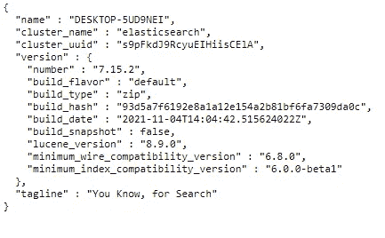

# 用 Elasticsearch 在 15 分钟内建立一个搜索引擎

> 原文：<https://pub.towardsai.net/building-a-search-engine-using-elasticsearch-in-15-minutes-69b010ea420?source=collection_archive---------0----------------------->

## [自然语言处理](https://towardsai.net/p/category/nlp)

## 著名板球运动员的搜索引擎(小索引)

大家好😉,

今天我们将在 15 分钟内了解如何在 Elasticsearch 中构建一个搜索引擎。还有多种开源技术也可以用来构建搜索引擎(也可以称为索引)，比如 SOLR。但是我用了 Elasticsearch。我最初的选择没有理由。


由[安德烈斯·西蒙](https://unsplash.com/@johnmcclane?utm_source=medium&utm_medium=referral)在 [Unsplash](https://unsplash.com?utm_source=medium&utm_medium=referral) 上拍摄的照片

为了便于理解，搜索引擎的构建可以分为多个步骤。为了更好的理解，我将一一解释。首先，我们需要了解什么是搜索引擎？？？简单说一下。搜索引擎基本上会为用户的查询提供合适的结果。比如我们可以想到谷歌。这是一个巨大的搜索引擎。谷歌将基本上给我们所有我们执行的搜索。将会有多个按顺序排列的结果。最适合查询的文档将按最上面的顺序给出。我相信你在这一点上理解搜索引擎的意义。谷歌、雅虎、必应、问问都是搜索引擎。所以我们的目的也是一样的，只是规模小。我会告诉你如何建立一个著名板球运动员的搜索引擎索引。

在继续之前，我们必须了解一些术语以便更好地理解。我在下面列出了这样的术语。这些术语主要与信息检索有关。

## 弹性搜索

Elasticsearch 是一个分布式、开放的分析引擎。Elasticsearch 结合了索引术语的倒排索引。Elasticsearch 使用术语频率/逆向文档频率作为评分机制。它支持许多不同类型的索引查询。

*   Kibana:基于 Elasticsearch 的可视化引擎
*   Index:类似于 MYSQL 这样的数据库，它将数据和结果存储在输出中供用户查询。
*   文档:数据库的行。个人数据记录

> 让我们立即开始建设吧。

1.  **数据采集**

对于任何与数据相关的工作来说，最主要也是最困难的工作之一就是数据收集。因为我们是在小范围内做的，工作的一个维度会减少，但无论如何还有另一个维度。我用 Cricbuzz 网站删除了指数的原始数据。当我用泰米尔语做索引时，也有一个预处理步骤。抓取的元数据包含球员姓名、年龄、国家、球员类型、击球风格、保龄球风格、得分和三柱门。


米卡·鲍梅斯特在 [Unsplash](https://unsplash.com?utm_source=medium&utm_medium=referral) 上的照片

2.**数据预处理**

从 Cricbuzz 搜集的数据是英文的。我使用 [beautifulsoup](https://www.crummy.com/software/BeautifulSoup/bs4/doc/) python 库从网络上抓取数据。由于搜索引擎将在泰米尔语，我们需要翻译成 Unicode 和将有一些不需要的字符在刮原始数据。在这一步中，我们需要清理数据。数据简化也在这一步完成。数据抓取和预处理 python 笔记书籍[这里有](https://github.com/sthenusan/SearchEngine-IR/blob/main/NoteBook/Web%20Scraping%20Cricbuzz%20for%20a%20player.ipynb)。所以完成这两个步骤后，经过预处理的关于板球运动员的数据就掌握在我们手中了。下面给出了预处理数据的例子。数据在抓取后没有更新。所以有些数据以后在现实世界中可能会改变。我已经为搜索引擎收集了 100 名球员的详细资料。年龄、Wickets 和 Runs 只是数据集中的数字数据，而其他数据是文本数据。

```
{
“பெயர்”: “விராட் கோலி”, 
“வயது”: 33, 
“வகை”: “துடுப்பாட்டவீரர்”, 
“துடுப்பாட்டம்”: “வலதுகை துடுப்பாட்டம்”,
“பந்துவீச்சு”: “வலதுகை வேகபந்துவீச்சு”,
“அணி”: “இந்தியா”, 
“இலக்குகள்”: 4, 
“ஓட்டங்கள்”: 12169,
“விபரம்”:”இவர் தற்போது அணித் தலைவராக உள்ளார். வலது கை மட்டையாளரான இவர் சர்வதேச சிறந்த துடுப்பாட வீரர்களில் ஒருவராகக் கருதப்படுகிறார்”
}
```

3.**安装所需软件**


山姆·克拉克在 [Unsplash](https://unsplash.com?utm_source=medium&utm_medium=referral) 上拍摄的照片

当我们使用 Elasticsearch 进行索引时，我们必须首先安装 Elasticsearch。您可以在此下载 Elasticsearch [并按照说明进行安装。我计划使用 Kibana 作为可视化工具来检查来自 Elasticsearch 的查询结果。你可以从](https://www.elastic.co/start)[这里](https://www.elastic.co/start)下载安装。您也可以使用 postman 来验证来自/发往 Elasticsearch 的请求。在安装了这两者之后，我们可以通过在浏览器中访问服务器的 URL 来简单地验证安装。在运行 URL 之前，您必须启动两个引擎的服务器。您只需在 bin 文件夹中打开终端，并为 kibana 服务器输入 Kibana，为 Elasticsearch 服务器输入 Elasticsearch。服务器启动后，我们可以在浏览器中检查 URL。在默认设置中，Elasticsearch 在 [http://localhost:9200/](http://localhost:9200/) 上运行，Kibana 在 [http://localhost:5601/](http://localhost:9200/) 上运行。如果 Elasticsearch 安装成功，浏览器将显示类似下面的消息，而当您在浏览器中尝试 URL 时，成功安装 Kibana 将打开仪表板。



作者图片

4.**建筑指数**

由于我们已经成功地搭建了舞台，我们可以开始构建索引了。在创建索引之前，我们需要在 Elasticsearch 中设置我们的分析器。Analyzer 意味着它将分析用户查询，并产生索引可以理解的重要术语。例如，Analyzer 将标记用户查询中的术语，并删除停用词以获得更好的结果。我还提供了停用词检测、同义词支持和词干分析。为了更好地理解这些术语，你可以到[这里](https://docs.enterprise.shopware.com/search/developer/stopwords_stemmer/)。所有这些都依赖于语言。互联网上有很多词干分析器、停用词词典、同义词映射。你可以很容易地找到它们，并用它们来学习英语。但是对于泰米尔人来说，资源更少。因此，我为此手动创建了它们。当您提高分析器的质量时，自然会提高对索引的查询质量。要将分析器添加到索引中，我们必须将所有三个(`stopwords.txt, stem.txt and synonym.txt`)文件[复制到 Elasticsearch config 文件夹中名为(或创建)analysis 的文件夹中。这必须在创建索引之前完成。我将我的索引命名为`cricsearch`。(您可以随意命名，但需要坚持下去，所有章节都在后面)我们将在 Kibana dev tools 仪表板中运行每个设置和查询。所有的查询和设置都使用特定于领域的语言。复制分析器后，您必须运行以下查询，将分析器添加到服务器。基本上，这将使用自定义分析器创建一个空索引(这里将使用 Elasticsearch 中默认的倒排索引)。这将包括自定义空白标记，自定义停用词检测，自定义词干分析器和自定义同义词。](https://github.com/sthenusan/SearchEngine-IR/tree/main/Stem_Stop_Synonym)

4.**向索引添加文档**

可以通过 [BULK API](https://www.elastic.co/guide/en/elasticsearch/reference/current/docs-bulk.html) 将文档添加到索引中。主要可以通过两种方式来实现。第一种方法是使用 Python Elasticsearch 库。你可以在这里找到 python 实现[的代码](https://github.com/sthenusan/SearchEngine-IR/blob/main/NoteBook/bulkdata.py)。第二种方法是通过 Kibana Dev 工具控制台直接将文档添加到 Elasticsearch 索引中。你可能会发现特定领域语言脚本在这里是。我已经给了下面的脚本样本格式。

```
POST /_bulk
{ "index" : { "_index" : "cricsearch", "_type" : "_doc", "_id" :1 }}
{"பெயர்": "விராட் கோலி", "வயது": 33, "வகை": "துடுப்பாட்டவீரர்", "துடுப்பாட்டம்": "வலதுகை துடுப்பாட்டம்", "பந்துவீச்சு": "வலதுகை வேகபந்துவீச்சு", "அணி": "இந்தியா", "இலக்குகள்": 4, "ஓட்டங்கள்": 12169,"விபரம்":"இவர் தற்போது அணித் தலைவராக உள்ளார். வலது கை மட்டையாளரான இவர் சர்வதேச சிறந்த துடுப்பாட வீரர்களில் ஒருவராகக் கருதப்படுகிறார்."}
```

在成功添加文档后，我们的索引几乎是使用 Elasicsearch 构建的。我们将在下一节通过采石来验证我们的指数。

5.**查询索引**

质疑建立索引的主要目的。索引(搜索引擎)必须为用户查询提供最合适的结果。我们还可以通过根据查询结果查询和修改分析器来提高索引质量。我将使用 Kibana Dev 工具控制台来查询和检查查询的结果。这里你也可以用邮递员。

Elasticsearch 支持大量的查询类型。我们会用例子一个一个看。在此之前，你可以在这里查看[我也在这里测试了我的分析器(停用词、词干和同义词支持)。](https://github.com/sthenusan/SearchEngine-IR)

**简单查询**

*   下面我给出了一个简单的范围查询。它基本上给出了总积分(ஓட்டங்கள்)超过 10000 的玩家的详细信息。这里`range`表示范围查询，`gte`表示更大。

```
GET /cricsearch/_search
{
    "query": {
        "range": {
            "ஓட்டங்கள்" : {
                "gte" : "10000"
            }
        }
    }
}
```

*   下面是一个用于拼写错误处理的模糊多匹配查询的例子。这里的查询将给出விராட் கோலி).的详细信息当`fuzziness`被设置为`AUTO`时，即使有一定程度的拼写错误，它也会给出正确的结果

```
GET /cricsearch/_search
{
   "size":1,
   "query": {
       "multi_match" : {
           "query" : "விராட் கோலி",
           "fuzziness": "AUTO",
       "analyzer": "my_analyzer"
       }
   }
}
```

**布尔查询**

*   在 Elasticsearch 中，不同的术语支持布尔查询。**或**拼写为`should`**拼写为`must`，NOT 拼写为`must_not`。我给出了一个相对简单的查询，如下例所示。**
*   **该查询要求玩家是一个全能(சகலதுறைவீரர்) **或**保龄球手(பந்துவீச்சாளர்)，拥有超过 60 个三柱门(இலக்குகள்) **和**他的保龄球类型(பந்துவீச்சு)must 匹配右臂快速保龄球(வலதுகை வேகபந்துவீச்சு)，他必须**不是**来自澳大利亚(அஸ்திரேலியா).**

```
GET /cricsearch/_search
{
 "query": {
   "bool": {
     "must": {
       "bool" : { 
         "should": [
           { "match": { "வகை": "சகலதுறைவீரர்" }},
           { "match": { "வகை": "பந்துவீச்சாளர்" }} 
         ],
         "filter": [ 
       {
         "range": {
           "இலக்குகள்" : {
               "gte" : "60"
           }
         }
       }
     ],
         "must": { "match": { "பந்துவீச்சு": "வலதுகை வேகபந்துவீச்சு" }} 
       }
     },
     "must_not": { "match": {"அணி": "அஸ்திரேலியா" }}
   }
 }
}
```

****通配符查询****

*   **通配符查询意味着基于指定的模式匹配获取数据。当我们不知道该术语的确切拼写时，这很有帮助。Elasticsearch 也支持这类查询。下面我将展示一些不同类型的通配符查询。**
*   **下面的查询将导致球员姓名(பெயர்)以“லி”字母结尾。**

```
GET /cricsearch/_search
{
    "query": {
        "wildcard" : {
	        "பெயர்" : "*லி"     
	 }
    }
}
```

*   **搜索以“லி”开头的球员名字，可以很容易地通过将上面查询中的`"பெயர்" : "*லி"`改为`"பெயர்" : "லி*"`来查询。**
*   **在上面的查询中，将`"பெயர்" : "*லி"`改为`"பெயர்" : "*ர்ன*"`，可以找到名字中间有“ர்ன”字母的玩家名字。你可以在这里找到所有不同类型的通配符查询[。](https://github.com/sthenusan/SearchEngine-IR)**

****更像这样的查询****

*   **这是弹性搜索中的一种高级查询方法。它使用文本挖掘来获得索引中文档的正确结果。**
*   **以下查询使用文本挖掘在每个文档的 bio (விபரம்)字段中搜索了`"இவர் ஐசிசியின் ஒருநாள் பன்னாட்டுத் துடுப்பாட்டத்தின் பன்முக ஆட்டக்காரர்கள்"`句子。这将从文档的 bio (விபரம்)字段的上述句子中检索至少有一个术语(如我在查询中指定的`"min_term_freq" : 1`)的所有文档。**

```
GET /cricsearch/_search
{
  "query": {
    "more_like_this" : {
      "fields" : ["விபரம்"],  
      "like" : "இவர் ஐசிசியின் ஒருநாள் பன்னாட்டுத் துடுப்பாட்டத்தின்   பன்முக ஆட்டக்காரர்கள்",
      "min_term_freq" : 1,
      "max_query_terms" : 12
    }
  }
}
```

****分桶查询****

*   **这种类型的查询将有助于根据某些字段对文档进行分组。在下面的例子中，我用球队(அணி)作为场地来分组球员。该查询将输出包含玩家数量的球队列表。**

```
GET /cricsearch/_search 
{
  "aggs": {
    "group_by_team": {
      "terms": { "field": "அணி.keyword" }
    }
  }
}
```

**这里有一些更复杂的查询。你也可以试试。所以在过去的几分钟里，我们成功地在 Elasticsearch 中建立了一个搜索，并通过多种不同类型的查询对其进行了检查。看看我的 GitHub repo，其中包含这些代码，以进一步澄清。学习新事物的最佳实践总是我们自己去尝试。经验永远是更好的老师。因此，请关注这篇博客，尝试一下吧。在进步中你会学到更多。**

**我相信你已经理解了上面讨论的关于弹性搜索和索引的所有问题。如果您有任何问题或任何澄清，不要犹豫，通过回复部分与我联系。感谢您花费宝贵的时间阅读本博客，我相信这将激励您继续学习更多关于弹性搜索和信息检索的知识。**

*****欣赏文章？成为*** [***中等会员***](https://sthenusan.medium.com/membership) ***继续无限制学习。如果你使用上面的链接，我会收到你的一部分会员费，不需要你额外付费。提前感谢。*****

****

**乔恩·泰森在 [Unsplash](https://unsplash.com?utm_source=medium&utm_medium=referral) 上的照片**