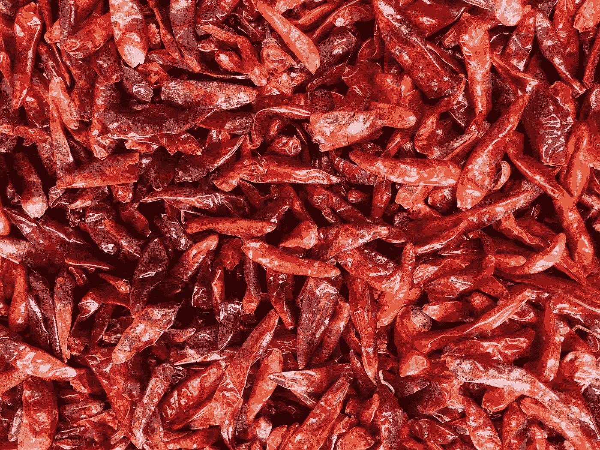
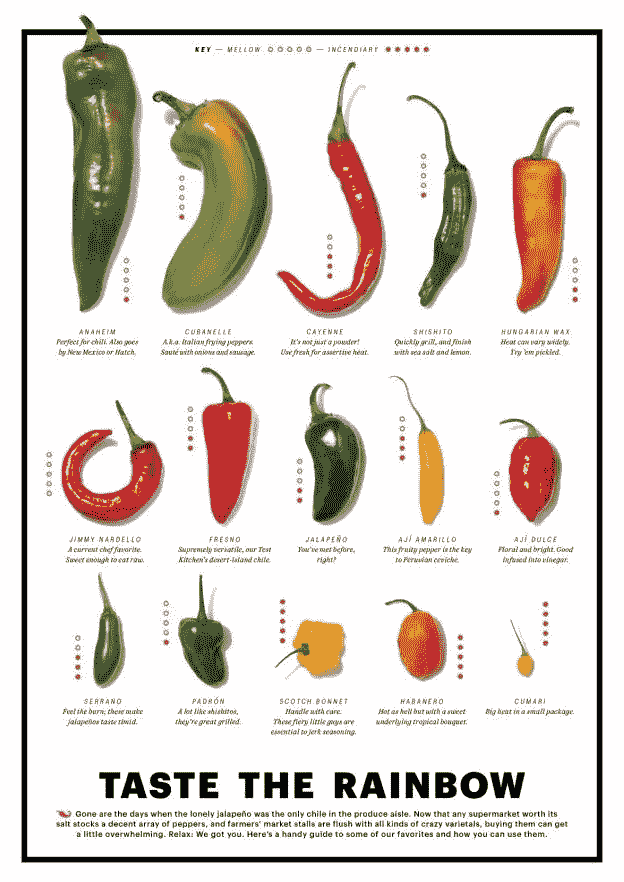
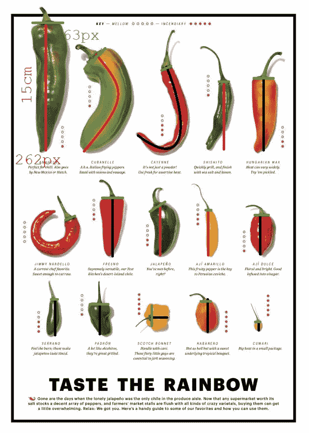
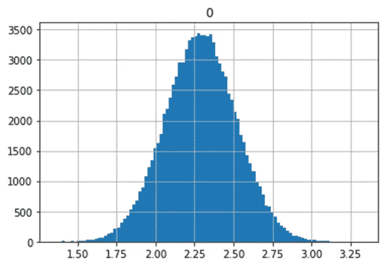
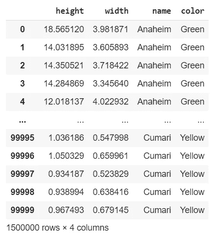
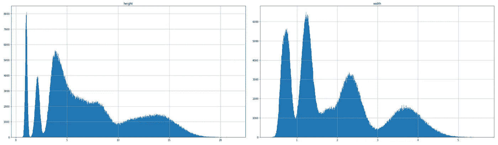
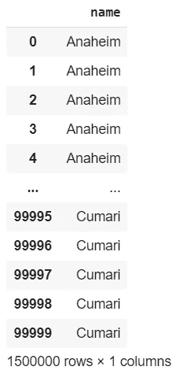
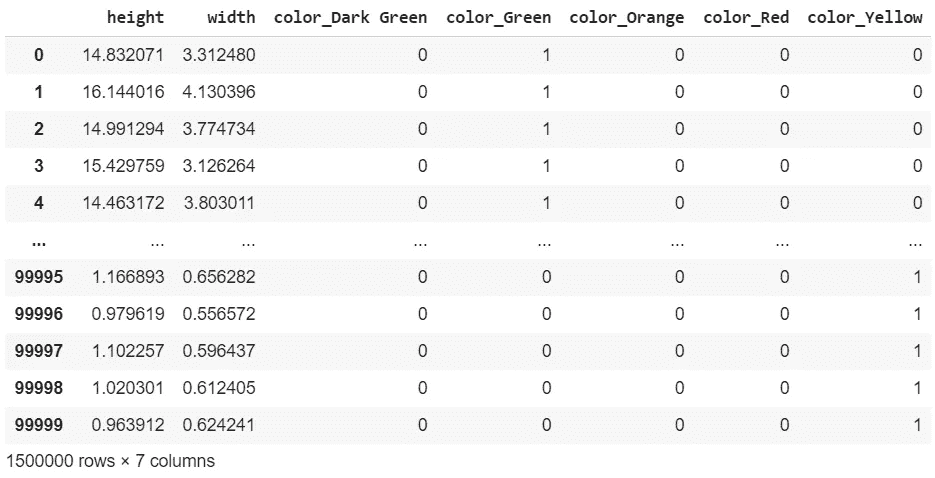

# 在没有数据集的情况下构建一个辣椒分类器，准确率为 96%

> 原文：<https://pub.towardsai.net/building-a-spicy-pepper-classifier-with-no-datasets-96-accuracy-8262d54a8117?source=collection_archive---------1----------------------->

## [数据科学](https://towardsai.net/p/category/data-science)，[机器学习](https://towardsai.net/p/category/machine-learning)

## 不在数据集上使用分类模型。全部代码可在我的 Github repo 获得[。](https://github.com/arditoibryan/Projects/tree/master/20200821_Spicy_Pepper_Classifier)

在这篇文章中，我将创建一个能够从尺寸和颜色识别辣椒的人工智能。因为你在网上找不到任何关于辣椒测量的数据集，我将使用统计学方法自己生成它。在第二篇文章中，我可能会尝试应用回归算法来估计你的辣椒在斯科维尔尺度上的辣度。



Andrew Coop 在 [Unsplash](https://unsplash.com?utm_source=medium&utm_medium=referral) 上拍摄的照片

## 流程:

1.  查找可用数据
2.  进行测量
3.  从分布创建数据集
4.  创建模型
5.  性能赋值

# 1.查找可用数据

如前所述，您不太可能找到一个包含您希望构建的所有内容的数据集。在我的例子中，我想建立一个辣椒分类器，如果你没有数据，这是一个困难的任务。我在网上唯一能找到的是一张不同辣椒的对比表(希望是同一级别)。



我需要将这些数据转换成数字形式。我能做的是测量这些图像，并将它们作为特征放入数据集中。

# 2.进行测量

为了进行测量，我可以使用像素。知道了像素到厘米的转换率后，我就可以用像素来测量每个辣椒的大小，并将其转换成现实世界的比例。



这是所有尺寸(名称、高度、宽度和颜色)都转换为特征的最终表格。

```
#   measurements
pepper_measurements_px = [
                          ['Anaheim', 262, 63, 'Green'],
                          ['Cubanelle', 222, 70, 'Green'],
                          ['Cayenne', 249, 22, 'Red'],
                          ['Shishito', 140, 21, 'Green'],
                          ['Hungarian Wax', 148, 63, 'Orange'],
['Jimmy Nardello', 190, 23, 'Red'],
                          ['Fresno', 120, 43, 'Red'],
                          ['Jalapeno', 106, 40, 'Dark Green'],
                          ['Aji Amarillo', 92, 13, 'Yellow'],
                          ['Aji Dulce', 81, 30, 'Red'],
['Serrano', 74, 14, 'Dark Green'],
                          ['Padron', 62, 38, 'Dark Green'],
                          ['Scotch Bonnet', 37, 42, 'Yellow'],
                          ['Habanero', 67, 21, 'Orange'],
                          ['Cumari', 18, 11, 'Yellow'],
]
```

我现在将为辣椒生成一个包含 100，000 个样本的数据集。

# 3.从发行版创建数据集

在开始创建分布之前，我首先需要将像素转换成厘米。然后对于长度和宽度，我将需要两个单独的正态分布，使用这些数据作为平均值。对于标准差，我将使用平均值的 10%(这样我就不必谷歌每个辣椒的细节)。

## 创建函数

我正在创建一组函数，允许创建 n 个数据集，输入大小。我会用 100，000 个样品做辣子。

```
#simulated probability distribution of one stock
from scipy.stats import skewnorm
import matplotlib.pyplot as plt
import pandas as pd
import numpy as npdef create_peppers(sd, mean, alfa, size):
  #invertire il segno di alfa
  x = skewnorm.rvs(-alfa, size=size) 
  def calc(k, sd, mean):
    return (k*sd)+mean
  x = calc(x, sd, mean) #standard distribution#graph the distribution
  #pd.DataFrame(x).hist(bins=100)#pick one random number from the distribution
  #formally I would use cdf, but I just have to pick randomly from the 1000000 samples
  df = [np.random.choice(x) for k in range(size)]
  #return the DataFrame
  return pd.DataFrame(df)def cm_converter(px_measurements):
  pc_cm = 0.05725
  for _ in range(len(px_measurements)):
    px_measurements[_][1] *= pc_cm
    px_measurements[_][2] *= pc_cm
  return px_measurements
```

## 创建数据集

我现在准备好创建数据集了。我可以指定使用平均值的 10%作为标准差(我可以很容易地从 height_sd 和 widht_sd 中更改它):

```
#   create converted list
pepper_measurements_cm = cm_converter(pepper_measurements_px)#   create final datasets
heigh_sd = 0.1
width_sd = 0.1df = pd.DataFrame()
for _ in pepper_measurements_cm:
  #   create height
  #SD is 10% of the height
  df_height = create_peppers(_[1]*heigh_sd, _[1], 0, 100000)
  #   create width
  #SD is 10% of the width
  df_width = create_peppers(_[2]*width_sd, _[2], 0, 100000)
  #create DataFrame
  df_single = pd.concat([df_height, df_width], axis=1)
  df_single.columns = ['height', 'width']
  #create name
  df_single['name'] = str(_[0])
  df_single['color'] = str(_[3])df = pd.concat([df, df_single], axis=0)
df
```



单个生成要素的正态分布

这是最终结果:综合起来，数据集计数为 150 万个样本:



最终数据集

如果我们在不同的直方图中绘制高度和宽度:



独立直方图中的高度和宽度

# 4.创建模型

我将使用的模型是朴素贝叶斯分类器。与许多其他模型不同，此模型专门处理以下数据:

*   是独立的
*   遵循正态分布

因为我是按照这些前提构建数据集的，所以这个分类器非常适合我想要构建的东西。

## 预处理

我必须做的唯一预处理步骤是用 one_hot 编码算法对颜色进行编码:

```
#backup
X = df.copy()def one_hot(df, partitions):
  #togliamo le colonne da X
  for col in partitions:
    k = df.pop(col)
    k = pd.get_dummies(k, prefix=col)
    df = pd.concat([df, k] , axis=1)
  return dfX = one_hot(X, ['color'])
X
```

## 选择要素和标签

```
y = X.pop('name')
y
```



标签

```
X
```



one_hot 编码后的功能

## 剧烈的

```
from sklearn.model_selection import train_test_splitX_train, X_test, y_train, y_test = train_test_split(X, y, test_size=0.2, random_state=42)
```

我现在将随机分割特征和标签，比例为 80:20 就足够了。

## 训练模型

```
from sklearn.naive_bayes import GaussianNB
clf = GaussianNB()
clf.fit(X_train, y_train)
```

该模型已经被训练:

```
GaussianNB(priors=None, var_smoothing=1e-09)
```

# 5.性能赋值

在训练模型之后，我将在 AI 在训练期间从未见过的数据集部分上测试它:

```
clf.score(X_test, y_test, sample_weight=None)
0.9659133333333333
```

该模型达到了令人瞩目的 96%的准确率！