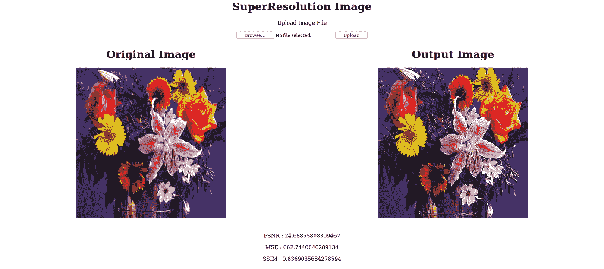
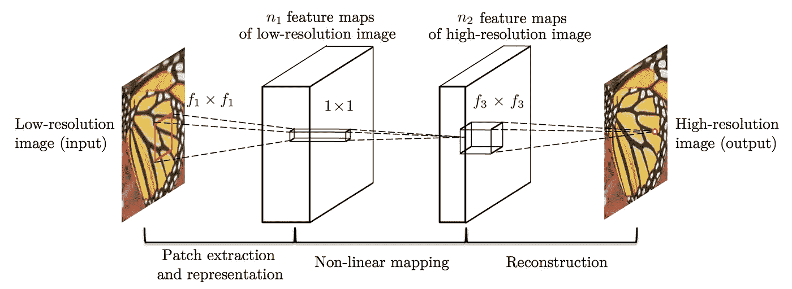

# 构建超分辨率图像网络应用

> 原文：<https://pub.towardsai.net/building-a-super-resolution-image-web-app-57e26886cb45?source=collection_archive---------2----------------------->

## [深度学习](https://towardsai.net/p/category/machine-learning/deep-learning)，[编程](https://towardsai.net/p/category/programming)

## 在本文中，我们将构建一个基于 SRCNN 模型的 web 应用程序。



超分辨率网络应用

当给定一幅图像作为输入时，它重建同一幅图像的更高分辨率的图像。我做了这个应用程序，作为我的细化编码试点任务。任务包括找到一个合适的模型，制作推理算法，将它包装在一个 REST API 中，最后将应用程序 dockerizing。

对于这个任务，我使用 Keras 和 Tensorflow 后端和 Flask。这个博客是关于我在这个任务中面临的同样的挑战，以及当你在做你的项目时如何克服它们。

## 第一步:找到合适的模型

对于模型，我研究了一下图像的超分辨率问题，找到了 SRCNN 模型。

我选择这个模型的原因是预先训练的重量是可用的。这意味着，我不用再重新训练这个模型了。并且模型架构相对简单易懂。于是我又多了解了一下模型，敲定用这个。对于模型结构和权重，我遵循了这个存储库:【https://github.com/MarkPrecursor/SRCNN-keras】T4

```
import tensorflowfrom keras.models import Sequential
from keras.layers import Conv2D
from keras.optimizers import Adam# define model type
SRCNN = Sequential()

 # add model layers
SRCNN.add(Conv2D(filters=128, kernel_size = (9, 9), kernel_initializer=’glorot_uniform’,
 activation=’relu’, padding=’valid’, use_bias=True, input_shape=(None, None, 1)))
SRCNN.add(Conv2D(filters=64, kernel_size = (3, 3), kernel_initializer=’glorot_uniform’,
 activation=’relu’, padding=’same’, use_bias=True))
SRCNN.add(Conv2D(filters=1, kernel_size = (5, 5), kernel_initializer=’glorot_uniform’,
 activation=’linear’, padding=’valid’, use_bias=True))

 # define optimizer
adam = Adam(lr=0.0003)

 # compile model
SRCNN.compile(optimizer=adam, loss=’mean_squared_error’, metrics=[‘mean_squared_error’])
```



SRCNN 架构

## 步骤 2:设置推理算法

所以我的任务是建立一个模型，使它能为给定的图像返回一个更高分辨率的重建图像。首先，我需要获得模型结构的 model.json 文件。

这个简单的代码片段获取 JSON 格式的模型，用于推理和测试。现在我也抢到了预先训练好的负重。在现有模型回购的一些帮助下，作为确切的模型回报，并准备开始。

因此，首先必须编写一些辅助函数，用于图像预处理。

上述函数获取输入图像，并按因子缩小图像，即，用因子除尺寸，并返回新图像。现在定义了用于计算图像的 PSNR(峰值信噪比)和 MSE(均方误差)值的函数。

还有一些更多的图像处理功能，以裁剪和删除图像的边界。

最后是预测函数。现在，predict 函数有两个参数，image 和 image_name(输入图像)。

首先，加载模型和预训练模型。以及图像被加载。现在，ref 将加载并存储来自**“静态/输入”**位置的图像，并将其输入到模型中，以获得重建图像。

下一步是将“ref”图像转换为 YCrCb 形式，用于模型输入，并将其存储在一个名为“Y”的变量中。接下来，从模型获得的输出再次被预处理，以将其转换回 BGR(蓝-绿-红)格式。

最后，通过更多的预处理，我们将最终输出以及 PSNR 和 MSE 值发送给返回。

## 步骤 3:制作烧瓶应用程序

现在，预测的功能已经完成，模型正在返回重建的图像。所需要的是制作一个界面，通过它用户可以输入任何图像。方法是将它包装在一个 RESTApi 中，它可以接受图像作为输入。

我用 Flask 来设计 API。API 设计很简单，因为它只有一个端点“/”。

这里代码定义了端点，可以处理“GET 和 POST”请求。GET 将根据请求返回新图像。而 POST 就是将图像发送到服务器。

与此同时，我们有一个模板，index.html 就绪，这将显示。

表单是从用户输入一个图像。现在“图像文件”存储图像输入。下一步是将图像发送到模型，以获得重建的图像。

这里，图像保存在“静态/输入”文件夹中，然后进行预处理。最后，使用 predict 函数将缩小的图像输入到模型中。从那里我们得到输出图像以及 PSNR，MSE 和 SSIM 值。

接下来，这个图像，从数组转换回图像格式，最后，我们保存这个图像。现在我们已经保存了输出图像和输入图像，下一个任务是在屏幕上显示它们。使用“jinja 模板”可以轻松完成这项任务。

这里，render_template 中发送的值显示在 index.html 页面上。

## 第四步:归档

网络应用也准备好了，直到这一部分是顺利的。现在是最困扰我的部分。要在 Windows 中运行 Docker，需要启用“虚拟化”。但不幸的是，我的设备不支持这一点。所以我不得不迁移到 Ubuntu 来完成剩下的代码。

要对 flask 应用程序进行 dockerizing，需要两件事，一是列出所有包和依赖项的 requirements.txt。第二个是 docker 文件，它是一个文本文档，包含用户可以在命令行上调用的所有命令，以组装 docker 映像。

现在我面临另一个错误，关于. cv2 的使用，基本上使用 pip3 没有帮助。所以，这是一个问题，我最终明白了。因此，无论何时，一个使用 open-cv 的 Flask 应用程序都必须使用`sudo-apt-get`。这是 docker 文件…

任务就是这样完成的。

Github 库:[https://github.com/Aanisha/SuperResolution](https://github.com/Aanisha/SuperResolution/)

幸运的是，我被选为 Tessellate Imaging 的开源实习生。我将使用 MonkAI 库，这是一个低代码的计算机视觉库，来帮助用户轻松地构建和训练模型。