# 使用 Amazon Sagemaker 构建端到端深度学习模型，并部署在 AWS 云上

> 原文：<https://pub.towardsai.net/building-an-end-to-end-deep-learning-model-with-deployment-on-aws-cloud-using-amazon-sagemaker-6b8584c9c6e7?source=collection_archive---------2----------------------->

## [云计算](https://towardsai.net/p/category/cloud-computing)，[深度学习](https://towardsai.net/p/category/machine-learning/deep-learning)

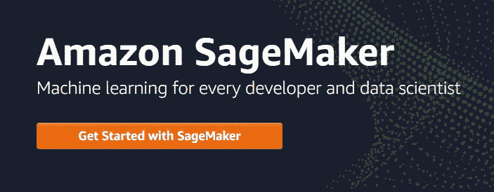

图片提供:亚马逊网络服务

这篇文章的目标是指导你通过使用 AWS 云计算服务 SageMaker，使用 RESNET-50 架构建立一个端到端的机器学习管道，涉及深度学习和对象检测。我们还将发现如何使用 Amazon Sagemaker Ground Truth 在几分钟内标记大型数据集。

这篇文章将涵盖机器学习开发生命周期的所有主要方面:

1.  **下载图像数据集:**

在我们开始下载数据集之前，我们将启动一个 sagemaker 笔记本实例:我们可以这样做

1.  去你的 console.aws.com
2.  选择 sagemaker 服务->笔记本实例->创建笔记本实例
3.  如下所示填写详细信息

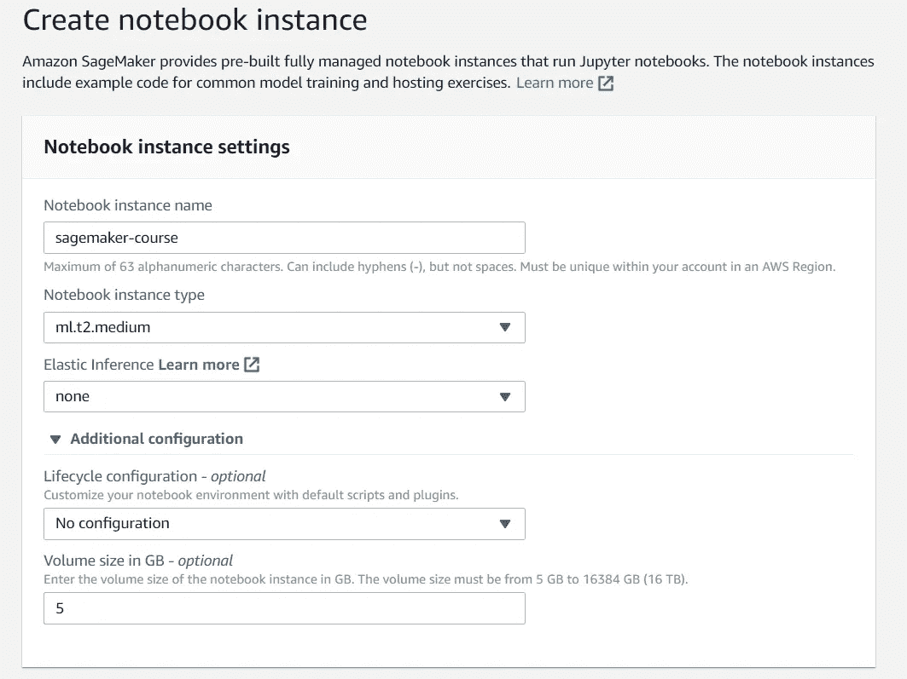

截图 1

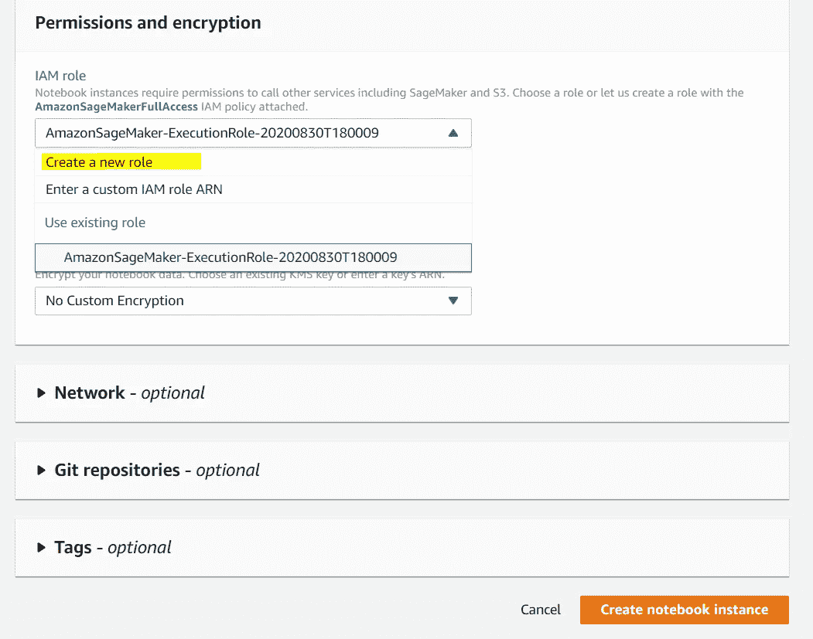

截图 2

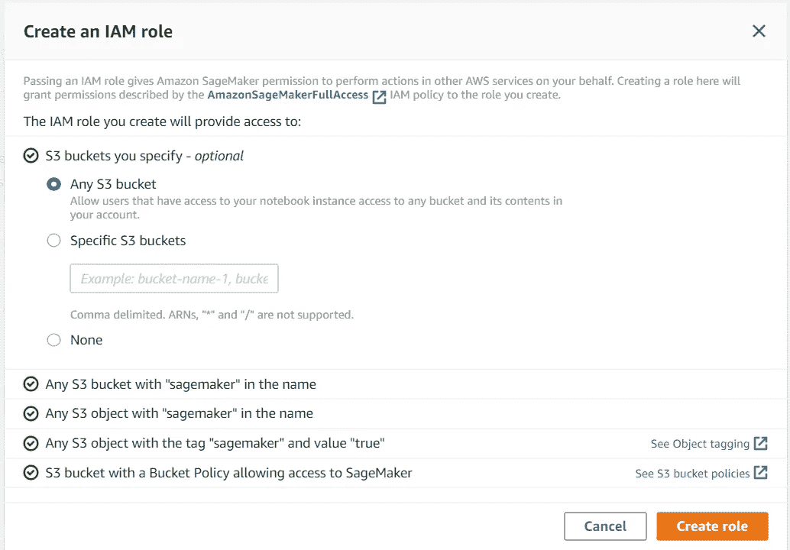

截图三

**行话预警:** **弹性推理:**这使得 GPU 加速可以提高你的深度学习模型的吞吐量，降低延迟。

**IAM 角色:**对于刚接触云计算的人来说，这是一个提供 AWS 服务特定权限的角色。

一旦实例准备就绪，您就可以在 Sagemaker 实例中打开 jupyterlab 笔记本。

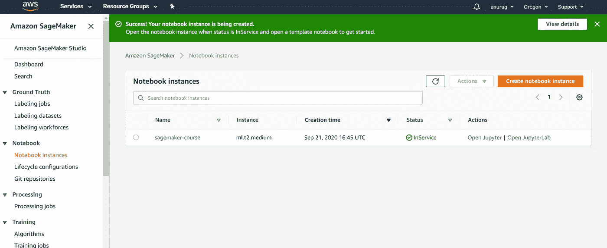

屏幕截图 4

一旦您打开 Jupyterlab，您就可以从这个[链接](https://github.com/anuragbisht12/AWS-SageMaker-Deployment/blob/master/Object%20Detection/ObjectDetection_SageMaker.ipynb)中克隆存储库。您必须导航到对象检测文件夹。

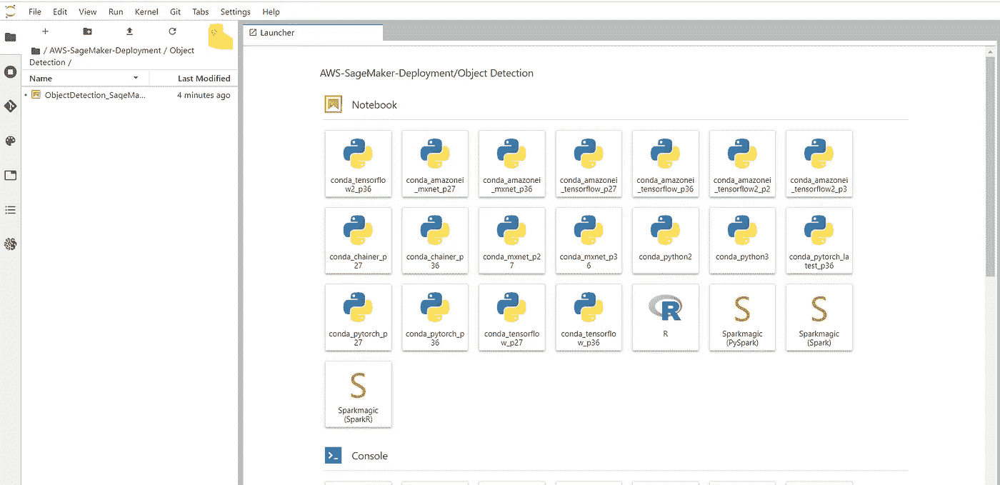

屏幕截图 5

我们将使用这个包含 500 张蜜蜂图片的开源数据集[链接](http://aws-tc-largeobjects.s3-us-west-2.amazonaws.com/DIG-TF-200-MLBEES-10-EN/dataset.zip)。因此，第一项任务是下载文件，解压缩并上传到亚马逊 S3 桶，因为亚马逊 sagemaker 使用 S3 桶来存储工件。

在 Jupyter 笔记本中编写以下命令，将数据集和清单文件解压缩并复制到 S3 存储桶中。

```
#Download & unzip the files to the ec2 instance of Amazon sagemaker
!wget http://aws-tc-largeobjects.s3-us-west-2.amazonaws.com/DIG-TF-200-MLBEES-10-EN/dataset.zip 
!unzip -qo dataset.zip*# S3 bucket must be created in us-west-2 (Oregon) region*
BUCKET = '<Your s3 bucket name>'
PREFIX = 'input' *# this is the root path to your working space, feel to use a different path*#Copy the files  to the s3 bucket
!aws s3 sync --exclude="*" --include="[0-9]*.jpg" . s3://$BUCKET/$PREFIX/
```

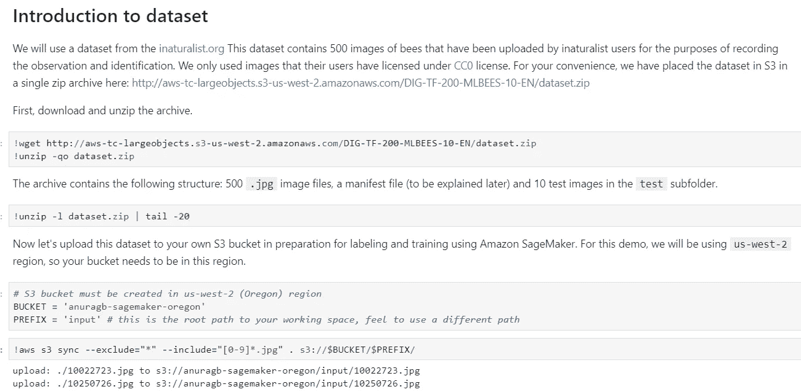

屏幕截图 6

一旦上传了数据，相应的 s3 存储桶将包含所有图像，如下所示。

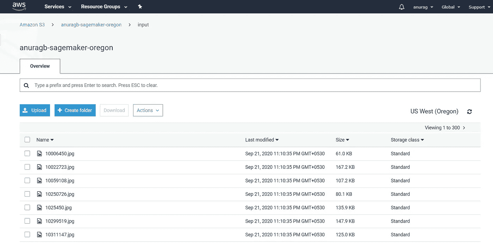

屏幕截图 7

**2。使用亚马逊地面真相创建图像标签工作**

一旦您将图像放入 S3 桶，您就可以开始手动标记它们，或者您可以使用 AWS powered 服务来自动标记图像。让我们来看看能做什么。

在“标记作业”部分，您可以创建标记作业

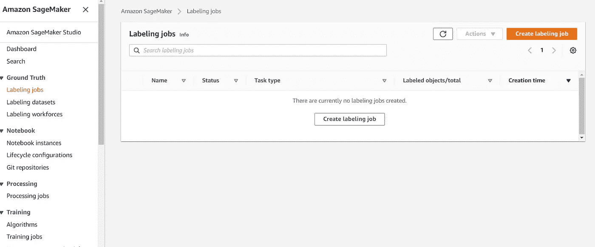

屏幕截图 8

您可以按照截图中提到的方式填写详细信息


屏幕截图 9

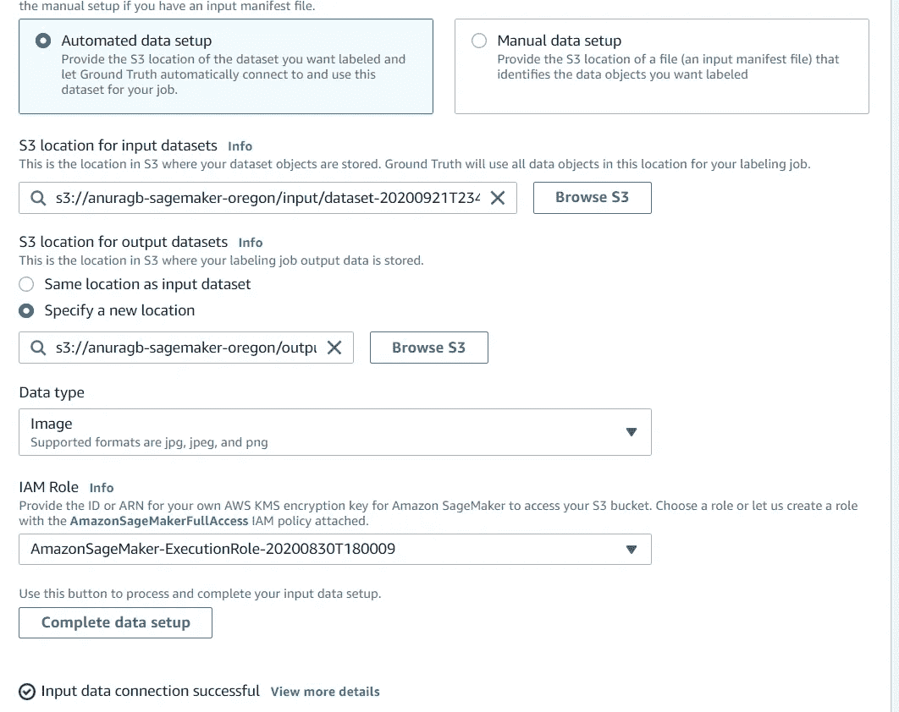

截图 10

确保单击“完整数据设置”选项为输入图像创建清单文件。清单文件包含键值对格式的数据集图像的所有位置。您还需要为标记作业指定 IAM 角色来访问 S3 存储桶。

现在，您甚至可以选择是标记整个数据集还是该数据集中的样本。

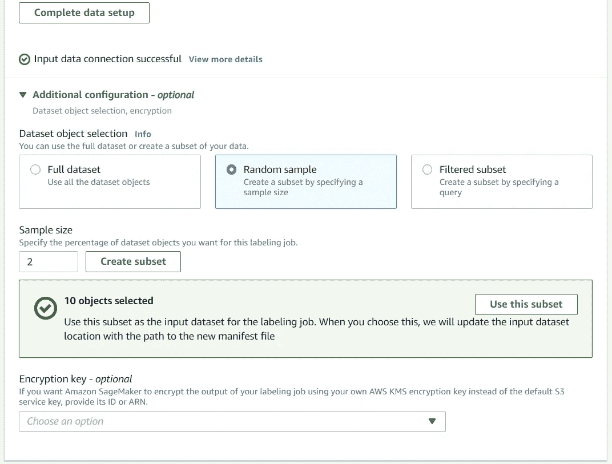

屏幕截图 11

完成后，您需要为贴标机指定任务类别。


屏幕截图 12

现在，您可以为您的贴标工作选择工人类型:私人，供应商管理，或亚马逊土耳其机械公司(公共)。

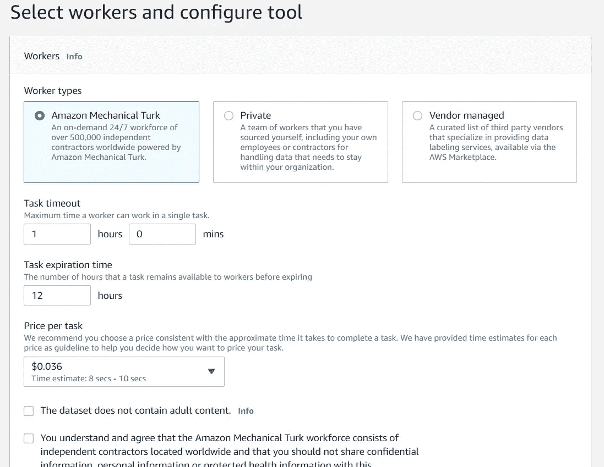

屏幕截图 13

现在你要描述标签，好的和坏的例子。

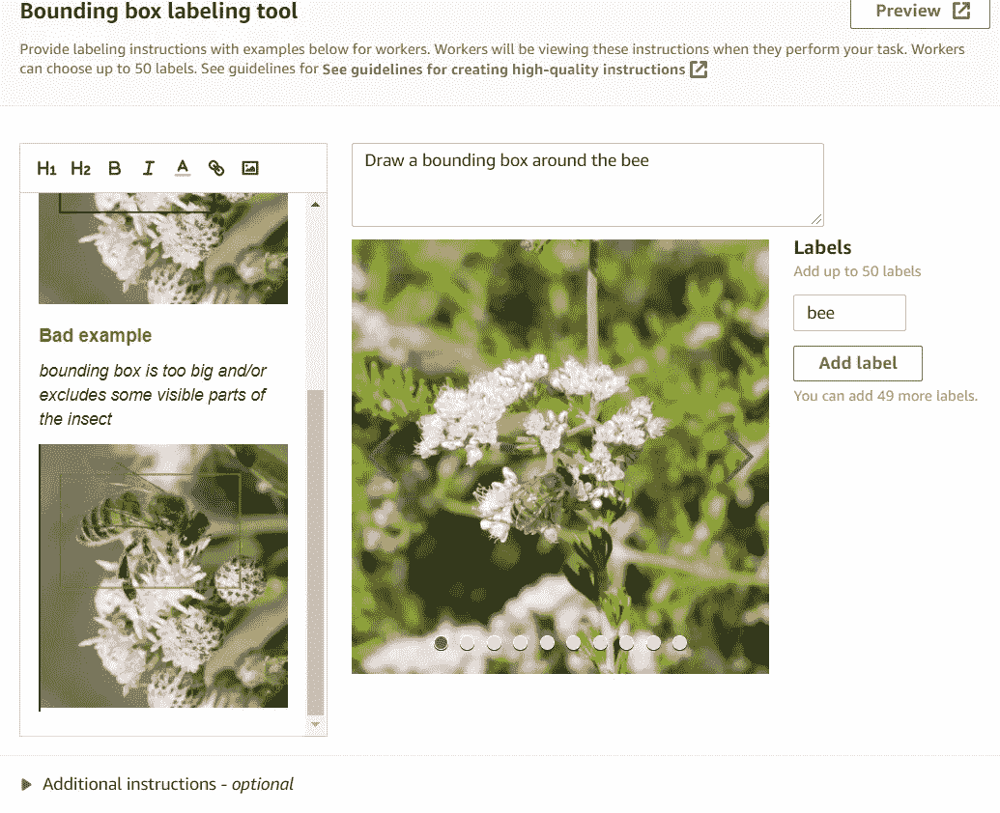

屏幕截图 14

这份工作看起来像这样。

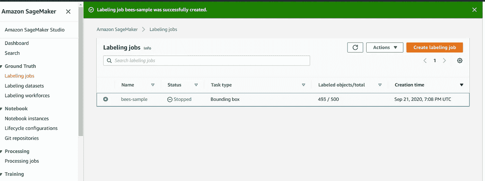

屏幕截图 15

要查看带注释的图像，我们可以下载清单文件，其中包含由标记作业完成的注释的所有信息。

```
# Enter the name of your job here
labeling_job_name = 'bees-sample'import boto3
client = boto3.client('sagemaker')s3_output = client.describe_labeling_job(LabelingJobName=labeling_job_name)['OutputConfig']['S3OutputPath'] + labeling_job_name
augmented_manifest_url = f'{s3_output}/manifests/output/output.manifest'import os
import shutiltry:
    os.makedirs('od_output_data/', exist_ok=False)
except FileExistsError:
    shutil.rmtree('od_output_data/')# now download the augmented manifest file and display first 3 lines
!aws s3 cp $augmented_manifest_url od_output_data/
augmented_manifest_file = 'od_output_data/output.manifest'
!head -3 $augmented_manifest_file#Plotting function
import matplotlib.pyplot as plt
import matplotlib.patches as patches
from PIL import Image
import numpy as np
from itertools import cycledef show_annotated_image(img_path, bboxes):
    im = np.array(Image.open(img_path), dtype=np.uint8)

    # Create figure and axes
    fig,ax = plt.subplots(1)# Display the image
    ax.imshow(im)colors = cycle(['r', 'g', 'b', 'y', 'c', 'm', 'k', 'w'])

    for bbox in bboxes:
        # Create a Rectangle patch
        rect = patches.Rectangle((bbox['left'],bbox['top']),bbox['width'],bbox['height'],linewidth=1,edgecolor=next(colors),facecolor='none')# Add the patch to the Axes
        ax.add_patch(rect)plt.show() #Show the annotated images!pip -q install --upgrade pip
!pip -q install jsonlines
import jsonlines
from itertools import islicewith jsonlines.open(augmented_manifest_file, 'r') as reader:
    for desc in islice(reader, 10):
        img_url = desc['source-ref']
        img_file = os.path.basename(img_url)
        file_exists = os.path.isfile(img_file)bboxes = desc[labeling_job_name]['annotations']
        show_annotated_image(img_file, bboxes)
```

将绘制 10 幅带注释的图像

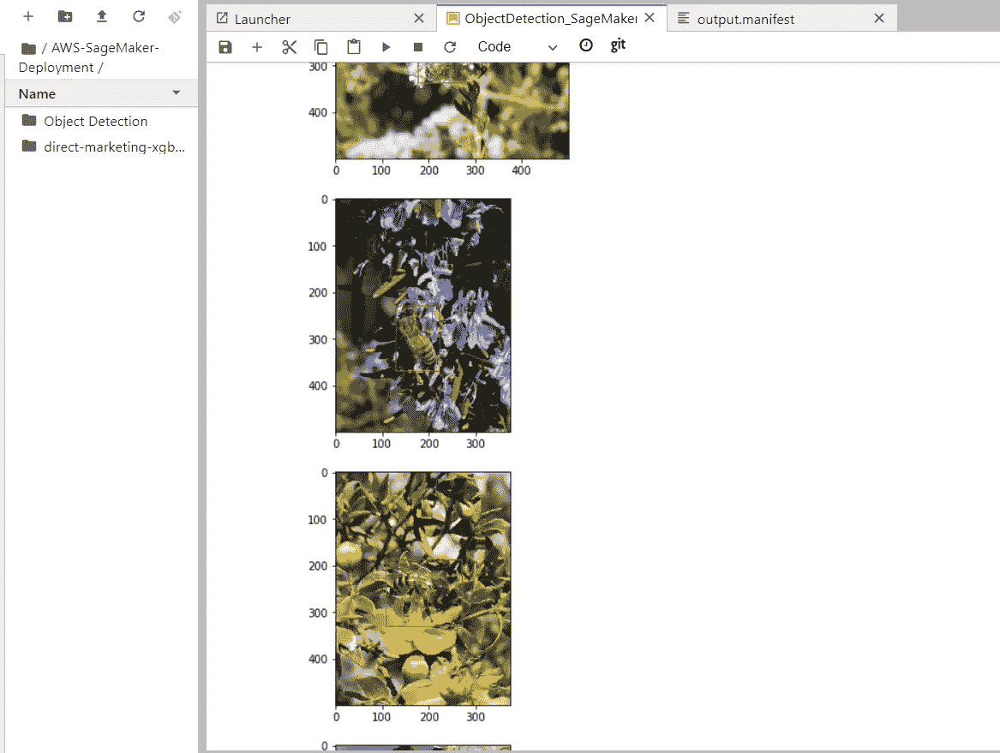

屏幕截图 16

在我们使用训练作业训练模型之前，将数据分成训练和验证部分是很重要的。在这里，清单文件将方便我们分割数据样本。

```
import json,jsonlines
import numpy as npwith jsonlines.open('output.manifest', 'r') as reader:
    lines = list(reader)
    # Shuffle data in place.
    np.random.shuffle(lines)

dataset_size = len(lines)
num_training_samples = round(dataset_size*0.8)train_data = lines[:num_training_samples]
validation_data = lines[num_training_samples:]augmented_manifest_filename_train = 'train.manifest'with open(augmented_manifest_filename_train, 'w') as f:
    for line in train_data:
        f.write(json.dumps(line))
        f.write('\n')augmented_manifest_filename_validation = 'validation.manifest'with open(augmented_manifest_filename_validation, 'w') as f:
    for line in validation_data:
        f.write(json.dumps(line))
        f.write('\n')

print(f'training samples: {num_training_samples}, validation samples: {len(lines)-num_training_samples}')pfx_training = PREFIX + '/training' if PREFIX else 'training'
# Defines paths for use in the training job request.
s3_train_data_path = 's3://{}/{}/{}'.format(BUCKET, pfx_training, augmented_manifest_filename_train)
s3_validation_data_path = 's3://{}/{}/{}'.format(BUCKET, pfx_training, augmented_manifest_filename_validation)!aws s3 cp train.manifest s3://$BUCKET/$pfx_training/
!aws s3 cp validation.manifest s3://$BUCKET/$pfx_training/
```

下面是拆分的输出，一旦清单文件上传回 S3 存储桶。

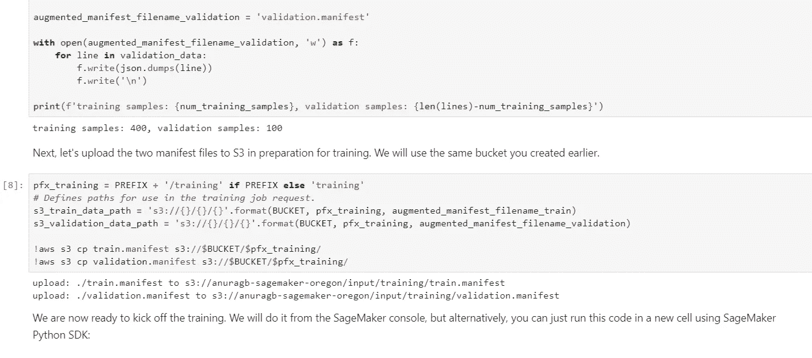

屏幕截图 17

**3。使用标记的数据训练模型。**

创建培训工作有两种选择:

1.  使用 API 和代码方法:代码在笔记本中提供，我们将研究基于控制台的方法。
2.  使用 sagemaker 控制台:

我们将转到 Sagemaker->培训工作->创建培训工作

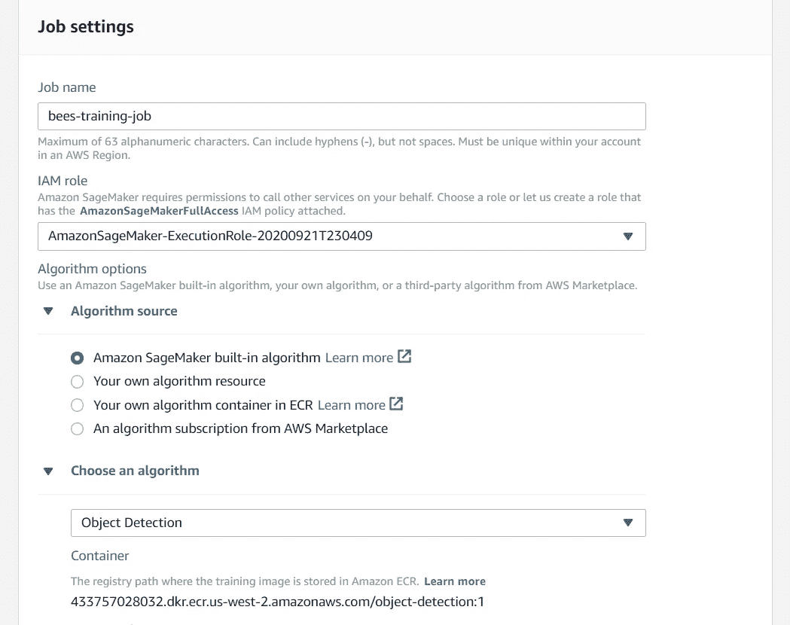

屏幕截图 18

选择输入模式可能是主观的，您有两种选择:

文件模式:您的培训数据将被复制到培训作业开始的 EC2 实例中。

管道模式:您的训练数据将实时传输到 EC2 实例。

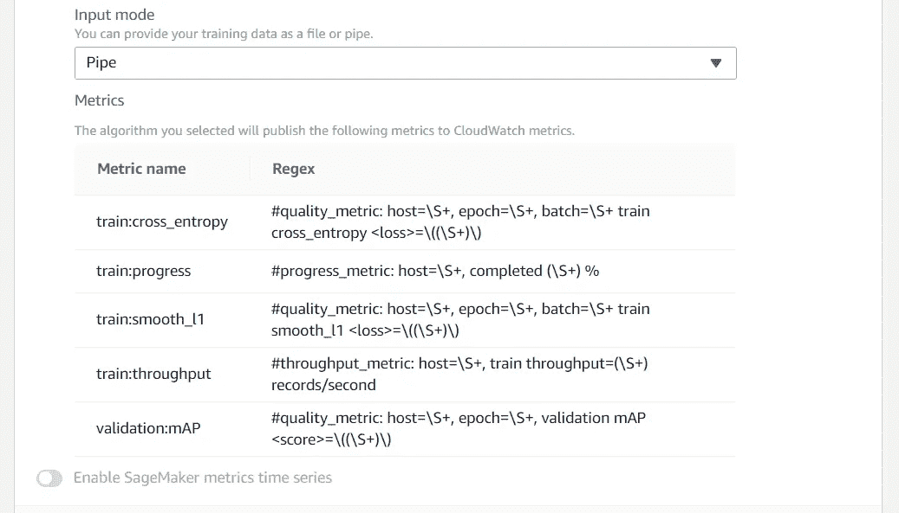

屏幕截图 19

下一步是选择培训工作的资源类型，您可以选择标准计算实例或 GPU 驱动的实例。

我们必须为我们的培训工作指定超参数。最常见的在下面的截图中指定。

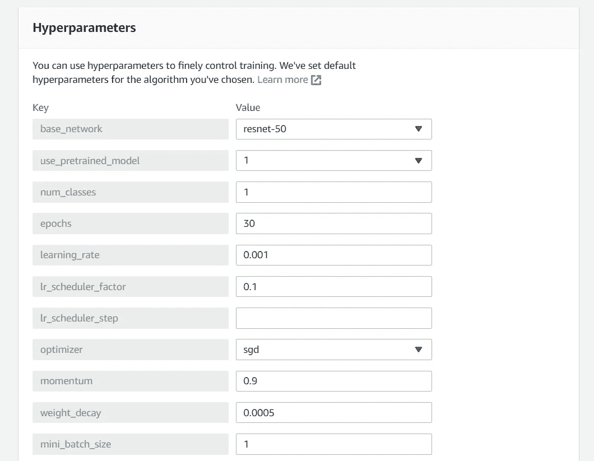

截图 20

我们为训练和验证通道指定了两个输入配置，为输出数据通道指定了一个输出配置。

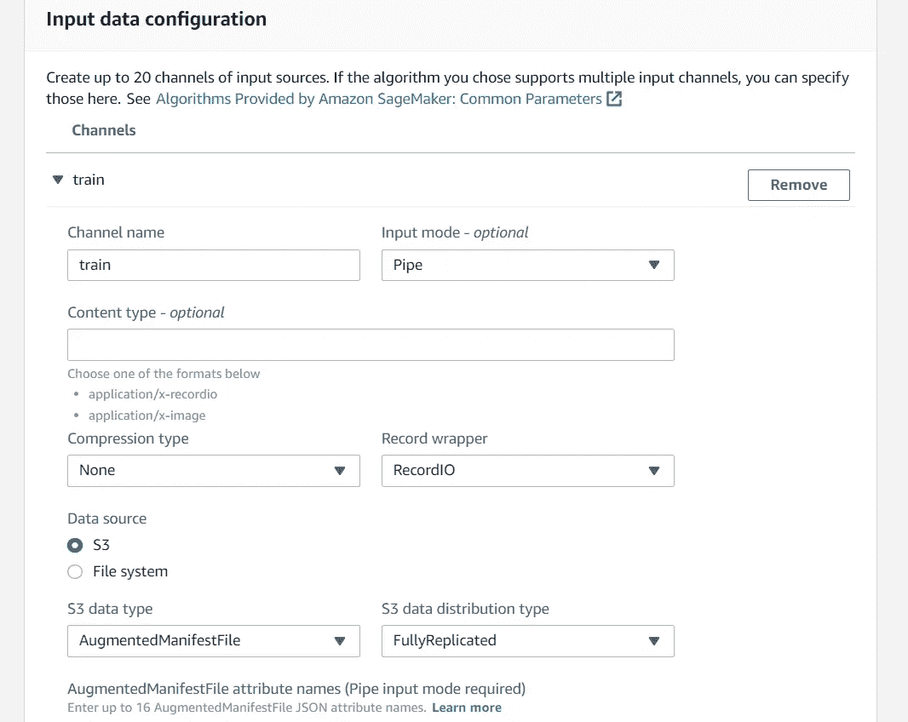

培训配置 1

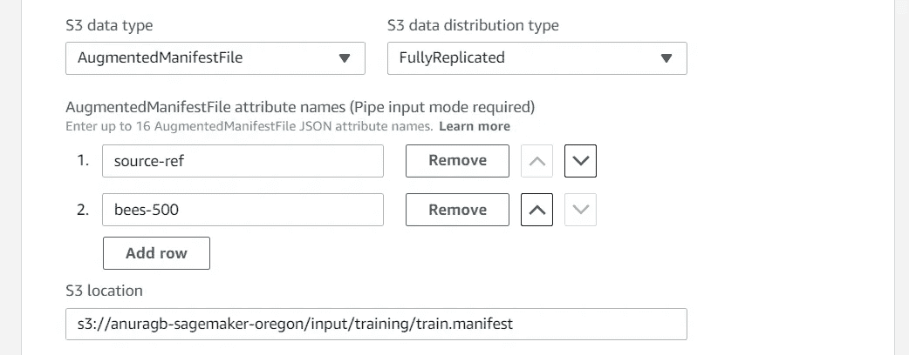

培训配置 2

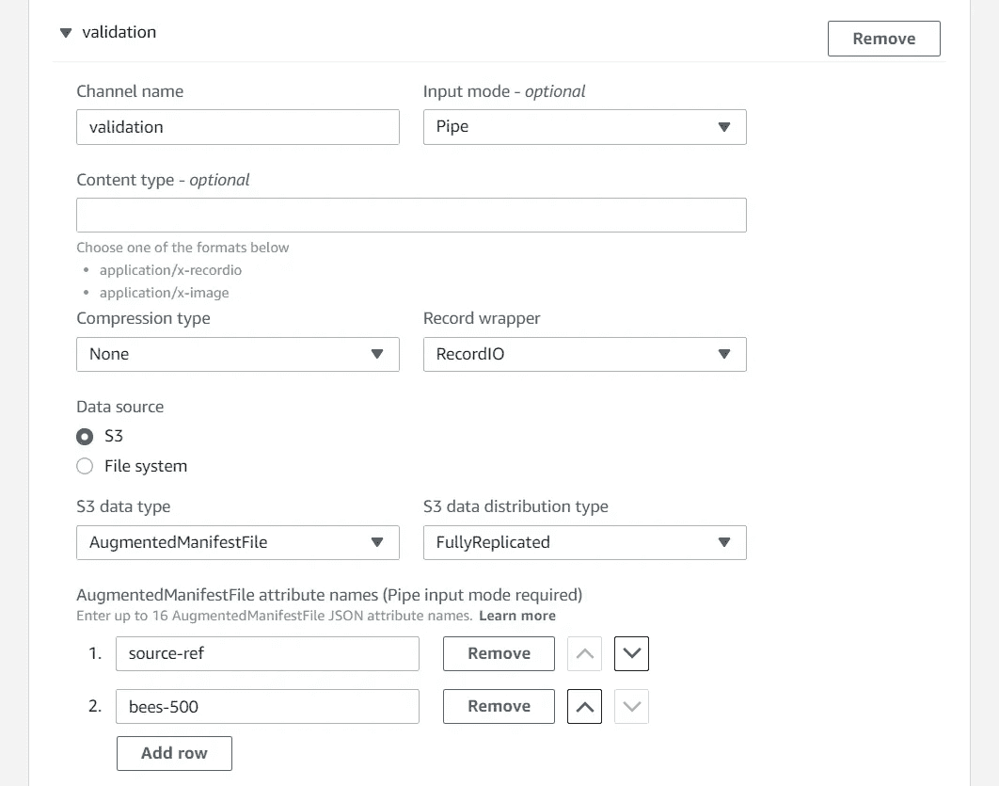

验证配置

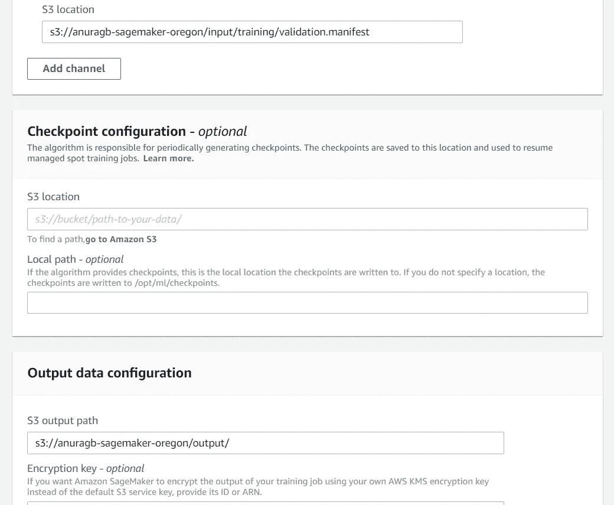

输出配置

培训工作开始后，您可以监控其进度。


屏幕截图 21

您还可以通过代码以编程方式查看培训作业的状态。

```
##### REPLACE WITH YOUR OWN TRAINING JOB NAME
# In the above console screenshots the job name was 'bees-detection-resnet'.
# But if you used Python to kick off the training job,
# then 'training_job_name' is already set, so you can comment out the line below.
training_job_name = 'bees-training'
##### REPLACE WITH YOUR OWN TRAINING JOB NAMEtraining_info = client.describe_training_job(TrainingJobName=training_job_name)print("Training job status: ", training_info['TrainingJobStatus'])
print("Secondary status: ", training_info['SecondaryStatus'])
```

**4。模型的创建和部署**

要创建一个模型，您必须使用由使用 describe_training_job API 的培训作业创建的模型工件。

```
import time
timestamp = time.strftime('-%Y-%m-%d-%H-%M-%S', time.gmtime())
model_name = training_job_name + '-model' + timestamptraining_image = training_info['AlgorithmSpecification']['TrainingImage']
model_data = training_info['ModelArtifacts']['S3ModelArtifacts']primary_container = {
    'Image': training_image,
    'ModelDataUrl': model_data,
}from sagemaker import get_execution_rolerole = get_execution_role()create_model_response = client.create_model(
    ModelName = model_name,
    ExecutionRoleArn = role,
    PrimaryContainer = primary_container)print(create_model_response['ModelArn'])
```

在我们部署模型之前，我们必须创建一个端点配置。这在您执行 a/b 测试或者尝试您的端点后面的模型的不同变体的情况下特别有用。

```
timestamp = time.strftime('-%Y-%m-%d-%H-%M-%S', time.gmtime())
endpoint_config_name = training_job_name + '-epc' + timestamp
endpoint_config_response = client.create_endpoint_config(
    EndpointConfigName = endpoint_config_name,
    ProductionVariants=[{
        'InstanceType':'ml.t2.medium',
        'InitialInstanceCount':1,
        'ModelName':model_name,
        'VariantName':'AllTraffic'}])print('Endpoint configuration name: {}'.format(endpoint_config_name))
print('Endpoint configuration arn:  {}'.format(endpoint_config_response['EndpointConfigArn']))
```

一旦创建了端点配置，您就可以通过 sagemaker 仪表板或使用 create_endpoint API 来创建端点。

```
timestamp = time.strftime('-%Y-%m-%d-%H-%M-%S', time.gmtime())
endpoint_name = training_job_name + '-ep' + timestamp
print('Endpoint name: {}'.format(endpoint_name))endpoint_params = {
    'EndpointName': endpoint_name,
    'EndpointConfigName': endpoint_config_name,
}
endpoint_response = client.create_endpoint(**endpoint_params)
print('EndpointArn = {}'.format(endpoint_response['EndpointArn']))#check the endpoint status
endpoint_name="endpoint name from above steps"
# get the status of the endpoint
response = client.describe_endpoint(EndpointName=endpoint_name)
status = response['EndpointStatus']
print('EndpointStatus = {}'.format(status))
```

一旦端点准备就绪，我们就可以使用下面的代码执行一个推理请求。

```
#Check for the test images
import glob
test_images = glob.glob('test/*')
print(*test_images, sep="\n")def prediction_to_bbox_data(image_path, prediction):
    class_id, confidence, xmin, ymin, xmax, ymax = prediction
    width, height = Image.open(image_path).size
    bbox_data = {'class_id': class_id,
               'height': (ymax-ymin)*height,
               'width': (xmax-xmin)*width,
               'left': xmin*width,
               'top': ymin*height}
    return bbox_dataimport matplotlib.pyplot as pltruntime_client = boto3.client('sagemaker-runtime')# Call SageMaker endpoint to obtain predictions
def get_predictions_for_img(runtime_client, endpoint_name, img_path):
    with open(img_path, 'rb') as f:
        payload = f.read()
        payload = bytearray(payload)response = runtime_client.invoke_endpoint(EndpointName=endpoint_name, 
                                       ContentType='application/x-image', 
                                       Body=payload)result = response['Body'].read()
    result = json.loads(result)
    return result# wait until the status has changed
client.get_waiter('endpoint_in_service').wait(EndpointName=endpoint_name)
endpoint_response = client.describe_endpoint(EndpointName=endpoint_name)
status = endpoint_response['EndpointStatus']
if status != 'InService':
    raise Exception('Endpoint creation failed.')for test_image in test_images:
    result = get_predictions_for_img(runtime_client, endpoint_name, test_image)
    confidence_threshold = .2
    best_n = 3
    # display the best n predictions with confidence > confidence_threshold
    predictions = [prediction for prediction in result['prediction'] if prediction[1] > confidence_threshold]
    predictions.sort(reverse=True, key = lambda x: x[1])
    bboxes = [prediction_to_bbox_data(test_image, prediction) for prediction in predictions[:best_n]]
    show_annotated_image(test_image, bboxes)
```

**5。使用模型调整作业的超参数优化。**

尽管我们已经创建并部署了我们的模型。为了提高模型的准确性，我们可能需要调整超参数。

要创建超参数优化作业，可以使用 API 或 AWS 控制台。你可以使用贝叶斯优化策略或随机搜索策略。

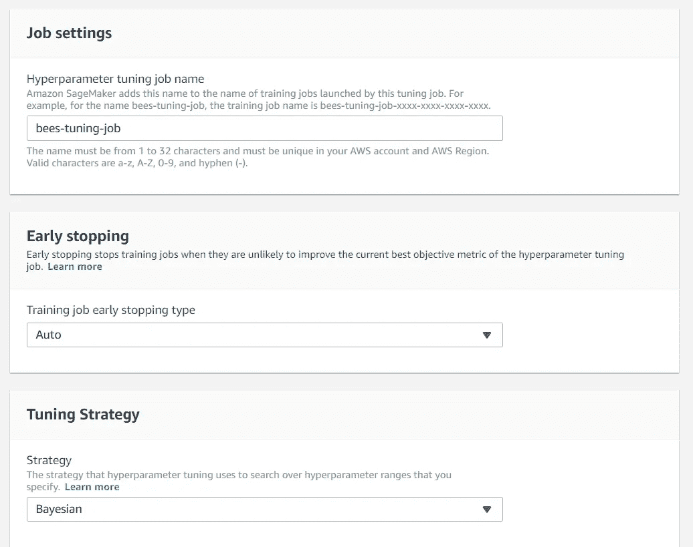

屏幕截图 22

在职务定义中，参数几乎与培训职务部分相同。唯一的区别是您现在可以选择选项或指定范围。

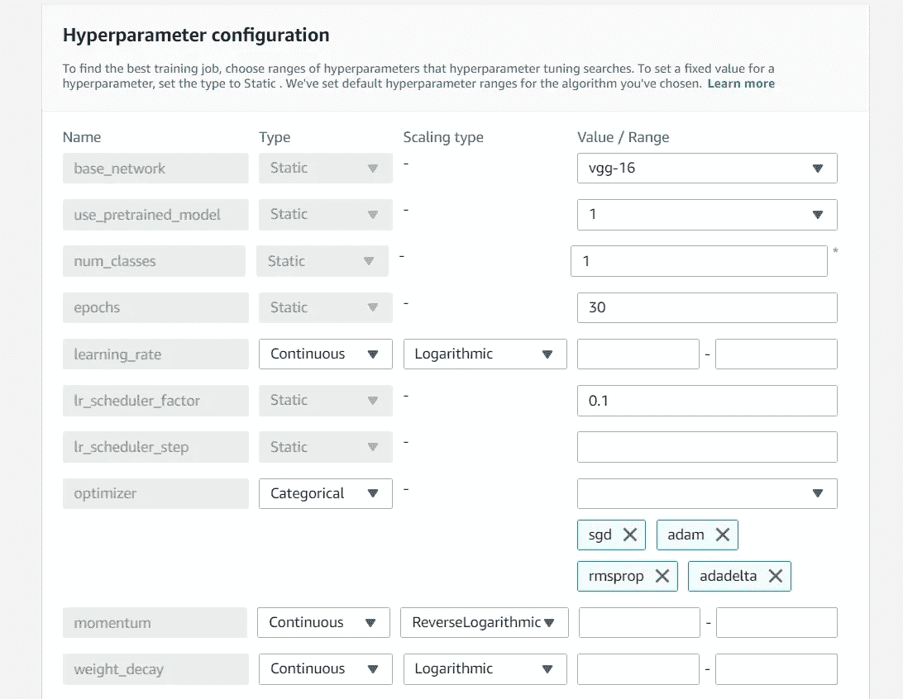

屏幕截图 23

训练、验证和输出通道的配置如下所示。


屏幕截图 24

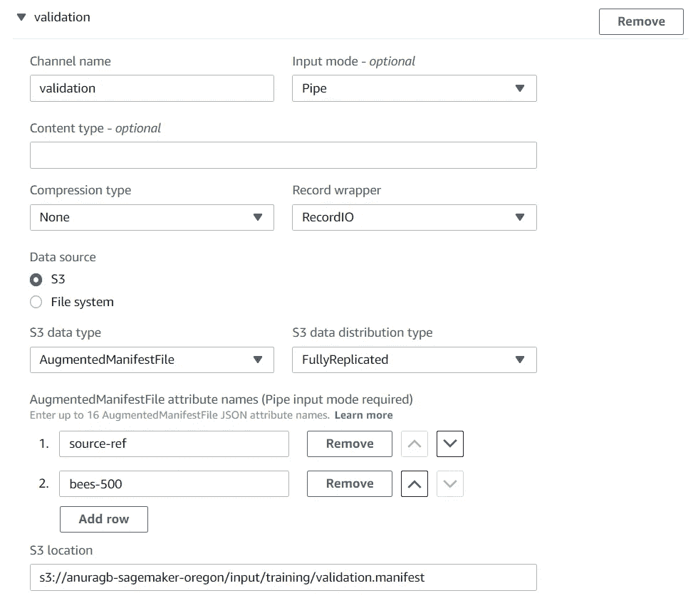

屏幕截图 25

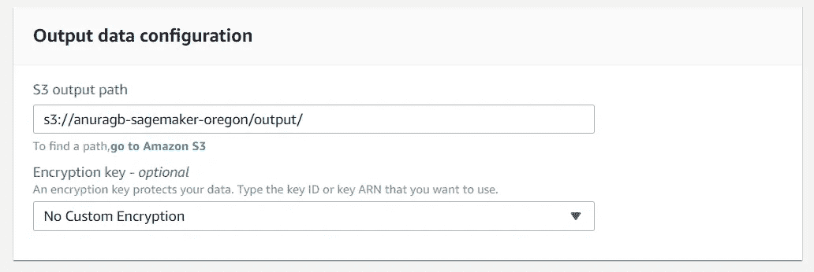

屏幕截图 26

现在您可以配置资源了。

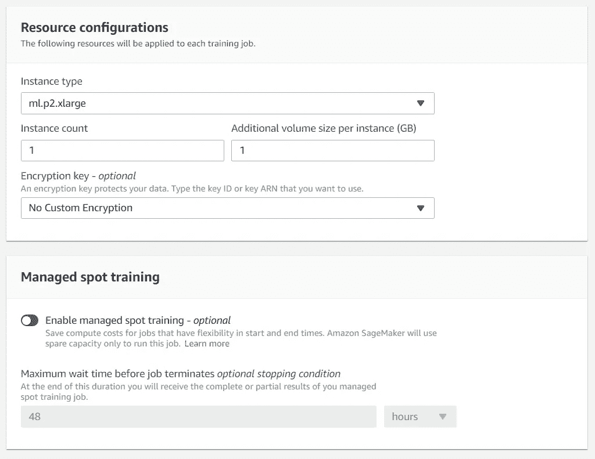

屏幕截图 27

在下一步中，您将指定资源限制。

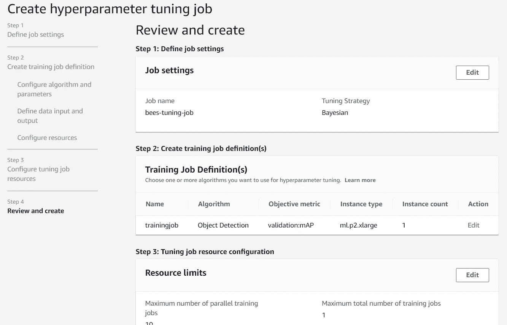

屏幕截图 28

超参数作业完成后，您可以查看具有最佳客观指标值的作业历史记录

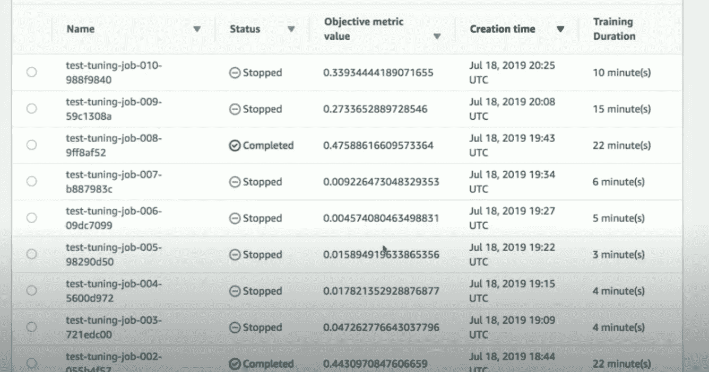

屏幕截图 29

您可以从摘要中选择超参数的最佳组合。

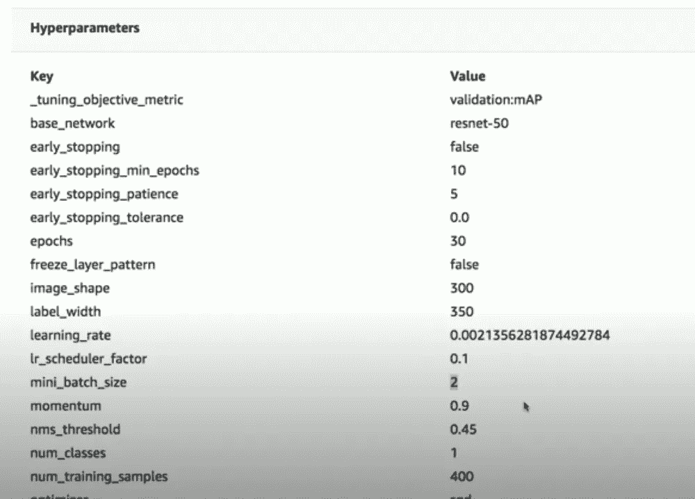

**6。如果需要，清理不必要的资源**

您可以使用 delete_endpoint API 删除不必要的资源或端点。

```
client.delete_endpoint(EndpointName=endpoint_name)
```

真实世界用例中需要的数据工程方面超出了本文的范围。我们一定会在以后的文章中讨论这些设计原则。

我们还将详细讨论如何在单个端点后使用多模型架构，转移一部分流量，进行 A/B 测试，并用新的生产变体替换模型。

如果你真的喜欢这篇文章，那么请考虑关注我，获取关于人工智能/机器学习、数据分析和商业智能的高质量内容和教程。

在 [LinkedIn](https://www.linkedin.com/in/anurag-bisht-39935a59/) 上查看我