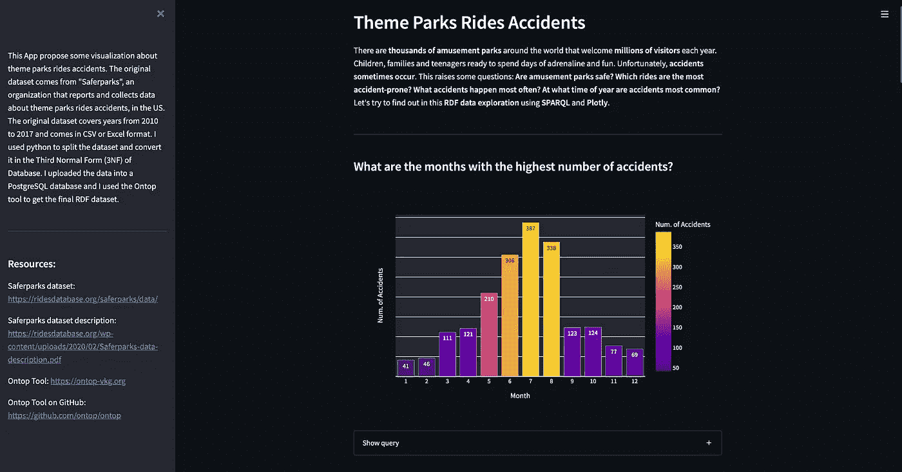
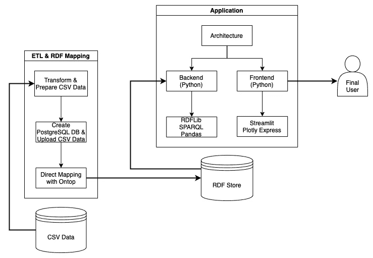
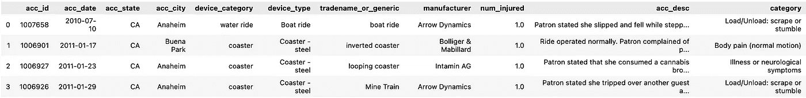
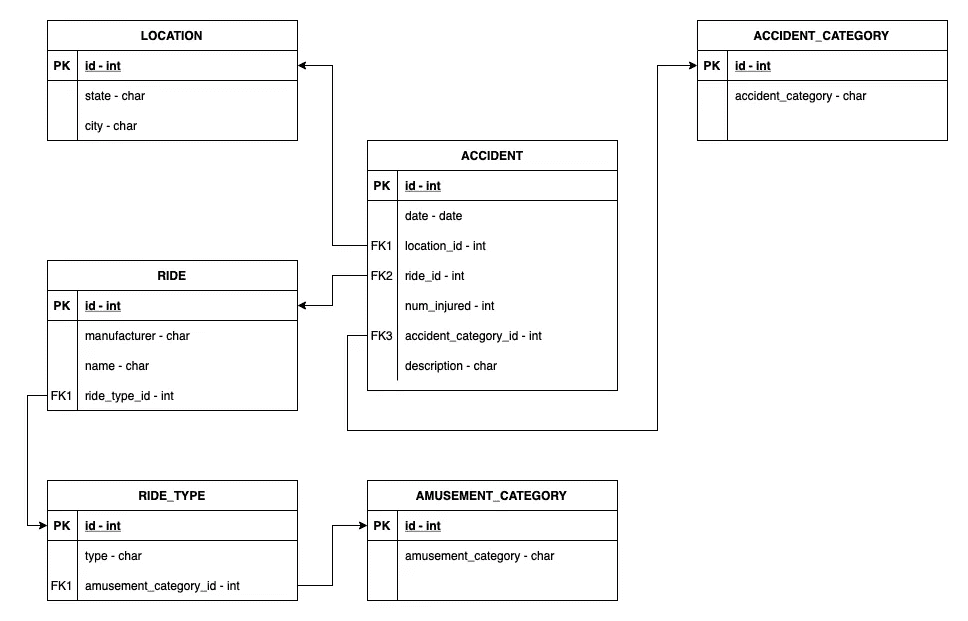
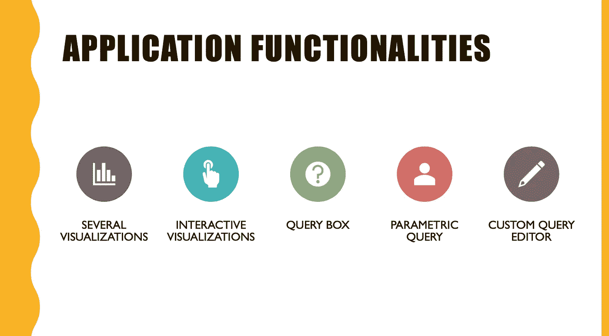
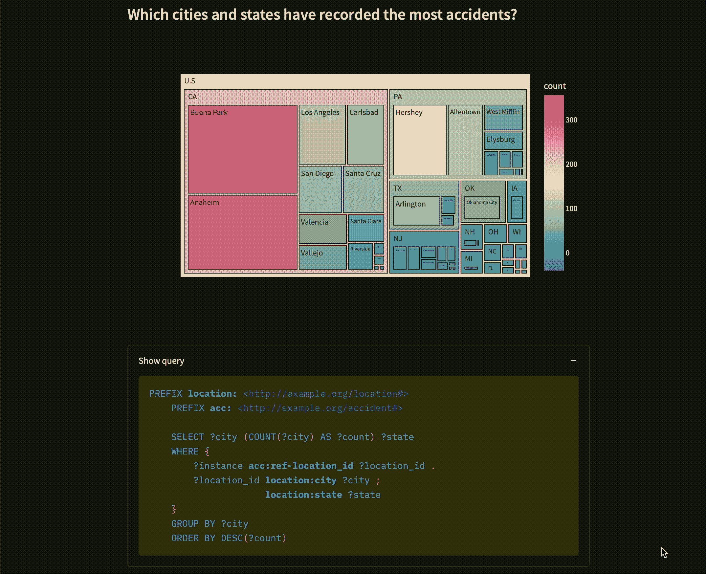
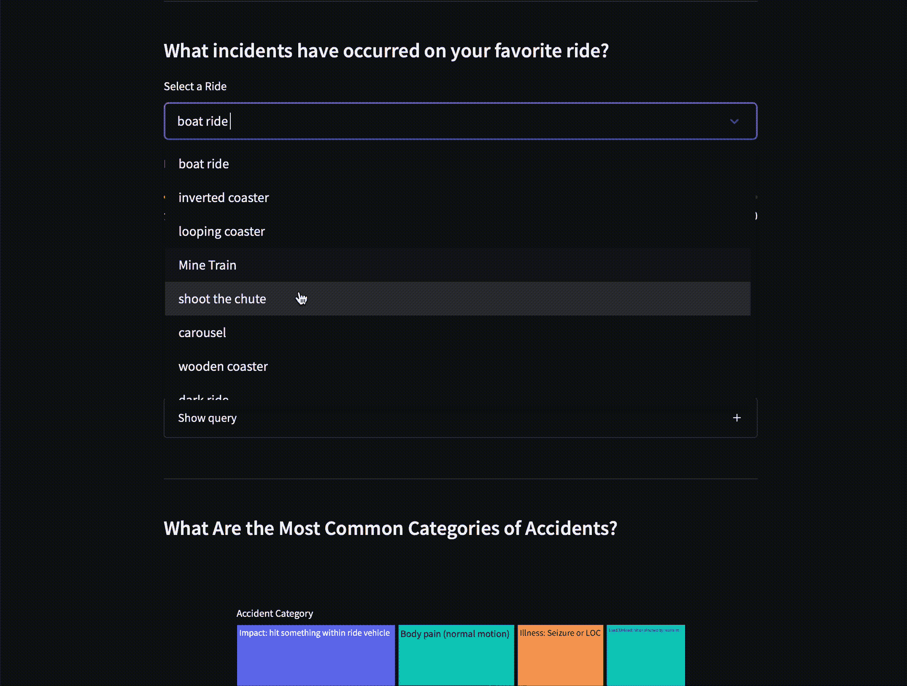
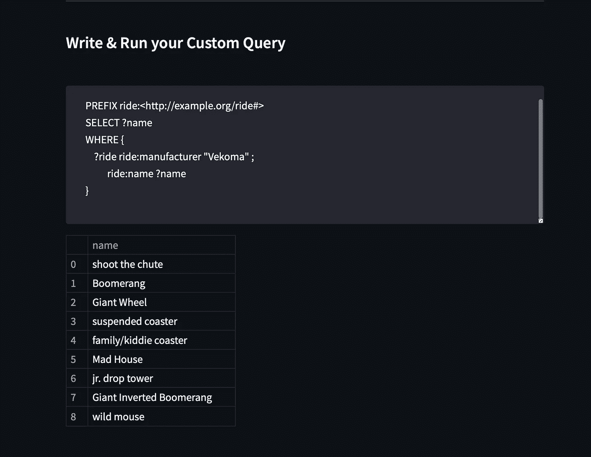
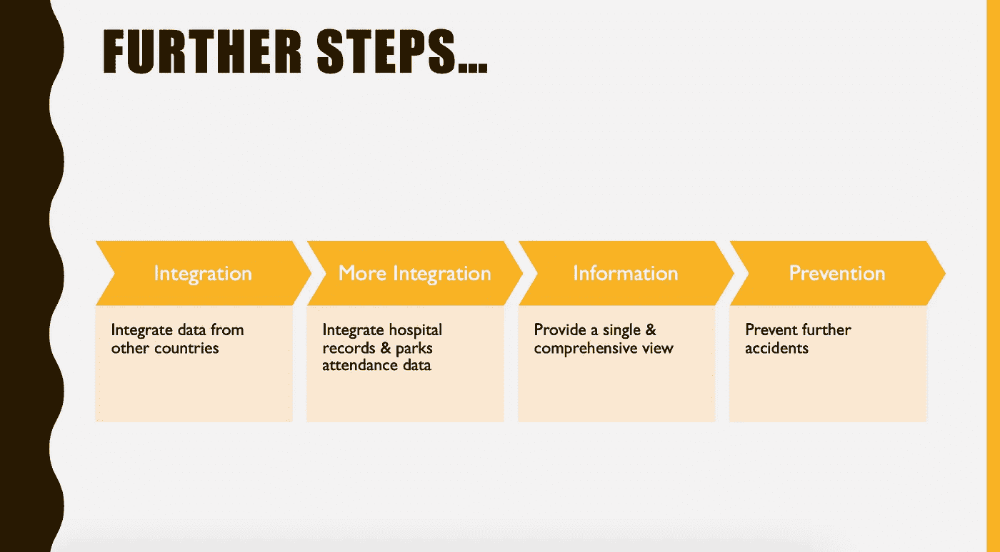

# 构建端到端链接的数据工程项目

> 原文：<https://pub.towardsai.net/building-an-end-to-end-linked-data-engineering-project-b146149df38e?source=collection_archive---------1----------------------->

## 使用语义网技术的数据建模和分析



最终申请的第一部分。图片由作者提供。

**应用程序通常受限于它们能够访问的数据。检索的数据来自**定义的源**，通常为应用程序本身设计**。这很好，但是**想象一个应用程序可以访问一个更全球化的数据库**，不同的**数据源连接在一起，**形成一个**大的**，**综合的**，**机器可读的数据源**。****

**这是**关联数据**。这就是**语义网**。**

**在本文中，我将展示一个端到端的项目，**展示了** (1) **如何将关系数据转换成链接数据**，以便集成，(2)**SPARQL****语言**对链接数据的查询能力，(3) **如何构建一个完整的语义 web 应用程序**。**

# **内容**

1.  *****简介*****
2.  *****应用领域&动机*****
3.  *****数据源描述*****
4.  *****技术和总体架构*****
5.  *****开发阶段*** *5.1 概述
    5.2 数据准备
    5.3 数据库创建&人口
    5.4 映射&物化 RDF
    5.5 查询&呈现结果***
6.  *****应用功能*****
7.  *****应用代码*** *7.1 将查询结果转换为数据框架
    7.2 查询执行
    7.3 交互式可视化&查询框
    7.4 参数化查询
    7.5 自定义查询编辑器***
8.  *****结论*****

# **1.介绍**

****语义网**提出的愿景和**关联数据**的使用，允许**大规模** **合并和整合数据**，从而让**获得大量信息**。这一切都要求**开放标准**和**互通**，属性**不易实现**。集成数据的难点在于**数据库很少采用相同的属性**来表示**相同的对象**。**

**结果，**一个** **对象在不同的数据库**中表现不同。**

**为了克服这个问题，我们需要**给数据**添加新的定义。这个新信息被称为词汇(或本体)。因此，**不同词汇的标准化**也是一个实际困难。**

**然而，好处在于搜索效率的提高:数据连接越多，获得的结果就越丰富。此外，RDF 等技术的**模式灵活性**是优于关系数据库的**优势，在关系数据库中，模式的改变会带来困难。其他优势包括**可扩展性**和**速度**。****

**链接数据的另一个重要属性叫做**推断**，指的是**从现有数据**中推断数据**之间新连接**的能力。**

**关于这个项目，最终应用的一个**运行演示**被**托管在 Huggingface** 上:**

**[](https://huggingface.co/spaces/EdBianchi/ThemeParksAccidents_RDF-SPARQL) [## 主题公园事故 RDF-SPARQL-EdBianchi 的拥抱脸空间

huggingface.co](https://huggingface.co/spaces/EdBianchi/ThemeParksAccidents_RDF-SPARQL) 

**完整的应用程序代码**存放在 **GitHub** 上:

[](https://github.com/EdoWhite/ThemeParkAccidents_RDF-SPARQL) [## GitHub-edo white/ThemeParkAccidents _ RDF-SPARQL

### 使用语义 Web 技术(RDF & SPARQL)提供主题公园游乐事故分析的 Web 应用程序。

github.com](https://github.com/EdoWhite/ThemeParkAccidents_RDF-SPARQL) 

# 2.应用领域和动机


应用领域和动机。图片由作者提供。

**游乐园遍布全球**，每年都会发生或多或少的严重**事故**。一种**语义网**和**关联数据**的方法可以被**用于阻止和通知**。

想象一下**连接全世界所有游乐园**的事故数据:我们**可以获得准确无误的信息**，这些信息可以用来**让公园变得更安全**。不仅如此:**得益于 RDF** 等技术的属性，使得**整合来自不同来源的其他事故相关数据**成为可能。

最终结果将产生一个**集成数据源，允许轻松获取和可视化事故相关信息**。这些信息也可以**链接到处理主题公园安全的国家服务**。我相信这样的系统对公园和游客都有价值。

# 3.数据源描述


数据源描述。图片由作者提供。

**本项目使用的数据集来自 Saferparks** 。安全公园是一个旨在限制和防止主题公园事故的组织。尽管这个组织不再从事研究，但它继续分享多年来收集的数据。

具体来说，该项目使用的数据集包含 2010 年至 2017 年发生在全美**公园**的**数据。事故数据包含**事故类别**、**涉及人员、**和**涉及乘坐**的信息。**空间和时间数据**也存在。**

数据集以 **CSV 或 Excel** 格式提供，可在安全公园数据集页面上找到。该数据集**将被分割和修改**，以便它能够**加载到第三范式(3FN)数据库**中，并**转换成 RDF** 格式。

# 4.技术和整体架构



图 1:系统的架构。图片由作者提供。

**通用系统架构**如图*图 1* 所示，遵循语义 web 应用的通用**结构。**

特别是，使用了以下**工具和框架**:

*   ***RDF* :** *资源描述框架*，一种 **表示关联数据**的**标准化方式。RDF 将**数据表示为三元组**，由**主题、对象、**以及它们之间的关系(**谓词**)组成。**主语、谓语、宾语是 web** (理想情况下)上**资源的 IRI** (国际化资源标识符)。RDF 也是一个**词汇**。**
*   ***RDFS* :** RDF 模式，RDF 词汇表和**数据建模语言**的一个**扩展。**
*   ***RDFLib*** :这个 Python 库被设计成**与 RDF** 一起工作。它提供了**加载、保存和导航 RDF 图的能力**。也可以用 SPARQL 查询图形。
*   *:SPARQL 是用于查询 RDF 图的**查询语言**。*
*   ****Ontop*** : Ontop 是一个用来**将关系数据库源映射到 RDF** 数据源的工具。*
*   ****Streamlit***:Streamlit 是一个开源的 Python 框架，用于**开发** **简单有效** **web apps** 。Streamlit 提供了一组可以放在应用程序页面上的组件。*
*   ****Plotly Express***:这个 Python 库用来创建**图形和可视化**。*
*   ****拥抱脸*** :拥抱脸是一个**面向 AI 的社区**。在他们的网站上，他们托管了大量的模型、数据集和空间。用户可以免费创建空间来托管和共享他们的应用程序。*
*   ****PostgreSQL+pg admin 4***:用于**创建&操作数据库**的工具，从 CSV 表中加载数据。*

*所有这些组件一起使用，对于应用程序的正确运行是不可或缺的。*

# *5.发展阶段*

## *5.1 概述*

*系统的**总体架构**，如图*图 1* ，**反映了** *的开发阶段。*特别是，**构建应用程序需要以下步骤**:*

1.  *从安全公园获取关于事故的数据集。*
2.  ***准备数据**:选择感兴趣的属性，分割数据集，导出转换后的 CSV 表。*
3.  ***创建一个 PostgreSQL 数据库**并上传导出表中的数据(需要使用 Ontop 工具)。*
4.  ***使用 Ontop 工具映射关系数据库**并物化最终的 RDF 数据集。*
5.  ***使用 SPARQL 查询 RDF** 并在用 Streamlit 构建的 web 应用程序上绘制结果。*

***步骤 2 和 3** 命名为**提取、转换、加载** (ETL)。所有的步骤都在中简要说明。*

## *5.2 数据准备*

*为了准备数据，我用了一个 **Jupyter 笔记本**。特别是，我使用了 **Pandas 库将数据集分割成不同的表**，同时**保持引用约束**。目的是**导出 CSV** 表，准备**加载到 PostgreSQL 数据库**。应遵守**第三范式(3FN)**。*

*对数据集的**初步操作**包括**导入**数据集和**选择感兴趣的列**进行分析；*

*数据准备的初步步骤。作者代码。*

*产生以下数据集:*

**

*初步操作后的数据集。图片由作者提供。*

*然后，我不得不**将数据集**分成六个不同的表，并且**将这些表**与主键(id)和外键链接起来。以下代码用于**将*事故 _ 类别*表链接到*事故*表**。过程**与其他表格**相似。*

*与 PK 和 FK 的链接表。图片由作者提供。*

*包含所有操作的**完整笔记本**包含在**项目资源库**的*data/data _ preparation . ipynb*中。所有操作的**最终结果**遵循图 2*所示的结构。**

## *5.3 数据库创建和填充*

**

*图 2:数据库模式。图片由作者提供。*

*Ontop 工具**提供的映射功能**要求数据位于关系数据库中。为此，我创建了一个**定制 PostgreSQL 数据库**，其中包含所有必需的表和约束。*图 2* 表示**数据库模式**。使用 **SQL DDL 语言**创建数据库表。*

*例如，以下 SQL 代码表示事故表的**创建:***

```
*CREATE TABLE accident (
    id INTEGER PRIMARY KEY,
    date DATE,
    num_injured INTEGER,
    description CHARACTER VARYING,
    location_id INTEGER,
    accident_category_id INTEGER,
    ride_id INTEGER,
    FOREIGN KEY (location_id) REFERENCES location(id),
    FOREIGN KEY (acc_cat_id) REFERENCES accident_cat(id),
    FOREIGN KEY (ride_id) REFERENCES ride(id)
)*
```

*在这一步之后，我使用 **PSQL 工具将数据准备**阶段导出的 CSV 表上传到数据库中。要上传， **CSV 数据和数据库表必须共享相同的名称和属性**。*

*以下通用命令用于加载数据:*

```
*COPY <table_name> FROM ’<csv path>’ DELIMITER ’,’ CSV HEADER*
```

*例如:*

```
*COPY accident_category FROM ’/User/Data/acc_cat.csv’ DELIMITER ’,’ CSV HEADER*
```

*在这一步的最后，**数据库被完全填充，**并且所有的**约束都被遵守**。*

## *5.4 映射和具体化 RDF*

*将数据加载到数据集中后，我使用 **Ontop 工具生成 RDF 数据集**。特别是，转换是用一个 **R2RML 映射**完成的，它指定了从关系数据库到 RDF (RDB 到 RDF)的**映射。***

*在执行 Ontop 映射之前，您需要使 **Ontop 能够连接到您的数据库**。为此，**我** **在 Ontop 文件夹内的 *basic.properties* 文件中建立数据库连接**。*

*这是我的属性文件的内容:*

*basic.properties 文件。图片由作者提供。*

*现在，可以从终端进行**映射操作**:*

```
*$ ./ontop bootstrap −m ./RDF/mapping.obda −p ./basic.properties −t ./RDF/ontology.ttl −b http://example.org/$ ./ ontop mapping to−r2rml −p ./ basic . properties −i ./RDF/mapping.obda −o ./RDF/mapping. ttl$ ./ontop materialize −m ./RDF/mapping.ttl −p ./basic.properties −t ./RDF/ontology . ttl −o ./RDF/rdf−dataset . ttl −f turtle*
```

*第一个命令**生成 OBDA** (基于本体的数据访问)文件和本体。第二个命令**将 OBDA 文件作为输入，并产生一个映射**。第三个命令**使用映射和本体来输出最终的 RDF** 数据。总而言之，**这一步的结果包括一个本体、一个映射文件和 RDF 数据**。*

*在最终具体化之前，可以修改**映射和本体**，从而允许**灵活和更丰富的数据结构。***

*注意，**生成的 RDF** 数据可以**容易地与**尊重同一本体**的其他数据**合并。**本体**以及相应的数据源**也可以扩展并与其他本体和更多数据**集成。*

*这个过程有可能**产生大量信息**，否则**不可能获得这些信息**。*

## *5.5 查询和展示结果*

*最后的应用是用 Streamlit 构建的**。布局包括**几个具有**不同可视化效果的容器**。*****

*查询用 **SPARQL 编写，并使用 RDFLib** 库执行。*

*SPARQL 是链接数据的**标准**(也是强大的)**查询语言**。这种语言提供了在同一个查询中**查询不同源**(端点)**的能力。语法类似于**SQL**，但是**结果是通过匹配由**三元组语句**表示的图形模式**来检索的。(主语谓语宾语)。***

*这里有一个简单的例子:*

```
*# Select the name of the rides whose manufacturer is “Vekoma”PREFIX ride:<http://example.org/ride#>
SELECT ?name
WHERE {
       ?ride ride:manufacturer "Vekoma" .
       ?ride ride:name ?name .
}*
```

*查询的**结果被转换为 Pandas dataframe** ，稍后用于**以图表的形式显示结果**。这些图表是用 **Plotly Express 库**构建的。*

# *6.应用功能*

**

*应用程序功能。图片由作者提供。*

*该系统用于**计算对数据**的分析查询。*

*所有的可视化都可以动态放大、缩小和导航。在页面底部，有一个部分允许用户编写和执行定制查询。从网络浏览器访问该应用**。***

*特别是，**基本结构有八个部分**，其中六个是可视化:*

*   ****事故月度分析*** :表示事故发生次数最多的月份。*
*   ****事故地理分析*** :表示事故发生较多的州和城市。*
*   ****特定游乐设备上发生的事故描述*** :该参数查询允许用户从游乐设备列表中选择一个游乐设备，并返回该游乐设备上发生的可变数量的事故。使用滑块选择结果的数量。参数查询如图 4 所示。*
*   **:这是最常见的事故类型**
*   *****最危险游乐设备类别*** :这是发生事故最多的游乐设备类别。**
*   *****最危险的游乐设备类型*** :这是发生事故最多的游乐设备类型。**
*   *****事故涉及人数*** :表示事故中一般涉及的受伤人数。**

****最后一部分**，如图*图 5* 所示，允许用户**键入个性化查询**并以表格格式查看结果。**

# **7.应用代码**

****

**图片由作者提供。**

**在这一部分，我想**分享应用程序**主要部分的代码。**

**子节 **7 *.1*** 和 **7 *.2*** 呈现**实用方法来解析结果**和**执行查询**。从**7*3*到*7.5*的小节显示了**GUI 是如何构造的**以及**图表是如何生成的**。完整的源代码，请参考 GitHub 资源库。****

## **7.1 将查询结果转换为数据框架**

**片段 1 包含一个将 SPARQL 查询结果转换成 Pandas 数据帧的方法，允许进一步处理。**

**片段 1。作者代码。**

## **7.2 查询执行**

***代码片段 2* 包含两个方法。第一个**用于计算通用查询**。然后将结果转换成熊猫数据帧。**第二个**方法展示了**如何使用 RDFLib 提供的 *prepareQuery* 功能实现参数查询**。**

**在这种情况下，我将`ride_name` Python 变量设置为**文字**。这个文字的内容是作为 `ride_name` **方法参数**传递的**字符串。当我调用执行器执行查询时，我指定**将查询**中的`?ride_name` **变量**绑定到`ride_name` **Python 变量**。这样，我可以使用一个**查询变量，它的值来自于**查询之外。****

**片段 2。作者代码。**

## **7.3 交互式可视化和查询框**

****

**图 3。可视化和相关的查询框。图片由作者提供。**

***图 3* 显示了主应用的**部分和相关的**查询框**(展开)。构建这个应用程序部分的代码在*代码片段 3 中。*****

**特别是，**每个可视化由一个 Streamlit 容器**组成。在容器内部，我编写了**标题**，**计算查询**，**建立最终图表**。我还呈现了一个**扩展器**，允许用户**显示或隐藏已执行查询的代码**。**

**片段 3。作者代码。**

## **7.4 参数查询**

****

**图 4。参数查询部分，带有选择框输入和滑块。图片由作者提供。**

***图 4* 表示**用户如何选择查询参数**和**如何显示** **结果**。构建这个应用程序部分的代码在*代码片段 4 中。***

**特别是，我计算一个**一般查询** (query_0)到**得到所有的游乐设施名称**。然后，我让**用户从列表**中选择一个乘车名(用 query_0 结果填充，并用 Streamlit 选择框呈现)。最后，我**运行参数查询，指定用户选择的游乐设备**。最后，如果结果多于三个，我让用户用滑块选择结果的数量来显示 T21。**

**片段 4。作者代码。**

## **7.5 自定义查询编辑器**

****

**图 5。该应用程序的部分允许用户编写自定义查询。图片由作者提供。**

***图 5* 显示了**自定义查询编辑器**。构建这个应用程序部分的代码在代码片段 5 中。**

**Streamlit **文本框的内容被解析为一个查询**和**并转发给执行器**。该块由 try/except 包围**，以在**语法错误**的情况下通知用户。****

**片段 5。作者代码。**

# **8.结论和进一步措施**

****

**进一步的步骤。图片由作者提供。**

**关于这个系统，我试图使用和展示不同的语义网工具和技术。虽然应用程序本身**并不特别复杂**，但我还是试图**照顾到所有的细节。****

**我希望我已经成功地**提供了一个全面的观点**，关于**语义网**如何通过让**访问更多(灵活的)数据**来**增加应用程序**的能力。**

****进一步的步骤**可能包括，例如，与来自其他国家的事故数据**整合**以创建一个独特的数据库。此外，**医院事故记录**和**公园出勤数据**可以连接到源。这些数据一起将提供一个单一的、全面的视图，可用于防止进一步的事故。**

**您可能还对以下内容感兴趣:**

**[](/sql-vs-nosql-choose-the-most-convenient-technology-4506d831b6e4) [## SQL 与 NoSQL:选择最方便的技术

### 数据库的酸碱属性

pub.towardsai.net](/sql-vs-nosql-choose-the-most-convenient-technology-4506d831b6e4) [](/improve-your-classification-models-with-threshold-tuning-bb69fca15114) [## 通过阈值调整改进您的分类模型

### 实用而重要的指南

pub.towardsai.net](/improve-your-classification-models-with-threshold-tuning-bb69fca15114) 

## 参考

*   ***https://ontop-vkg.org 波尔扎诺自由大学/博曾—翁托普***

*   ***pg admin 4*** [https://www.pgadmin.org](https://www.pgadmin.org)
*   ***PostgreSQL*** [https://www.postgresql.org](https://www.postgresql.org)
*   https://rdflib.readthedocs.io/en/stable/***RDFLib*** 
*   ***阴谋地表达*** [https://plotly.com/python/plotly-express/](https://plotly.com/python/plotly-express/)
*   ***安全公园*** 网址:[https://ridesdatabase.org/saferparks](https://ridesdatabase.org/saferparks)
*   ***Streamlit*** [https://Streamlit . io](https://streamlit.io)
*   ***拥抱脸***
    [https://huggingface.com](https://huggingface.com)
*   ***W3C—SPARQL*** [https://www.w3.org/TR/rdf-sparql-query/](https://www.w3.org/TR/rdf-sparql-query/)
*   ***W3C—RDF*** [https://www.w3.org/RDF/](https://www.w3.org/RDF/)
*   ***W3C — RDF 模式*** [https://www.w3.org/TR/rdf-schema/](https://www.w3.org/TR/rdf-schema/)****