# 使用矩阵分解构建端到端推荐引擎，使用 Amazon SageMaker 进行云部署

> 原文：<https://pub.towardsai.net/building-an-end-to-end-recommendation-engine-using-matrix-factorization-with-cloud-deployment-using-f878d43c1005?source=collection_archive---------2----------------------->

## [云计算](https://towardsai.net/p/category/cloud-computing)，[机器学习](https://towardsai.net/p/category/machine-learning)


图片提供:谷歌云

您访问过多少次购物网站并购买过任何东西，您是否注意到网站会根据您的购买历史进行个性化设置？

你们一定都看过 YouTube 视频。这款应用会根据你观看的内容类型以某种方式推荐视频吗？

看电影或上网时，广告看起来熟悉吗？

推荐引擎是机器学习最重要的应用之一，它们改变了企业与客户互动的方式。它帮助用户找到相关内容，探索新项目，并改善决策，但它也帮助内容制作者了解用户行为，提高用户参与度。

这不仅有助于企业为其客户提供合适的产品，也有助于用户根据自己的兴趣和消费来个性化他们的用户体验。

推荐系统的类型:

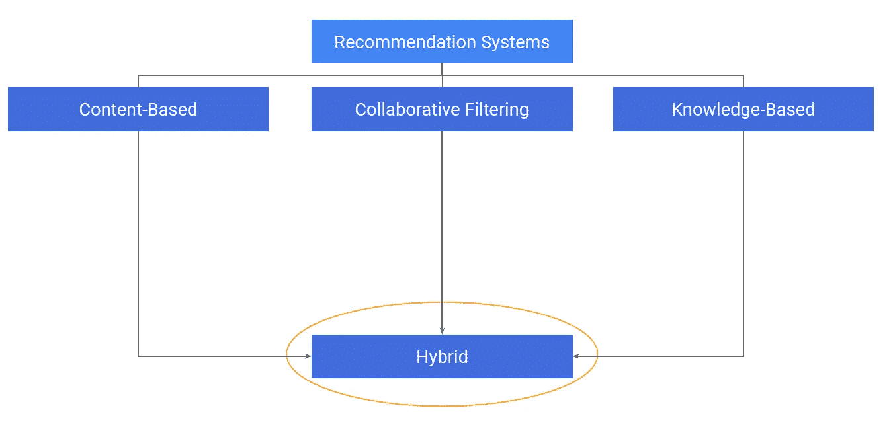

图片提供:谷歌云

1.  **基于内容的过滤:**

基于内容的过滤使用项目的属性来向用户推荐新项目。推荐纯粹基于用户的内容消费历史。例如，如果用户观看了两部电影，并将科幻电影评为高，将恐怖电影评为低，则基于内容的推荐引擎将开始向该用户推荐更多科幻电影。

下面是一个用户-项目交互矩阵，其中对第二个用户的推荐将仅基于该用户对项目的评分。

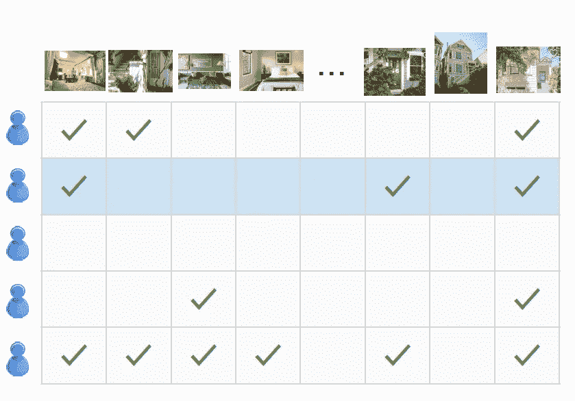

图片提供:谷歌

**缺点:冷启动**——假设用户没有对足够多的电影评级，推荐引擎不会考虑未评级的电影，因为它只考虑用户历史。

**在**时使用:有足够的用户历史可用。

**2。协同过滤:**

它同时利用用户和商品之间的相似性来决定推荐什么。这考虑了整个用户-项目交互矩阵来向用户推荐项目。例如，如果两个用户显示出相似的物品购买行为，则很有可能两个用户都会购买相似类型的物品。

下面是一个例子，其中整个矩阵将被视为向第二个用户推荐商品。

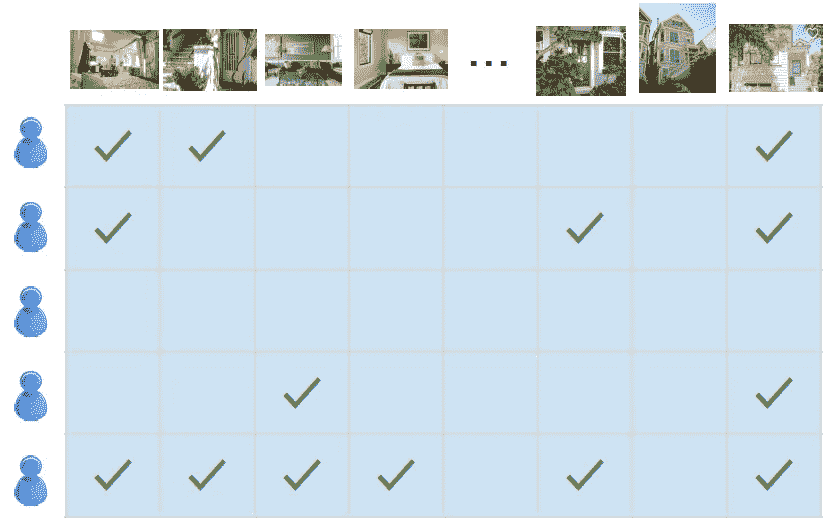

图片提供:谷歌云

**优点:**只要检测到用户之间的相似性，就克服了冷启动问题。

**用于:**用户交互矩阵稀疏的可能性很高(用户可能会也可能不会对大部分项目进行评分)。

反对意见:在极少数情况下，用户很少与任何物品互动(例如购买任何超级奢侈品)，协同过滤可能帮助不大。

**3。基于知识的过滤:**

在这种情况下，关于用户的明确知识被用来创建推荐。例如，在开始时以小测验或表格的形式问一些问题。

**优点:**它克服了以上问题。

**基于混合的过滤:**在现实世界的场景中，所有三种技术的组合被用来构建推荐引擎。因此它被称为基于混合的过滤。

今天我们将讨论构建推荐引擎的协同过滤。我们可以遵循两种方法来构建我们的推荐引擎:

1.  **矩阵分解:**

这个想法是将用户交互矩阵分解为用户因素和项目因素。使用给定的用户 id，两个矩阵的乘积将产生预测评级。使用这些排名前 k 的用户将获得 k 个项目的推荐。在这篇博客中，我们将使用矩阵分解来构建我们的推荐。


来源:谷歌云

这个模型可以用这个等式来表示。

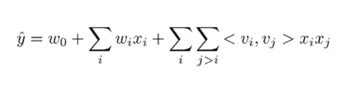

资料来源:AWS

该方程中的三项分别对应于模型的三个组成部分:

*   w0 项代表全局偏差。
*   wi 线性项模拟第 I 个变量的强度。
*   <vi>因式分解项模拟第 I 个和第 j 个变量之间的成对相互作用。</vi>

该模型被训练为减少损失度量。

对于**分类**,测井曲线损失函数具有以下等式:

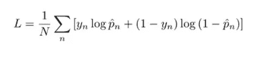

资料来源:AWS

在哪里

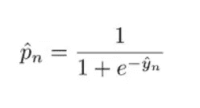

资料来源:AWS

ŷn:模型预测

yn:目标值

对于**回归**任务，平方损失函数:

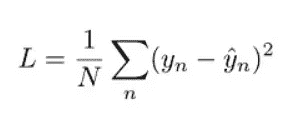

资料来源:AWS

你可以使用白皮书阅读更多关于因式分解机器的信息。

**2。神经协同过滤(NCF):**

在我们进入什么是神经协同过滤之前，我们应该理解两个术语:

**显式反馈**:由用户明确提供给系统，例如喜欢或不喜欢，或者对视频的评分。基于用户交互，该数据可能存在，也可能不存在。

**隐性反馈**:这些数据是通过用户的使用模式隐性收集的，比如观看视频的时间、点击量、浏览量。它更容易获得。

通过使用来自用户-项目交互的隐式反馈，NCF 比传统的矩阵分解技术更进了一步。为此，NCF 利用多层感知器在解决方案中引入非线性。

**先决条件:**

为了建立我们的模型，我们需要一个 AWS 帐户和访问 AWS SageMaker 服务。该数据集将是一个开源数据集。我们将使用像 S3 这样的 AWS 服务来存储模型工件，并使用 AWS sagemaker 托管服务来端到端地部署我们的模型。

**注意**:虽然您可能正在使用 AWS 免费层服务，但如果不是免费试用，AWS Sagemaker 服务可能会向您收取费用。因此，请留意您使用 SageMaker 服务的时间，以避免任何与账单相关的意外。

我们将从存储模型工件的存储桶创建开始。为此，我们将使用亚马逊 S3 服务。

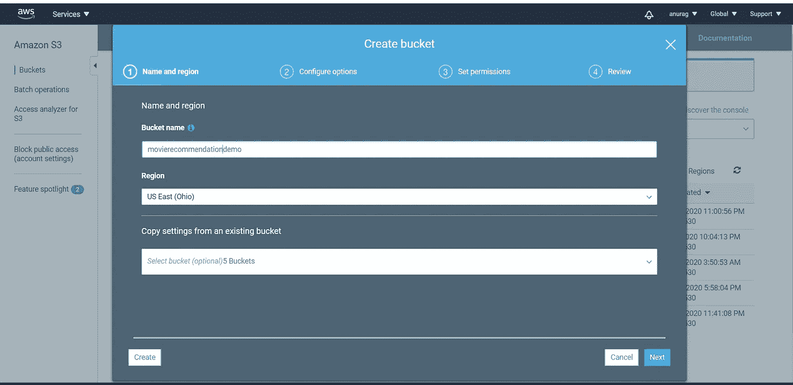

屏幕截图 1

确保选中“阻止所有公共访问”。

一旦创建了 bucket，就可以转到 Amazon SageMaker 服务来创建一个笔记本实例。

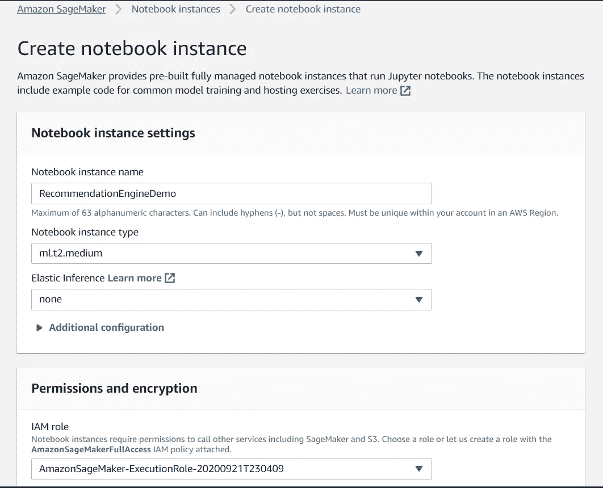

屏幕截图 2

一旦实例准备就绪，您就可以打开 jupyterlab 了。

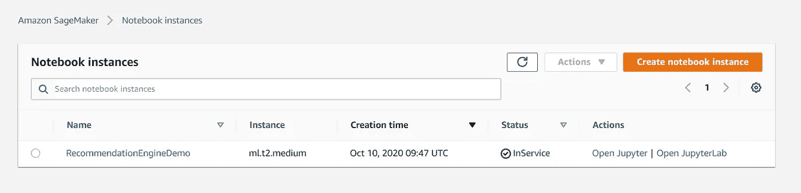

屏幕截图 3

1.  **使用以下命令从公共存储库中下载数据集:**

```
!wget [http://files.grouplens.org/datasets/movielens/ml-100k.zip](http://files.grouplens.org/datasets/movielens/ml-100k.zip)
!unzip -o ml-100k.zip
```

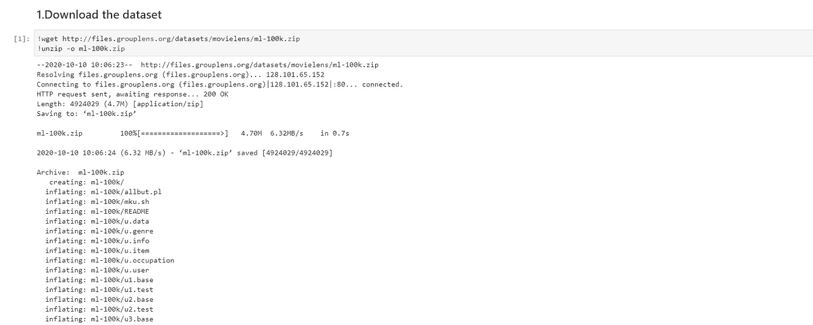

屏幕截图 4

**2。检查数据集:**

下一个任务是检查下载的数据集。

```
%cd ml-100k
!shuf ua.base -o ua.base.shuffled
!head -10 ua.base.shuffled!head -10 ua.test
```

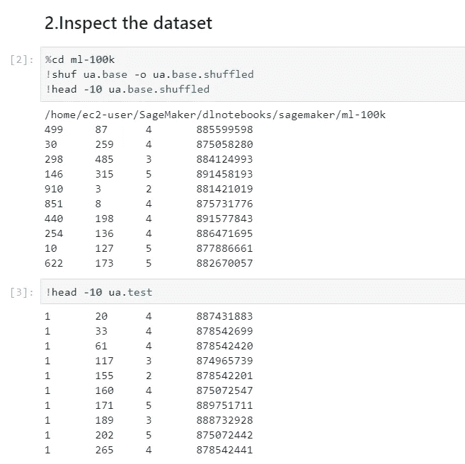

屏幕截图 5

**3。构建训练和测试数据集:**

在这一步中，我们将导入必要的库，并创建一个训练和测试数据集。

```
import sagemaker
import sagemaker.amazon.common as smac
from sagemaker import get_execution_role
from sagemaker.predictor import json_deserializerimport boto3, csv, io, json
import numpy as np
from scipy.sparse import lil_matrixnbUsers=943
nbMovies=1682
nbFeatures=nbUsers+nbMoviesnbRatingsTrain=90570
nbRatingsTest=9430# For each user, build a list of rated movies.
# We'd need this to add random negative samples.
moviesByUser = {}
for userId in range(nbUsers):
    moviesByUser[str(userId)]=[]

with open('ua.base.shuffled','r') as f:
    samples=csv.reader(f,delimiter='\t')
    for userId,movieId,rating,timestamp in samples:
        moviesByUser[str(int(userId)-1)].append(int(movieId)-1)def loadDataset(filename, lines, columns):
    # Features are one-hot encoded in a sparse matrix
    X = lil_matrix((lines, columns)).astype('float32')
    # Labels are stored in a vector
    Y = []
    line=0
    with open(filename,'r') as f:
        samples=csv.reader(f,delimiter='\t')
        for userId,movieId,rating,timestamp in samples:
            X[line,int(userId)-1] = 1
            X[line,int(nbUsers)+int(movieId)-1] = 1
            if int(rating) >= 4:
                Y.append(1)
            else:
                Y.append(0)
            line=line+1

    Y=np.array(Y).astype('float32')
    return X,YX_train, Y_train = loadDataset('ua.base.shuffled', nbRatingsTrain, nbFeatures)
X_test, Y_test = loadDataset('ua.test',nbRatingsTest,nbFeatures)print(X_train.shape)
print(Y_train.shape)
assert X_train.shape == (nbRatingsTrain, nbFeatures)
assert Y_train.shape == (nbRatingsTrain, )
zero_labels = np.count_nonzero(Y_train)
print("Training labels: %d zeros, %d ones" % (zero_labels, nbRatingsTrain-zero_labels))print(X_test.shape)
print(Y_test.shape)
assert X_test.shape  == (nbRatingsTest, nbFeatures)
assert Y_test.shape  == (nbRatingsTest, )
zero_labels = np.count_nonzero(Y_test)
print("Test labels: %d zeros, %d ones" % (zero_labels, nbRatingsTest-zero_labels))
```

一旦训练和测试数据集准备就绪，我们将进入下一步。

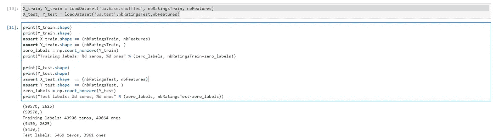

屏幕截图 6

**4。将样本转换为 protobuf 格式并存储在 s3:**

在这一步中，我们将数据集转换为 protobuf 格式，因为 Sagemaker 接受这种格式用于因式分解机器的训练作业，并将其保存到 s3。

```
bucket = 'movierecommendationdemo'
prefix = 'sagemaker/fm-movielens'train_key      = 'train.protobuf'
train_prefix   = '{}/{}'.format(prefix, 'train3')test_key       = 'test.protobuf'
test_prefix    = '{}/{}'.format(prefix, 'test3')output_prefix  = 's3://{}/{}/output'.format(bucket, prefix)def writeDatasetToProtobuf(X, Y, bucket, prefix, key):
    buf = io.BytesIO()
    smac.write_spmatrix_to_sparse_tensor(buf, X, Y)
    buf.seek(0)
    obj = '{}/{}'.format(prefix, key)
    boto3.resource('s3').Bucket(bucket).Object(obj).upload_fileobj(buf)
    return 's3://{}/{}'.format(bucket,obj)

train_data = writeDatasetToProtobuf(X_train, Y_train, bucket, train_prefix, train_key)    
test_data  = writeDatasetToProtobuf(X_test, Y_test, bucket, test_prefix, test_key)    

print(train_data)
print(test_data)
print('Output: {}'.format(output_prefix))
```

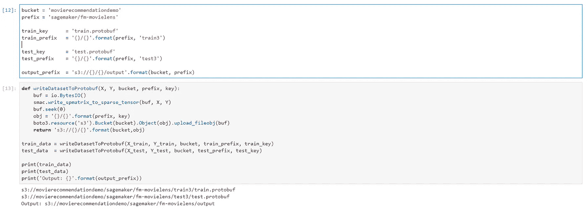

屏幕截图 7

一旦工件被保存，您就可以在 s3 存储桶中看到它们。

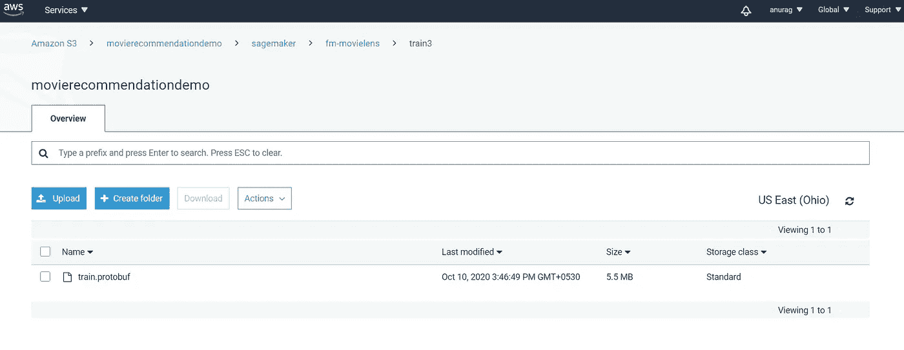

屏幕截图 8

5.运行培训作业:

下一步是创建一个训练作业，并使用预定义的超参数运行它。

以下代码将触发培训作业。

```
containers = {'us-west-2': '174872318107.dkr.ecr.us-west-2.amazonaws.com/factorization-machines:latest',
              'us-east-1': '382416733822.dkr.ecr.us-east-1.amazonaws.com/factorization-machines:latest',
              'us-east-2': '404615174143.dkr.ecr.us-east-2.amazonaws.com/factorization-machines:latest',
              'eu-west-1': '438346466558.dkr.ecr.eu-west-1.amazonaws.com/factorization-machines:latest'}fm = sagemaker.estimator.Estimator(containers[boto3.Session().region_name],
                                   get_execution_role(), 
                                   train_instance_count=1, 
                                   train_instance_type='ml.c4.xlarge',
                                   output_path=output_prefix,
                                   sagemaker_session=sagemaker.Session())fm.set_hyperparameters(feature_dim=nbFeatures,
                      predictor_type='binary_classifier',
                      mini_batch_size=1000,
                      num_factors=64,
                      epochs=100)fm.fit({'train': train_data, 'test': test_data})
```

培训作业开始后，用户可以从控制面板的“培训作业”部分对其进行跟踪。

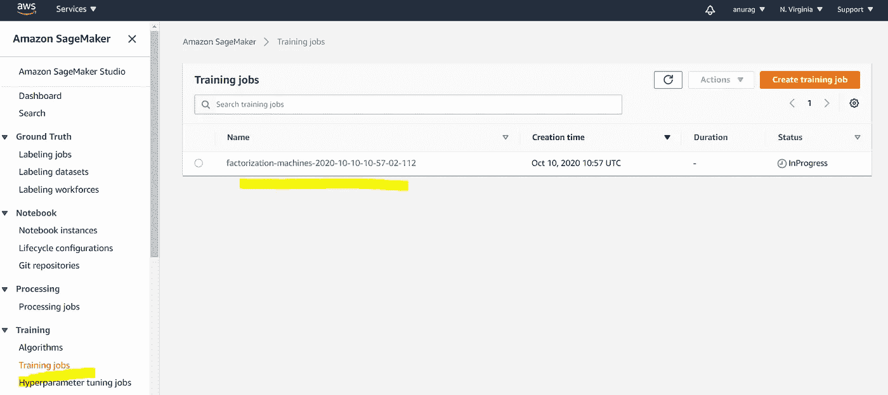

屏幕截图 9

训练工作完成后，您可以开始使用训练好的模型。此外，您可以使用超参数作业来调整超参数。你可以参考我的[帖子](https://medium.com/towards-artificial-intelligence/building-an-end-to-end-deep-learning-model-with-deployment-on-aws-cloud-using-amazon-sagemaker-6b8584c9c6e7)，在那里我展示了如何使用超参数调优作业

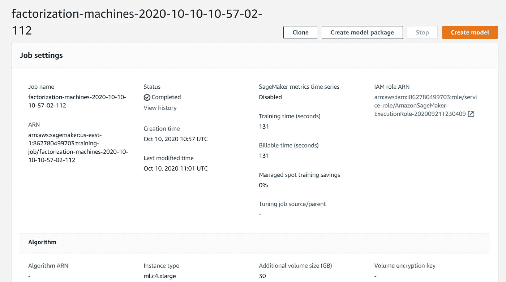

截图 10

**6。部署基线模型:**

现在，我们可以通过编程方式调用 API 来部署我们的模型，或者使用 sagemaker 仪表板来部署它。

```
fm_predictor = fm.deploy(instance_type='ml.c4.xlarge', initial_instance_count=1)def fm_serializer(data):
    js = {'instances': []}
    for row in data:
        js['instances'].append({'features': row.tolist()})
    #print js
    return json.dumps(js)fm_predictor.content_type = 'application/json'
fm_predictor.serializer = fm_serializer
fm_predictor.deserializer = json_deserializer
```


屏幕截图 11

一旦创建了端点，您就可以运行预测来为这组用户获得关于电影的推荐。

```
result = fm_predictor.predict(X_test[1000:1010].toarray())
print(result)
print (Y_test[1000:1010])
```

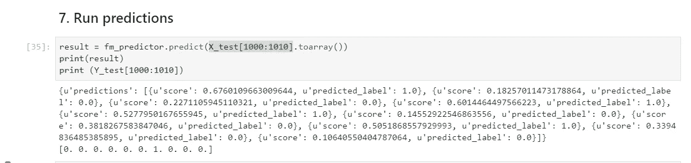

屏幕截图 12

这里预测标签(0 或 1)用置信度分数表示用户是否应该观看电影。

**7。清理活动:**

为了避免产生任何费用，删除端点是一个好的实践，s3 存储桶中的工件。

```
sagemaker.Session().delete_endpoint(fm_predictor.endpoint)
```

您还需要删除任何端点配置和端点。

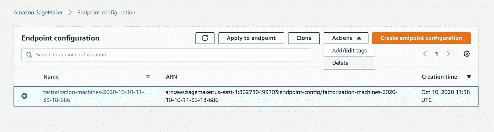

屏幕截图 13

删除任何创建的模型。

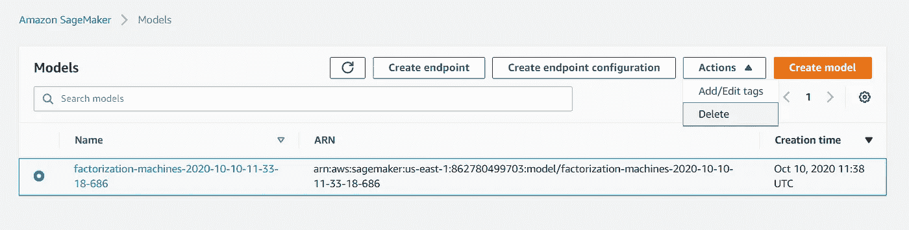

屏幕截图 14

**注意**:停止任何正在运行的笔记本实例(如果需要，在终止后删除)

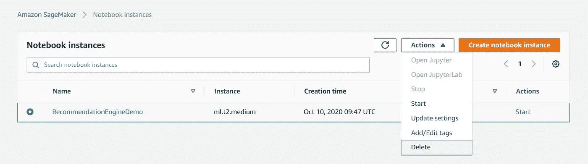

屏幕截图 15

您还可以删除 S3 存储桶中的任何工件。

你可以在这里找到完整的 jupyter 笔记本。

希望你喜欢这篇文章，让我知道你的想法，如果你有任何疑问或建议，希望听到更多你的意见。如果你喜欢人工智能的旅程，请继续关注它，在未来的帖子中会很有趣。

你可以关注我关于人工智能/机器学习、数据分析和商业智能的教程。你可以在 [LinkedIn](https://www.linkedin.com/in/anurag-bisht-39935a59/) 上和我联系。

**参考文献:**

1.  亚马逊网络服务培训
2.  谷歌云培训
3.  算法[白皮书](https://www.csie.ntu.edu.tw/~b97053/paper/Rendle2010FM.pdf)