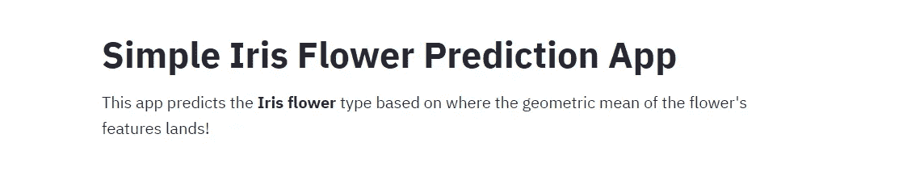
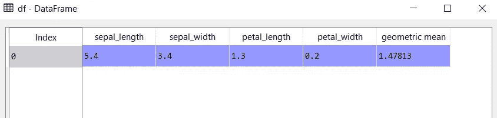
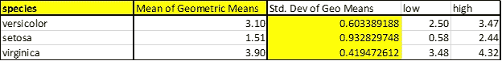
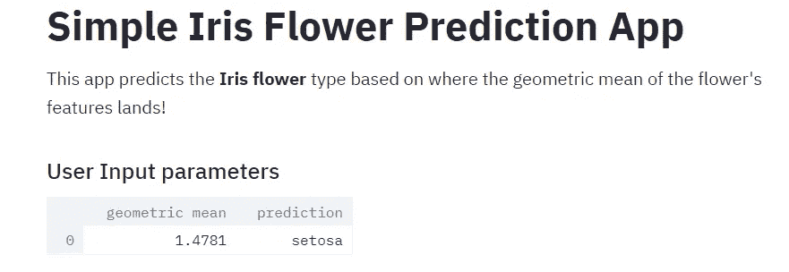
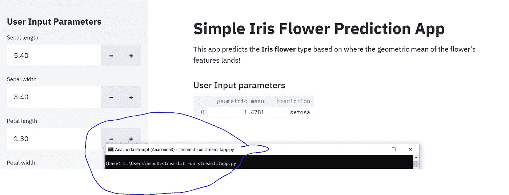
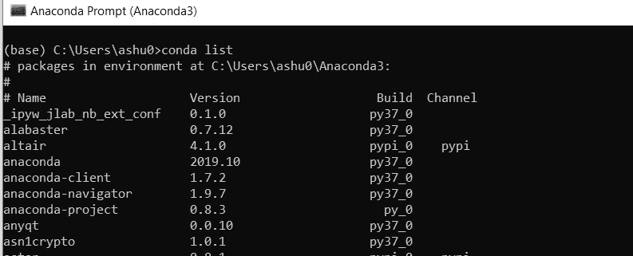
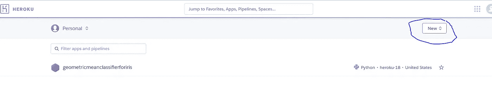
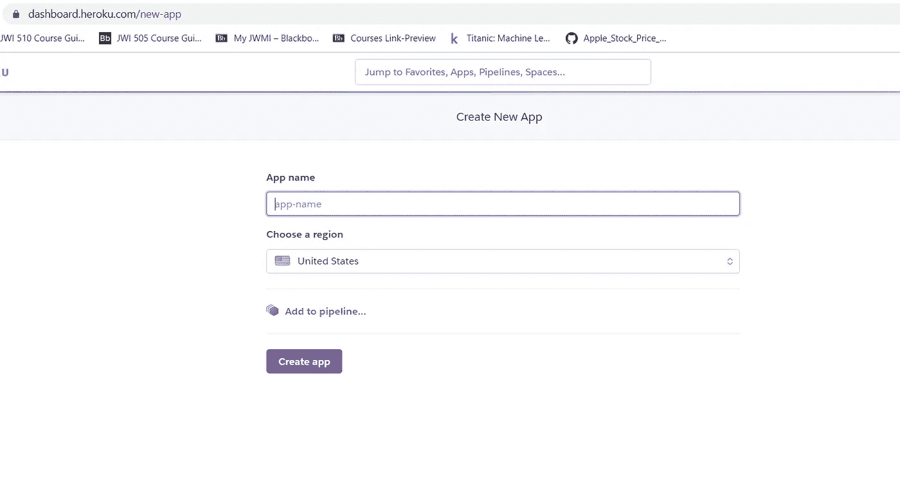
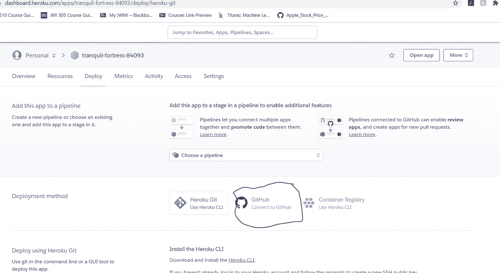
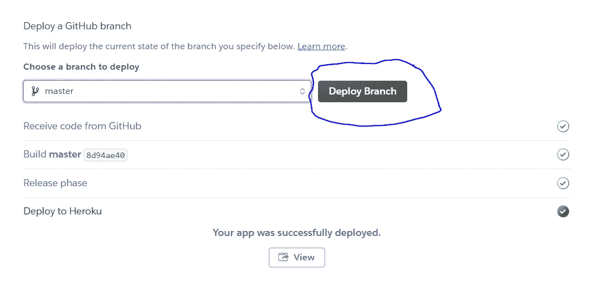

# 如何为数据科学制作 Web 应用程序

> 原文：<https://pub.towardsai.net/building-and-deploying-a-data-science-web-application-to-recognize-flowers-using-geometric-mean-c700d23e187?source=collection_archive---------1----------------------->

## [数据科学](https://towardsai.net/p/category/data-science)，[编程](https://towardsai.net/p/category/programming)

## 几何平均虹膜分类器的应用内置 Streamlit


照片由[伊琳娜·伊里斯](https://unsplash.com/@iriser?utm_source=unsplash&utm_medium=referral&utm_content=creditCopyText)在 [Unsplash](https://unsplash.com/s/photos/flowers?utm_source=unsplash&utm_medium=referral&utm_content=creditCopyText) 上拍摄

我的申请可以在这里找到 [**。**](https://geometricmeanclassifierforiris.herokuapp.com/)

这个应用程序使用**几何平均分类算法**对虹膜数据集中的花朵进行分类，我在这里已经提到过 [**。**](https://medium.com/towards-artificial-intelligence/geometric-mean-classifier-for-iris-dataset-ed83209f54f3)

在这篇文章中，我将带您了解从 python 代码开始到部署应用程序的整个过程。

让我们从代码开始。首先，您必须使用下面的代码导入这些包:

```
import streamlit as st
import pandas as pd
from sklearn import datasets
import numpy as np
import scipy
from scipy import stats
```

Streamlit 允许你构建应用程序，pandas/sklearn/numpy/scipy 都是众所周知的数据科学应用程序，我们将使用它们来编写对鲜花进行分类的代码，并接受用户的输入。

现在让我们在 web 应用程序的顶部添加一些描述。您可以使用以下代码来实现这一点:

```
st.write(“””
# Simple Iris Flower Prediction App
This app predicts the **Iris flower** type based on where the geometric mean of the flower’s features lands!
“””)
```

在 web 应用程序中，它看起来像这样:



现在让我们为应用程序构建一个侧边栏视图来接受用户输入。

```
st.sidebar.header('User Input Parameters')
st.subheader('User Input parameters')
```

现在我们可以编写一个函数来接受用户输入的特性:

```
def user_input_features():
    sepal_length = st.sidebar.number_input('Sepal length', 4.3, 7.9, 5.4)
    sepal_width = st.sidebar.number_input('Sepal width', 2.0, 4.4, 3.4)
    petal_length = st.sidebar.number_input('Petal length', 1.0, 6.9, 1.3)
    petal_width = st.sidebar.number_input('Petal width', 0.1, 2.5, 0.2)
    data = {'sepal_length': sepal_length,
            'sepal_width': sepal_width,
            'petal_length': petal_length,
            'petal_width': petal_width}
    features = pd.DataFrame(data, index=[0])
    return features
```

让我们来分解这个函数。在这个函数中，您要求用户提供四个参数，他们可以通过侧栏(st.sidebar.number_input)选择这些参数。这四个参数是虹膜数据集的特征，萼片长度、萼片宽度、花瓣长度和花瓣宽度。

接下来，我们将它放入名为 data 的字典中，其中的键是每个特性的名称，值是用户在侧栏中输入的值。

最后，我们将数据字典转换成名为 features 的 pandas 数据框架。然后，该函数在被调用时返回 dataframe 特性，这就是应用程序用户输入的所有四个值。

接下来，我们将把函数的结果赋给一个公共数据帧名 df:

```
df = user_input_features()
```

现在，使用 scipy 和 pandas 包，让我们计算用户输入的几何平均值，并将其分配给 x。

```
x=scipy.stats.gmean(df.iloc[:,0:4],axis=1)
```

gmean 是 scipy 中的一个内置函数。

df.iloc 选择您想要操作的列和行。在这种情况下，[:，0:4]意味着我们正在计算数据集 df 中所有四个特征的几何平均值。

现在，让我们构建一个名为几何平均值的新列，它包含我们上面计算的变量 x 的值。

```
df['geometric mean'] = x
```

如果您运行代码到这一点，并查看 df 数据帧，它将如下所示:



在这一点上，让我们看看我们在这篇[无分支编程文章](https://medium.com/towards-artificial-intelligence/an-example-of-branchless-logic-using-excel-c6afc6eef75e)中看到的几何分类器的一些范围。我复制了以下产品系列的图片:



所以，让我们用 python 来编码这些范围。我做了一些改变。请注意，setosa 的范围很小，为 0.58，为了方便起见，我将它设为小于 2.44(高值)的值，以便包含更小的值。它不与其他职业重叠，所以这不是一个冒险的举动。我还将 virginica 的高值 4.32 更改为 100，以包含任何超出的值。

现在，我们可以从这些假设中列出两个列表。一个包含将给出三个布尔值的条件/范围，另一个包含标签。为了简单起见，第一个列表叫做条件，第二个叫做标签。

```
conditions = [
 (df[‘geometric mean’] <= 2.33),
 (df[‘geometric mean’] > 2.33) & (df[‘geometric mean’] <= 3.47),
 (df[‘geometric mean’] > 3.47) & (df[‘geometric mean’] <= 100),
 ]labels =[‘setosa’,’versicolor’,’virginica’]
```

接下来，我们可以使用 numpy 根据条件选择适当的标签，然后 pandas 创建一个包含该标签的预测列。

```
df['prediction'] = np.select(conditions, labels)
```

现在，我只想在应用程序的主要部分显示某些列，如下所示:



为此，我们可以列出要包含的列名:

```
col_list = [‘geometric mean’, ‘prediction’]
```

现在，我们可以在 df 数据帧中传递这个列表，只选择这些列，并将其分配回 df 数据帧:

```
df=df[col_list]
```

最后，我们必须使用 st.write 来显示我们在应用程序上的工作:

```
st.write(df)
```

现在，打开命令提示符。在我的例子中，我使用了 anaconda，所以我使用了 anaconda 提示符。输入

```
streamlit run streamlitapp.py
```

它将在您的本地主机上运行应用程序，并显示其外观:



现在，我们可以使用 GitHub 和 Heroku 部署这个应用程序。

创建一个 GitHub 帐户和一个库，将下面 GitHub 链接中的文件放入其中。(可以用自己的。py 文件，而不是其中的一个，它将在应用程序上部署它)

以下是您需要的 GitHub 文件:

[](https://github.com/ashm212/geometricmeanclassifier/tree/master) [## ashm 212/几何平均分类器

### 几何平均分类器应用程序。通过创建一个帐户，为 ashm 212/geometricmeancrypter 开发作出贡献…

github.com](https://github.com/ashm212/geometricmeanclassifier/tree/master) 

您将需要所有这些文件，除了。py，它将基于您的 python 代码。现在，对文件进行一些修改。在 requirements.txt 文件中，您需要您的应用程序版本才能工作。

获取所有包的版本的方法是在 anaconda 提示符下键入“conda list”。在 github 上的 requirements.txt 文件中，确保您的计算机有正确的版本号，然后将其保存回来。



现在，去 heroku.com 的。

1.  注册或登录。您将看到此仪表板页面:



2.点击新建

3.在下拉列表中，单击“创建新应用程序”

4.您现在位于此页面:



5.输入应用程序名称。

6.选择您所在的地区(美国或欧洲)

7.点击创建应用程序按钮

8.现在，您将进入此页面:



9.点按被圈起来的 Github 按钮。当你点击这个，它将允许你用你的帐号连接到 GitHub 到你创建的仓库。

10.完成后，您可以选择自动或手动部署。

11.在本例中，我选择了手动部署。在手动部署下，您将看到以下内容。单击“部署分支”链接，它将安装所有内容并部署您的应用程序。这可能需要一些时间。



12.点击图片中的“查看”按钮，它会给你链接。

13.对我来说，链接是[https://geometricmeanclassifierforiris.herokuapp.com/](https://geometricmeanclassifierforiris.herokuapp.com/)

看看吧！

谢谢，

灰

参考资料:

这个应用程序是使用数据教授的视频构建的，这些视频可以在以下链接找到:【https://www.youtube.com/watch?v=ZZ4B0QUHuNc】T2&t = 110s

[主数据处理器/代码 GitHub](https://github.com/dataprofessor/code/tree/master/streamlit/part2) 的代码/流线/零件 2