# 用 SAS 建立和优化随机完全区组设计

> 原文：<https://pub.towardsai.net/building-and-optimizing-randomized-complete-block-designs-using-sas-c973d127d862?source=collection_archive---------0----------------------->

## [统计数据](https://towardsai.net/p/category/statistics)

在动物科学中，使用最多的设计是随机完全区组设计(RCBD)。这种设计可以与生命科学中常用的分层随机设计相比较。它的巧妙之处在于利用一个实验的设计来包含方差，以便排除方差。这是正确的。我们在设计中包含了方差，以确保我们可以控制它，所以当需要分析数据时，我们可以排除它。我在之前的[介绍性](https://medium.com/@marc.jacobs012/general-introduction-to-design-of-experiments-in-animal-science-using-sas-for-codes-fe1c5272b37a)帖子中写过关于随机化和分块的内容。在这篇文章中，我将深入 RCBD。

RCBD 是构建块和随机化的结合。真的没什么可说的了。

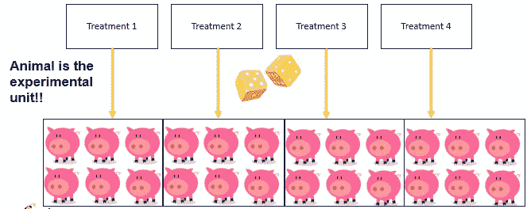

在这里，你可以看到猪被随机分配到不同的治疗组。因为所有的猪都是一样的，随机化是为了展示。

现在，假设我们的猪并不都是同样的颜色。如果我们只是将猪随机分组，我们的处理中会有不均匀的颜色分布。猪的颜色可能是我们在分析中需要处理的一个协变量。虽然这真的很好，但在设计阶段处理潜在的混淆因素会更有效率和效果。

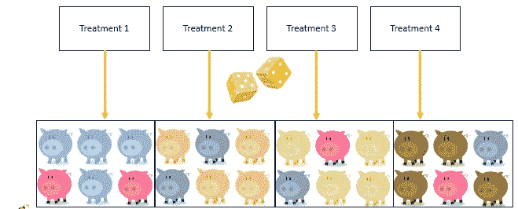

随机化并不自动意味着已知的协变量在治疗中均匀分布。尤其是在小样本的情况下。分析只能纠正这么多。

完全随机设计是一个大数目的设计。它假设，通过从人群中随机抽取，代表每个处理的样本在所有特征上都是相同的，除了处理→ **比较将是纯粹的**。在动物科学中，这种情况很少发生，因为我们无法实现达到这种纯度水平所需的数量。然而，我们有两个选择:

1.  将颜色作为协变量包含在模型中
2.  设计中包含颜色→随机完全区组设计

我们现在将展示 RCBD 设计在实践中是如何工作的。首先，我们创建块，我们创建的块和颜色一样多。通常，这种一对一的关系是不可能的，您需要创建块内差异很小而块间差异很大的块。

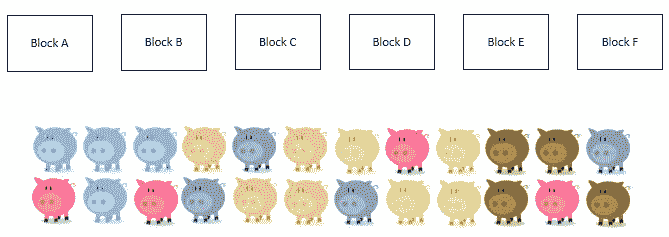

六块代表六种颜色。

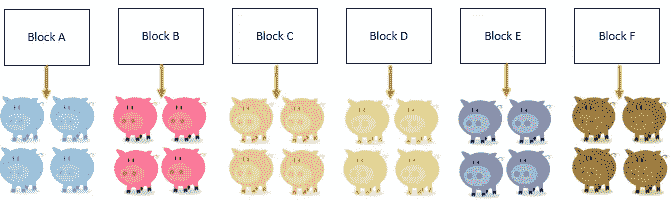

现在，我们有 6 个积木，每个积木有 4 只动物。每个区块由一组同质的动物(颜色)组成。每个区块由一组同质的动物(颜色)组成

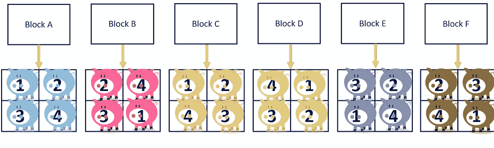

**随机完全区组设计**实际上意味着**每个处理*区组组合一个**重复。这将导致下面的例子。

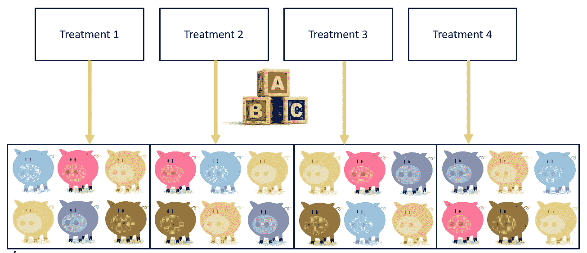

每个处理在处理中具有相同的颜色分布，这意味着每个处理具有每种颜色的猪。这是 RCBD。

作为阻断的结果，每种处理现在在阻断因子→ **颜色**方面具有相似的分布。这里，块代表猪的颜色，通过块，我们确保每个处理至少有一只每种颜色的猪。然而，我们很少有这么好的预定义阻塞因子水平。此外，为了获得由阻塞因子引起的方差的良好估计，我们需要每个阻塞的两个以上的级别，这可能很难完成

**总之，一个 R** 和优化的 **C** 完整的 **B** 锁设计确保:

1.  随机处理是在一个区块内随机进行的
2.  所有的治疗都在一个街区
3.  每个区块*处理有一个重复
4.  每个区块都是一个**小型实验**，因为我们在每个区块内比较治疗。

一般来说，RCBD 比完全随机化设计(CRD)更有效，因为块内单元比块间单元更相似(同质的)。因此，在考虑了块变化之后，实验误差变得更小

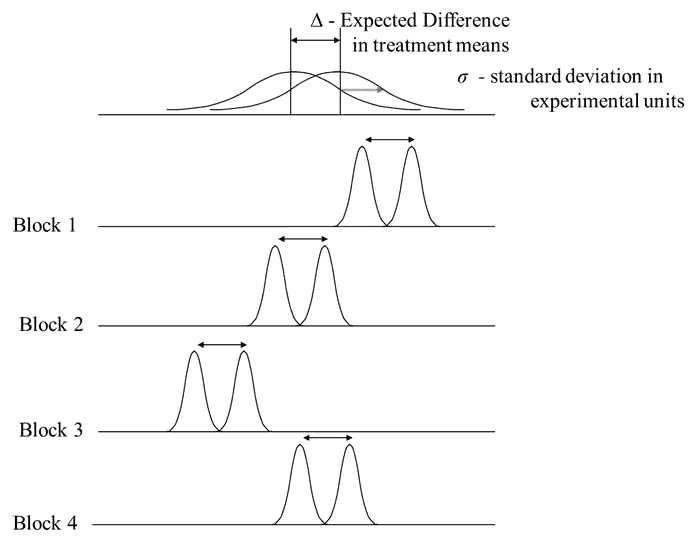

这些块通过故意把差异放在那里来捕捉差异。通过使用 RCBD，你可以控制方差，所以它不会让你感到惊讶。事实上，你是在利用已知的方差，使你的设计更强大。你能在你的程序块中捕捉到的差异越多越好。

上图显示了每个处理中的差异已经被划分成块。每个区块都是一个微型实验，有自己的处理差异和具体的变化。这种设计增加了信噪比，因为块之间的处理差异是相似的

我想到的最大问题是什么时候屏蔽是有帮助的。正如你可能已经猜到的，它的有用性取决于它捕捉变化的能力。[方差越大越好](https://medium.com/@marc.jacobs012/randomness-in-mixed-models-8b7affd8a7c4)。

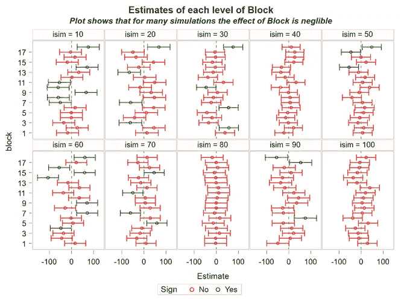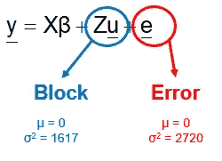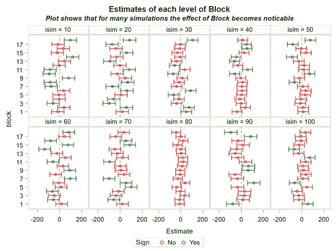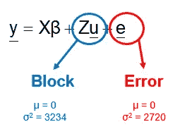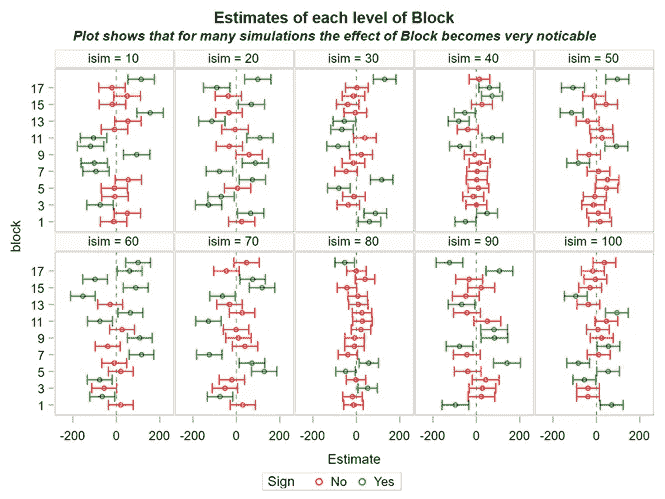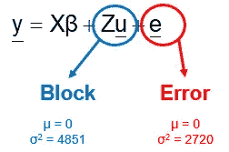

块可以捕获的方差越多，块/总方差比率就越好。

封锁就是解释你创造的变化。如果你的区块没有捕捉到变异，那么设计一个区块研究是没有用的，甚至会对你的能力有害。要决定屏蔽是否有用，你需要问自己:

1.  我感兴趣的主要结果是什么？
2.  是否存在会降低信噪比的变异源
3.  这个降幅会有多大？
4.  随机区组设计能帮助我限制下降吗？
5.  随机区组设计能帮助我提高信噪比吗？

在最佳随机完全区组设计中，您有:

1.  街区内的同质性
2.  跨块的异质性

如果块太大，或者块太少，则块将太易变，从而不能有效地捕捉和删除变化

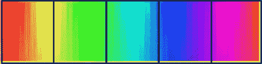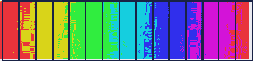

与右侧的块结构相比，左侧的块显示了太多的块内差异。这是极其重要的。包含的区间数不超过方差内数的分块充其量是无用的，而在

一个分块结构能捕捉的差异越多，在一个研究中捕捉“真实”差异所需的分块就越少。与样本大小一样，区块越多越好。最后，它取决于块创建块间方差的能力。

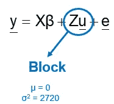

现在，如果你设计了一个 RCBD，但是把它作为一个 CRD 来分析，会怎么样呢？这样做的话，您就无法捕获由块引起的差异。这个方差会进垃圾桶——实验误差——你会降低信噪比→治疗效果/实验误差。此外，您将增加发现第二类错误的机会，因为实际的实验错误比模型显示的要少

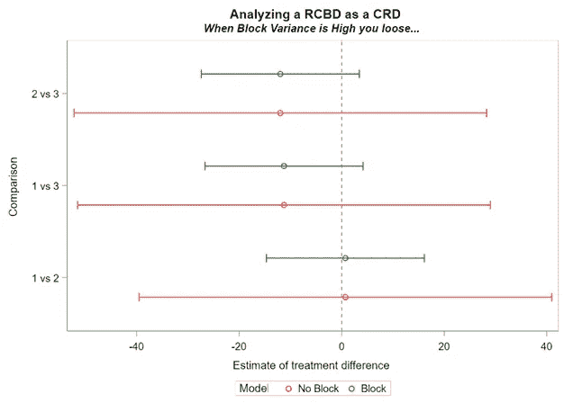

将 RCBD 作为 CRD 进行分析取决于阻塞结构造成的方差。

封杀就像签订**合同** *。*一旦你进入了，你就进入了，根据你的研究目标，这些模块是一个有用的——通常是必要的——工具。像设计中的所有东西一样，块必须正确设计，并在统计模型中考虑。例如，如果结果变量和动物的初始体重之间的相互作用不是预期的，那么完全随机设计可以很好地完成这项工作。这里，初始体重是一个量，可以作为协变量

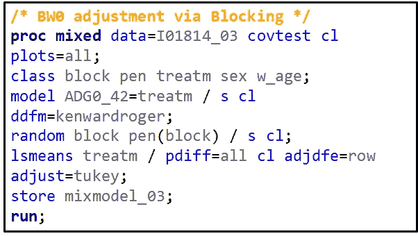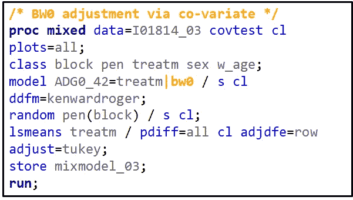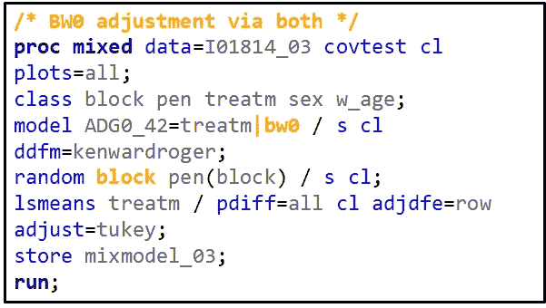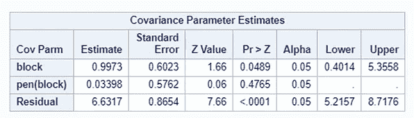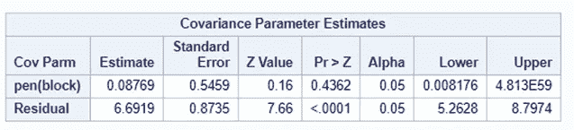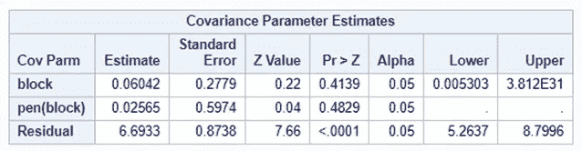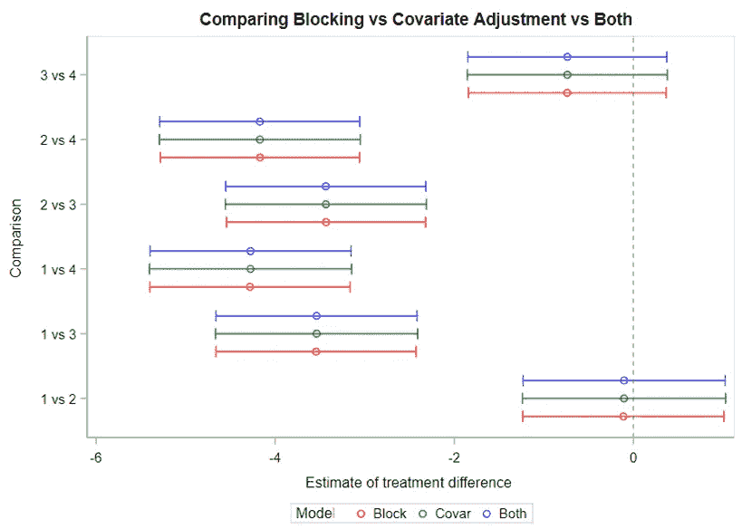

分析方法之间没有可辨别的差异(提示:这也与没有丢失数据有关)。

如果能代表真实的人群，屏蔽效果最好。但是，如果您对群体的某个特定部分更感兴趣，或者您期望某个特定部分有更多的变化，那么包含该部分的更多块可能会很有用

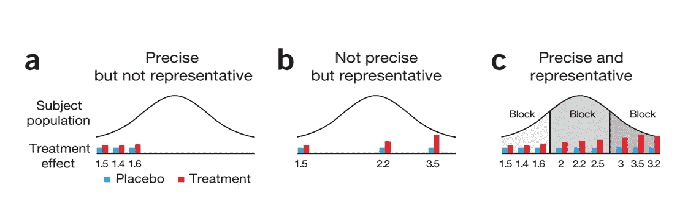

阻挡的有效性取决于它的代表性和精确性。

现在，如果更多的研究从同一种群的动物开始，有时多个实验从同一群动物开始。将动物分配到不同的实验中会对结果产生很大的影响。在大多数情况下，对所有受影响的实验都有效的解决方案是可能的。然而，情况并非总是如此，这可以从下图中看出。在这里，一个大动物堆被用来喂养两个独立的研究。绩效研究的分配影响了偏好研究的分配。

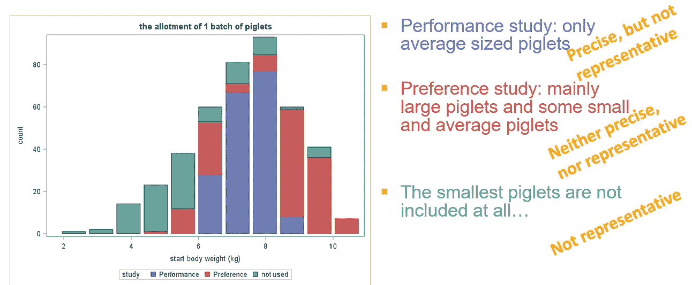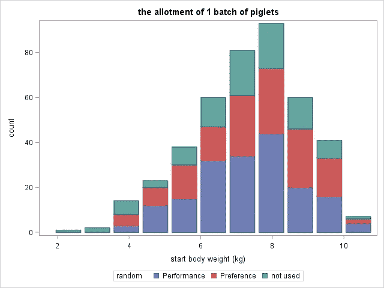

它是如何进行的(左)和它应该如何进行的(右)。

除了最小的小猪，所有的小猪都被随机分配到研究中。两项研究都具有代表性。然而，特别是性能研究不太精确。重复次数相同，但方差增加。这将对研究的效果产生负面影响。

现在，我们已经多次讨论了使用正确的阻挡策略的重要性。这些块需要能够以牺牲块内方差来最大化块间方差的方式捕获方差。街区的设置方式对此是不利的。

下面左边是一个实际的阻断策略，使用第 0 天的体重作为阻断参数。在右边，你可以看到一个模拟的阻断策略，利用第 0 天的体重分布来显示阻断的大小和数量。确定哪项研究将证明具有更好的阻断策略并不需要很大的远见。

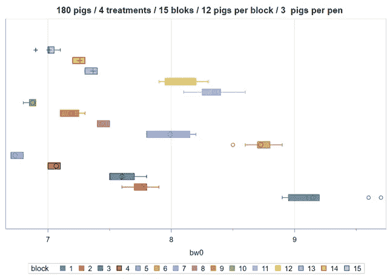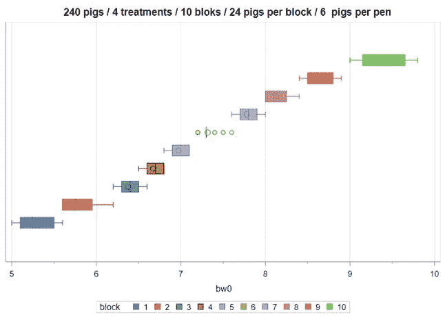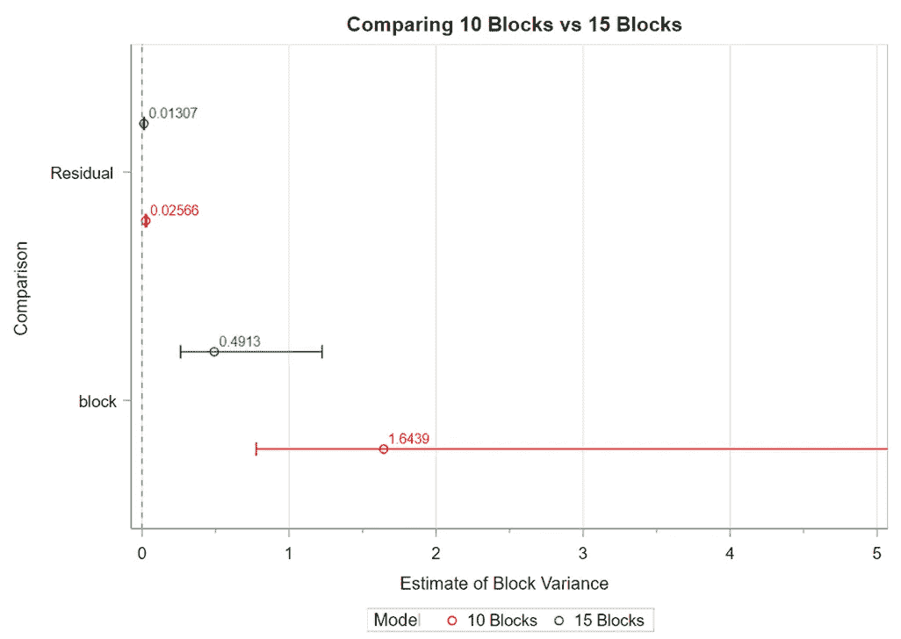

10 个块比 15 个块捕捉更多的变化。然而，仍然有一个很大的方差集包括在内。一定要小心。

使用 [**PROC FACTEX**](https://support.sas.com/documentation/onlinedoc/qc/132/factex.pdf) 可以轻松创建和优化随机完整区组设计。下面，你可以看到一个跨四个区块的 2 全因子实验，得到 32 个实验单位。 [**PROC 计划**](https://support.sas.com/documentation/onlinedoc/stat/141/plan.pdf) 当然也可以容纳在这里。

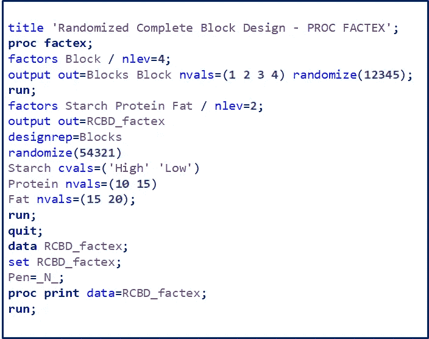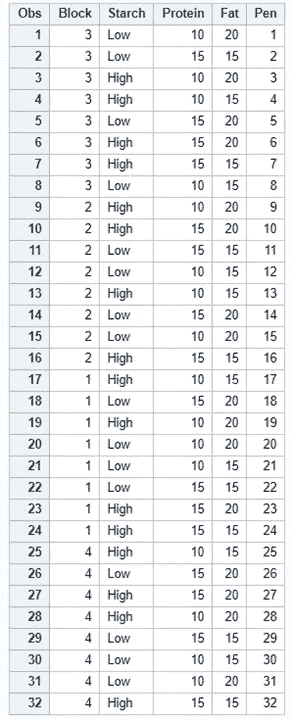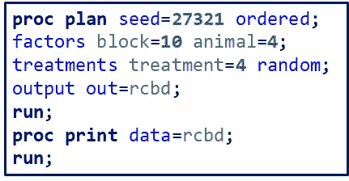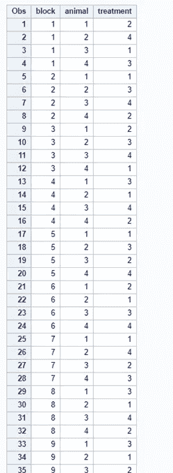

然后，总是有构建嵌套数据集的数据步骤方法。在 SAS 中，这是儿童游戏。

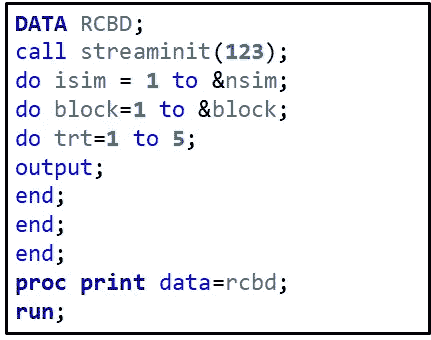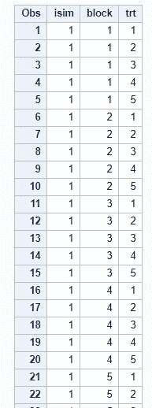

最后，但同样重要的是，我们可以使用 [**PROC OPTEX**](https://support.sas.com/documentation/onlinedoc/qc/132/optex.pdf) 来构建一个 RCBD。

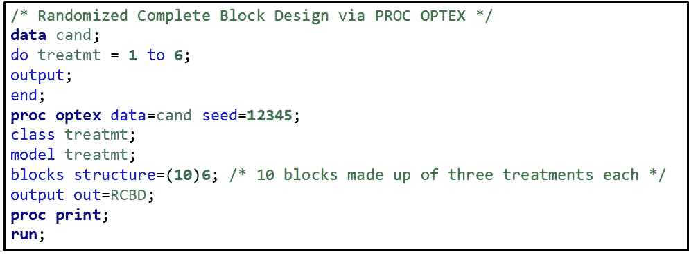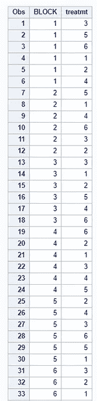

现在，让我们开始分析一个 RCBD 设计。下面你可以看到我试图加入一种治疗*阻断相互作用。请记住，RCBD 对每个处理*阻断相互作用只有一个重复，这意味着包括处理*阻断不会留下任何信息来确定残差方差。你可以清楚地看到。

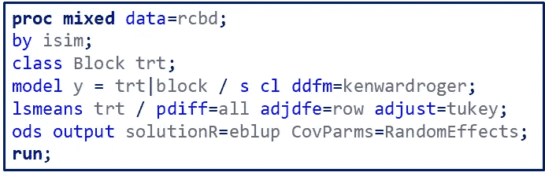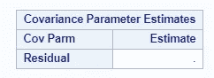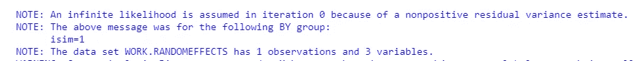

如果你想分析治疗和阻断之间的相互作用，你需要在一个阻断内复制治疗。然而，这将使块更大，这可能导致块内的同质性更低，因此同质性更低

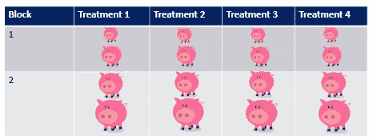

两个块试图通过增加块间方差来捕获方差。

因此，随机完全区组设计是一个很好的设计，如果:

1.  有足够的差异可以通过分块来捕获
2.  块的设置方式是内部同构，而之间异构。

如果你有很多治疗方法，就很难获得同质的块，正如你在这里看到的彩色条。

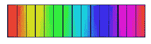

因此，这就是**随机化不完全区组设计** (RIBD) 能够具有巨大价值的地方，因为它通过在每个区组中不进行所有处理来保持区组的同质性。可以在**平衡**和**部分平衡**设计之间进行区分。

RIBD 有四个关键特征:

1.  每个处理水平都是同等复制的
2.  每种处理不会出现在每个区块中
3.  每个处理在块上出现**相同的次数**
4.  每对处理**在一个块中出现相同的次数**

随机不完全区组设计。

要构建这样的设计，您需要处理一个内置 SAS 宏，然后使用 **PROC OPTEX** 。

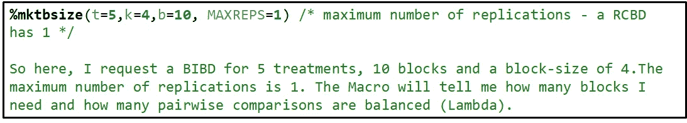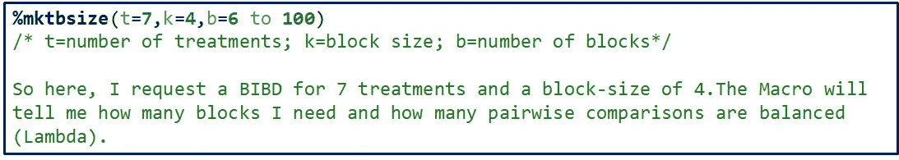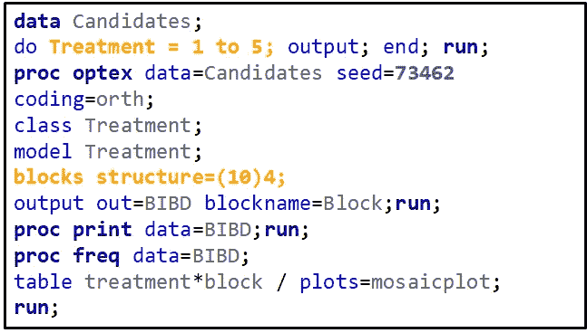

对具有五个治疗的 RIBD 的请求，并且希望在十个块中有四个治疗。

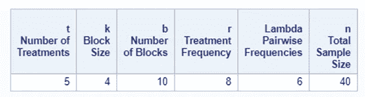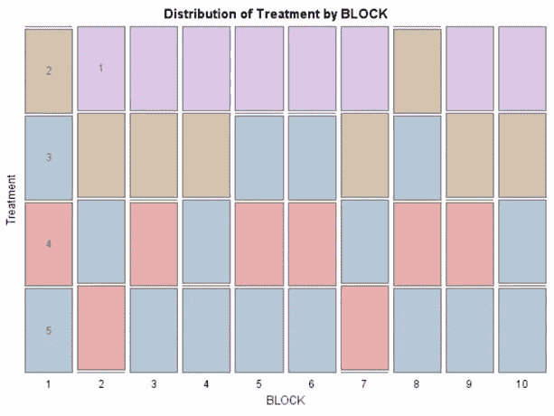

我有十个区块，每个区块包含四种治疗方法。每个处理可以在八个模块中找到，实现六个成对的平衡比较。

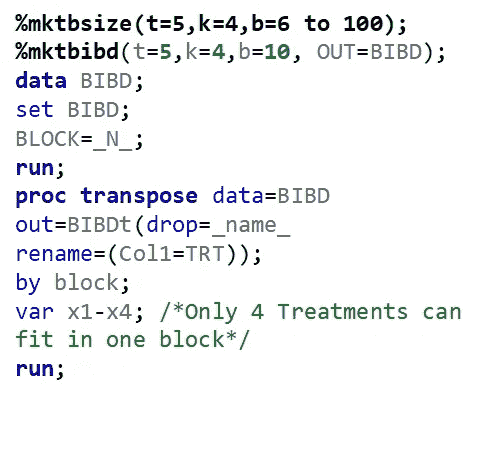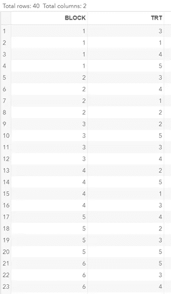

Macro 要求一个平衡的不完全区组设计，用于五个处理，十个区组，以及我们每个区组的处理。

当然，即使不完整的区块设计是平衡的，它也不是 RCBD 的对手。然而，如果您没有足够的空间来容纳 RCBD 所需的样本量，我认为 RIBD 是最好的选择。

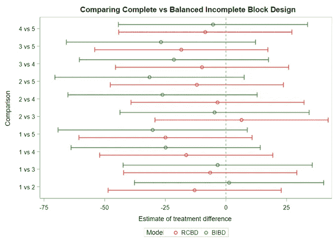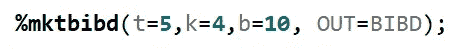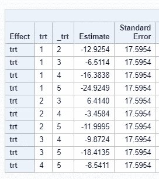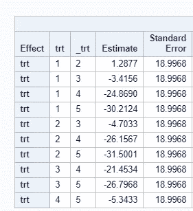

比较 RCBD 和里伯德。由于随机抽样，估计值可能看起来完全不同，但最重要的是要注意 RIBD 的置信限更大。

因为我们有一个完全平衡的不完全区组设计，所以我们也可以创建部分平衡的不完全区组设计。这里:

1.  每个处理**不会在每个程序块中出现**
2.  每个处理**在块上出现的次数**不同
3.  每对处理**在一个块中出现的次数**不同

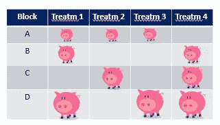

部分平衡的不完全区组设计。

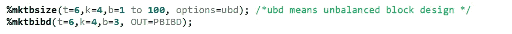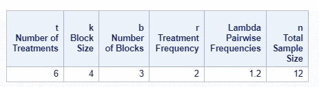

λ不再是整数，这意味着每个处理比较在每个块中并不相等

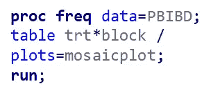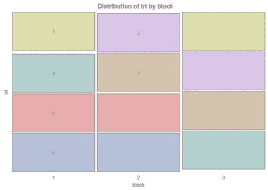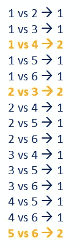

如你所见，比较在样本量上有所不同，而平衡不完全区组设计则不是这样。因此，为什么它被称为平衡，这种设计被称为不平衡。

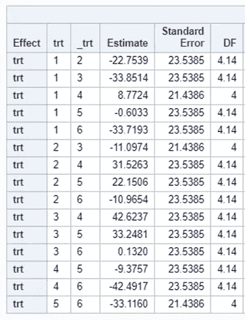

这种不平衡表现在每次比较可用的自由度上。

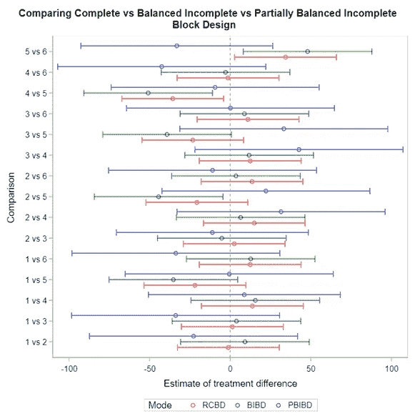

这将在比较和大多数置信区间中反映出来。

假设我有六个处理，四个区块，每个区块三个处理，我最感兴趣的是比较 1 对 2，1 对 4，2 对 4。一个简单的开始是使用**触发计划**。

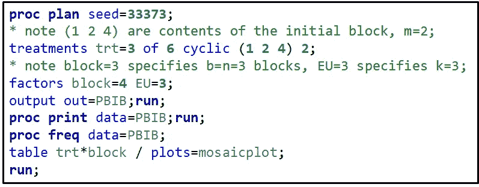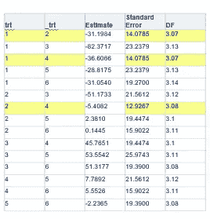

我感兴趣的比较具有最低的标准误差。

下面，您将看到一个使用 PROC FACTEX 的多个步骤来构建固定和随机组件嵌套的 RCBD 设计示例，从块开始，添加处理，然后添加性别作为因素。

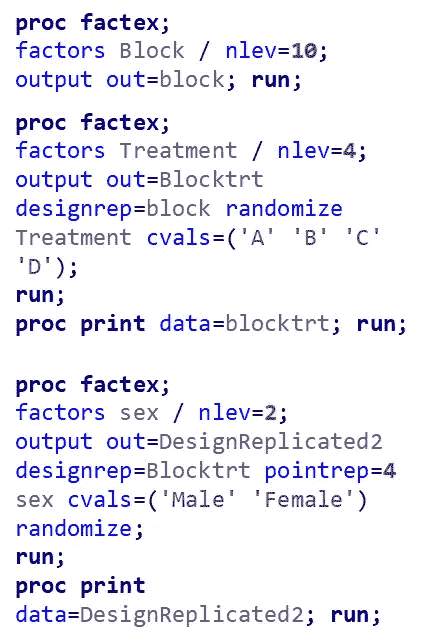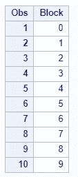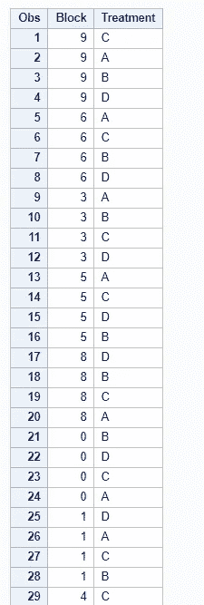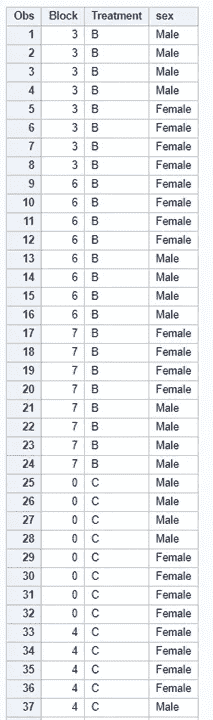

数据集随着嵌套变量数量的增加而增加。

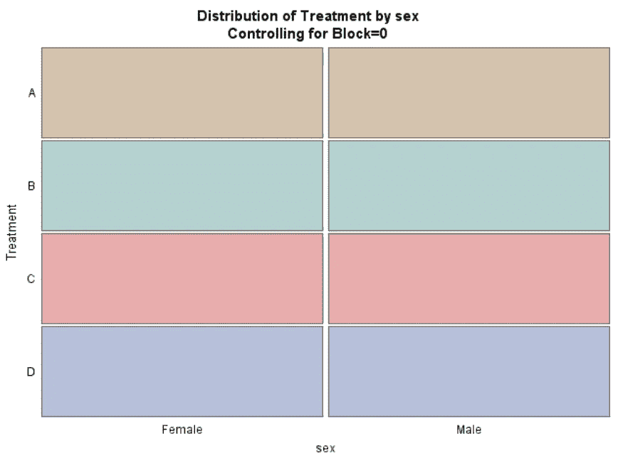

最后，我有十个区块，每个区块包含四个处理，每个处理有四个雄性和四个雌性。

人们也可以很容易地要求 SAS 将全因子转换成 RCBD，您可以在下面看到两个例子。

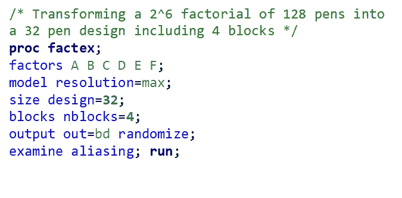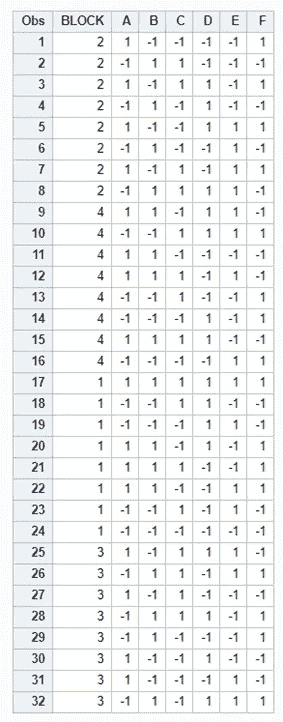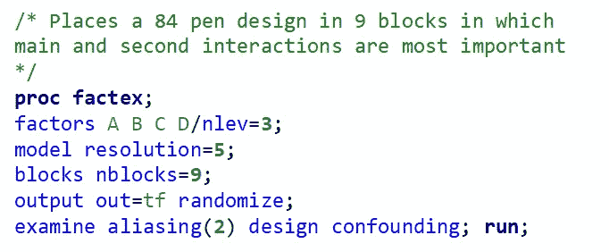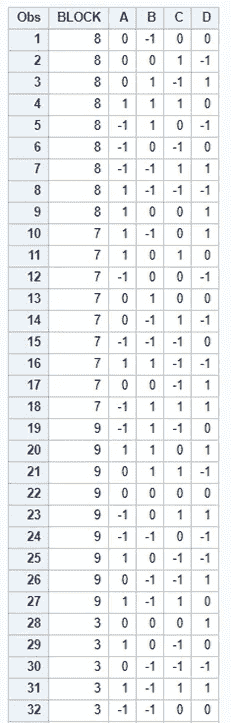

总之，阻止一项研究有两个主要原因:(1)实际的，和(2)统计的。

**堵塞的实际原因**

1.  研究中的条件不能保持不变。
2.  将实验分成同种动物的小型实验。
3.  这个实验更容易操作。

**统计阻塞原因**

1.  通过创建和计算已创建的差异来控制差异。
2.  抵消块与块之间的差异
3.  更好地估计治疗差异→仅由实验误差引起的标准误差