# 使用 TF2 从头开始构建和可视化机器语言翻译

> 原文：<https://pub.towardsai.net/building-and-visualizing-machine-language-translation-using-seq2seq-models-with-attention-from-6803b9b4bd6a?source=collection_archive---------2----------------------->

## [深度学习](https://towardsai.net/p/category/machine-learning/deep-learning)，[自然语言处理](https://towardsai.net/p/category/nlp)

## 学习理解建立机器语言翻译，深度学习模型，用 TensorFlow(注意使用 Seq2seq 模型)。

这篇文章需要一些递归神经网络和 GRU 的基本知识。我将在本文中简要介绍这个概念。

在序列对序列的深度学习中，模型已经在机器语言翻译的任务中取得了很大的成功。在本文中，我们将构建一个西班牙语到英语的翻译器。

**记住，动画中的任何凹凸都是指在幕后进行的数学运算。**另外，如果你在动画中遇到任何法语单词，把它们当成西班牙语单词，然后继续(我尽力从网上收集最好的动画(͡ ͜ʖ ͡))

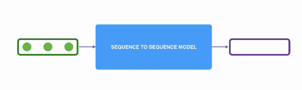

序列 2 序列可视化

**RNN 简介:**

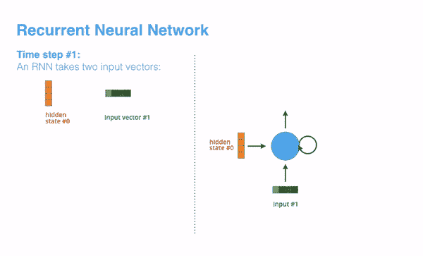

每个 RNN 单元接受一个输入向量(**输入#1** )和前一个隐藏状态向量(**隐藏状态#0** )来计算该特定单元的当前隐藏状态向量(**隐藏状态#1** )和输出向量(**输出#1** )。我们堆叠了许多这样的单元来构建我们的模型(如果我们专门讨论第一个单元，逻辑上就没有先前的状态，所以用零初始化它)。在接下来的动画中，你会遇到编码器和解码器部分，这些编码器-解码器部分中的每一个都与这些 RNN 堆叠在一起(在我们当前的例子中，GRU 的，他们也可以是 LSTM 的，但 GRU 的就足够了)。

**先说 seq2seq 型号:**

这个 seq2seq 模型将输入作为一个项目序列，输出另一个项目序列。例如，在这个模型中，它将接受一个西班牙句子作为输入**“我喜欢艺术”**并输出翻译的英语句子**“我喜欢艺术”**。

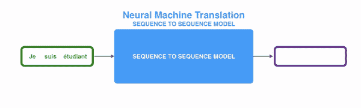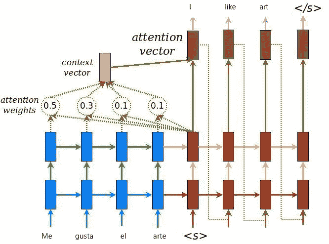

高级 seq2seq 注意模型

**注意力**机制的诞生是为了帮助记忆神经机器翻译(NMT)中的长源句。 **attention** 发明的秘方是在上下文向量和整个源输入之间创建快捷方式，而不是从编码器的最后一个隐藏状态构建一个单独的上下文向量。

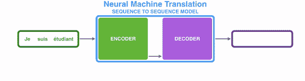

在机器翻译的情况下，上下文是一个向量(基本上是一组数字)。编码器和解码器往往都是递归神经网络。

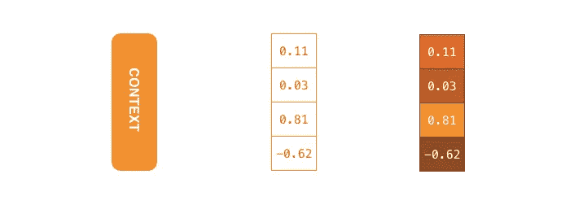

**上下文**是一个浮点向量。在本帖的后面，我们将通过为具有较高值的单元格分配较亮的颜色来可视化彩色矢量。

您可以在设置模型时设置上下文向量的大小。它是编码器 RNN 中隐藏单元的数量。这些可视化显示了大小为 4 的向量，但在现实世界的应用程序中，上下文向量的大小可能是 256、512 或 1024。在这个特定的实现中，我们将使用 **1024** ，随着我们进一步深入，您将会看到它。

**好了，让我们开始实施吧。**

完整实现 google co-lab 笔记本的是 [**这里的**](https://bit.ly/3ilL63V) 。我建议你一段一段地去读，我会试着解释几个我觉得理解实现有困难的部分。

进口第一

现在让我们装载我们的火车，测试和预处理它。我将使用来自这个[链接](http://storage.googleapis.com/download.tensorflow.org/data/spa-eng.zip)的数据。数据由英语句子和西班牙语句子组成，用制表符(\t)分隔。

```
(An example line in the dataset)
Go see Tom.      Ve a ver a Tom.
```

现在我们需要标记数据。**标记化**是将**标记化**或将字符串、文本拆分成一系列标记的过程。我们可以把记号看作是部分，就像单词是句子中的记号，句子是段落中的记号一样。

```
The output of **tokenizer** for the sentence "I am worried." would be 
[1, 4, 568, 3, 2] 1 and 2 are mappings of start and end of the sentence. This is telling our model when to start or stop translation.
```

既然我们对数据进行了标记化，让我们先取 30，000 个样本，让我们将训练集和验证集分成 24，000 个测试数据，6，000 个 val 数据，总共 30，000 个句子。30，000 拆分是为了更快地进行培训，您可以在合作实验室中实施时更改该数字。

验证您的令牌化器

```
Input Language; index to word mapping 
1 ----> <start> 
24 ----> estoy 
36 ----> muy 
1667 ----> confundida 
3 ----> . 
2 ----> <end>Target Language; index to word mapping 
1 ----> <start> 
4 ----> i 
18 ----> m 
85 ----> so 
561 ----> confused 
3 ----> . 
2 ----> <end>
```

创建一个 tf.data 这是一个非常有用的步骤，可以在不丢失任何一致性的情况下，对数据进行洗牌或对整个数据执行任何数据扩充操作。

这里我们定义了在网络中使用的参数。我们将使用 256 个嵌入维度，如果 vocab 大小为 9414，那么我们的嵌入矩阵形状将为 256*9414。这意味着对于我们的 vocab 集中的 9414 个单词中的每一个，我们将发布一个 256 长度的列向量，因此对于我们的网络来说，每个单词都是一个 256 长度的列向量。稍后，如果你想更深入地了解 Keras 嵌入层教程，查看这个解释得很好的 [**youtube 教程**](https://www.youtube.com/watch?v=OuNH5kT-aD0) 。

回顾我们的高级 seq2seq 注意力模型，让我们实现我们的编码器和解码器网络，(记得我在**RNN 节简介**中说过，编码器和解码器网络是堆叠的 [GRU 单元](https://d2l.ai/chapter_recurrent-modern/gru.html))。

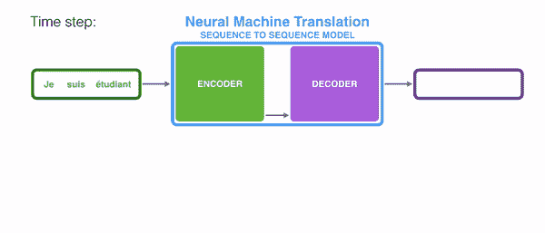

**在计算注意力、上下文向量和解码部分时，请留意上图中的时间戳，以便更好地理解。**

**下面的编码器从时间戳 1 开始，到时间戳 3 结束**

我们将向编码网络(64，16)发送 64 个批量大小的输入，这里 16 是我们的标记化填充序列句子的形状。在我们所有 30，000 个(如果我们仅考虑训练数据，则为 26，000 个)样本中，存在一个句子，该句子中最多有 16 个单词，这就是我们从中获得 16 个单词的地方。如果句子只包含两个单词，我们为这两个单词发出标记，并用零填充剩余的 14 个槽。

这个(64，16)通过嵌入层(9414，256)然后用 1024 个单位通过 GRU(还记得吗？在解释上下文视觉的时候，我说我们会用 1024)。1024 是隐藏状态的形状，也是 GRU 的输出。

```
Encoder output shape: (batch size, sequence length, units) (64, 16, 1024) 
Encoder Hidden state shape: (batch size, units) (64, 1024)
```

好吧！查看编码器片段，更好地理解解释。我们首先用零初始化第一编码器 GRU 的隐藏状态。

**就这样，我们构建了编码器，现在来看注意力和上下文向量以及计算解码器的主要部分。**

首先，编码器向解码器传递更多的数据。编码器不是传递编码阶段的最后一个隐藏状态，而是将所有隐藏状态传递给解码器:

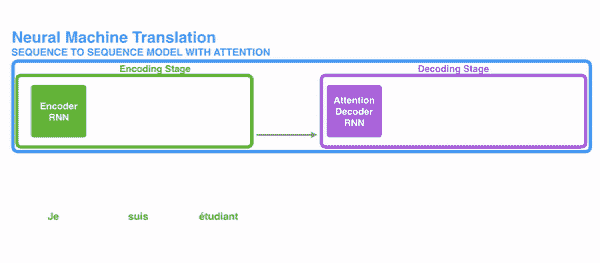

第二，注意力解码器在产生输出之前做了额外的步骤。为了关注与该解码时间步长相关的输入部分，解码器执行以下操作:

1.  查看它接收到的编码器隐藏状态集——每个编码器隐藏状态与输入句子中的某个单词最相关
2.  给每个隐藏的州打分
3.  将每个隐藏状态乘以其 softmaxed 分数，从而放大分数高的隐藏状态，淹没分数低的隐藏状态。

**计算隐藏状态分数:**

以下部分直接取自 TensorFlow 示例的合作实验室笔记本，因为这是解释的最佳方式。

本教程将 [Bahdanau 的注意力](https://arxiv.org/pdf/1409.0473.pdf)用于编码器。在写出简化形式之前，让我们先决定符号:

*   FC =完全连接(密集)层
*   EO =编码器输出
*   H =隐藏状态
*   X =解码器的输入

伪代码是:

*   `score = FC(tanh(FC(EO) + FC(H)))`
*   `attention weights = softmax(score, axis = 1)`。默认情况下，Softmax 应用于最后一个轴，但这里我们想将其应用于第一个轴*，因为分数的形状是 *(batch_size，max_length，hidden_size)* 。`Max_length`是我们输入的长度。因为我们试图为每个输入分配一个权重，所以 softmax 应该应用于该轴。*
*   *`context vector = sum(attention weights * EO, axis = 1)`。与上面选择轴为 1 的原因相同。*
*   *`embedding output` =解码器 X 的输入通过嵌入层。*
*   *`merged vector = concat(embedding output, context vector)`*
*   *然后，这个合并的矢量被提供给 GRU*

*每一步所有向量的形状都在代码的注释中指定了。*

*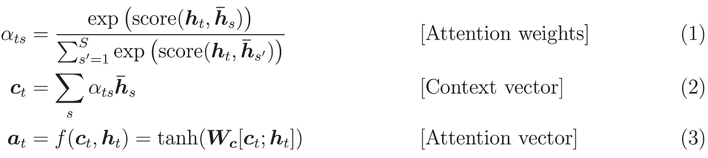***

*看上面的等式，所有 hs_dash 对应于编码器网络的隐藏状态，ht 对应于解码器网络的隐藏状态。【摘自[*https://jalammar.github.io/illustrated-transformer/*](https://jalammar.github.io/illustrated-transformer/)*】**

*这种评分练习在解码器端的每个时间步进行。*

*现在让我们把整个事情放在一起，在下面的视觉化中，看看注意力过程是如何工作的:*

1.  *注意力解码器 RNN 接收<end>令牌的嵌入和初始解码器隐藏状态。</end>*
2.  *RNN 处理它的输入，产生一个输出和一个新的隐藏状态向量(h4)。输出被丢弃。*
3.  *注意步骤:我们使用编码器隐藏状态和 h4 向量来计算这个时间步骤的上下文向量(C4)。*
4.  *我们将 h4 和 C4 连接成一个向量。*
5.  *我们将这个向量通过一个前馈神经网络(一个与模型联合训练的网络)。*
6.  *前馈神经网络的输出表示该时间步长的输出字。*
7.  *重复接下来的时间步骤*

*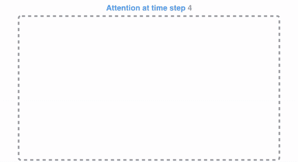*

*在对关注值评分后计算上下文向量*

*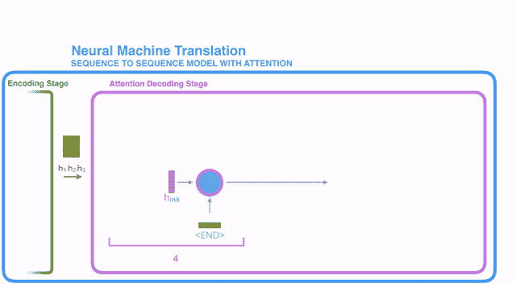*

*整个画面发生在解码器端*

*解码器代码:*

*最后，我们对模型进行优化和训练，以实现完整的端到端机器翻译。*

**

*请从 TensorFlow 官方教程中找到解释模型的完整实现的合作实验室笔记本，尝试自己实现它。*

*链接: [**点击这里**](https://colab.research.google.com/drive/1GhWYcxpoK97hyXGVtz6Bk7Iwl1WRe3gj)*

*注意:这是我的第一篇关于媒体的文章，欢迎任何建议:)。*

*请随意评论您的疑问。*

*[**在 LinkedIn 上连接**](https://www.linkedin.com/in/pvbhanuteja/)*

*图片来源:*阿拉玛，杰伊(2018)。图解变压器[博客帖子]。检索自*[](https://jalammar.github.io/illustrated-transformer/)*

**参考资料:**

**[](https://colab.research.google.com/github/tensorflow/docs/blob/master/site/en/tutorials/text/nmt_with_attention.ipynb) [## 谷歌联合实验室

### 编辑描述

colab.research.google.com](https://colab.research.google.com/github/tensorflow/docs/blob/master/site/en/tutorials/text/nmt_with_attention.ipynb)  [## 基于注意力的神经机器翻译的有效方法

### 一种注意力机制最近被用于通过选择性地聚焦于……来改善神经机器翻译(NMT)

arxiv.org](https://arxiv.org/abs/1508.04025v5) [](http://jalammar.github.io/visualizing-neural-machine-translation-mechanics-of-seq2seq-models-with-attention/) [## 可视化神经机器翻译模型(Seq2seq 模型的机制，注意)

### 翻译:中文(简体)，日文，韩文，俄文观察:麻省理工学院的深度学习艺术讲座…

jalammar.github.io](http://jalammar.github.io/visualizing-neural-machine-translation-mechanics-of-seq2seq-models-with-attention/)**