# 使用 Keras Functional API 构建复杂的深度学习模型

> 原文：<https://pub.towardsai.net/building-complex-deep-learning-models-using-keras-functional-api-38090f4769a4?source=collection_archive---------0----------------------->

## 了解如何使用 Keras 构建复杂的模型

Keras 中的函数式 API 是顺序模型的强大扩展。它允许我们通过组合简单的构建块来创建复杂的模型，每个构建块接受一个或多个输入，处理它们并返回一个输出。本文将向您概述 Keras Functional API 体系结构，以及如何为您自己的用例实现它的具体示例。

在 [Unsplash](https://unsplash.com?utm_source=medium&utm_medium=referral) 上 [Preethi Viswanathan](https://unsplash.com/@sallybrad2016?utm_source=medium&utm_medium=referral) 拍摄的照片

## 目录:

1.  **加载数据&构建简单模型**
2.  **构建一个宽&深的神经网络**
3.  **构建宽&多输入深度神经网络**
4.  **构建宽&深度多输入神经网络&输出**

## 您可以在 GitHub 知识库中找到本文中使用的代码和数据:

 [## GitHub-youssefHosni/机器学习-实用指南

### 在 GitHub 上创建一个帐户，为 youssefHosni/Machine-Learning-Practical-Guide 开发做贡献。

github.com](https://github.com/youssefHosni/Machine-Learning-Practical-Guide) 

**如果你想免费学习数据科学和机器学习，看看这些资源:**

*   免费互动路线图，自学数据科学和机器学习。从这里开始:[https://aigents.co/learn/roadmaps/intro](https://aigents.co/learn/roadmaps/intro)
*   数据科学学习资源搜索引擎(免费)。将你最喜欢的资源加入书签，将文章标记为完整，并添加学习笔记。[https://aigents.co/learn](https://aigents.co/learn)
*   想要在导师和学习社区的支持下从头开始学习数据科学吗？免费加入这个学习圈:[https://community.aigents.co/spaces/9010170/](https://community.aigents.co/spaces/9010170/)

如果你想在数据科学&人工智能领域开始职业生涯，但不知道如何开始。我提供数据科学指导课程和长期职业指导:

*   长期指导:[https://lnkd.in/dtdUYBrM](https://lnkd.in/dtdUYBrM)
*   辅导会议:[https://lnkd.in/dXeg3KPW](https://lnkd.in/dXeg3KPW)

***加入*** [***中等会员***](https://youssefraafat57.medium.com/membership) ***计划继续无限制学习。如果你使用下面的链接，我会收到一小部分会员费，不需要你额外付费。***

 [## 加入我的介绍链接媒体-优素福胡斯尼

### 阅读 Youssef Hosni(以及媒体上成千上万的其他作家)的每一个故事。您的会员费直接支持…

youssefraafat57.medium.com](https://youssefraafat57.medium.com/membership) 

# 1.加载数据并构建简单的模型

首先，我们将加载我们将在本文中使用的数据，这将是 [**MNSIT Fashion**](https://www.tensorflow.org/datasets/catalog/fashion_mnist) 数据集。数据由不同类型的时装组成，包含十个类别。

让我们首先加载所需的库:

接下来，让我们从 **Keras.datasets** 库中加载数据集，然后将数据分为训练和验证两部分，最后将数据标准化:

现在让我们打印数据集和标签的大小:

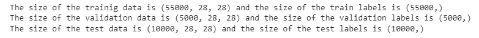

我们可以看到，训练数据的大小是 55000，验证数据是 5000，测试数据是 10000。每张图片的尺寸为 28*28。

让我们绘制一个数据子集，以便更好地了解我们正在处理的内容。数据如图 1 所示。

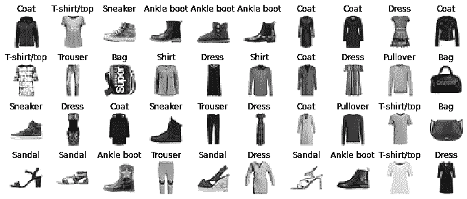

图一。时尚 MNSIT 数据集的子集

为简单起见，我们将简化数据，以便在神经网络中使用:

让我们建立和训练一个简单的 MLP 神经网络，如图 2 所示。

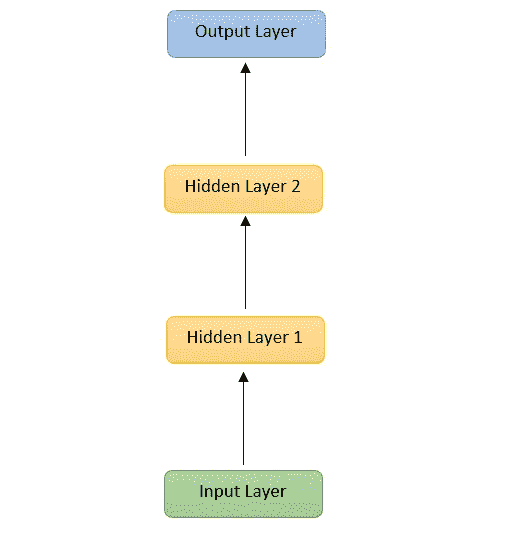

图二。简单的 MLP 神经网络结构。

现在让我们构建如图 2 所示的模型。代码是不言自明的。我们首先用预期的输入大小定义输入层。接下来，我们用 30 个神经元和 Relu 激活函数定义第一个隐藏层，然后用相同的参数定义第二个隐藏层。

最后，输出层包含我们拥有的类的数量，在我们的例子中是 **10。**最后，我们将使用 Keras utils 库**中的 **plot_model** 函数绘制模型。**

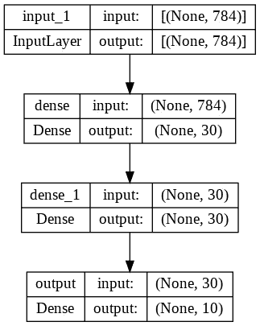

图 3。由 Keras functional API 构建的简单 MLP 神经网络架构。

现在，让我们编译模型，使其符合训练数据，并使用下面的代码绘制学习曲线:

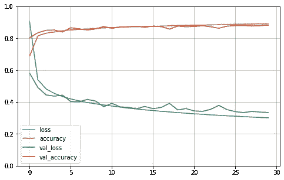

图 4。简单 MLP 神经网络的学习曲线

最后一步是根据测试数据评估模型，并打印准确性和损失。模型的精度为 **86.7%** 相比模型的简单性来说是不错的。

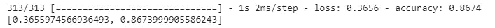

# 2.构建一个宽而深的神经网络

复杂模型的第一个例子是 wide & Deep network，它是一种非顺序神经网络，首次在 Heng-Tze Cheng 等人的论文[**Wide&Deep Learning for recommenders Systems**](https://arxiv.org/abs/1606.07792)中介绍。在该模型中，部分或全部输入直接连接到输出层，如图 5 所示。这种架构允许模型使用**深度**路径学习深度信息，并通过**宽**路径直接从输入中学习简单信息。

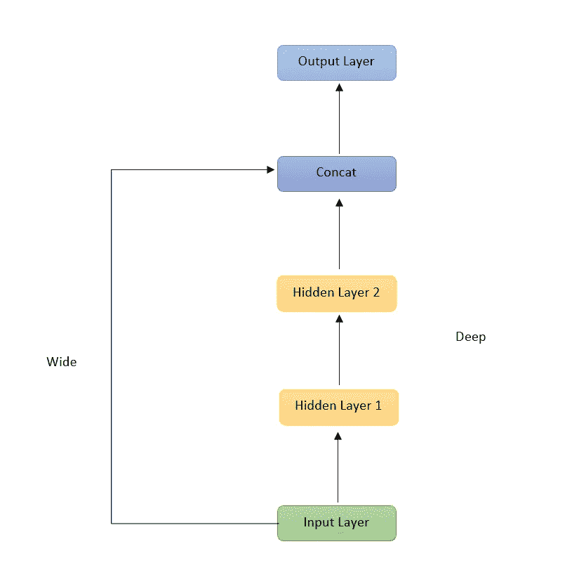

图 5。广度和深度神经网络

下面是使用 Keras API 构建该架构的代码，为了确保构建的模型与所需的模型相同，我们将使用 **Keras.utils.plot_model** 方法绘制模型架构。最终的模型如图 6 所示。

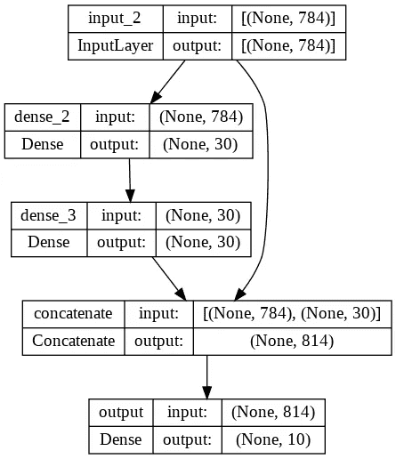

图 6。使用 Keras functional API 构建的广度和深度神经网络

让我们更详细地解释一下代码:

*   **input_** :在第一行中，我们创建了一个输入对象。这定义了模型的输入，包括它的类型和形状。这个模型可以有多个对象，我们将在接下来的模型中看到。
*   **hidden1** :下一步是用 30 个神经元和 ReLU 激活函数创建第一个隐藏层，我们把之前在这行中创建的输入传递给它。你可以看到它类似于调用一个函数，这就是为什么它被称为函数式 API。
*   **hidden2:** 接下来，我们创建另一个隐藏层，它具有与先前隐藏层相同的属性，我们将先前隐藏层的输出传递给它。
*   **连接:**这是一个**连接**层，用于连接第二个隐藏层的输入和输出。
*   **输出:**这是输出层，为了简单起见，它由一个单个神经元组成，没有激活函数，但是你可以为你的模型添加你需要的东西。
*   **模型:**最后，我们创建 Keras 模型，并指定使用哪个输入和输出。

下一步是编译模型，使其符合训练数据，并绘制学习曲线。这可以使用下面的代码来完成:

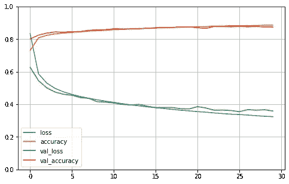

图 7。深度和广度网络的学习曲线。

最后一步是根据测试数据评估模型，并打印准确性和损失。该模型的精确度为 **85.9%** ，与该模型的简单性相比，这是很好的，尽管它小于上一节中介绍的简单 MLP 模型。

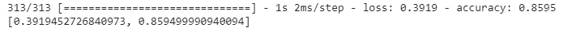

## 3.构建多输入的宽深度神经网络

您可以对前面的模型进行的另一个重要的改变是为输入提供两条路径。例如，如果您希望通过宽路径发送部分输入要素，通过深路径发送部分输入要素，这将非常有用。这个模型如图 8 所示。

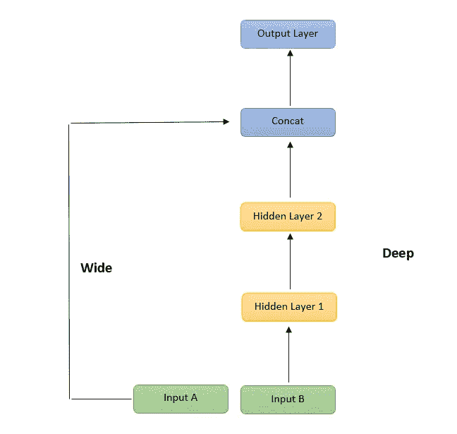

图 8。多输入宽深度神经网络

因此，让我们来构建这个，我们将分割一半的要素通过深路径，另一半通过宽路径，然后我们将绘制创建的模型，如图 9 所示。

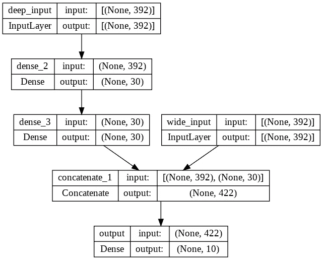

图 9。使用 Keras API 构建具有多个输入的广度和深度神经网络

代码与前一个非常相似，只是我们在创建模型时必须定义两个输入( **input_A** 和 **input_B** )，每个输入的形状为 392，这是我们拥有的特征数量的一半。

接下来，让我们使用下面的代码编译模型并使其符合数据:

正如您所看到的，compile 和 fit 方法与前面的代码相似，唯一的区别在于 fit 方法，在该方法中，我们必须为训练数据、验证和测试数据提供两个输入。最后，我们将使用下面的代码，通过测试数据来评估这个模型:

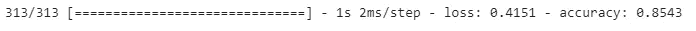

## 4.构建多输入多输出的宽深度神经网络

最后，我们将构建一个既有多输入又有多输出的宽而深的神经网络，如图 10 所示。这可用于多种情况，例如:

*   你有多个输出，比如在物体检测和分类中，你想返回物体的坐标和它的类。
*   您可能正在处理多项任务，每个人都有不同的输出图层。例如，你可能正在进行面部检测任务、情感识别和身份识别。因此，您可以训练相同的网络，并为每个网络提供单独的输出层。
*   另一个可能的用途是正则化，在本例中我们将使用多个输出。正则化方法用于减少过度拟合，并提高模型推广到新数据的能力。

在下面的例子中，我们将在神经网络中使用一个辅助输出，以确保网络的底层部分将自己学习有用的信息，而不依赖于网络的其余部分。

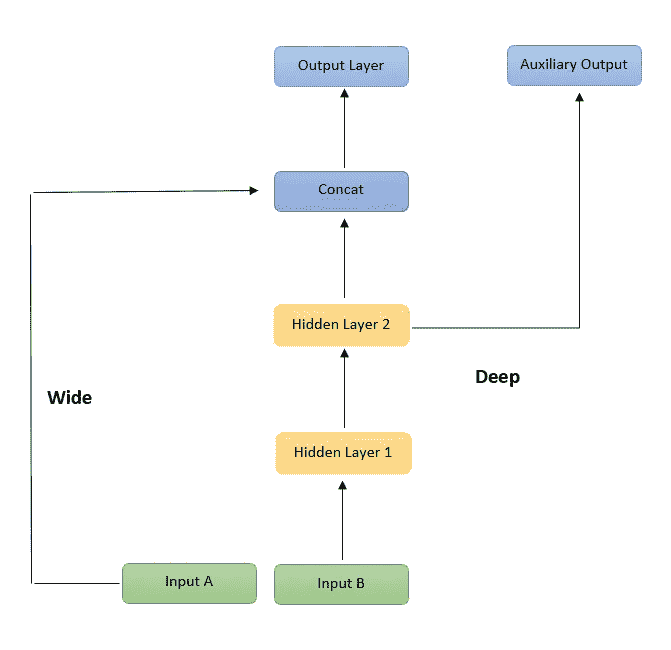

图 10。具有多个输入和输出的宽深度神经网络

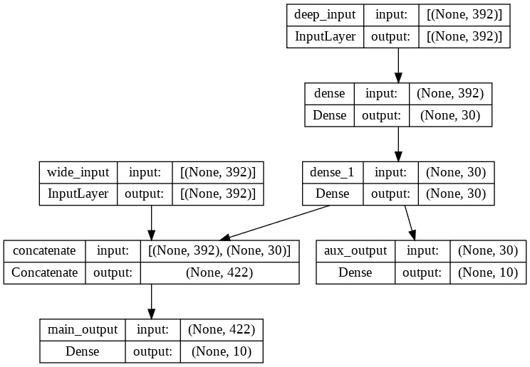

图 11。由 Keras functional API 构建的具有多个输入和输出的宽深度神经网络

现在，让我们编译模型并使其符合训练数据。由于我们使用两个输出，因此，我们将必须定义两个损失函数(如果我们传递一个损失函数，那么它将假设它将用于两个输出)。此外，应该声明每个损失的权重，否则它将假设两个输出将以相同的量贡献给模型损失。在这种情况下，我们希望给予主输出比辅助输出更多的权重。因此，主输出的损耗权重为 0.7，辅助输出的损耗权重为 0.3。

现在让我们根据训练数据拟合模型:

最后，让我们根据测试数据评估模型:

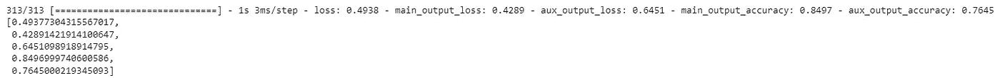

如您所见，这将返回如下五个数字:

*   总损失:0.4938
*   主输出损耗:0.4289
*   辅助输出损耗:0.6451
*   主输出精度:0.8497
*   辅助输出精度:0.7645

***喜爱文章？成为*** [***中等会员***](https://youssefraafat57.medium.com/membership) ***继续无限制学习。如果你使用下面的链接，我会收到一小部分会员费，不需要你额外付费。***

 [## 加入我的介绍链接媒体-优素福胡斯尼

### 阅读 Youssef Hosni(以及媒体上成千上万的其他作家)的每一个故事。您的会员费直接支持…

youssefraafat57.medium.com](https://youssefraafat57.medium.com/membership) 

***感谢阅读！如果你喜欢这篇文章，一定要鼓掌*** 👏 ***(最多 50！)并在***[***LinkedIn***](https://www.linkedin.com/in/youssef-hosni-b2960b135/)***上与我联系，并在*** [***上关注我，以便随时更新我的新文章。***](https://youssefraafat57.medium.com/)